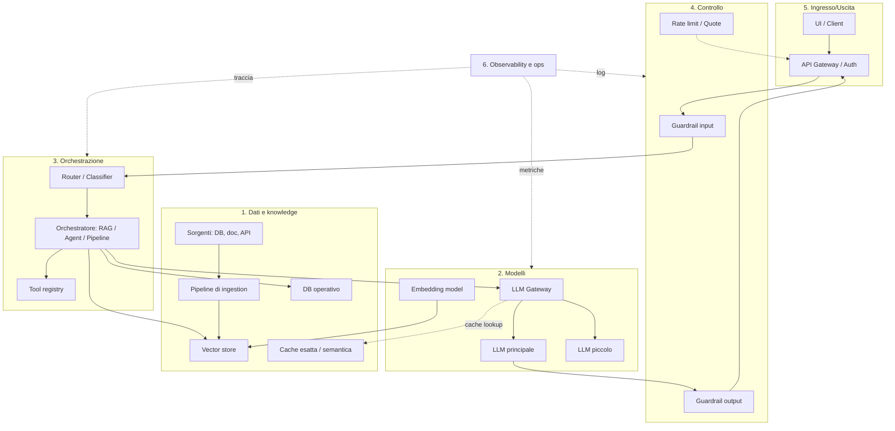

# Reference architecture

  Stabile
  Lezione 7.1
  ~14 min di lettura

Hai costruito i mattoni in Parte 1, hai capito il design in Parte 5, hai messo in produzione in Parte 6. Adesso il quadro completo: come si compone un sistema AI end-to-end, dove vanno le linee di confine, quali componenti sono sempre presenti e quali dipendono dal caso d'uso. È la mappa che ti permette di disegnare un sistema nuovo davanti a una whiteboard senza dimenticare pezzi.

Una reference architecture non è un'opera d'arte da copiare pixel-per-pixel. È una griglia mentale che ti dice "in un sistema AI ben fatto ci sono questi strati, queste responsabilità, queste linee di comunicazione". Quando progetti, parti dalla reference e adatti — togli quello che non serve, espandi quello che ti serve di più. Senza reference, dimentichi sempre lo stesso pezzo (di solito observability o guardrail) e te ne accorgi in produzione.

## I sei strati di un sistema AI completo

Dal basso verso l'alto:

**1. Strato dei dati e della knowledge.** Le sorgenti (database, documenti, API esterne, log), le pipeline che le portano in forma usabile, i vector store, i database operativi del sistema. Tutto quello che esiste *prima* che arrivi una richiesta utente.

**2. Strato dei modelli.** I modelli effettivi (LLM, embedding, eventuali modelli ML classici per classificazione/routing) e la loro infrastruttura di serving — sia che siano API esterne sia che siano serviti in proprio.

**3. Strato di orchestrazione.** Il cuore applicativo: la logica che riceve la richiesta, decide cosa fare (RAG, agente, chiamata diretta), compone i prompt, gestisce il loop tool calling, applica la business logic. Questo strato è codice tradizionale che chiama modelli e dati.

**4. Strato di controllo.** Guardrail (input e output), policy di sicurezza, rate limiting, gestione delle quote, gestione delle autorizzazioni a grana fine. Lo strato che impedisce che il sistema faccia danni — al business, agli utenti, ai dati.

**5. Strato di ingresso/uscita.** API gateway, autenticazione, gestione delle sessioni utente, UI (web, mobile, API per integrazioni). Il punto di contatto col mondo esterno.

**6. Strato di osservabilità ed operazioni.** Logging, tracing, metriche di qualità, monitoring di costi, alert, dashboard. Trasversale — vede dentro tutti gli altri strati.

Non tutti i sistemi hanno tutti gli strati nello stesso livello di sviluppo. Un sistema piccolo può avere uno strato di controllo banale (un controllo regex) e uno strato di osservabilità minimo (log su stdout). Un sistema enterprise ha ognuno di questi strati pieno. Ma la struttura logica è la stessa.

## I tre archetipi architetturali

Quasi tutti i sistemi AI ricadono in uno di tre archetipi (o una combinazione).

### Archetipo A — Pipeline deterministica con LLM nel mezzo

L'orchestrazione è codice classico che chiama il modello in punti specifici per task ben definiti: estrarre informazioni, classificare, riformulare, riassumere. Il modello non decide cosa fare, decide solo il contenuto della singola chiamata.

**Quando usarlo:** task di automazione documentale, ETL arricchiti, generazione di contenuti strutturati, sistemi di analisi.

**Punti di forza:** prevedibile, testabile, costi controllati, debugging semplice.

**Limiti:** non gestisce bene casi d'uso conversazionali aperti, dove non puoi prevedere in anticipo la sequenza di operazioni.

### Archetipo B — RAG conversazionale

Il flusso è quasi sempre lo stesso: query → retrieval → contesto → modello → risposta. Conversazione possibile, ma il modello non "fa cose" — recupera e risponde.

**Quando usarlo:** chatbot di supporto, assistenti su documentazione, sistemi di Q&A su knowledge base.

**Punti di forza:** copertura ampia, attributione delle fonti, costo prevedibile, valutazione gestibile (lezione 3.4).

**Limiti:** non può eseguire azioni, non integra naturalmente con sistemi transazionali, fatica su domande che richiedono ragionamento multi-step.

### Archetipo C — Agente con tool

Il modello decide quali tool chiamare, in che ordine, fino a un risultato. L'orchestratore esegue il loop, applica i guardrail, gestisce gli errori.

**Quando usarlo:** task complessi con passi non noti a priori, integrazione con sistemi multipli, automazione di processi.

**Punti di forza:** flessibilità altissima, copre casi che le pipeline non possono.

**Limiti:** imprevedibile, difficile da testare e valutare (lezione 3.5), costoso (molte chiamate al modello per richiesta), va difeso con cura (lezione 4.2).

**La realtà:** i sistemi produttivi seri raramente sono "puri". Sono ibridi — una pipeline che a un certo punto chiama un piccolo agente per un sotto-task, un RAG che attiva un agente solo quando l'utente chiede esplicitamente un'azione. Il bravo architetto sceglie l'archetipo giusto al livello giusto, non tutto in un colpo.

## Le linee di confine che contano

Tre confini sono particolarmente importanti da progettare bene perché definiscono cosa è facile cambiare in futuro e cosa diventerà un disastro.

**Confine tra orchestrazione e modelli — il gateway LLM.** Senza questo confine, il codice applicativo dipende da un provider specifico. Con il gateway (lezione 6.1), cambiare modello è una configurazione. È il confine più importante per la longevità del sistema.

**Confine tra orchestrazione e dati — repository pattern.** L'orchestrazione non sa se i documenti vengono da un vector store, un database, un file system o un'API. Chiama un'interfaccia ("getRelevantContext(query)") e l'implementazione vive dietro. Permette di sostituire vector store, cambiare embedding model, aggiungere ricerca ibrida senza toccare la logica.

**Confine tra controllo e orchestrazione — punto di iniezione dei guardrail.** I guardrail (input e output) sono un layer separato che si applica al passaggio tra orchestrazione e mondo esterno. Non sono `if` sparsi nella business logic. Permette di aggiungerne nuovi senza modificare il resto.

## Il deployment topology: dove vivono i pezzi

Lo stesso disegno architetturale può essere deployato in modi molto diversi. Tre topologie tipiche:

**Monolitico modulare.** Tutto in un singolo servizio applicativo che parla con servizi esterni (LLM API, vector store managed). Pratico per team piccoli, fino a complessità medie. Lo strato di orchestrazione è un'app Python/Node, gli altri strati sono servizi managed.

**Microservizi per responsabilità.** Servizi separati per: gateway LLM, orchestrazione, retrieval, guardrail, eval asincrona. Comunicazione via API interna o event bus. Va scelto solo se la dimensione del team o del traffico lo giustifica, altrimenti è overhead.

**Edge + core.** Una parte gira vicino all'utente (UI, caching, guardrail leggeri); il "cervello" sta in un'infrastruttura centrale. Pattern utile per app mobile/web globali con requisiti di latenza.

La scelta è ortogonale all'architettura logica. Si può fare lo stesso sistema (stessa reference architecture) in tutti e tre i modi.

## Cosa quasi sempre manca nelle prime versioni

Una checklist degli "ah, dovevo metterlo" che capitano sempre alla prima reference architecture disegnata da chi sta imparando:

- **Gateway LLM.** Si chiama l'API direttamente; il giorno che vuoi cambiare provider, devi toccare 40 file.
- **Eval suite automatica.** Si valuta a occhio; il giorno che il provider aggiorna il modello, non te ne accorgi finché non si lamenta un cliente.
- **Guardrail di output.** Si fida del modello; il primo prompt injection passa di filo.
- **Logging granulare.** Si logga "richiesta arrivata, risposta data"; il giorno del primo incidente di costo, non hai dati per indagare.
- **Pipeline di re-indicizzazione.** Si fa l'import una tantum; sei mesi dopo l'indice è stale e nessuno se ne è accorto.
- **Versioning del prompt di sistema.** Si modifica in linea; non c'è traccia di cosa è cambiato e quando.

Cinque dei sei pezzi sopra costano poco a metterli all'inizio e tantissimo a metterli dopo.

## Cosa NON è una reference architecture

| Il pensiero sbagliato | Come stanno le cose |
|---|---|
| "Disegnamo l'architettura, poi codifichiamo" | Reference architecture è una griglia mentale; la specifica del singolo sistema si scrive scegliendo dentro la griglia. |
| "Più componenti = più professionale" | Componenti che non servono sono debito. Parti minimale e aggiungi quando serve. |
| "L'architettura non cambia" | Cambia. I confini ben progettati permettono di farla evolvere; quelli sbagliati la cementano. |
| "Tutti i sistemi devono assomigliare a questa reference" | I tre archetipi sono molto diversi. Scegli quello giusto per il problema, non quello più ricco. |

## Cosa dura, cosa evitare

Dura: **i sei strati come griglia mentale**, **i tre archetipi**, **i tre confini chiave** (gateway, repository, guardrail).

Cambia velocemente: **gli strumenti specifici** in ogni strato (vector store, motori di inferenza, observability tooling), **i provider di modelli**. Per questo i confini ben tracciati pagano.

---

## Verifica di comprensione

> Rispondi a memoria. Le incerte rivedile domani.

1. Quali sono i sei strati di un sistema AI completo? Cita uno o due componenti per strato.
2. Descrivi i tre archetipi architetturali (pipeline, RAG, agente) e quando usarli.
3. Quali sono i tre confini più importanti da progettare bene e perché?
4. Cita tre cose che "quasi sempre mancano nelle prime versioni" e perché sono costose da aggiungere dopo.
5. Architettura logica e deployment topology: che relazione hanno?

---

## Glossario

- **Reference architecture** — griglia mentale che descrive gli strati, i componenti e le loro responsabilità in una classe di sistemi.
- **Archetipo architetturale** — pattern complessivo che descrive come è strutturato il flusso: pipeline deterministica, RAG, agente.
- **Gateway LLM** — confine tra orchestrazione e modelli che permette di cambiare provider/modello senza toccare la logica.
- **Repository pattern** — astrazione dell'accesso ai dati che disaccoppia l'orchestrazione dall'implementazione del retrieval.
- **Deployment topology** — come i pezzi logici sono distribuiti fisicamente: monolitico, microservizi, edge+core.

---

## Per approfondire

- **"Designing Machine Learning Systems"** di Chip Huyen — pre-LLM ma molti pattern si applicano.
- **AWS / Azure / GCP — reference architectures for GenAI** — i tre cloud major pubblicano reference architecture; vale leggerne almeno una per vedere come gli strati prendono forma con servizi specifici.

---

## Prossima lezione

**7.2 Build vs buy, proprietari vs open-weight.** Hai la griglia; ora le decisioni che la riempiono. Quando costruire un componente in casa, quando comprare. Quando il modello proprietario vince, quando l'open-weight. Niente risposte fisse, criteri di decisione che durano.
