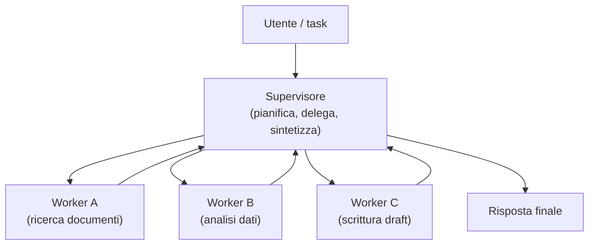
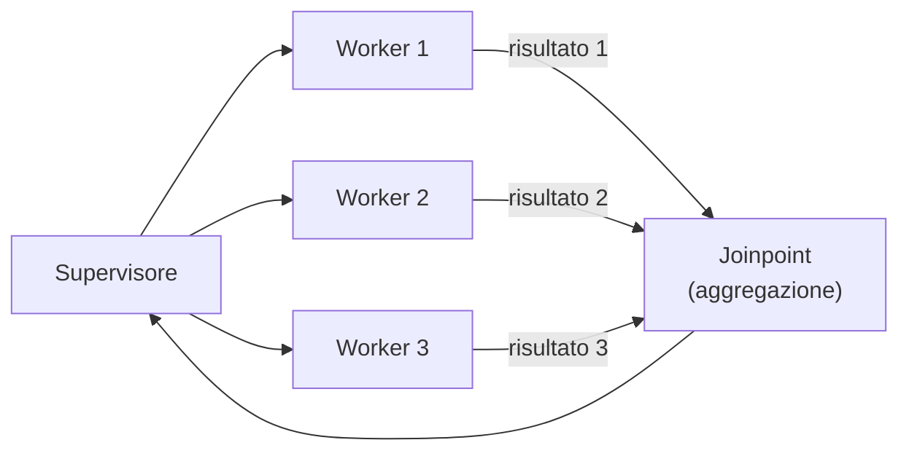

# Orchestrazione multi-agent

  In evoluzione
  Lezione 1.6
  ~14 min di lettura

Un singolo agente in un loop ReAct risolve un sacco di problemi. Poi arriva un task troppo grande per una sola context window, o che richiede specializzazione parallela, o che ha sotto-task che si possono fare in contemporanea. È lì che serve l'orchestrazione multi-agent — e lì che i costi possono esplodere se non si progetta bene.

Nella lezione 1.5 hai visto che un agente è un loop: l'LLM ragiona, chiama un tool, osserva il risultato, ragiona di nuovo. Funziona bene su task sequenziali con un orizzonte limitato. I problemi arrivano quando il task è troppo complesso per stare in una sola context window, quando diverse parti del task richiedono competenze diverse, oppure quando alcune parti si possono fare in parallelo.

La risposta istintiva è "aggiungo più agenti". La risposta corretta è "aggiungo più agenti solo se so esattamente perché e sono pronto a gestirne il costo." Ogni agente in più è un'inferenza in più per ogni passo; su un sistema con 5 agenti che girano in sequenza, un task che prima costava 5 chiamate al modello ne costa facilmente 25.

## Il pattern di base: supervisore e worker

Il pattern più diffuso nei sistemi multi-agent è **supervisore-worker**: un agente supervisore riceve il task, lo scompone in sotto-task, li delega ad agenti specializzati (worker), raccoglie i risultati, sintetizza.

Il supervisore conosce i worker — i loro ruoli, capacità e interfacce — ma non i dettagli di come ciascuno opera. Ogni worker è ottimizzato per il suo task: prompt specifico, tool rilevanti, magari un modello diverso (un modello piccolo per ricerche semplici, uno più capace per reasoning complesso).

Il vantaggio della specializzazione è reale: un worker con un prompt breve e tool specifici fa meno errori di un agente generalista con 50 tool e istruzioni lunghe. La context window corta riduce la probabilità di distrazione. Ma ogni confine tra agenti è un punto dove le informazioni si perdono o si distorcono: il supervisore non vede il ragionamento interno del worker, solo il suo output.

## Agenti paralleli: quando ha senso correre insieme

Alcune parti di un task sono **indipendenti**: la ricerca di fonti legali non dipende dall'analisi finanziaria; il controllo del tono non dipende dalla verifica dei dati. In questi casi si possono lanciare più worker in parallelo.

Il guadagno è di latenza, non di costo: i 3 worker girano contemporaneamente, quindi il tempo totale è vicino a quello del più lento, non alla somma. Il costo in token è identico a quello sequenziale.

La trappola: non tutti i task che sembrano paralleli lo sono davvero. Se Worker 2 ha bisogno del risultato di Worker 1 per fare il suo lavoro, parallelizzarli produce errori silenziosi. Prima di parallelizzare, mappi le dipendenze.

## Stato condiviso e memoria

Un singolo agente tiene tutta la sua storia nella context window. Con più agenti, la context window di ciascuno è separata: il Worker B non sa cosa ha trovato Worker A, a meno che qualcuno non glielo dica.

Lo **stato condiviso** è il meccanismo con cui i risultati intermedi diventano visibili agli agenti che ne hanno bisogno. Può essere:
- Un dizionario in memoria passato dal supervisore ad ogni worker (semplice, va bene per flussi lineari)
- Un database condiviso che ogni agente può leggere e scrivere (necessario per sistemi più complessi con parallelismo)
- Un message bus asincrono (per sistemi distribuiti veri)

La scelta dipende dalla complessità e dalla necessità di persistenza. Per la maggior parte dei casi, un dizionario strutturato passato esplicitamente dal supervisore è sufficiente — ed è molto più facile da debuggare di un database condiviso.

Il problema del "telefono rotto" tra agenti

Ogni volta che un worker produce un output e lo passa al supervisore, che poi lo passa a un altro worker, c'è un rischio di distorsione. Il worker scrive in modo conciso; il supervisore parafrasando perde dettagli; il secondo worker agisce su un'informazione degradata. Questo è il "telefono rotto" distribuito: ogni confine tra agenti è un punto di perdita di informazione. La soluzione parziale è passare l'output completo del worker, non solo un riassunto — anche se costa più token.

## Framework: LangGraph e CrewAI

Due framework hanno acquisito trazione (a maggio 2026):

**LangGraph** modella il sistema come un grafo orientato: i nodi sono funzioni (o agenti), gli archi sono transizioni, lo stato è un oggetto strutturato che fluisce attraverso il grafo. Il punto di forza è il controllo: puoi specificare esattamente il flusso, gestire cicli, aggiungere condizioni di routing, gestire errori con branch dedicati. È più vicino a codice esplicito che a "magia AI". Il contro: verboso per task semplici.

**CrewAI** usa un'astrazione più ad alto livello: definisci agenti con ruoli e obiettivi in linguaggio naturale, poi li fai lavorare insieme su un task. Più accessibile per prototipare rapidamente. Meno controllo su dettagli di flusso e gestione degli errori rispetto a LangGraph.

**AutoGen** (Microsoft) adotta un modello di conversazione tra agenti: ogni agente è un partecipante in una chat multi-turno. Utile per casi dove il dialogo tra agenti è naturale.

Nessuno è "il migliore": dipende dal task, dalla preferenza del team e dal livello di controllo necessario. Il principio chiave vale per tutti: **il controllo di flusso deve stare nel codice, non nei prompt.** Un supervisore che decide cosa fare scrivendo "pensa a cosa fare e decidi" in un prompt è una ricetta per comportamenti imprevedibili.

## Il costo è il vincolo principale

Una richiesta a un sistema multi-agent non è una chiamata al modello: è una sequenza di chiamate. Supponi un supervisore che pianifica (1 call), tre worker (3 call), e una sintesi finale (1 call): 5 inferenze solo per il caso base, senza iterazioni o retry.

Se il task è complesso e i worker iterano, la conta cresce. Se usi un modello frontier (GPT-4o, Claude 4, Gemini 2.0) per ogni agente, i costi a scala diventano rapidamente proibitivi.

Le strategie pratiche:
- Usa il **modello più piccolo possibile** per ogni worker. Un worker che fa solo ricerca in un database non ha bisogno di un modello frontier; un modello small (3-7B parameter, o API economiche) basta.
- Limita il numero di iterazioni per worker con un `max_steps` esplicito.
- Monitora il numero medio di chiamate per task in produzione — è spesso 3-5x quello che ci si aspettava in sviluppo.
- Torna al triangolo qualità-latenza-costo (lezione 5.3): ogni agente aggiunto sposta l'ago verso costo e latenza. Hai abbastanza guadagno di qualità da giustificarlo?

## Quando NON usare il multi-agent

Il multi-agent non è la risposta a tutti i task complessi. Un singolo agente con tool ben scelti, context window grande e prompt chiaro risolve la maggior parte dei casi — con meno costo, meno latenza e meno problemi di debug.

Considera il multi-agent quando:
- Il task ha sotto-task genuinamente indipendenti che beneficiano di specializzazione
- La context window di un singolo agente è un vincolo reale (non un'ipotesi)
- Il parallelismo riduce la latenza in modo misurabile e rilevante per il caso d'uso

Non introdurlo quando:
- Stai cercando di risolvere un problema di qualità del singolo agente — la soluzione è migliorare il prompt, non aggiungere agenti
- Il task è sequenziale e non si parallelizza
- Non hai monitoring per tracciare quante chiamate fa il sistema (vedi lezione 3.3)

## Cosa NON è

| Pensiero sbagliato | Come stanno le cose |
|---|---|
| "Multi-agent = più intelligenza" | Multi-agent = più coordinazione. L'intelligenza di ciascun agente dipende dal modello e dal prompt, non dall'architettura. Un supervisore che orchestra worker stupidi produce un sistema stupido coordinato. |
| "Il supervisore vede tutto quello che fanno i worker" | Il supervisore vede solo gli output dei worker, non il loro ragionamento interno. Ogni confine tra agenti è una perdita di informazione. |
| "I framework si occupano della gestione degli errori" | I framework danno struttura; la gestione degli errori (retry, fallback, log) devi scriverla tu. Un worker che fallisce silenziosamente non verrà catturato automaticamente da nessun framework. |
| "Prima multi-agent, poi ottimizziamo" | Inizia sempre con l'architettura più semplice che potrebbe funzionare. Aggiungere agenti è facile; toglierli e semplificare il sistema già in produzione è costoso. |

## Verifica di comprensione

1. Descrivi il pattern supervisore-worker. Qual è il ruolo di ciascuno e cosa vede il supervisore degli output del worker?
2. Quando ha senso parallelizzare agenti? Cosa guadagni in termini di latenza vs costo?
3. Hai un sistema multi-agent in produzione che costa il doppio di quello che ti aspettavi. Qual è la prima cosa che controlli?
4. Perché si dice "il controllo di flusso deve stare nel codice, non nei prompt"? Cosa succede se lo metti nei prompt?
5. *Domanda aperta*: un task richiede di: ricercare informazioni su 3 fonti diverse, sintetizzarle, poi generare un report. Descriveresti questo come task per un singolo agente o multi-agent? Quali sono i criteri che ti fanno scegliere?

## Glossario della pagina

**Supervisore** — agente che riceve il task, lo scompone, lo delega ai worker e sintetizza i risultati.

**Worker** — agente specializzato su un sotto-task specifico; ha prompt, tool e contesto ristretti al suo ambito.

**Stato condiviso** — struttura dati (dizionario, DB, bus) che contiene i risultati intermedi accessibili agli agenti che ne hanno bisogno.

**LangGraph** — framework per sistemi multi-agent basato su grafi orientati con stato esplicito. Offre controllo fine sul flusso e sui cicli.

**CrewAI** — framework multi-agent con astrazione ad alto livello basata su ruoli in linguaggio naturale. Rapido per prototipare.

**Joinpoint** — punto nel grafo di esecuzione dove i risultati di agenti paralleli vengono riuniti prima di continuare.

## Per approfondire

- Cerca "LangGraph multi-agent tutorial LangChain" per esempi pratici con codice.
- Il paper "Agents" di Lilian Weng (lilianweng.github.io) è una risorsa di riferimento sul design degli agenti.
- Per i costi reali, cerca "multi-agent cost analysis" — ci sono benchmark pubblici che misurano il numero medio di chiamate per tipo di task.

## Prossima lezione

Agenti e sistemi multi-agent hanno bisogno di connettersi a tool esterni: database, API, filesystem. Il problema è che ogni tool ha un'interfaccia diversa, e gestirla a mano non scala. La lezione 1.7 introduce **MCP — Model Context Protocol**, lo standard che risolve questo problema una volta per tutte.
