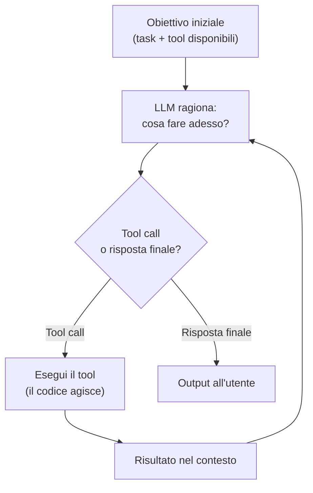
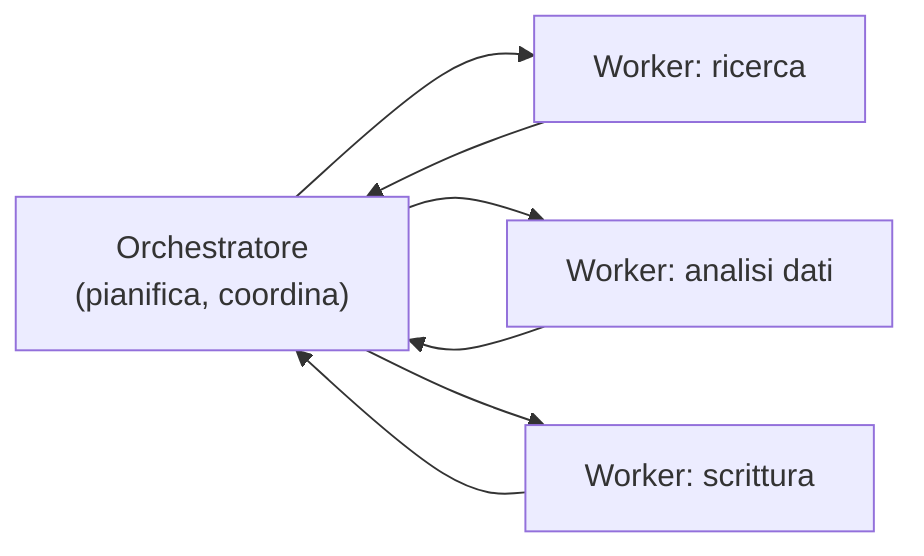

# Agenti semplici — tool calling e ReAct

<div class="lesson-meta">
  <span class="badge-stato evoluzione">In evoluzione</span>
  <span>Lezione 1.5</span>
  <span>~13 min di lettura</span>
</div>

<p class="lesson-lead">Un agente è un LLM in un loop che decide, agisce e osserva i risultati — ripetutamente, fino al completamento del task. Il loop cambia radicalmente la complessità del sistema: ogni passo è un'inferenza, ogni errore si propaga, e il controllo di flusso non va mai nei prompt.</p>

Nella lezione 1.4 hai visto che il function calling permette al modello di dichiarare di voler chiamare una funzione, che il codice esegue. Un'unica chiamata, un'unica decisione. Un **agente** estende questo in un loop: il modello decide cosa fare, il codice lo esegue, il risultato torna al modello, il modello decide di nuovo — e così via fino al completamento del task.

Sembra un piccolo passo. È un cambiamento architetturale enorme, perché introduce **autonomia**: il modello non risponde una sola volta, ma pianifica e si adatta a ogni passo. Con l'autonomia arrivano i benefici — task più complessi, meno bisogno di istruzioni esplicite per ogni passo — e i problemi: errori che si propagano, costi che esplodono, comportamenti difficili da prevedere.

## Il loop: decide, agisce, osserva

La struttura base di un agente è sempre la stessa, qualunque sia il framework:



L'LLM non "sa" quale sarà il passo successivo prima di ragionare. Ad ogni iterazione vede l'obiettivo, la storia di ciò che ha fatto, i risultati ottenuti, e decide il passo successivo. Può sbagliare: chiamare il tool sbagliato, interpretare male un risultato, andare in loop.

## ReAct: ragionamento e azione intrecciati

**ReAct** (Reasoning + Acting) è il pattern più usato per strutturare il ragionamento dell'agente. Invece di andare direttamente dall'input all'azione, il modello produce esplicitamente due cose:

1. **Thought** — il ragionamento: "l'utente chiede gli ordini di Mario Rossi; ho bisogno di cercarli nel DB."
2. **Action** — la decisione: "chiamo `cerca_ordini(cliente='Mario Rossi')`."

Poi osserva il risultato (**Observation**) e ricomincia il ciclo.

Il vantaggio di rendere il ragionamento esplicito è che è ispezionabile — puoi vedere cosa sta "pensando" l'agente ad ogni passo, il che è fondamentale per il debug e per la valutazione (lezione 3.5). Il costo: ogni pensiero è token generati, quindi più lento e più costoso di un'azione diretta.

<details>
<summary>Chain-of-thought negli agenti</summary>

Nella lezione 0.5 hai visto che il chain-of-thought migliora il ragionamento su task complessi. ReAct è essenzialmente chain-of-thought applicato a un loop di azioni. La differenza: in CoT il ragionamento porta a una risposta finale; in ReAct porta a un'azione, poi a un'osservazione, poi a un altro round di ragionamento.

Il principio meccanico è lo stesso (i token generati costruiscono il contesto per i token successivi), ma applicato a più iterazioni. Questo moltiplica sia il beneficio (ragionamento ricco) sia il costo (molti token per passo).
</details>

## Orchestratore e worker

Su task semplici, un singolo agente è sufficiente. Su task complessi che richiedono specializzazione, si usa il pattern **orchestratore-worker**: un agente centrale che pianifica e coordina, più agenti specializzati che eseguono parti del task.

L'orchestratore riceve l'obiettivo, lo scompone in sotto-task, delega ciascuno al worker adatto, raccoglie i risultati e sintetizza la risposta finale. I worker sono specializzati: sanno fare bene una cosa (ricerca web, analisi di dati, scrittura di codice) e la fanno su istruzione dell'orchestratore.



Il vantaggio: i worker sono più facili da valutare e ottimizzare singolarmente. Il costo: ogni worker è un LLM separato con il suo contesto, i suoi tool, la sua latenza e il suo costo di inferenza.

**Il principio chiave:** ciò che va garantito — il controllo di flusso, la sequenza dei passi, le politiche di sicurezza — sta nell'orchestratore, nel codice deterministico. Ciò che richiede giudizio — decidere cosa fare dato un risultato ambiguo — sta nell'LLM.

## Il controllo di flusso non va nei prompt

Questa è la regola più importante, e la più violata.

Mettere il controllo di flusso nei prompt significa scrivere istruzioni come "se la risposta dell'API contiene un errore, ritenta con i parametri corretti, altrimenti procedi al passo successivo". Il problema: il modello segue le istruzioni in modo probabilistico, non deterministico. Può interpretarle in modo diverso, dimenticarle se sono sepolte nel contesto, o andare in loop senza mai uscire.

La regola: **il controllo di flusso va nel codice**. Il codice deterministico controlla la logica condizionale — se/else, retry, timeout, exit conditions. L'LLM decide il *contenuto* di ogni passo, non la *struttura* del flusso.

```python
# SBAGLIATO: controllo di flusso nel prompt
# "Se l'API restituisce un errore, riprova. Se riesci, procedi al passo B."

# GIUSTO: controllo di flusso nel codice
for attempt in range(MAX_RETRY):
    result = call_tool(...)
    if result.success:
        break
# poi passa il risultato all'LLM per decidere il passo successivo
```

## Il costo reale: ogni passo è un'inferenza

Prima di scegliere un'architettura agentica, fai il conto.

Ogni turno del loop è una chiamata al modello. Se l'agente fa 5 passi per completare un task, hai 5 inferenze — 5 volte il costo, 5 volte la latenza, 5 punti di possibile fallimento. In un sistema multi-agent con 3 worker e 1 orchestratore, un task da 5 passi per agente può arrivare a 20+ chiamate.

Alcune domande da porre prima di scegliere l'architettura agentica:

- Il task richiede davvero autonomia multi-step, o posso risolverlo con una chiamata singola ben strutturata?
- Quanto posso pagare per inferenza, e quante ne fa mediamente il mio agente?
- Qual è la latenza accettabile? Un agente da 5 passi a 2 secondi l'uno è 10 secondi di attesa.

Il triangolo qualità-latenza-costo (lezione 5.3) si applica in modo particolarmente duro agli agenti: ogni passo lo percorre di nuovo.

## Cosa NON è un agente

| Il pensiero sbagliato | Come stanno le cose |
|---|---|
| "Un agente è più intelligente di un LLM" | È un LLM con tool in un loop. L'intelligenza è la stessa; la capacità di agire è estesa. |
| "Il controllo di flusso va nel prompt" | No: nel prompt va il giudizio, nel codice il controllo. I prompt non garantiscono il comportamento. |
| "Multi-agent = sempre meglio di un singolo agente" | Più complessità, più costo, più punti di fallimento. Si usa quando ci sono vantaggi concreti di specializzazione o parallelismo. |
| "Gli agenti sono affidabili come il codice deterministico" | Sono probabilistici: possono sbagliare passo, andare in loop, interrompere prima del completamento. Si valutano diversamente (lezione 3.5). |

---

## Verifica di comprensione

> Rispondi a memoria. Le incerte rivedile domani. Le ultime due anticipano lezioni successive.

1. Qual è la struttura base del loop di un agente?
2. Cosa aggiunge ReAct rispetto a un agente che va direttamente all'azione?
3. Qual è la differenza di responsabilità tra orchestratore e worker?
4. Perché il controllo di flusso non va nei prompt? Fai un esempio concreto.
5. Un task che un agente risolve in 8 passi. Quante inferenze fa, e che implicazioni ha su costo e latenza?
6. *(anticipazione)* Se un agente con tool può eseguire azioni reali (scrivere file, inviare email, chiamare API), quali nuovi rischi di sicurezza introduce?
7. *(anticipazione)* Come valuteresti se un agente ha completato il task correttamente — non il singolo output, ma l'intero processo?

---

## Glossario

- **Agente** — un LLM inserito in un loop che decide quali azioni compiere, le esegue tramite tool, osserva i risultati e ripete fino al completamento del task.
- **ReAct** — pattern di ragionamento (Reasoning + Acting) in cui il modello produce esplicitamente un pensiero e un'azione a ogni passo, rendendo il processo ispezionabile.
- **Tool calling** — il meccanismo con cui l'agente dichiara quale tool vuole usare e con quali parametri; il codice esegue il tool e rimette il risultato nel contesto.
- **Orchestratore** — l'agente centrale in un sistema multi-agent: pianifica, coordina i worker, raccoglie i risultati.
- **Worker** — agente specializzato che esegue un sotto-task su delega dell'orchestratore.
- **Loop agente** — il ciclo decide → agisci → osserva che si ripete fino alla risposta finale.
- **Exit condition** — la condizione (nel codice) che termina il loop agente; senza di essa, il loop può diventare infinito.

---

## Per approfondire

- **"ReAct: Synergizing Reasoning and Acting in Language Models"** — il paper che ha formalizzato il pattern ReAct; cerca il titolo su arXiv.
- **Documentazione di framework agentici** (LangGraph, CrewAI, AutoGen) — mostrano architetture orchestratore-worker e il modo di strutturare il codice; cerca le versioni recenti, i framework cambiano in fretta.

*Risorse indicate per la ricerca; per i link aggiornati conviene cercarli al momento.*

---

## Prossima lezione

**1.7 MCP — Model Context Protocol.** Hai agenti che usano tool. Il problema pratico è come collegare quegli strumenti al modello in modo standardizzato e riusabile — senza dover riscrivere l'integrazione per ogni combinazione di modello e tool. MCP è la risposta dello standard.
