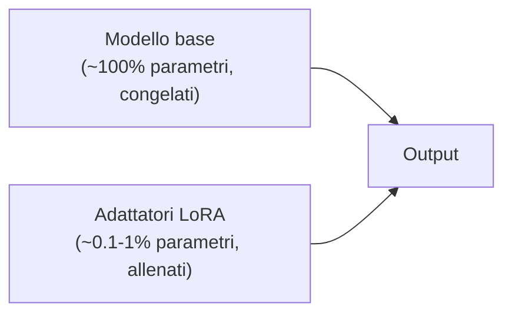

# Fine-tuning operativo — LoRA, QLoRA, DPO

<div class="lesson-meta">
  <span class="badge-stato evoluzione">In evoluzione</span>
  <span>Lezione 1.9</span>
  <span>~14 min di lettura</span>
</div>

<p class="lesson-lead">La 1.10 ti farà esercitare la griglia di decisione. Questa ti insegna come farlo quando serve davvero. Nel 2026 il fine-tuning non è più "ri-addestrare un modello da zero": è un'operazione chirurgica e relativamente economica, ma piena di trappole.</p>

Nella lezione 1.10 imparerai una griglia di decisione: serve uno *stile* o una *conoscenza*? Se è conoscenza aggiornabile, RAG. Se è stile, comportamento, formato, tono — allora forse fine-tuning. La parola chiave è "forse", perché tra il "forse fine-tuning" e il "ho un modello fine-tuned in produzione che porta valore" c'è una distanza che si misura in trappole. Questa lezione è la mappa di quelle trappole.

Il punto da fissare subito: nel 2026 **fare fine-tuning non è più riservato a chi ha cluster di GPU**. Tecniche come LoRA e QLoRA hanno reso possibile affinare un modello da decine di miliardi di parametri su una **singola GPU consumer**, con qualche ora di compute e qualche centinaio di euro di costo cloud. Questo cambia le decisioni: cose che 18 mesi fa erano "no, troppo costoso" oggi sono fattibili.

## Cosa cambia il fine-tuning, davvero

Riprendiamo brevemente l'intuizione meccanica dalla lezione 0.3, perché qui conta. Un modello pre-addestrato ha già "imparato il linguaggio" — i suoi parametri codificano grammatica, fatti del mondo, capacità di ragionamento. Il **fine-tuning** prende quel modello e gli mostra ulteriori esempi, mirati, spostando di pochissimo i pesi nella direzione di quegli esempi.

L'effetto utile è **specializzare il comportamento**: il modello fine-tuned tende a rispondere come gli esempi del tuo dataset. Stile, formato, lessico, modo di approcciare il task — tutto questo si sposta. Se il tuo dataset è fatto di 500 esempi di "risposta a email da customer service in tono formale italiano, max 3 paragrafi, sempre con call-to-action finale", il modello impara *quel pattern* e ti restituisce roba che assomiglia a quegli esempi anche su input che non ha mai visto.

Quello che il fine-tuning **non fa**, e questa è l'incomprensione più cara del settore: non aggiunge fatti recuperabili con precisione. Puoi fine-tunare un modello con 1.000 fatti sulla tua azienda e quando gli chiedi un fatto specifico ti rispondono cose verosimili ma *non garantite*. I fatti aggiornabili stanno in RAG, sempre. Il fine-tuning sposta lo stile, non riempie un database.

## LoRA: il trucco che ha cambiato tutto

Prima del 2021, fine-tunare un LLM significava ricalcolare *tutti* i suoi parametri — miliardi di numeri da aggiornare. Costoso, lento, richiedeva GPU enterprise. Poi è arrivato un paper di Microsoft, *LoRA: Low-Rank Adaptation*, che ha proposto un'idea elegante: invece di toccare i pesi originali, **affianca al modello dei piccoli "adattatori"** che imparano la modifica.

L'analogia che funziona: pensa al modello base come a un libro stampato, fissato. Fare full fine-tuning sarebbe riscriverlo. LoRA è come aggiungere **post-it sui margini delle pagine**: il libro originale resta intatto, i tuoi post-it sono piccoli e si fanno in fretta, e quando leggi tieni conto sia del libro che dei post-it. Se i post-it non ti piacciono più, li stacchi e torni al modello originale senza danni.



Numeri concreti: per un modello da 70 miliardi di parametri, gli adattatori LoRA pesano tipicamente **lo 0.1-1%** del totale — qualche centinaio di megabyte invece di centinaia di gigabyte. Te ne stai sul tuo PC, te li sposti, te li versioni in Git LFS. Cambia tutto a livello operativo.

**Cosa si guadagna:**
- Compute richiesto per il training: 10-100× inferiore rispetto al full fine-tuning.
- Memoria GPU: si entra in 24-80 GB invece di richiedere cluster.
- Tempo di training: ore invece di giorni.
- Costo: poche centinaia di euro su cloud invece di decine di migliaia.
- Reversibilità: stacchi l'adattatore e sei tornato al modello base. Provi un secondo dataset e fai un secondo adattatore parallelo. Servi tre LoRA diversi da un solo modello base.

**Cosa si perde:** in linea di principio, un po' di qualità rispetto al full fine-tuning. In pratica, sui task ragionevoli (stile, formato, tono), la differenza è impercettibile o nulla. È il motivo per cui LoRA è diventato il default nel 2026 — *full fine-tuning si fa solo se hai un buon motivo specifico*.

### Sotto il cofano: cos'è "low-rank"

Il pezzo tecnico che vale la pena vedere — fa capire perché LoRA funziona così bene a costo così basso.

Quando aggiorni un parametro del modello durante il training, in realtà stai aggiornando una **matrice** (le reti neurali sono fatte di matrici). Una matrice grossa — diciamo 4096 × 4096 = 16 milioni di numeri da memorizzare per la sua modifica.

L'osservazione del paper LoRA: gli aggiornamenti tipici del fine-tuning **non sono "ricchi"** — non usano davvero tutti i 16 milioni di gradi di libertà. Si possono approssimare bene con il prodotto di due matrici molto più piccole: $A$ di dimensione $4096 \times r$ e $B$ di dimensione $r \times 4096$, dove $r$ ("rank") è piccolo, tipo 8, 16, 32.

$$\Delta W \approx B \cdot A$$

Invece di memorizzare 16 milioni di numeri per $\Delta W$, ne memorizzi $4096 \cdot r + r \cdot 4096 = 8192 \cdot r$. Con $r=16$, sono circa 130.000 numeri invece di 16 milioni: un fattore 125× in meno. Moltiplica per tutte le matrici del modello e capisci da dove esce il risparmio.

Cosa portarsi a casa: LoRA assume che le **modifiche utili al modello vivano in un sottospazio piccolo**, e parametrizza esplicitamente solo quel sottospazio. Funziona perché empiricamente l'assunzione è vera. Il *rank* $r$ è l'iperparametro principale che imposterai — 8 e 16 sono default sensati per partire.

## QLoRA: ancora più economico

LoRA risolve il problema dei *parametri da allenare*. Ma resta un altro collo di bottiglia: il **modello base** stesso, da tenere in memoria durante il training, è enorme. Un Llama 70B in precisione standard occupa circa 140 GB di memoria GPU — fuori portata per chiunque non abbia un H100 o equivalente.

**QLoRA** — *Quantized LoRA*, paper di metà 2023 — combina due tecniche. Prima **quantizza** il modello base a 4 bit invece dei 16 bit standard, comprimendolo di un fattore 4 senza perdita pratica di qualità (la quantizzazione è meccanica simile a comprimere un'immagine a JPEG: butti precisione che non serviva). Poi ci applica LoRA sopra, allenando gli adattatori in precisione normale.

Risultato netto: un Llama 70B che richiedeva 140 GB ora ne occupa ~35 GB. Lo allena chiunque abbia una **singola GPU consumer di fascia alta** — una RTX 4090 da gaming basta. Un Llama 7B/13B lo fine-tuni su una macchina da 16-24 GB di VRAM, accessibile a 1.000-1.500 euro di hardware o pochi euro/ora di cloud.

Il prezzo della quantizzazione: una **leggera** perdita di qualità rispetto a LoRA non-quantizzato. In pratica, per la maggior parte dei task di stile/formato, indistinguibile.

QLoRA è ciò che ha trasformato il fine-tuning da "operazione enterprise" a "operazione da garage". Nel 2026 è il default ragionevole per fine-tunare modelli open-weight di fascia media (7B-70B) senza grossi budget.

## DPO e ORPO: oltre l'imitazione, l'allineamento alle preferenze

Tutto quello che abbiamo visto fin qui è **supervised fine-tuning (SFT)**: gli mostri esempi della forma "input → output desiderato", lui impara a imitarli. È la base, e per il 90% dei task applicativi basta.

Ma c'è un caso che SFT non risolve bene: **insegnare al modello quale tra due risposte è migliore**. Il customer service deve essere "cortese ma non leccaculo", "informativo ma non pedante", "fermo sulle policy senza essere ostile". Questi sono giudizi *comparativi*: difficili da catturare con esempi positivi singoli. Per insegnarli funziona meglio mostrare al modello coppie del tipo "data questa domanda, *questa* risposta è meglio di *quest'altra*", e premiarlo per preferire la prima.

Il metodo classico per questo si chiama **RLHF** (Reinforcement Learning from Human Feedback): è quello con cui sono stati allineati GPT-4 e simili. Funziona ma è complesso da implementare — richiede un *reward model* separato, una pipeline di PPO, tuning instabile. Fuori scope per quasi qualunque progetto applicativo.

Nel 2023-2024 sono usciti **DPO** (Direct Preference Optimization) e poi **ORPO** (Odds Ratio Preference Optimization), che hanno semplificato radicalmente la cosa: ti permettono di allenare direttamente sulle coppie di preferenza, **senza reward model esplicito**, senza RL classico, con codice quasi identico a un training SFT. Il risultato non è all'altezza di un RLHF fatto bene da OpenAI, ma per i casi applicativi è più che sufficiente.

**Quando usare DPO/ORPO al posto di SFT puro:**
- Hai task dove la qualità è *comparativa* (quale risposta suona meglio), non solo binaria (corretto/sbagliato).
- Hai modi semplici per generare coppie di preferenze: due risposte del modello base, un umano sceglie la migliore. Oppure due risposte e un giudice automatico (LLM-as-judge, lezione 3.2) che le ordina.
- SFT da solo ti porta vicino al risultato ma manca il "polish" finale di registro/tono.

La pipeline tipica è ibrida: prima un SFT su un dataset di esempi positivi per portare il modello vicino al territorio giusto, poi un DPO su un dataset più piccolo di coppie per affinare le preferenze. È il pattern industriale del 2025-26.

> **Nota onesta** — DPO/ORPO sono ancora il **secondo livello di sofisticazione** del fine-tuning applicativo. Il 70% dei progetti reali fa solo SFT con LoRA/QLoRA e si ferma lì, con risultati ottimi. Non partire da DPO: prima fai SFT, misura, e se vedi che ti manca il polish finale aggiungi DPO sopra.

## Il dataset è il 90% del progetto

Più che lo strumento, conta cosa gli dai da imparare. È la cosa che chi inizia col fine-tuning sottovaluta di più, e che dopo il primo flop tende a sopravvalutare.

**Dimensione minima realistica:** dipende dal task, ma sotto i **100 esempi** raramente succede qualcosa di utile. Sotto i **500** la qualità è instabile. Da **1.000-5.000 esempi** ben fatti si vede l'effetto. Sopra i **10.000** i rendimenti tendono a flatten — qualità migliore dei dati batte quasi sempre più dati.

**Qualità >> quantità.** Cinquecento esempi puliti, curati, rappresentativi del task reale battono diecimila esempi rumorosi raschiati malamente. È noioso ma vero: il tempo di un progetto di fine-tuning si spende quasi tutto nel preparare/pulire il dataset, non nel lanciare il training.

**Formato.** I provider e i framework si aspettano JSONL — un esempio per riga, ogni esempio è un oggetto JSON con la conversazione in formato standard (sistema, utente, assistente). Il formato esatto cambia tra provider, ma l'idea è la stessa.

```json
{"messages": [
  {"role": "system", "content": "Sei un assistente di customer service di Acme. Tono formale, max 3 paragrafi, sempre call-to-action finale."},
  {"role": "user", "content": "Il pacco non è ancora arrivato dopo 5 giorni, cosa devo fare?"},
  {"role": "assistant", "content": "Gentile cliente, comprendiamo la sua preoccupazione...\n\n[risposta strutturata di esempio]\n\nLa invitiamo a contattarci tramite il modulo dedicato per aprire una segnalazione formale."}
]}
```

**Split train/eval.** Tieni da parte 10-20% degli esempi come **evaluation set**, mai usato in training. Senza questo non hai modo di sapere se il fine-tuning funziona o se hai solo memorizzato i tuoi esempi (vedi sotto, "catastrophic forgetting").

**Validazione contro l'over-fitting.** Durante il training si guarda la *loss* sia su train che su eval: se la loss su train scende ma quella su eval risale, stai memorizzando, non generalizzando. È il segnale per fermare il training.

## Catastrophic forgetting: il rischio più sottovalutato

C'è un fallimento ricorrente che merita una sezione propria perché morde sempre. Si chiama **catastrophic forgetting**, e funziona così: il modello, mentre impara il tuo dataset specifico, *dimentica* parte delle capacità generali che aveva.

Esempio concreto. Fine-tuni un modello su 2.000 esempi di customer service in italiano, lo lanci. I test sul customer service vanno benissimo. Poi qualcuno gli chiede "spiegami il teorema di Pitagora" — e il modello risponde male, o si comporta come un customer service che cerca di parlare di matematica. Il fine-tuning ha **distorto** il comportamento generale verso il task specifico.

Le contromisure:
- **Mescola al dataset una parte di "general data"** — esempi che mantengono le capacità ampie. È il motivo per cui i provider managed (OpenAI, Anthropic) mischiano dietro le quinte i tuoi esempi con i loro dati di alignment.
- **Tieni LoRA con rank basso.** Più basso il rank, meno il modello può deviare. Su task ristretti $r=8$ basta; alzarlo invita a forgettare di più.
- **Few epochs, not many.** Più passi sui dati = più rischio di forgetting. 2-3 epoche tipicamente bastano; 10 epoche sono spesso troppe.
- **Eval con un benchmark generale.** Non testare solo il tuo task: tieni un set di domande "generiche" (MMLU, qualche prompt di senso comune) per verificare che il modello non sia degradato altrove.

Il forgetting è il motivo per cui sentir dire "ho fine-tunato e ora il modello è peggio" non è raro. Quasi sempre è questo, e quasi sempre lo si evita pulendo il dataset, controllando le epoche, e validando su benchmark esterni.

## Managed vs self-hosted: dove farlo

Hai due strade.

**Provider managed.** OpenAI, Anthropic, Google e altri offrono API di fine-tuning: carichi il JSONL, paghi a token di training, scarichi un model ID che chiami come fosse un modello normale.
- *Pro:* zero infrastruttura, mantengono loro i benchmark generali nel mix per evitare forgetting, alignment di sicurezza preservato, deployment immediato.
- *Contro:* costi più alti a parità di compute, modelli proprietari che non puoi auto-ospitare, vincolo al provider per sempre, niente accesso ai pesi.
- *Quando:* progetti enterprise dove la velocità di iterazione conta più del costo, casi dove non vuoi gestire infrastruttura GPU, integrazione semplice con lo stack esistente del provider.

**Self-hosted con framework open.** **Unsloth** è diventato lo standard de facto nel 2025-26 per QLoRA su singola GPU — semplice, ottimizzato, supporta i principali modelli open. **Axolotl** è l'alternativa più configurabile, popolare in setup multi-GPU. Entrambi girano sopra Hugging Face Transformers/PEFT.
- *Pro:* costi molto più bassi a parità di compute, controllo totale sul dataset e sul modello, modelli open-weight che possono restare on-prem, possibilità di servirli come vuoi.
- *Contro:* devi gestire infrastruttura (GPU, ambiente, deployment), devi gestire tu il rischio di forgetting, alignment e safety da curare a mano se il caso lo richiede.
- *Quando:* casi privacy-critici (modello on-prem), volumi di training significativi (il managed diventa caro), bisogno di sperimentare velocemente con dataset diversi.

Una via di mezzo nel 2026: piattaforme come **Together, Fireworks, Replicate** offrono fine-tuning di modelli open su loro infrastruttura — paghi cloud, ma con interfacce semi-managed e accesso al peso fine. Buon compromesso per chi non vuole gestire GPU.

## Quando fine-tuning batte un buon prompt

Una decisione che ricorre: ho un modello grande con un prompt sofisticato che funziona — vale la pena fine-tunare un modello piccolo?

Spesso sì, e qui sta uno dei guadagni più interessanti del fine-tuning nel 2026: **un modello da 7-13B fine-tunato bene sul tuo task spesso batte un modello da 70B con prompt elaborato**, soprattutto su:
- **Costo per chiamata in produzione.** Il modello piccolo costa 10-30× meno per inferenza.
- **Latenza.** Anche 5-10× più veloce.
- **Privacy.** Lo metti on-prem.
- **Coerenza di formato.** Il fine-tuning insegna il formato meglio di qualunque prompt.

La trappola che sentirai citare: questo guadagno è specifico al tuo task. Sul task generico il modello grosso resta superiore. Il fine-tuning ti compra **specializzazione a costo basso**, non capacità generale a costo basso.

Riferimento alla griglia 1.10: "vuoi uno *stile/comportamento* specifico, ad alta frequenza, che giustifica il costo di training? Fine-tuning. Vuoi *fatti aggiornabili*? RAG. I due non si sostituiscono — spesso si combinano: fine-tuning per il formato + RAG per i fatti."

## Cosa NON è il fine-tuning

| Il pensiero sbagliato | Come stanno le cose |
|---|---|
| "Fine-tuning carica i miei dati nel modello come una memoria" | No, sposta i pesi verso lo *stile* dei tuoi dati. Fatti precisi e aggiornabili stanno in RAG. |
| "Più epoche = più qualità" | Falso. Più epoche tipicamente = più overfitting + catastrophic forgetting. 2-3 sono spesso il punto giusto. |
| "Se ho il dataset grande, posso saltare la curatela" | Falso al cubo. Cinquecento esempi puliti battono diecimila sporchi. Quasi sempre. |
| "Il modello fine-tunato è migliore in tutto" | No, è migliore sul **task specifico** per cui l'hai allenato, spesso a costo di un calo altrove. |
| "Fine-tuning rimpiazza il prompt engineering" | No, lo *complementa*. Anche un modello fine-tunato risponde meglio con prompt curati. |
| "QLoRA dà sempre la stessa qualità di LoRA full-precision" | Quasi sempre indistinguibile sui task applicativi, ma sui task estremamente sensibili una piccola perdita di qualità c'è. |

> **Il punto da tenere stretto** — Il fine-tuning operativo del 2026 non è "ri-addestrare un modello" ma "**applicare degli adattatori chirurgici**". Costa poco, gira veloce, è reversibile. Questo cambia le decisioni: cose impensabili 18 mesi fa sono ora un weekend di lavoro. Ma la facilità tecnica ha alzato il rischio: con un dataset cattivo, in due ore peggiori il modello senza accorgertene. Il valore non è nello strumento, è nel **dataset**.

## Cosa dura, cosa evitare

<span class="badge-stato stabile">Stabile</span> **I principi:** dataset >> strumento, qualità >> quantità, validation set obbligatorio, attenzione al catastrophic forgetting, fine-tuning per stile / RAG per fatti. Reggono per anni.

<span class="badge-stato evoluzione">In evoluzione</span> **I framework e i nomi specifici** (Unsloth, Axolotl, le API managed). I default cambiano ogni 6-12 mesi. Astrai la tua pipeline di training dietro un'interfaccia che ti permetta di cambiarli.

<span class="badge-stato evoluzione">In evoluzione</span> **DPO/ORPO come standard.** DPO è del 2023, ORPO del 2024 — sono ancora in assestamento. Stanno uscendo varianti continuamente. Aspettati che il "metodo di scelta" per preference tuning cambi nei prossimi 12-24 mesi.

<span class="badge-stato rischio">A rischio</span> **Servire LoRA come "model ID" gestito dal provider.** Per ora OpenAI ti vende il modello fine-tunato come un'entità a sé, opaca. Si va verso una maggiore trasparenza sui pesi anche nei provider managed, ma il modello commerciale è ancora in movimento.

<span class="badge-stato legacy">Legacy</span> **Full fine-tuning come scelta default.** Si fa ancora in casi specifici (modelli piccolissimi, lavori di laboratorio), ma in produzione applicativa è stato sostituito da LoRA/QLoRA per quasi tutto.

---

## Verifica di comprensione

> Rispondi a memoria, senza rileggere. Risposte incerte: rivedile **domani**.

1. Qual è la differenza fondamentale tra LoRA e full fine-tuning, in una frase?
2. Cosa aggiunge QLoRA rispetto a LoRA, e a che prezzo?
3. Quando ha senso DPO al posto di SFT puro?
4. Cos'è il catastrophic forgetting e come lo prevedi/diagnostichi?
5. Quanti esempi servono realisticamente per fine-tunare con qualche speranza?
6. Provider managed vs self-hosted: due criteri reali per scegliere.
7. *(anticipazione)* Hai un modello fine-tunato in produzione. Come misuri se *continua* a funzionare bene sui nuovi tipi di richieste che arrivano? (cfr. lezione 6.3 monitoring)

---

## Glossario

- **Fine-tuning** — fase di addestramento *aggiuntiva* su un modello già pre-addestrato, mirata a specializzarne il comportamento su un dominio/task.
- **SFT (Supervised Fine-Tuning)** — fine-tuning su coppie input/output desiderato; il caso di base.
- **LoRA (Low-Rank Adaptation)** — tecnica che congela i pesi del modello base e allena solo piccoli adattatori a basso rango. Standard de facto nel 2026.
- **QLoRA** — variante di LoRA che quantizza il modello base a 4 bit per ridurre la memoria richiesta in training. Standard per fine-tuning su singola GPU.
- **Rank (r)** — l'iperparametro principale di LoRA, dimensione del sottospazio degli aggiornamenti. Valori tipici: 8, 16, 32.
- **DPO (Direct Preference Optimization)** — metodo per allenare il modello su coppie di preferenze (questa risposta è meglio di quest'altra) senza reward model esplicito.
- **ORPO** — variante più recente e più semplice di DPO, evita anche il modello di riferimento.
- **RLHF (Reinforcement Learning from Human Feedback)** — il metodo classico di alignment via RL, complesso e costoso. DPO/ORPO sono i suoi sostituti semplificati per i casi applicativi.
- **Catastrophic forgetting** — perdita di capacità generali del modello durante il fine-tuning su un dominio specifico.
- **Epoch (epoca)** — un passaggio completo sul dataset di training. 2-3 epoche sono tipicamente il punto giusto per evitare overfitting.
- **JSONL** — formato standard per i dataset di fine-tuning: un esempio per riga in JSON.

---

## Per approfondire

- **Paper LoRA** (Microsoft, 2021) — il paper originale è inusualmente leggibile per chi mastica reti neurali; non indispensabile per usare LoRA, utile per capirla.
- **Paper QLoRA** (University of Washington, 2023) — anche questo leggibile, mostra in chiaro il trade-off quantizzazione/qualità.
- **Paper DPO** (Stanford, 2023) e **ORPO** (KAIST, 2024) — entrambi importanti se lavori su preference tuning.
- **Unsloth** — documentazione e notebook ufficiali. Il modo più veloce per provare QLoRA su un modello open-weight nel 2026.
- **Hugging Face PEFT** — libreria di riferimento per fine-tuning parameter-efficient; sotto sta a quasi tutti i framework moderni.
- **Documentazione fine-tuning di OpenAI / Anthropic** — leggere quelle ufficiali è obbligatorio se userai il loro servizio: cambiano formato e prezzi spesso.

*Risorse indicate per la ricerca; i link cambiano nel tempo, cerca le versioni attuali.*

---

## Prossima lezione

Hai chiuso la Parte 1. Sai costruire i pezzi: RAG, context engineering, structured output, agenti, MCP. Sai decidere tra fine-tuning, RAG, prompt engineering. Hai gli strumenti operativi per fine-tunare quando serve. Da qui si entra nella **Parte 2**: cosa sa fare l'AI oltre il testo — immagini, audio, video — e quando un modello multimodale nativo batte una pipeline classica. Si parte da **2.1: come funziona il multimodale**.
