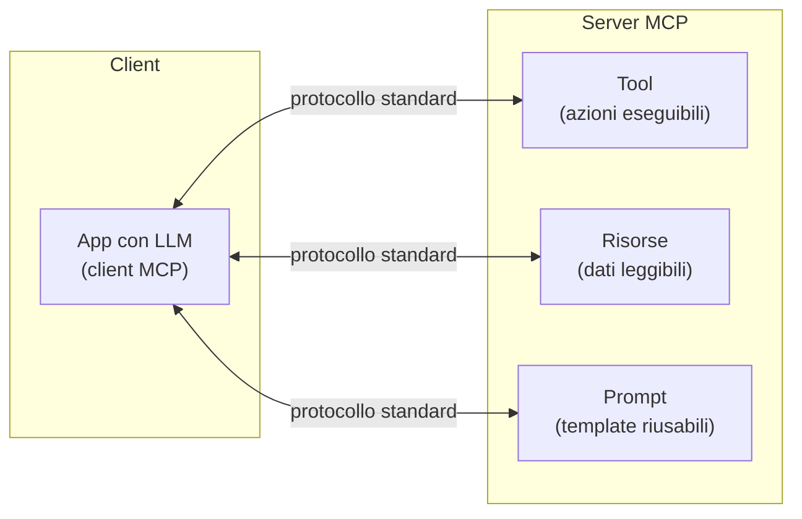

# MCP — Model Context Protocol

<div class="lesson-meta">
  <span class="badge-stato stabile">Stabile</span>
  <span>Lezione 1.7</span>
  <span>~8 min di lettura</span>
</div>

<p class="lesson-lead">MCP risolve il problema di collegare modelli, tool e dati in modo standardizzato — come fece USB per le periferiche. Non è un framework AI: è un protocollo di trasporto. A maggio 2026 non è più "uno standard emergente": è infrastruttura di settore, donata da Anthropic alla Linux Foundation a dicembre 2025 con OpenAI, Google e Microsoft come co-sponsor.</p>

Nella lezione 1.5 hai visto che gli agenti hanno bisogno di tool — funzioni che il modello può richiedere di eseguire. Il problema pratico che emergeva subito: come colleghi quegli strumenti al modello? Storicamente, ogni framework, ogni provider, ogni azienda inventava il suo protocollo. Risultato: integrazioni fragili, non riusabili, da riscrivere ogni volta che cambiavi modello o framework.

**MCP — Model Context Protocol** — risolve questa frammentazione con uno standard aperto: un protocollo unico che qualsiasi modello può usare per parlare con qualsiasi tool o fonte dati, senza integrazioni su misura. Scrivi un "server MCP" per la tua fonte una volta, e lo usano tutti i client compatibili.

## Il problema prima di MCP

Prima dello standard, collegare un LLM a un database era un progetto di integrazione su misura: scrivi l'adattatore per il modello A, lo riscrivi per il modello B, lo riscrivi ancora per il framework C. Quando esce il modello D, si ricomincia. Ogni tool richiedeva il suo connector dedicato per ogni contesto d'uso.

Era il problema delle periferiche negli anni '90: ogni dispositivo aveva il suo connettore proprietario, e collegare un dispositivo a un computer diverso spesso era impossibile. USB ha risolto questo con uno standard universale — un connettore, un protocollo, qualsiasi dispositivo su qualsiasi computer.

MCP è USB per i tool degli LLM.

## Architettura: server, client, trasporto



Tre concetti chiave:

**Server MCP** — espone capacità al client. Può esporre *tool* (funzioni che l'LLM può richiedere di eseguire), *risorse* (dati che l'LLM può leggere, come file o risultati di query), e *prompt* (template predefiniti e parametrizzabili). Un server MCP per un database espone tool per fare query; un server per un filesystem espone risorse per leggere file.

**Client MCP** — l'applicazione con l'LLM che consuma i server. Il client scopre automaticamente quali tool, risorse e prompt sono disponibili su ogni server collegato, e li rende disponibili al modello.

**Trasporto standard** — il formato dei messaggi è fisso e aperto. Client e server scritti da persone diverse, in linguaggi diversi, funzionano insieme senza accordi preventivi. È il valore del protocollo: l'interoperabilità.

## Il valore: un ecosistema di server pronti

Implementare un server MCP per la tua fonte è un'operazione una tantum. Una volta fatto, funziona con qualunque client MCP, qualunque modello compatibile, qualunque framework.

Questo ha creato un effetto di rete: chiunque scriva un server MCP per una fonte utile — GitHub, Slack, un database comune — lo rende disponibile a tutta la comunità. Esiste già un ecosistema crescente di server pronti. Collegare il tuo sistema LLM a GitHub non è più un progetto di integrazione: trovi il server MCP di GitHub, lo colleghi, e il tuo modello può già leggere issue, PR e repository.

```python
# Struttura di un tool in un server MCP (pseudocodice)
@server.tool()
def cerca_ordini(cliente_id: str, dal: str) -> list:
    """Restituisce gli ordini di un cliente a partire da una certa data."""
    return db.query(cliente_id, dal)
```

Il client (l'app col modello) scopre automaticamente che questo tool esiste, inclusi nome, descrizione e parametri. L'LLM può decidere di chiamarlo quando lo ritiene utile, senza che tu scriva la "colla": la fornisce il protocollo.

## Quando usare MCP

| Situazione | Scelta |
|---|---|
| Integri 1 sola API in un progetto piccolo | Una chiamata diretta basta; MCP è sovrastruttura |
| Più tool, più progetti, vuoi riuso | MCP ripaga: scrivi il server una volta, lo usi ovunque |
| Vuoi usare server già pronti dell'ecosistema | MCP è nato per questo |
| Vuoi intercambiabilità tra modelli e framework | MCP ti libera dal lock-in |

## La cautela sulla sicurezza

Un modello con tool via MCP può fare cose nel mondo reale — modificare file, scrivere su database, inviare richieste HTTP. Ogni tool esposto è una superficie d'attacco.

Le regole pratiche: esponi solo i tool necessari (principio del minimo privilegio); ogni tool deve validare i propri input; considera un layer di autorizzazione tra il client MCP e i tool più critici. La sicurezza del tool calling è trattata in dettaglio nella lezione 4.1 (prompt injection) e nella 4.2 (sicurezza agentica).

<span class="badge-stato evoluzione">In evoluzione</span> L'ecosistema di server MCP pronti cresce velocemente. A inizio 2025 il registry pubblico contava ~1.200 server; ad aprile 2026 ne conta oltre 9.400, con crescita mese-su-mese a doppia cifra. Controlla il registry ufficiale quando cerchi un'integrazione, perché probabilmente esiste già.

## Lo stato del 2026: da standard emergente a infrastruttura di settore

Tre eventi del 2025-26 hanno cambiato la natura di MCP da "protocollo proposto da Anthropic" a "infrastruttura di settore":

1. **Dicembre 2025 — Donazione alla Linux Foundation.** Anthropic ha donato la governance del protocollo, con OpenAI, Google e Microsoft come co-sponsor fondatori. Non è più "il protocollo di Anthropic"; è uno standard di proprietà neutrale.
2. **Adozione cross-vendor.** Ad aprile 2026 il 78% dei team AI enterprise ha almeno un agente MCP in produzione (sondaggi di settore); 67% dei CTO lo dichiara standard di default. Tutti i principali lab e IDE lo supportano nativamente: Claude (native), ChatGPT (aprile 2025), Google Gemini API e Vertex AI Agent Builder (marzo 2026), Cursor, Windsurf, Zed, JetBrains AI Assistant, Vercel AI SDK, OpenAI Agents SDK.
3. **Roadmap 2026 ufficiale.** Tre fronti principali: *enterprise authentication* (OAuth 2.1 + identity provider enterprise), *multi-agent coordination* (tool calling agent-to-agent via MCP), *registry verificato* con security ratings. La specifica successiva — release candidate al 28 luglio 2026 — introduce stateless protocol core, framework di estensioni, Tasks, MCP Apps, authorization hardening.

Pratica conseguenza per chi costruisce ora: **MCP non è una scommessa**. Investirci tempo non è "guardare al futuro", è seguire dove l'industria è già.

## Cosa MCP non è

| Il pensiero sbagliato | Come stanno le cose |
|---|---|
| "MCP è un framework AI" | È un protocollo di trasporto, non un framework. Non gestisce la logica degli agenti: gestisce la comunicazione tra client e server. |
| "MCP risolve la sicurezza del tool calling" | Definisce il canale, non i controlli. La sicurezza si costruisce nei server e nell'orchestratore. |
| "Serve solo per agenti" | Qualsiasi applicazione LLM che ha bisogno di tool o dati esterni beneficia dello standard. |
| "MCP è proprietario di Anthropic" | Lo era nominalmente fino al 2025. A dicembre 2025 Anthropic l'ha donato alla Linux Foundation: governance neutrale con OpenAI, Google, Microsoft come co-sponsor. |

---

## Verifica di comprensione

> Rispondi a memoria. Le incerte rivedile domani.

1. Qual è il problema che MCP risolve, e qual è l'analogia che lo spiega meglio?
2. Cosa differenzia tool, risorse e prompt in un server MCP?
3. Perché il valore di MCP non è solo tecnico, ma "di ecosistema"?
4. Hai un agente che può leggere file e inviare email via MCP. Quali rischi concreti introduce questa capacità?
5. Quando ha senso *non* usare MCP e fare un'integrazione diretta?

---

## Glossario

- **MCP (Model Context Protocol)** — protocollo aperto per la comunicazione standard tra applicazioni LLM (client) e tool o fonti dati (server).
- **Server MCP** — componente che espone tool, risorse e prompt al client in formato standardizzato.
- **Client MCP** — l'applicazione con l'LLM che si connette ai server MCP e rende le loro capacità disponibili al modello.
- **Tool (in MCP)** — un'azione eseguibile che il modello può richiedere; il server la esegue e restituisce il risultato.
- **Risorsa (in MCP)** — dato leggibile esposto da un server (un file, il risultato di una query, un documento).
- **Ecosistema MCP** — l'insieme di server MCP già scritti dalla comunità per fonti comuni (GitHub, database, filesystem, ecc.).

---

## Per approfondire

- **Specifica ufficiale di MCP** — la fonte primaria aggiornata; cerca "Model Context Protocol specification" o vai su modelcontextprotocol.io. La release candidate prevista per il 28 luglio 2026 introduce stateless protocol core, Extensions framework, Tasks, MCP Apps.
- **Registry ufficiale dei server MCP** — lista dei server già pronti (9.400+ ad aprile 2026); utile prima di scriverne uno da zero.
- **MCP roadmap 2026** — pubblicata sul blog ufficiale `blog.modelcontextprotocol.io`; spiega le priorità (enterprise auth, multi-agent, registry verificato).

*Risorse indicate per la ricerca; per i link aggiornati conviene cercarli al momento.*

---

## Prossima lezione

**1.8 Decision drill — Costruire.** Hai ora tutti i mattoni della Parte 1. Prima di passare alla griglia di decisione sistematica (1.10), un esercizio da architetto: dati vincoli reali di budget, latenza e tipo di dati, scegli l'architettura e giustifica ogni scelta.
