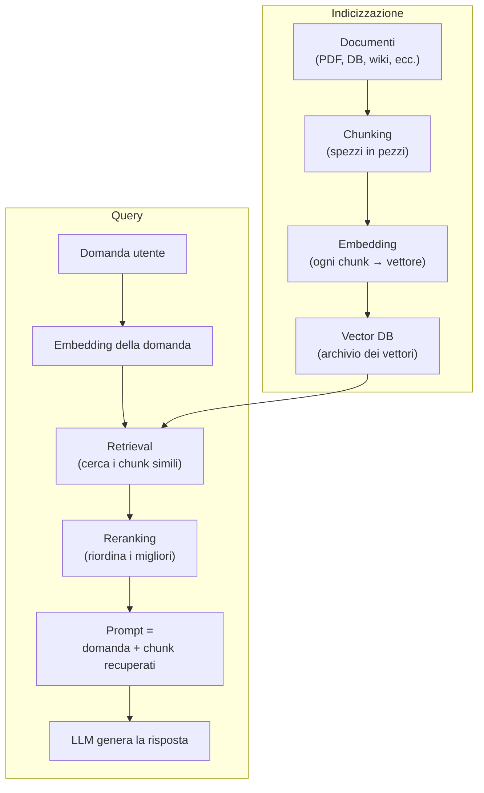

# RAG — Retrieval-Augmented Generation

  Stabile
  Lezione 1.1
  ~15 min di lettura

Il sistema più frequente in produzione per i sistemi AI aziendali. Il pattern resta stabile da anni; cambiano i pezzi dentro — ma capire il ciclo completo è il prerequisito di tutto il resto della Parte 1.

Nella lezione 0.5 hai visto che il prompt engineering non può portare fatti aggiornati o specifici al dominio — e nemmeno documenti che superano la context window. L'alternativa "facile" è il fine-tuning: ci insegni i dati al modello una volta per tutte. Ma è costoso, lento, e ogni volta che i dati cambiano devi riaddestrare.

**RAG — Retrieval-Augmented Generation** — taglia il nodo: invece di insegnare i dati al modello, li recupera al momento giusto e li mette nel prompt. Il modello non li "ricorda"; li legge. È la differenza tra uno studente che ha memorizzato l'enciclopedia e uno che ha il libro aperto alla pagina giusta.

## Il problema: il modello non sa quel che non ha visto

Un LLM sa solo ciò che ha visto in addestramento, fino al suo cut-off. Non conosce i documenti della tua intranet, i contratti della settimana scorsa, i prodotti aggiunti ieri al catalogo. Quando non sa, ha due comportamenti possibili: ammette di non sapere (raro), oppure genera qualcosa di plausibile ma falso — l'allucinazione di cui abbiamo parlato nella lezione 0.1.

Fine-tuning non risolve questo per i fatti aggiornabili. Come hai visto nella lezione 0.3, il fine-tuning sposta i pesi verso uno stile e un comportamento, non porta fatti recuperabili con precisione. Puoi insegnare al modello che "i tuoi prodotti si chiamano X", ma non puoi garantire che risponda correttamente sui dettagli tecnici di ciascuno.

RAG cambia l'architettura: separa la "memoria" dall'inferenza. I documenti vivono in un archivio esterno. Quando arriva una domanda, il sistema recupera i pezzi pertinenti, li imbottisce nel prompt, e il modello risponde basandosi su quelli. I documenti cambiano? Si aggiorna l'archivio, non il modello.

## Il ciclo RAG: da documento a risposta

Il flusso ha due fasi distinte: **indicizzazione** (si fa una volta, o alla modifica dei documenti) e **retrieval + generazione** (si fa a ogni query).

Il percorso è questo: prendi i tuoi documenti, spezzali in pezzi (chunking), trasforma ogni pezzo in un vettore (embedding), salva tutto in un vector database. Quando arriva una domanda, la trasformi in un vettore allo stesso modo, cerchi i chunk più simili nel DB, riordini i migliori con un reranker, e costruisci il prompt finale con domanda e chunk. Il modello genera la risposta basandosi su quel contesto.

Ogni passaggio ha la sua complessità. Li vediamo uno per uno.

## Chunking: la decisione che pesa di più

Chunking è spezzare i documenti in pezzi. Suona banale; è invece la decisione che impatta di più sulla qualità del retrieval — e la più sottovalutata.

**Chunk troppo piccolo**: perde il contesto che circonda l'informazione. "La scadenza è il 30 giugno" estratto da una frase non dice niente senza sapere di cosa. Il chunk troppo piccolo recupera frammenti decontestualizzati.

**Chunk troppo grande**: porta rumore. Se il chunk è un intero capitolo di 3.000 parole, il modello riceve un sacco di testo non pertinente insieme al pezzo che serviva. Consuma più token, costa di più, e il segnale utile si diluisce.

Non esiste una dimensione universale. Dipende dal tipo di documento (un contratto legale è diverso da un manuale tecnico), dalla struttura naturale del testo, e da come vengono poste le domande. Alcune strategie:

- **Chunk semantici**: rispetta la struttura naturale — paragrafi, sezioni — invece di tagliare ogni N caratteri. Produce chunk più coerenti.
- **Chunk sovrapposti**: ogni chunk include l'inizio del successivo (overlap). Riduce il rischio di tagliare a metà un concetto.
- **Chunk gerarchici**: mantieni sia pezzi piccoli (per retrieval preciso) sia pezzi grandi (per contesto). Al retrieval recuperi entrambi e scegli.

La regola pratica: inizia con chunk da 300-600 token con qualche overlap, misura la qualità del retrieval sul tuo dataset, e aggiusta. Il chunking non si indovina: si prova e si misura.

## Embedding e vector database

Una volta prodotti i chunk, ogni chunk viene trasformato in un vettore tramite un modello di embedding — già visto nella lezione 0.2. Il vettore cattura il significato semantico del chunk: chunk che dicono cose simili producono vettori vicini nello spazio.

Questi vettori vengono salvati in un **vector database** — un sistema di storage ottimizzato per cercare rapidamente i vettori più vicini a un vettore query. A differenza di un database tradizionale che fa ricerche esatte su colonne, un vector DB fa **ricerca approssimata del vicino più prossimo** (ANN — Approximate Nearest Neighbor): trova i vettori più simili alla query tra milioni, in millisecondi.

Sotto il cofano: come funziona l'ANN search

Cercare il vettore più simile tra milioni con un confronto esaustivo è troppo lento a scala. I vector database usano strutture a indice — HNSW (Hierarchical Navigable Small World) è il più diffuso — che permettono di trovare i vicini approssimati in tempo sub-lineare.

L'idea di HNSW: costruisci un grafo in cui ogni vettore è connesso ai suoi vicini prossimi. La ricerca naviga il grafo "saltando" verso la zona dello spazio dove si trova la query, senza confrontare tutto. È "approssimato" perché può perdere il vicino *esatto* più prossimo, ma in pratica la qualità è alta e la velocità guadagnata vale la piccola perdita.

Ai fini pratici: sceglierai un vector DB (Pinecone, Weaviate, Qdrant, pgvector, Chroma, Milvus, e — in crescita rapida nel 2025-26 — LanceDB per setup serverless e multimodali) e userai la sua implementazione ANN. Non devi implementare HNSW a mano; ma capire che c'è un indice approssimato — e che va costruito una volta e aggiornato quando aggiungi documenti — ti spiega perché il warm-up di un vector DB non è istantaneo.

Attenzione al dettaglio pratico dalla lezione 0.2: i vettori prodotti da modelli di embedding diversi non sono confrontabili. Scegli un modello e usalo sia per indicizzare i chunk sia per embeddare le query. Cambiare modello richiede di re-embeddare tutto.

## Retrieval: dense, sparse e hybrid

Una volta che la query è stata trasformata in un vettore, la ricerca recupera i chunk più simili. Tre approcci principali.

**Dense retrieval** (ricerca semantica pura): confronta il vettore della query con i vettori dei chunk, prende i K più vicini. Trova cose simili anche se le parole sono diverse — cerca "password dimenticata" e trova "reimpostare le credenziali". Funziona bene su domande in linguaggio naturale, meno su query con termini precisi (codici, numeri, ID).

**Sparse retrieval** (BM25 e derivati): il vecchio approccio keyword-based, ma ben calibrato. Conta la frequenza delle parole, penalizza i termini troppo comuni, premia quelli rari. Eccelle quando i termini esatti contano — "articolo 34 del GDPR", "SKU-10293", "errore 0x80070002". Zero comprensione del significato, precisione altissima sui match esatti.

**Hybrid search**: il meglio di entrambi. Esegui dense e sparse in parallelo, poi combina i ranking con una formula di fusione — Reciprocal Rank Fusion è il metodo standard. Nella pratica, l'hybrid è spesso il default ragionevole per sistemi in produzione: copre sia le domande semantiche sia quelle che contengono termini specifici.

In evoluzione Hybrid search era "avanzato" fino a poco tempo fa; oggi è lo standard de facto nei sistemi seri.

## Reranking: il secondo passaggio di qualità

Il retrieval recupera K candidati velocemente, ma la velocità ha un costo: può sbagliare l'ordine. Il **reranker** è un secondo modello — più lento e più preciso — che prende quei candidati e li riordina in base alla vera rilevanza rispetto alla query.

Il reranker vede la query e ogni chunk insieme (non i vettori separati, ma i testi completi): questo gli permette di valutare la relazione tra i due in modo più ricco. Il trade-off è la latenza: un reranker aggiunge tempo. La soluzione standard è il **two-stage retrieval**: recupera 50-100 candidati velocemente, poi il reranker ne valuta 50 e restituisce i migliori 3-5 al prompt.

**La regola pratica più importante:** se il tuo RAG produce risposte scadenti, il primo posto dove guardare è il retrieval — stai recuperando i chunk giusti? Per 10 domande reali del tuo dataset, visualizza i chunk che vengono effettivamente passati al modello. Spesso scopri che il problema non è il modello, è che arrivano i pezzi sbagliati.

## GraphRAG: quando la struttura conta

Il RAG classico tratta i documenti come sacchi di chunk indipendenti. Ma alcune basi di conoscenza hanno una struttura: concetti che si collegano, relazioni tra entità, gerarchie. Chiedere "come sono collegati questi due regolamenti?" su un RAG classico è difficile — i chunk non sanno niente dei loro vicini.

**GraphRAG** è un'estensione che aggiunge un grafo di conoscenza sopra il retrieval classico: estrae entità e relazioni dai documenti, costruisce un grafo, e usa quel grafo per navigare relazioni multi-hop al momento della query. Utile quando le domande richiedono ragionamento su connessioni.

In evoluzione GraphRAG è potente ma complesso da mantenere. È la scelta giusta solo quando il retrieval semantico classico non basta perché le domande richiedono traversate di relazioni. Non aggiungerla per default: inizia dal RAG classico, misura, e aggiungi se c'è evidenza che il retrieval relazionale aiuta.

## Cosa il RAG non è

| Il pensiero sbagliato | Come stanno le cose |
|---|---|
| "RAG elimina le allucinazioni" | Riduce il rischio, ma non lo azzera. Se recupera i chunk sbagliati, il modello può comunque generare qualcosa di falso. La qualità del retrieval è tutto. |
| "Context window grande rende RAG inutile" | No: più token in contesto = più costo a ogni chiamata e "lost in the middle". RAG porta solo i pezzi pertinenti, riducendo costo e rumore. |
| "RAG e fine-tuning fanno la stessa cosa" | No: RAG porta fatti nel contesto al momento della risposta; il fine-tuning sposta il comportamento nei pesi. Spesso si usano insieme. |
| "Se le risposte sono brutte, cambio modello" | Quasi sempre il problema è il retrieval, non il modello. Controlla prima i chunk che arrivano al prompt. |

---

## Verifica di comprensione

> Rispondi a memoria, senza rileggere. Le risposte incerte rivedile domani. Le ultime due anticipano lezioni successive.

1. Perché RAG risolve un problema che il fine-tuning non risolve?
2. Quali sono le due fasi di un sistema RAG, e cosa succede in ciascuna?
3. Cos'è il chunking, e perché chunk troppo piccoli *e* troppo grandi sono entrambi un problema?
4. Differenza tra dense retrieval e sparse retrieval: quando usi l'uno, quando l'altro?
5. Cos'è il reranking e perché si usa al secondo passaggio invece del primo?
6. *(anticipazione)* Hai un RAG funzionante. La context window del tuo modello è 128k token. Puoi mettere tutto il corpus nel contesto e fare a meno del retrieval?
7. *(anticipazione)* Quando il RAG non basta e dovresti considerare il fine-tuning?

---

## Glossario

- **RAG (Retrieval-Augmented Generation)** — pattern che recupera pezzi di conoscenza da un archivio esterno e li inserisce nel prompt prima che il modello generi la risposta.
- **Chunking** — l'operazione di spezzare i documenti in pezzi di dimensione adatta al retrieval.
- **Chunk** — un pezzo di documento, unità base dell'indicizzazione e del retrieval.
- **Indicizzazione** — la fase offline in cui i documenti vengono spezzati, embeddati e salvati nel vector DB.
- **Vector database** — sistema di storage ottimizzato per la ricerca veloce dei vettori più simili a un vettore query.
- **ANN (Approximate Nearest Neighbor)** — algoritmo di ricerca approssimata del vettore più vicino; la base tecnica dei vector database.
- **Dense retrieval** — ricerca basata sulla similarità dei vettori embedding; trova testi semanticamente simili anche con parole diverse.
- **Sparse retrieval (BM25)** — ricerca basata su keyword e frequenza dei termini; precisa su termini esatti, senza comprensione semantica.
- **Hybrid search** — combinazione di dense e sparse retrieval; standard de facto per i sistemi in produzione.
- **Reranking** — secondo passaggio in cui un modello più preciso riordina i candidati del retrieval in base alla vera rilevanza.
- **Two-stage retrieval** — architettura in cui il retrieval veloce recupera molti candidati e il reranker ne seleziona i migliori.
- **GraphRAG** — estensione del RAG classico che usa un grafo di conoscenza per rispondere a domande che richiedono traversate di relazioni tra entità.

---

## Per approfondire

- **"Retrieval-Augmented Generation for Knowledge-Intensive NLP Tasks"** di Lewis et al. — il paper originale che ha dato il nome al pattern; cercalo su arXiv con questo titolo.
- **Documentazione di Weaviate, Qdrant, pgvector** — i vector DB più diffusi spiegano l'architettura ANN e i trade-off di configurazione nella loro documentazione tecnica.
- **"GraphRAG: Unlocking LLM discovery on narrative private data"** — il post di Microsoft Research che ha formalizzato GraphRAG; cercalo sul blog di Microsoft Research.

*Risorse indicate per la ricerca; per i link aggiornati conviene cercarli al momento.*

---

## Prossima lezione

**1.2 Context engineering: cosa mettere nel contesto, a scala.** Ora sai come recuperare i pezzi giusti. La prossima domanda è: una volta che li hai, come decidi cosa mettere davvero nel prompt? Con context window da 128k token, la tentazione è "metto tutto" — ma il costo cresce, e l'attenzione del modello decade nel mezzo. Context engineering è la risposta.

