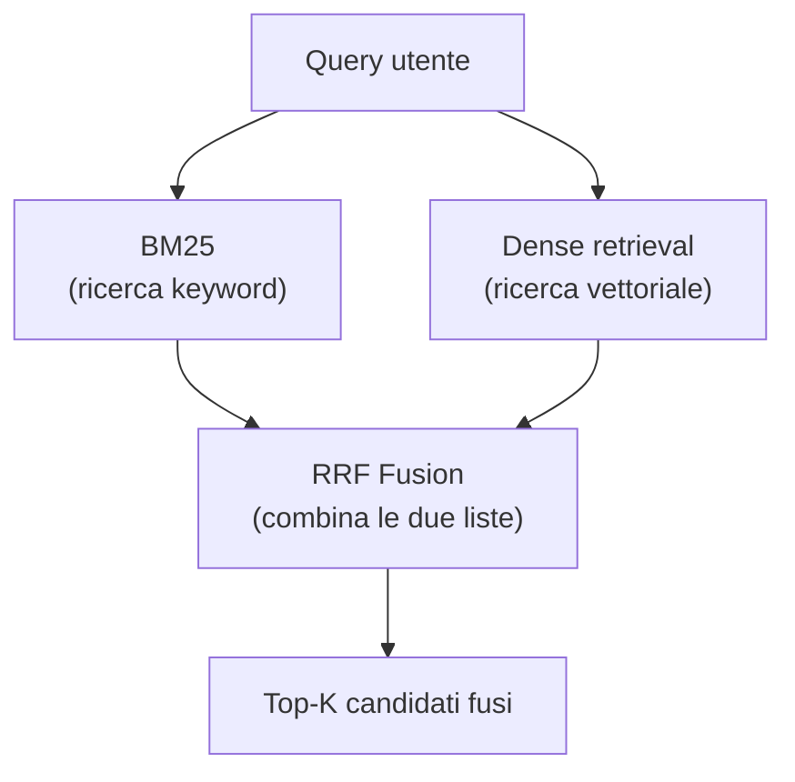
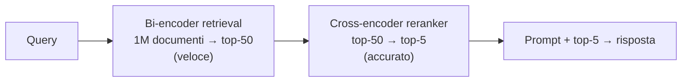

# Retrieval avanzato

  In evoluzione
  Lezione 1.2
  ~14 min di lettura

Il RAG di base funziona. Il problema arriva quando comincia a sbagliare in modi silenziosi — recupera documenti plausibili ma non pertinenti, oppure manca quelli giusti perché le parole non coincidono. Questa lezione è il set di strumenti per rimediare.

Nella lezione 1.1 hai costruito il ciclo RAG nella versione essenziale: spezzi i documenti in chunk, li trasformi in embedding, quando arriva una query cerchi i chunk con la maggiore similarità coseno. Funziona bene su molti casi. Il problema è che la ricerca semantica pura ha dei punti ciechi precisi, e in produzione li incontri presto.

Il primo: **mancano i termini esatti.** Un documento parla di "accordo contrattuale con collaboratore esterno"; la query chiede "contratto dipendente junior". Semanticamente vicini. Ma se la query include un codice normativo preciso — "Regolamento UE 2024/1689" — la ricerca vettoriale restituisce documenti sul tema dell'IA piuttosto che quelli che citano esattamente quella stringa. La similarità semantica non è ricerca full-text.

Il secondo: **recuperare è più facile che ordinare.** La ricerca vettoriale torna i top-K candidati in ordine approssimato. I 50 chunk più vicini spesso includono quelli giusti — ma non necessariamente in cima. E al modello passi solo i primi 5-10: se i buoni sono al posto 12 e 15, la risposta soffre, e non sai perché.

Da questi due problemi nascono le tre tecniche di questa lezione: **hybrid search**, **reranking** e **agentic retrieval**. Più un quarto strumento per casi speciali: **GraphRAG**.

## Hybrid search: parole e significato insieme

La ricerca full-text classica usa **BM25** — *Best Match 25* — un algoritmo di scoring statistico che misura quanto spesso i termini della query appaiono in un documento, pesati per rarità nel corpus (TF-IDF in salsa moderna). BM25 trova il documento che cita "Regolamento UE 2024/1689" perché quella stringa c'è dentro, letteralmente.

La ricerca vettoriale trova invece il documento che parla dello stesso argomento anche se usa parole diverse. È più robusta al parafrasare; è cieca ai termini rari.

**L'hybrid search le combina.** Si fa la ricerca BM25 in parallelo a quella vettoriale, si ottengono due liste di risultati, si fondono. Il metodo standard per fonderle si chiama **RRF — Reciprocal Rank Fusion**: per ogni documento, somma $\frac{1}{k + \text{rank}_{BM25}} + \frac{1}{k + \text{rank}_{dense}}$ dove $k$ è una costante (tipicamente 60). Documenti che figurano in cima a entrambe le liste guadagnano punteggio alto; quelli forti su una sola fonte scalano meno. Il bello di RRF è che non richiede di normalizzare i punteggi delle due ricerche — sono spesso incommensurabili, e tentare di pesarli manualmente porta a bug sottili.

Quasi tutti i vector database moderni (Weaviate, Qdrant, Elasticsearch con dense, OpenSearch) supportano hybrid search nativamente. Non è un'aggiunta costosa: si fa la stessa query su due indici in parallelo e si fonde in memoria. Il guadagno di recall su query ibride (semantiche + keyword) è consistente — tipicamente +10-20% su benchmark misti.

## Reranking: il secondo passaggio che fa la differenza

Il retrieval iniziale, anche con hybrid search, è un filtro rapido. Restituisce i top-50 candidati plausibili. Ma "plausibile" non è "pertinente": l'ordine è approssimato, e quello che conta è l'ordine finale perché il modello vede solo i primi 5.

Il **reranking** è un secondo passaggio più lento ma più accurato che riordina quei 50 candidati. Funziona diversamente dal retrieval iniziale.

Nel retrieval con embedding usi un **bi-encoder**: query e documento vengono codificati separatamente in vettori, e il punteggio è il prodotto scalare tra i due vettori. È velocissimo — puoi confrontare una query con milioni di documenti in millisecondi — ma perde l'interazione tra query e documento: i due vettori sono calcolati senza sapere niente l'uno dell'altro.

Un **cross-encoder** fa l'opposto: prende la coppia (query, documento) insieme e produce un unico punteggio di rilevanza. Il modello vede la query e il documento allo stesso tempo, può pesare ogni parola della query rispetto a ogni frase del documento. È molto più accurato — e molto più lento: $O(N)$ chiamate al modello, non un prodotto di vettori.

La soluzione è usarli in sequenza:

Il costo del cross-encoder è contenuto perché lavora su 50 candidati, non su un milione. Modelli come `bge-reranker-large`, `ms-marco-MiniLM` o Cohere Rerank via API fanno questo lavoro bene. Il guadagno di precisione rispetto al solo bi-encoder è significativo: è qui che i documenti giusti scalano in cima.

Sotto il cofano: come funziona un cross-encoder

Un cross-encoder è in genere un modello BERT o simile fine-tuned su dataset di rilevanza (tipicamente MS MARCO). Prende il testo "[CLS] query [SEP] documento [SEP]" come input, e produce un singolo valore (logit) che rappresenta la rilevanza della coppia. Il fine-tuning lo addestra a distinguere risposte rilevanti da non rilevanti per una data domanda. La forza è che l'attention del transformer può collegare ogni token della query a ogni token del documento: se la query dice "costo" e il documento ha "euro" in un contesto di budget, il cross-encoder lo cattura; un bi-encoder probabilmente no.

## Agentic retrieval: quando una query sola non basta

Il retrieval standard è **statico**: arriva una query, si fanno i retrieval, si risponde. Funziona per domande dirette. Ma molte domande reali sono composte, multi-hop o ambigue.

"Qual è la posizione dell'azienda sulla gestione dei dati dei fornitori nei contratti firmati dopo il GDPR?" Non è una query sola — è almeno due ricerche diverse, e il risultato della prima cambia cosa cerchi nella seconda.

L'**agentic retrieval** delega la strategia di retrieval all'agente. L'agente può:
- Riscrivere la query originale in termini più precisi (*query rewriting*)
- Generare una risposta ipotetica e usarla come query — tecnicamente **HyDE** (*Hypothetical Document Embedding*): il modello inventa come potrebbe essere la risposta, usa quell'ipotesi per fare retrieval, e recupera documenti simili a quella risposta fittizia. Funziona perché una risposta attesa è spesso più vicina nello spazio vettoriale al documento giusto della query stessa.
- Fare retrieval iterativo: recupera un primo batch, legge, decide se ha abbastanza o se serve altra ricerca, va avanti
- Decomporsi la domanda in sub-domande e risolverle in sequenza

Il costo è più alto — ogni iterazione è un'inferenza in più — e il sistema diventa più complesso da debuggare. L'agentic retrieval si introduce quando il retrieval statico produce risposte parziali o incoerenti su domande composte, non come prima mossa.

## GraphRAG: quando i documenti sono un grafo

RAG standard tratta ogni chunk come un'unità isolata. In molti domini, però, i documenti non sono unità isolate: sono nodi in una rete di relazioni. Una norma rimanda ad altre norme. Un paziente ha una storia clinica che collega diagnosi, farmaci, visite. Un'entità aziendale ha contratti con fornitori che hanno a loro volta sub-fornitori.

**GraphRAG** costruisce un grafo di conoscenza sopra i documenti: estrae entità (*persone*, *luoghi*, *concetti*, *prodotti*), le relazioni tra loro, e organizza il tutto in comunità tematiche. La query non fa solo similarity search — traversa il grafo, recupera entità rilevanti e i loro vicini, poi sintetizza.

Microsoft Research ha pubblicato l'implementazione di riferimento (2024). I risultati su query "globali" — "quali temi ricorrono in tutto il corpus?" — sono nettamente migliori rispetto al RAG classico. Su query puntuali — "dimmi cosa dice questo paragrafo" — il vantaggio sparisce.

Il costo è sostanziale: costruire il grafo richiede molte chiamate LLM (estrazione di entità e relazioni), lo storage è più complesso, e il retrieval è più lento. GraphRAG ha senso su domini densi di entità (legal, medical, research) dove le relazioni tra documenti portano valore. Non lo introdurre per default.

## Cosa NON è

| Pensiero sbagliato | Come stanno le cose |
|---|---|
| "Aggiungo il reranker e il RAG funzionerà" | Il reranker migliora la precisione tra i candidati recuperati. Se il retrieval iniziale non recupera i documenti giusti, il reranker non può crearli dal nulla. Prima migliorai il recall (hybrid search), poi la precisione (reranker). |
| "Hybrid search = media dei punteggi BM25 e vettoriale" | Non si media: i punteggi sono incommensurabili (BM25 va da 0 a qualcosa che dipende dal corpus; la similarità coseno va da -1 a 1). Si fondono le *classifiche* con RRF, non i punteggi. |
| "HyDE è sempre meglio di una query diretta" | Su query brevi e ambigue HyDE aiuta. Su query già precise può degradare: il documento ipotetico generato porta il modello su un tangente. Si prova e si misura. |
| "GraphRAG sostituisce il RAG standard" | GraphRAG è un'estensione per domini relazionali. Su corpus non relazionali aggiunge costo senza beneficio. Il RAG classico resta più veloce e più semplice nella maggior parte dei casi. |

## Come decidere cosa usare

Inizia sempre dal RAG base (lezione 1.1). Poi misura sul tuo dataset di test (lezione 3.1) e osserva dove fallisce:

- **Basso recall** (i documenti giusti non vengono recuperati) → aggiungi **hybrid search**
- **Bassa precisione** (i documenti recuperati non sono pertinenti, o l'ordine è sbagliato) → aggiungi **reranker**
- **Risposte parziali su domande composte** → sperimenta **agentic retrieval** o decomposizione della query
- **Corpus con forti relazioni tra entità** → valuta **GraphRAG**, ma solo dopo aver verificato che il problema non si risolva con le tecniche precedenti

Non aggiungere tutto insieme: ogni livello aggiunge latenza e complessità di debug. Aggiungi un pezzo per volta, misura, poi decidi se vale.

## Verifica di comprensione

1. Perché la ricerca vettoriale pura fallisce su termini rari o codici normativi precisi? E perché BM25 da solo non basta?
2. Spiega la differenza tra bi-encoder e cross-encoder. Perché non usi il cross-encoder direttamente su tutto il corpus?
3. Cos'è RRF e perché si fondono le classifiche invece dei punteggi?
4. Hai un sistema RAG che recupera documenti plausibili ma non risponde bene alle domande: sospetti che l'ordine dei chunk sia il problema. Quale tecnica introduci per prima?
5. *Domanda avanzata*: un collega propone di usare GraphRAG su un corpus di FAQ del supporto clienti (domande indipendenti, senza relazioni tra entità). Ha senso? Perché sì o no?

## Glossario della pagina

**BM25** — algoritmo di scoring full-text statistico che bilancia frequenza del termine nel documento (TF) e rarità nel corpus (IDF). Standard de facto per ricerca keyword.

**Cross-encoder** — modello che riceve query e documento insieme e produce un punteggio di rilevanza. Più accurato del bi-encoder, usato per reranking su pochi candidati.

**Bi-encoder** — modello che codifica query e documento separatamente in vettori; la rilevanza è il prodotto scalare. Veloce, usato per retrieval iniziale su grandi corpus.

**RRF (Reciprocal Rank Fusion)** — metodo per fondere due liste di risultati sommando i reciproci delle posizioni ($\frac{1}{k+\text{rank}}$). Non richiede normalizzazione dei punteggi.

**HyDE (Hypothetical Document Embedding)** — tecnica in cui il modello genera una risposta ipotetica, la trasforma in embedding, e la usa come vettore di query. Utile su domande ambigue.

**GraphRAG** — estensione di RAG che costruisce un grafo di conoscenza dal corpus e traversa le relazioni tra entità durante il retrieval. Ottimo su domini relazionali densi.

**Agentic retrieval** — strategia in cui l'agente decide dinamicamente come e quante volte fare retrieval, riscrivendo la query o iterando in più passi.

## Per approfondire

- Cerca "Reciprocal Rank Fusion Cormack 2009" per la paper originale dell'algoritmo.
- Microsoft GraphRAG: cerca "GraphRAG microsoft research 2024" per la paper e il repository open-source.
- Per il reranking, cerca "cross-encoder vs bi-encoder sentence-transformers" per esempi pratici con codice.
- Cohere, Voyage AI e Jina offrono reranker via API; utile per prototipare senza infrastruttura propria.

## Prossima lezione

Sai recuperare i documenti giusti. La prossima domanda è: una volta che hai una context window enorme (100k, 1M token), cosa ci metti dentro — e cosa lasci fuori? Non è la stessa domanda del retrieval, e la risposta cambia l'architettura. È il tema della lezione 1.3: **context engineering**.
