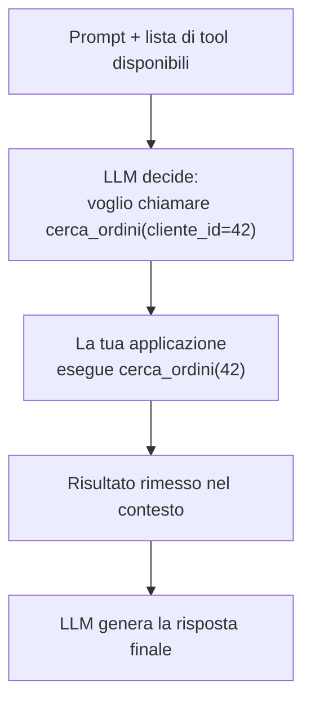

# Structured output e function calling

<div class="lesson-meta">
  <span class="badge-stato stabile">Stabile</span>
  <span>Lezione 1.4</span>
  <span>~10 min di lettura</span>
</div>

<p class="lesson-lead">Un LLM che risponde in prosa libera non si aggancia a un'API, un database o una pipeline. Structured output e function calling sono i due meccanismi che portano le risposte del modello dentro il tuo sistema — in forma che il codice può consumare.</p>

Nelle lezioni 1.1 e 1.3 hai visto come portare le informazioni *al* modello — recuperarle, organizzarle, scegliere cosa mettere nel contesto. Ma nelle applicazioni reali il problema è anche l'inverso: come usi quello che il modello *produce*?

In una demo basta la prosa libera. In produzione hai bisogno che il modello produca dati strutturati — un oggetto JSON, un elenco di campi, un'azione con parametri — che il tuo codice possa leggere e usare senza fare text parsing fragile su testo libero. Structured output e function calling risolvono questo.

## Il problema: dalla prosa alle strutture

Il riflesso naturale per integrare un LLM in un sistema è prendere il testo che produce e parsarlo. Regex, split, "cerca il JSON nel mezzo della risposta". È fragile, si rompe con ogni variazione di formato, e forza il modello a un compito — rispettare un formato preciso — che non è il suo punto di forza naturale quando non è guidato esplicitamente.

**Structured output** cambia l'approccio: invece di sperare che il modello produca il formato giusto e poi parsarlo, gli dici in anticipo *esattamente* che formato deve usare — uno schema JSON o un modello Pydantic — e il provider garantisce che l'output rispetti quello schema.

## JSON mode e schema enforcement

La forma più semplice: attivi la modalità JSON e il modello garantisce che l'output sia JSON valido. Non serve specificare la struttura: solo garantire la validità del formato.

Il passo successivo è lo **schema enforcement**: fornisci uno schema (JSON Schema o un modello Pydantic) che definisce esattamente i campi, i tipi e i vincoli. Il provider usa tecniche di decoding vincolato — forza i logit verso token che rispettano lo schema — per garantire un output conforme.

```python
from pydantic import BaseModel

class RispostaClassificazione(BaseModel):
    categoria: str
    confidenza: float
    motivazione: str

# Il modello è obbligato a produrre un oggetto con questi tre campi
risposta = client.chat.completions.parse(
    model="gpt-5.4",  # o claude-opus-4-7, gemini-3-pro, ecc.
    messages=[...],
    response_format=RispostaClassificazione,
)
```

Il decoding vincolato funziona a livello di token: dopo ogni token generato, maschera i token non validi rispetto allo schema attuale. Se il modello sta generando il valore di un campo `float`, sono ammessi solo token che continuano una sequenza numerica. Questo garantisce la conformità strutturale, non la correttezza semantica dei valori.

## Function calling: il modello che decide cosa chiamare

**Function calling** (o *tool calling* — il nome cambia con il provider ma il concetto è lo stesso) è un meccanismo diverso: non stai solo chiedendo un output strutturato, stai dando al modello un catalogo di azioni che può richiedere.

Il flusso è questo: descrivi al modello le funzioni disponibili (nome, descrizione, parametri). Nella risposta, invece di testo libero, il modello può produrre una "richiesta di chiamata" — "chiama la funzione `cerca_ordini` con parametro `cliente_id = 12345`". La tua applicazione esegue la funzione, ottiene il risultato, lo rimette nel contesto, e il modello continua.

**Fondamentale da capire:** il modello non esegue niente. Dichiara di voler chiamare una funzione. Sei tu — il tuo codice — a eseguirla e a rimettere il risultato nel loop. Il modello decide, il codice agisce.



Questo pattern è il cuore di ogni sistema agentico (lezione 1.5): un agente non è altro che questo loop ripetuto — l'LLM decide cosa chiamare, il codice lo esegue, il risultato torna nel contesto, l'LLM decide di nuovo.

## Validazione: non si assume che sia sempre corretto

Uno dei malintesi più comuni: "ho attivato structured output, ora l'output è sempre corretto". Non è così.

**La conformità strutturale è garantita (quasi sempre), la correttezza semantica no.** Il modello può produrre un JSON perfettamente valido dove `confidenza` è 0.95 per una risposta che avrebbe dovuto essere 0.2. Può mettere un valore in un campo sbagliato. Può troncare un testo per rispettare un vincolo di lunghezza e perdere informazione critica.

Quindi: **valida sempre l'output del modello prima di usarlo**, anche con structured output attivato. Pydantic, JSON Schema validation, o un semplice controllo dei tipi — qualcosa che alzi un'eccezione se il modello ha prodotto un valore fuori range o un campo mancante.

## Quando usare cosa

| Scenario | Strumento |
|---|---|
| Estrarre dati strutturati da testo libero | Structured output con schema |
| Classificare o categorizzare un testo | Structured output (campo `categoria` + `confidenza`) |
| Collegare il modello a API esterne o DB | Function calling |
| Pipeline dove un LLM prepara l'input per il passo successivo | Structured output |
| Agente che decide quali azioni eseguire | Function calling / tool calling |

## Cosa NON è questo pattern

| Il pensiero sbagliato | Come stanno le cose |
|---|---|
| "Con JSON mode l'output è sempre valido e corretto" | La struttura è garantita; i valori semantici no. Valida sempre. |
| "Il modello esegue le funzioni che chiama" | No: dichiara di volerle chiamare. Il tuo codice le esegue. |
| "Structured output elimina le allucinazioni" | No: può allucinare valori nei campi corretti. La struttura non è garanzia di verità. |
| "Function calling e tool calling sono concetti diversi" | Stesso concetto, nomi diversi per provider diversi. OpenAI usa "function/tool calling", Anthropic "tool use". |

---

## Verifica di comprensione

> Rispondi a memoria. Le incerte rivedile domani. L'ultima anticipa la prossima lezione.

1. Qual è il problema di parsare il testo libero di un LLM con regex?
2. Differenza tra JSON mode e schema enforcement.
3. Nel function calling, chi esegue la funzione — il modello o il tuo codice?
4. Perché devi validare l'output anche quando hai attivato structured output?
5. Hai un sistema che deve estrarre da una email il nome del cliente, l'importo della fattura e la data di scadenza. Quale pattern usi?
6. *(anticipazione)* Un agente che usa tool calling ripete un loop. Qual è esattamente quel loop?

---

## Glossario

- **Structured output** — modalità in cui il modello è vincolato a produrre output che rispetta un formato definito (JSON, schema Pydantic).
- **JSON mode** — il caso base: l'output è garantito JSON valido, senza schema specifico.
- **Schema enforcement** — versione più forte: l'output deve rispettare uno schema preciso con campi, tipi e vincoli.
- **Decoding vincolato** — tecnica che, a ogni token generato, maschera i token non ammessi rispetto allo schema corrente, garantendo la conformità strutturale.
- **Function calling / Tool calling** — meccanismo per cui il modello dichiara di voler chiamare una funzione con parametri specifici; il codice dell'applicazione esegue la funzione e rimette il risultato nel contesto.

---

## Per approfondire

- **Documentazione "Structured outputs"** di OpenAI e **"Tool use"** di Anthropic — le guide ufficiali spiegano lo schema, i casi limite e le garanzie del decoding vincolato.
- **Pydantic** — la libreria Python standard per la validazione di strutture dati; integrazione nativa con la maggior parte delle librerie LLM.

*Risorse indicate per la ricerca; per i link aggiornati conviene cercarli al momento.*

---

## Prossima lezione

**1.5 Agenti semplici — tool calling e ReAct.** Hai visto come il modello può dichiarare di voler chiamare una funzione. Un agente è il loop completo: il modello decide, il codice agisce, il risultato torna al modello, il modello decide di nuovo. Questo loop cambia radicalmente la complessità — e i rischi — del sistema.
