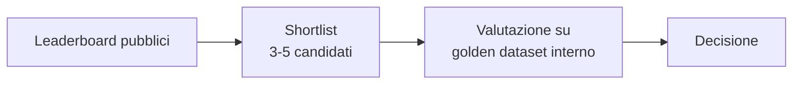

# Eval benchmarks e dataset — il vocabolario

  In evoluzione
  Lezione 3.1
  ~12 min di lettura

I nomi dei benchmark — MMLU, GPQA, SWE-bench, MTEB — sono il vocabolario che senti in ogni release di provider. Sapere cosa misurano davvero, perché sono compromessi, e quando ignorarli per costruirsi un golden dataset interno è il salto da "leggo le slide del provider" a "decido col cervello".

Questa pagina apre la Parte 3 con il vocabolario che serve per tutto il resto. Nelle lezioni successive vedrai *come* valutare con gli strumenti concreti: LLM-as-judge (3.2), observability (3.3), gestione delle allucinazioni (3.4), valutazione del comportamento agentico (3.5). Quel come richiede di sapere già cosa sono i benchmark e il golden dataset — è il motivo per cui questa lezione viene prima.

Il punto da fissare subito, e che torna fino in fondo: **i benchmark pubblici sono un segnale rumoroso, non una verità.** Sono utili per orientarsi, scartare candidati, monitorare trend di mercato. Sono inutili (anzi, fuorvianti) per decidere quale modello mettere sul *tuo* task specifico. Per quello serve un'altra cosa: il golden dataset interno, costruito sui tuoi dati reali.

## I benchmark che senti nominare di più

Una mappa minima dei nomi che incrocerai ogni settimana. Non è un elenco esaustivo: è il *vocabolario di lavoro* che dovresti riconoscere a colpo.

### Conoscenza generale e ragionamento

**MMLU — Massive Multitask Language Understanding.** Test a scelta multipla su 57 materie (storia, biologia, diritto, matematica del liceo, etica…). È stato *il* benchmark di riferimento dal 2020 al 2023. Oggi è considerato **saturo**: i modelli frontier 2026 lo superano al 90%+, le differenze tra modelli si appiattiscono nel rumore. Lo trovi ancora in tutti i report, più per continuità storica che per utilità.

**MMLU-Pro.** La versione "più dura" uscita per rimpiazzare MMLU saturo. Domande più sfidanti, 10 opzioni di risposta invece di 4, meno guessing. Più utile di MMLU ma a sua volta sta saturando.

**GPQA — Graduate-Level Google-Proof Q&A.** Domande di livello PhD in fisica, biologia, chimica. Si chiama "Google-proof" perché le risposte non si trovano cercando — richiedono ragionamento esperto. È il benchmark dove i **reasoning models** (lezione 0.6) hanno aperto il distacco vero. Nel 2026 è un riferimento serio per "questo modello sa ragionare su problemi tecnici complessi".

**ARC-AGI.** Domande di pattern recognition astratto, basate sui dataset di François Chollet. Pensate per misurare *generalizzazione* (vedere pattern nuovi mai visti in training) più che memoria. Storicamente difficile per gli LLM; nel 2024-25 i reasoning models hanno fatto saltare la prima generazione, ora siamo a ARC-AGI-2. Considerato uno dei segnali meno saturi di "vera capacità", anche se sta migliorando troppo in fretta per restare tale.

### Matematica

**MATH.** Problemi di matematica olimpica e competitiva, dalla scuola superiore in su. Saturato dai reasoning models. Citato spesso ma non più discriminante in alto.

**AIME** (American Invitational Mathematics Examination). Versione 15 problemi delle olimpiadi USA. Diventato il benchmark del momento per i reasoning models 2025-26 — è dove i provider fanno a gara a un punto in più.

### Codice

**HumanEval** (OpenAI, 2021). 164 problemini di Python con test cases. Storico ma **molto saturo** e con contamination conclamata: i modelli moderni l'hanno visto in training. Lo vedi ancora nei report, in genere accompagnato da bench più seri.

**SWE-bench** (Princeton, 2023) e **SWE-bench Verified** (OpenAI, 2024). Il salto qualitativo: 2.000+ issue GitHub reali in repository Python veri, con test suite. Il modello deve fare un PR che chiude l'issue. Il punteggio è la frazione di PR che fanno passare i test. **Il benchmark di riferimento per l'engineering reale** nel 2026. SWE-bench Verified (~500 issue ripulite a mano) è la versione *meno rumorosa*, da preferire come riferimento.

**LiveCodeBench.** Problemi di coding competitivo aggiornati continuamente con date di pubblicazione esplicite. Pensato per **scivolare oltre il cut-off** dei modelli: misuri solo su problemi posteriori al training del modello, riducendo la contamination. Standard emergente 2026 per evitare i baci del leaderboard.

### Agenti

**AgentBench.** Benchmark di task agentici end-to-end: shopping web, codice in ambiente live, uso di tool. Molto più rumoroso dei benchmark statici ma più rappresentativo del lavoro reale (vedi lezione 3.4).

**τ-bench (TAU-Bench)** di Sierra. Più recente, più curato: l'agente deve operare in un ambiente simulato (customer service, telefonia, retail) con tool reali e politiche di azienda. È il benchmark che si sta affermando come standard 2026 per valutare il **comportamento** degli agenti, non solo il loro output finale.

**WebArena, VisualWebArena.** Agenti che operano dentro un ambiente web reale. Eseguono task end-to-end con browser. Rilevanti per chi costruisce agenti che navigano il web.

### Embedding e retrieval

**MTEB — Massive Text Embedding Benchmark.** Il benchmark di riferimento per scegliere un **modello di embedding** (lezione 0.2, 1.1). Combina 50+ task in 8 categorie (classification, clustering, retrieval, reranking, similarity, summarization, STS, pair-classification). Il leaderboard è pubblico e affollatissimo. Da guardare per filtrare candidati di embedding model, **non per decidere il vincitore**: il vincitore per il tuo dominio quasi mai coincide con il vincitore generale di MTEB.

**BEIR.** Più vecchio, sottoinsieme focalizzato sul *retrieval*. Storicamente importante, ora MTEB lo include come parte.

### Conoscenza fattuale e allucinazioni

**TruthfulQA.** Domande progettate per indurre il modello in *false comuni* (miti, errori popolari). Misura quanto un modello "ripete cazzate plausibili" tipiche di internet. Saturato dai modelli moderni ma istruttivo come idea di design.

**HaluEval, HalluLens.** Benchmark dedicati alle **allucinazioni** (vedi lezione 3.4). Misurano quanto il modello inventa fatti su domande di conoscenza specifica. Sono in evoluzione rapida.

## La contamination: perché i benchmark mentono

Il problema strutturale che bacia *quasi tutti* i benchmark pubblici, e che chi li legge senza capirlo si fa fregare: la **contamination**.

I LLM moderni vengono addestrati su una porzione enorme del web. Inclusi, inevitabilmente, i benchmark stessi: le pagine Wikipedia che li descrivono, i repository GitHub che li implementano, i paper che riportano le risposte, i forum dove la gente discute le soluzioni. Risultato: il modello *ha visto* il benchmark in training. Non lo "risolve" — lo ricorda.

Il segnale che è quasi sempre presente: i punteggi su benchmark vecchi salgono molto più velocemente che le capacità *vere*. Un modello del 2024 può fare l'80% di HumanEval e crollare su un problema di coding leggermente fuori distribuzione. Non è più "intelligente" del modello che faceva il 50% nel 2022 — ha solo metabolizzato meglio i 164 problemi standard.

Le contromisure che il settore ha sviluppato:
- **Versioned benchmark** (LiveCodeBench, MMLU-Pro): aggiornati periodicamente con nuovi item, taggati per data, per filtrare quelli posteriori al cut-off del modello.
- **Held-out test sets**: il provider del benchmark tiene una parte privata, non pubblicata, e i modelli si valutano lì.
- **SWE-bench Verified**: revisionato a mano per rimuovere item ambigui o contaminati.
- **Public leaderboard chiuso ai submitter**: il submitter manda il modello, gli organizzatori lo valutano internamente (Chatbot Arena Hard, certi benchmark di ARC).

Detto questo: anche i benchmark "ben curati" possono essere stati visti tramite scraping del web durante il training senza che il provider lo sappia. La contaminazione è strutturalmente difficile da eliminare per un LLM addestrato sul web pubblico.

**Conseguenza operativa per te**: un benchmark vecchio + saturo (HumanEval, MMLU) ti dice quasi nulla. Un benchmark giovane + curato (SWE-bench Verified, GPQA, LiveCodeBench recenti) ti dice qualcosa, ma con un margine di incertezza significativo. **Nessun benchmark pubblico ti dice come il modello andrà sul tuo task specifico.** Da qui in poi inizia la parte importante.

## Il leaderboard è una guida, non una verità: cosa misurare davvero

I leaderboard pubblici ti aiutano a fare due cose:
1. **Scartare** candidati ovviamente fuori (un modello che è al 30% su SWE-bench non sarà il tuo coding copilot).
2. **Orientarti** sui trend di mercato (i reasoning models stanno guadagnando 20 punti su AIME ogni 6 mesi).

Per **tutto il resto** — scegliere quale modello mettere in produzione sul *tuo* task — i leaderboard sono il punto di partenza, non quello di arrivo. La verità arriva solo da un **golden dataset interno**: un set di esempi reali del tuo dominio, curato a mano, su cui valuti i candidati direttamente.

I leaderboard tagliano lo spazio dei candidati da centinaia a una manciata. Il golden dataset ti dice chi vince *sul tuo problema*. Saltare il secondo passaggio è la causa più frequente di "abbiamo scelto il modello peggiore secondo le slide del provider".

## Come si costruisce un golden dataset (per davvero)

Questa è la skill più sottovalutata della valutazione applicativa, e quella che fa la differenza nei colloqui e nei progetti. Versione operativa.

**Dimensione realistica.** 50-200 esempi sono il giusto punto di partenza per quasi tutto. Sotto 50 il rumore statistico domina (un modello sbaglia per caso 3 esempi su 30 e sembra peggiore). Sopra 200 i rendimenti decrescono — meglio investire in *qualità* dei 200 che spalmare su 500 rumorosi. Per task molto eterogenei o ad alto rischio (sanità, legale), 300-500 esempi sono giustificati.

**Composizione: copertura > volume.** Il dataset deve coprire le **categorie di richieste reali** del tuo sistema, con la **distribuzione approssimata** della produzione. Se in produzione l'80% delle domande sono FAQ, il 15% richieste personalizzate, il 5% edge case complessi — il tuo golden dataset replica quelle proporzioni. Aggiungi però sopra-rappresentazione di:
- **Casi sfidanti reali** che hanno fallito in passato.
- **Edge case** noti del dominio.
- **Adversarial** — query progettate per rompere il modello (vedi lezione 4.1 prompt injection).

**Etichetta cosa è "giusto".** Per ogni esempio servono:
- L'input.
- L'output **atteso** o, se ci sono più output validi, una **rubrica** di criteri per giudicare.
- (Opzionale) Una motivazione di *perché* quella è la risposta giusta.

La rubrica conta più della "risposta giusta" per task aperti. "Rispondi nel tono X, includi i punti A, B, C, non rivelare informazioni Y" è una rubrica utilizzabile da un LLM-as-judge (lezione 3.2) e da un revisore umano.

**Train / eval / hold-out.** Anche se non fai fine-tuning, separa il dataset in tre parti:
- **Eval set** (~70%): quello che usi per misurare i candidati e confrontarli.
- **Hold-out set** (~30%): mai usato durante lo sviluppo. Tirato fuori solo prima di andare in produzione per evitare di **over-fittare** le tue scelte (modello, prompt, hyperparameter) sull'eval set.

Il rischio reale che hold-out previene: a furia di iterare prompt e modelli scegliendo "quello che vince sull'eval set", tendi a sceglierlo *anche* per via di rumore casuale. L'hold-out, visto una volta sola, ti dà la stima onesta.

**Aggiornalo nel tempo.** Il golden dataset di gennaio non è quello giusto per dicembre. Nuove categorie di richieste compaiono, lo stato del mondo cambia, gli edge case riscontrati in produzione vanno aggiunti. **Almeno una volta a trimestre**: rivisita il dataset, aggiungi 10-20 esempi nuovi, rimuovi quelli diventati irrilevanti.

> **Punto operativo che si dimentica sempre** — Costruire un golden dataset richiede ~1-3 giorni di lavoro umano per i 50-200 esempi iniziali. Sembra tanto. Confronta con il costo di scegliere il modello sbagliato per 6 mesi in produzione. Non c'è confronto. È sempre l'investimento che paga di più.

## Synthetic data: usare LLM per generare casi di test

Una pratica che si è normalizzata nel 2025-26: usare un modello (di solito un modello potente, eventualmente reasoning) per **generare casi di test** per altri modelli. Non è una scorciatoia magica — ha regole e trappole — ma è uno strumento utile da padroneggiare.

**Casi d'uso legittimi:**
- **Aumentare la copertura** del golden dataset esistente. Hai 50 esempi reali; chiedi a un modello potente di generarne 200 varianti di edge case, paraphrasing, perturbazioni avversariali. Riguarda i 200, butti i cattivi, aggiungi i buoni al dataset.
- **Stress test sistematici**. Generi 100 prompt che tentano prompt injection per testare i guardrail della 4.1.
- **Test di regressione**. Quando rilasci una nuova versione, hai un set di prompt sintetici che colpisce ogni feature, e verifichi che nessuno regredisca.

**Le trappole serie:**
- **Bias del generatore**: se il modello che genera è lo stesso (o famiglia simile) del modello che valuta, ottieni un test set "amico" — il modello sotto test eccelle artificialmente. Usa un generatore di famiglia *diversa*.
- **Distribuzione fuori dalla realtà**: i sintetici tendono a essere troppo "ben formulati", troppo cortesi, troppo lineari. Gli utenti reali no. Il sintetico complementa il reale, non lo sostituisce.
- **Risposte attese inaffidabili**: se chiedi al modello di generare *anche* la risposta giusta, ti fidi del modello. Rivedi a campione, sempre.

Regola spannometrica: **il golden dataset finale dovrebbe essere ≥ 60% reale**, il resto sintetico per coprire edge case difficili da raccogliere. Andare oltre il 50% sintetico è un'illusione di copertura.

## Sotto il cofano: come si calcolano i punteggi

Una nota tecnica utile per non lasciarsi ingannare dai numeri.

**Accuracy / Pass@1.** Frazione di esempi su cui il modello ha azzeccato al primo tentativo. Il più semplice. Va bene per task con risposta univoca (matematica, classificazione).

**Pass@k.** Su k tentativi indipendenti, almeno uno passa. Pass@10 è sempre più alto di pass@1. I provider a volte riportano pass@10 senza dirlo: leggi il footnote, perché 10 tentativi in produzione raramente sono praticabili.

**Maj@k (majority vote).** Generi k risposte, prendi quella più frequente. Per task con varianza alta. Usato spesso nei reasoning models su matematica: maj@64 può essere 5-10 punti sopra pass@1.

**Score di un giudice (LLM-as-judge).** Un modello giudice valuta la risposta su una rubrica e dà un punteggio. Più flessibile dei metodi sopra, ma con i bias del giudice (vedi 3.2). Per benchmark soggettivi (qualità di una risposta, fluency, helpfulness) è spesso l'unico modo praticabile.

**Elo score (Chatbot Arena).** I modelli giocano "partite" a coppie, decise da voti umani. Il punteggio Elo si aggiorna come negli scacchi. Pro: misura preferenze umane reali. Contro: dominato da fattori superficiali (verbosità, tono cortese), poco discriminante per task tecnici.

Cosa portare a casa: **lo stesso modello su lo stesso benchmark può avere punteggi molto diversi** a seconda di pass@1 vs maj@64 vs giudice diverso. Quando confronti due modelli, verifica che siano valutati nello stesso modo. Spesso non lo sono.

## Cosa NON sono i benchmark

| Il pensiero sbagliato | Come stanno le cose |
|---|---|
| "Modello con punteggio più alto = scelta giusta per me" | Quasi mai. Il leaderboard generico ≠ il tuo task specifico. Sempre golden dataset interno per decidere. |
| "Se domina MMLU/HumanEval batte gli altri ovunque" | No, sono benchmark vecchi e contaminati. Nel 2026 dicono poco. |
| "I benchmark sono oggettivi" | I numeri lo sono; le scelte di cosa misurare no. E la contamination introduce bias sistematico. |
| "Più esempi nel mio golden dataset = meglio" | No, **copertura curata > volume**. 100 esempi buoni > 1000 rumorosi. |
| "I sintetici sostituiscono i dati reali" | No, complementano. Maggioranza reale, sintetici per edge case. |
| "L'hold-out set è una formalità accademica" | No, è il modo per non illudersi. Senza hold-out, scegli il modello che ha vinto *per rumore* sui tuoi esperimenti. |

> **Il punto da tenere stretto** — I benchmark pubblici sono **moneta comune** del settore: utili per scartare, orientarsi, parlare la lingua. Non sono **verità sul tuo task**. La verità per il tuo task vive in un golden dataset interno di 100-200 esempi curati. Costruirlo è 1-3 giorni di lavoro. Saltarlo è la causa più frequente di scelte di modello sbagliate.

## Cosa dura, cosa evitare

Stabile **Il principio**: golden dataset interno + LLM-as-judge + hold-out set. Questo metodo regge per anni, indipendentemente dai benchmark di moda.

In evoluzione **I benchmark specifici** (SWE-bench, AIME, GPQA, MTEB). I leader cambiano ogni anno: alcuni saturano, escono nuovi. Aspettati che il vocabolario di base cambi per il 30% ogni 12-18 mesi.

In evoluzione **τ-bench, ARC-AGI-2 e i benchmark agentici**. La valutazione agentica è giovane (vedi 3.5); i benchmark che ci provano sono ancora in cerca di stabilità metodologica.

Legacy **MMLU, HumanEval, MATH** come strumenti discriminanti. Citati per continuità storica, ma saturi e contaminati. Non basarci scelte.

A rischio **Chatbot Arena Elo come metrica principale.** Era lo standard del 2024; nel 2025-26 si è scoperto che premia eccessivamente verbosità e cortesia. Resta utile ma con cautela.

---

## Verifica di comprensione

> Rispondi a memoria, senza rileggere. Risposte incerte: rivedile **domani**.

1. Cos'è la "contamination" nei benchmark e perché bacia quasi tutti quelli vecchi?
2. Perché un benchmark pubblico, anche se ben fatto, non basta per scegliere il modello giusto per il tuo task?
3. Cosa misura SWE-bench e perché è più rilevante di HumanEval?
4. Quale dimensione minima realistica per un golden dataset interno?
5. A cosa serve l'hold-out set, distinto dall'eval set?
6. Tre rischi nell'usare dati sintetici nel golden dataset.
7. Differenza tra Pass@1, Pass@k e Maj@k — quando un provider riporta uno invece dell'altro?
8. *(applicazione)* Devi scegliere un embedding model per un RAG su documenti legali italiani. Come usi MTEB e come arrivi alla scelta finale?

---

## Glossario

- **Benchmark pubblico** — dataset di valutazione condiviso dalla comunità, usato per confrontare modelli su task standard.
- **MMLU, MMLU-Pro, GPQA, ARC-AGI** — benchmark di conoscenza/ragionamento generale.
- **AIME, MATH** — benchmark matematici.
- **HumanEval, SWE-bench, SWE-bench Verified, LiveCodeBench** — benchmark di codice (in ordine crescente di rilevanza nel 2026).
- **AgentBench, τ-bench (TAU-Bench), WebArena** — benchmark di task agentici.
- **MTEB, BEIR** — benchmark per modelli di embedding e retrieval.
- **Contamination** — il modello ha visto i casi del benchmark durante il pre-training; i punteggi sono gonfiati artificialmente.
- **Golden dataset (interno)** — set curato di esempi rappresentativi del tuo task, usato per decidere e validare scelte di modello/prompt.
- **Eval set / Hold-out set** — partizioni del golden dataset; eval per iterare, hold-out per validazione finale.
- **Pass@k, Maj@k** — metriche su k tentativi: almeno uno corretto (Pass@k) o maggioranza corretta (Maj@k).
- **Synthetic data** — esempi di test generati da un LLM; complementari (non sostitutivi) ai dati reali.
- **Chatbot Arena (Elo)** — leaderboard basato su voto umano a coppie di risposte; storico, ora con cautele.

---

## Per approfondire

- **MTEB Leaderboard** (Hugging Face) — vivo, aggiornato, da consultare *solo* per scartare/filtrare candidati di embedding model.
- **SWE-bench official site** — sito ufficiale, documenta SWE-bench, SWE-bench Verified, SWE-bench Lite. Leggere la pagina "FAQ" è istruttivo.
- **LMSys Chatbot Arena** — interface di voto a coppie + leaderboard. Andare a votare ti dà intuizione di cosa misurano davvero gli Elo.
- **Anthropic e OpenAI model cards** — il modo migliore per leggere come un provider serio riporta i suoi numeri (limiti dichiarati, caveat metodologici).
- **Eleuther LM Evaluation Harness** — framework open per riprodurre benchmark in casa.
- **Paper "Holistic Evaluation of Language Models (HELM)"** (Stanford) — il framework concettuale di riferimento per pensare alla valutazione in modo strutturato.

*Risorse indicate per la ricerca; i leaderboard cambiano in fretta, vai alla fonte attuale.*

---

## Prossima lezione

Hai aperto la Parte 3 con il vocabolario. Il **3.2 LLM-as-judge** ti dà il primo strumento concreto: come costruire un golden dataset su misura per il tuo sistema, scegliere i criteri di valutazione, e far giudicare un modello in modo calibrato. Da lì in avanti: observability (3.3), allucinazioni (3.4), valutazione agentica (3.5), e il drill finale (3.6). Dopo la Parte 3, la Parte 4 entra nella sicurezza: prompt injection, sicurezza agentica strutturale, privacy, governance.
