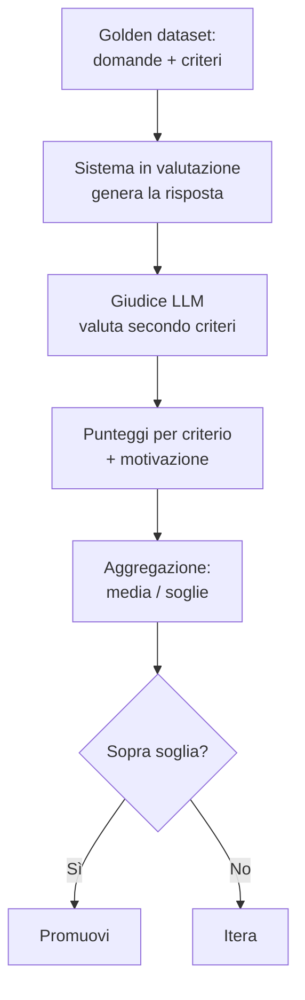

# LLM-as-judge — misurare la qualità del testo

<div class="lesson-meta">
  <span class="badge-stato evoluzione">In evoluzione</span>
  <span>Lezione 3.1</span>
  <span>~13 min di lettura</span>
</div>

<p class="lesson-lead">Hai un sistema che risponde. Funziona sul caso che ti viene in mente, ma su mille casi? Per il testo non esiste l'accuracy del classificatore — due risposte diverse possono essere entrambe corrette, due risposte che sembrano simili possono essere una buona e una pessima. Senza una misura non hai sistema, hai una demo che ogni tanto ti sorprende.</p>

Nella Parte 1 hai costruito sistemi: RAG, agenti, structured output. Funziona quando lo provi? Probabile. Funziona *quanto bene* sul caso che non ti viene in mente? Non lo sai. È il punto che separa "ho fatto vedere una demo che gira" da "ho un sistema che posso difendere davanti a chi paga". Questa è la lezione che ti dà la prima misura seria — il metodo da cui tutta la Parte 3 parte.

## Perché misurare il testo è strano

Nei sistemi software classici la qualità si misura con test deterministici: input X, output atteso Y, confronto secco. Nel ML classico (lezione 0.3) la qualità si misura con accuracy, precision, recall — metriche aggregate su un dataset etichettato.

Con gli LLM nessuna delle due funziona pulitamente. **Due risposte diverse possono essere entrambe corrette** — "Roma è la capitale d'Italia" e "La capitale d'Italia è Roma" dicono la stessa cosa con parole diverse. E **lo stesso modello, stessa domanda, può dare risposte diverse a chiamate diverse** (a meno che tu non forzi temperature 0, e anche lì non sempre è garantito). Confrontare l'output a una stringa attesa è una falsa partenza.

L'altra strada è la valutazione umana: chiedi a una persona "questa risposta è buona?". Affidabile, ma non scala. 10 risposte sì; 10.000 risposte al giorno per ogni cambio di prompt, no.

LLM-as-judge è il compromesso pratico: **usi un LLM forte come giudice delle risposte di un altro LLM**, secondo criteri che definisci tu. Non è perfetto, ma è scalabile, ripetibile, e sorprendentemente allineato al giudizio umano quando fatto bene.

## Il golden dataset: il fondamento

Prima del giudice, viene il dataset. Il **golden dataset** è una collezione curata di casi di test: domande (o input) per cui hai stabilito *a priori* cosa consideri una buona risposta, oppure i criteri per valutarla. Senza questo, ogni valutazione è aria — non hai un metro, hai un'impressione.

Tre proprietà che distinguono un golden dataset utile da una lista di esempi:

**Copre i casi reali.** Non casi che ti vengono in mente al volo, ma il riflesso dei tuoi dati di produzione: query frequenti, edge case che hai visto rompere il sistema, scenari critici per il business. Se gli utenti chiedono "rimborso", "fattura sbagliata", "non funziona": queste vanno dentro.

**Include i casi limite.** Domande ambigue, fuori scope, con dati mancanti, in linguaggio rotto. Il sistema deve essere bravo sui casi normali e *non disastroso* su quelli rotti — il golden dataset misura entrambi.

**Ha dimensione decente.** 30-50 casi sono il minimo per dire qualcosa di sensato; 200+ è meglio. 3 casi non sono un dataset, sono un aneddoto. Il dataset cresce con il sistema: ogni bug trovato in produzione diventa un caso di test.

> **Curiosità** — Il termine "golden" viene dall'idea che questi dati sono il riferimento aureo: tutto si confronta contro di loro. Il loro valore cresce nel tempo, perché ogni iterazione lo arricchisce di casi reali.

## Il giudice: come funziona meccanicamente

Il giudice è un LLM (di solito uno *forte*, più capace del modello che valuti — GPT-4, Claude Opus, Gemini Pro) a cui passi tre cose: la domanda, la risposta da valutare, e i criteri di valutazione espliciti. Il giudice produce un punteggio per criterio, motivato.



Il prompt del giudice è il pezzo dove si decide tutto. Un esempio funzionale:

```python
giudizio = llm_giudice(f"""Valuti la qualità di una risposta. Per OGNI criterio,
prima motiva in una frase, POI assegna un punteggio da 1 a 5.

Domanda: {domanda}
Contesto fornito al sistema: {contesto}
Risposta da valutare: {risposta}

Criteri:
- Fedeltà: la risposta usa solo informazioni dal contesto, senza inventare?
- Pertinenza: la risposta risponde davvero alla domanda posta?
- Completezza: copre i punti essenziali, senza lasciare buchi importanti?

Output in JSON:
{{
  "fedelta": {{"motivazione": "...", "punteggio": n}},
  "pertinenza": {{"motivazione": "...", "punteggio": n}},
  "completezza": {{"motivazione": "...", "punteggio": n}}
}}""")
```

Tre scelte non negoziabili in questo prompt. **Criteri espliciti**, non "è buona?": un giudice a cui chiedi "è buona?" ti dà un voto che riflette la sua intuizione, non il tuo bisogno. **Motivazione prima del punteggio**: un giudice che spiega ragiona meglio di uno che spara un numero — è chain-of-thought (lezione 0.5) applicato alla valutazione. **Output strutturato** (lezione 1.3): JSON con schema preciso, perché il codice deve poter aggregare i punteggi su centinaia di casi.

## I criteri: scegli quelli giusti per il tuo task

I criteri non sono universali. Cambiano per task:

**Per un RAG:** *Fedeltà* (la risposta è ancorata al contesto recuperato?), *Pertinenza* (risponde alla domanda?), *Completezza* (copre i punti?), *Citazione* (le fonti citate sono nel contesto?).

**Per un chatbot di supporto:** *Correttezza* (l'informazione è giusta?), *Tono* (è coerente col brand?), *Azionabilità* (l'utente può fare qualcosa con la risposta?), *Sicurezza* (evita consigli rischiosi su domande sensibili?).

**Per un agente con tool:** sono altri (vedi lezione 3.4 — la traiettoria, non il singolo output).

La regola: **pochi criteri ben definiti battono molti criteri vaghi**. 3-4 criteri ortogonali (che misurano cose diverse) sono il punto dolce. Sopra i 6 il giudice perde il filo e i punteggi diventano correlati.

## Eval offline vs eval online

Due momenti diversi della stessa pratica.

**Eval offline.** Sul golden dataset, prima di rilasciare. Cambi un prompt, una catena, un parametro? Passi il dataset sul nuovo sistema e confronti i punteggi col baseline. Veloce, ripetibile, decisivo per ogni cambio. È il regression test del mondo LLM.

**Eval online.** In produzione, sui dati reali. Periodicamente (o in streaming) campioni le risposte vere del sistema e le fai valutare al giudice. Misuri il *drift* — la qualità che peggiora silenziosamente perché la distribuzione delle domande è cambiata, o il modello del provider è stato aggiornato senza preavviso (la lezione 6.3 entra a fondo qui).

Servono entrambe. L'offline ti dice "il cambio è un miglioramento?". L'online ti dice "il sistema sta ancora funzionando come quando l'ho rilasciato?".

## I bias del giudice (e come tenerli sotto controllo)

Un giudice LLM ha bias documentati. Ignorarli vuol dire fidarsi di un giudice rotto.

**Bias di lunghezza.** I giudici tendono a preferire risposte più lunghe a parità di contenuto — sembrano "più complete". Contromossa: aggiungi un criterio esplicito di concisione, o calibra il punteggio sulla lunghezza.

**Bias di posizione.** Quando confronti due risposte fianco a fianco (A vs B), il giudice tende a preferire una delle due posizioni in modo sistematico. Contromossa: invertili e media i due risultati.

**Self-preference bias.** Un modello giudice ha un debole per risposte generate da modelli della sua stessa famiglia (uno stile che riconosce come proprio). Contromossa: usa un giudice di famiglia diversa da quello che valuti, o ruota i giudici.

**Bias di sicofantia.** Se nel prompt fai intendere che la risposta da valutare era "la nuova versione migliorata", il giudice tende a darle voti migliori. Contromossa: non passare al giudice meta-informazioni sul contesto della valutazione.

> **Nota** — Nessuno di questi bias rende il metodo inutile. Lo rendono *imperfetto* e *da calibrare*. Il bench di calibrazione fondamentale: ogni tanto, confronta i punteggi del giudice con punteggi umani su un campione (50-100 casi). Se il giudice è correlato bene all'umano (Pearson >0.7, di solito), ti puoi fidare per le iterazioni rapide. Se no, sistemi prima il giudice.

## Quando usare LLM-as-judge, quando no

| Situazione | Approccio |
|---|---|
| Hai una risposta esatta attesa (estrazione, classificazione, sì/no) | Match diretto / metriche classiche. Il giudice è sovrastruttura |
| Iteri spesso e in fretta sul prompt o sul sistema | LLM-as-judge sul golden dataset — è il regression test |
| Decisione critica o regolata (medico, legale, finanziario) | Giudice **+** revisione umana sui casi limite. Mai delegare tutto al giudice |
| Devi vendere a un committente la qualità del sistema | Giudice **+** un sottoinsieme umano per calibrazione |
| Hai 5 esempi di test | Non c'è valutazione possibile. Costruisci prima il golden dataset |

## Cosa NON è LLM-as-judge

| Il pensiero sbagliato | Come stanno le cose |
|---|---|
| "Sostituisce la valutazione umana" | La calibra e la scala. Senza umano nel loop di calibrazione, il giudice deriva senza che tu te ne accorga. |
| "Un punteggio alto vuol dire che il sistema è davvero buono" | Vuol dire che è buono **secondo i criteri che hai scritto**. Se i criteri non riflettono il valore reale, hai ottimizzato la metrica sbagliata. |
| "Il giudice è obiettivo perché è un modello" | Ha bias noti (lunghezza, posizione, self-preference, sicofantia). Vanno conosciuti e contromossi, non ignorati. |
| "Faccio il golden dataset una volta e basta" | Il dataset vive col sistema: ogni bug trovato in produzione è un nuovo caso da aggiungere. Senza questo, valuti sempre lo stesso passato. |

---

## Verifica di comprensione

> Rispondi a memoria, senza rileggere. Le incerte rivedile **domani** — lo stacco di un giorno le fissa più che rileggerle subito.

1. Perché per il testo non esiste una metrica unica come l'accuracy nella classificazione?
2. Cos'è un golden dataset e quali tre proprietà lo distinguono da una lista qualunque di esempi?
3. Perché conviene chiedere al giudice di motivare **prima** di assegnare il voto?
4. Differenza tra eval offline e eval online: a che domanda diversa rispondono?
5. Nomina due bias del giudice LLM e una contromossa per ciascuno.
6. Stai per cambiare il prompt del tuo RAG. Come imposti l'esperimento per dire se la nuova versione è meglio della vecchia?
7. *(anticipazione)* Hai il giudice LLM in piedi e i punteggi sul golden dataset. Cosa ti manca per sapere se in produzione la qualità sta tenendo nel tempo?

---

## Glossario

- **LLM-as-judge** — pattern di valutazione in cui un LLM forte giudica le risposte di un sistema secondo criteri espliciti.
- **Golden dataset** — insieme curato di casi di test (input + criteri o risposte attese) usato come riferimento stabile per le valutazioni.
- **Criteri di valutazione** — le dimensioni esplicite su cui il giudice valuta (es. fedeltà, pertinenza, completezza); pochi e ortogonali è meglio di molti e vaghi.
- **Eval offline** — valutazione sul golden dataset prima del rilascio; il regression test del mondo LLM.
- **Eval online** — valutazione su campioni di dati reali in produzione, per misurare il drift della qualità nel tempo.
- **Drift** — il degrado silenzioso della qualità in produzione, dovuto a cambi di distribuzione delle query o aggiornamenti del modello.
- **Bias di lunghezza** — tendenza del giudice a preferire risposte più lunghe a parità di contenuto.
- **Bias di posizione** — tendenza a preferire sistematicamente la risposta A o B in confronti fianco a fianco, indipendentemente dal contenuto.
- **Self-preference bias** — tendenza di un giudice a preferire risposte generate da modelli della sua stessa famiglia.
- **Calibrazione** — confronto periodico dei punteggi del giudice con punteggi umani su un campione, per verificare che il giudice riflette il giudizio umano.

---

## Per approfondire

- **"Judging LLM-as-a-Judge with MT-Bench and Chatbot Arena"** — il paper che ha formalizzato il pattern e documentato i bias principali; cerca il titolo su arXiv.
- **Anthropic e OpenAI — guide alla valutazione** — documentazione ufficiale dei provider su come strutturare evaluation pipeline; cerca "evaluations" o "evals" sui rispettivi siti.
- **Strumenti di evaluation/observability** come LangSmith, Langfuse, Arize Phoenix, Braintrust — implementano questo pattern e l'agganciano al tracing. Documentazione aggiornata sui rispettivi siti.

*Risorse indicate per la ricerca; per i link aggiornati conviene cercarli al momento.*

---

## Prossima lezione

**3.2 Observability.** Hai un metodo per misurare la qualità di una risposta. Ma per valutare *in produzione* — e per capire perché i punteggi calano, dove si perde tempo, dove i costi schizzano — ti serve l'infrastruttura per *vedere* cosa succede dentro il sistema. Tracing, costi, latenza, e il versionamento dei prompt da agganciare ai punteggi: è osservabilità nello specifico LLM.
