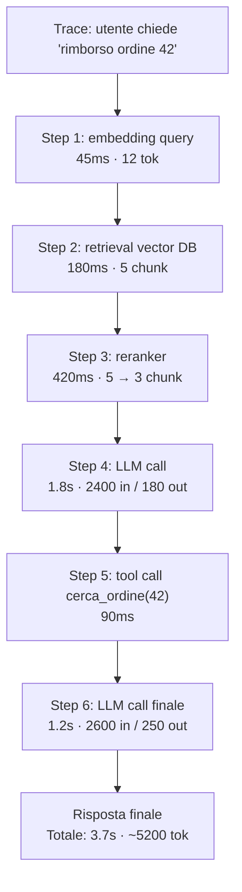

# Observability — vedere dentro il sistema

  In evoluzione
  Lezione 3.3
  ~12 min di lettura

Un sistema LLM senza observability è una scatola che produce risposte e brucia soldi senza che tu sappia dove. Quando qualcosa va storto — qualità che cala, costi che schizzano, latenze che si gonfiano — devi sapere *dove* è successo, non solo *che* è successo. È il livello sotto la valutazione: il giudice misura la qualità, l'observability ti dice perché.

Nella lezione 3.2 hai visto come misurare la qualità delle risposte. Funziona se ogni risposta è un evento singolo, isolato. Ma un sistema reale è un grafo di chiamate — il prompt va a un retriever, che chiama un embedding model, che interroga un vector DB, che ridà chunk, che vanno al modello finale, che a volte chiama un tool, che torna al modello. Quando una risposta è scadente o lenta, *dove* nel grafo è andato storto? Senza observability, brancoli.

## Cos'è observability quando in mezzo c'è un LLM

L'**observability** è la capacità di capire lo stato interno di un sistema dai dati che produce — log, metriche, trace. Sui sistemi software classici è una pratica matura: APM, Prometheus, Grafana, distributed tracing. Sugli LLM si applica lo stesso principio, ma con tre cose nuove da tracciare che il software classico non aveva.

**Token in, token out** — i tuoi soldi. Ogni chiamata consuma input token (quello che mandi) e produce output token (quello che riceve). Senza loggarli per chiamata, scopri la bolletta a fine mese e non sai chi ha mangiato cosa.

**Il prompt versionato** — la "logica di business" del tuo sistema vive nel prompt. Se non sai quale versione del prompt ha prodotto una certa risposta, non puoi riprodurre il bug né valutare se il cambio è stato un miglioramento.

**La qualità della risposta** — agganciata in tempo reale o batch al tracing, così quando un punteggio cala puoi vedere *quale catena di chiamate* l'ha prodotto.

Tre cose che insieme fanno la differenza tra "il sistema funziona" e "so come e perché funziona".

## Tracing: la sequenza di chiamate

Una singola interazione utente, in un sistema RAG agentico, può essere fatta di 10-20 chiamate diverse: embedding della query, retrieval dal vector DB, eventuale reranking, una o più chiamate all'LLM, magari tool call con risultati che tornano nel contesto, infine la risposta. Il **trace** è la sequenza ordinata di tutte queste chiamate per quella singola interazione, con tempi e metadata.

Un trace ben fatto ti dice:

- Quanti step ci sono stati e quali
- Quanto è durato ciascuno
- Quale modello/tool è stato chiamato
- Quali input e output ha visto ognuno
- Quanti token sono stati spesi a ogni step

Quando una risposta arriva lenta, il trace ti dice subito *dove* sta il tempo. Quando una risposta è sbagliata, il trace ti fa vedere *quali chunk* sono arrivati al modello — il 90% delle volte il problema del RAG sta lì (lezione 1.1), non nel modello.

## Le metriche che contano

Per LLM, quattro famiglie di metriche coprono la stragrande maggioranza delle domande.

**Costo.** Token in, token out, per chiamata, per utente, per feature. Aggregati per giorno/settimana, con breakdown per modello. La metrica più cieca da non avere: scoprire a fine mese che una feature costa 10x quello che pensavi è uno scenario classico.

**Latenza.** End-to-end (cosa percepisce l'utente) e per step (dove si perde il tempo). Le percentili contano: la mediana ti dice il caso normale, p95 e p99 ti dicono cosa vede il 5% e l'1% peggiore dei tuoi utenti — di solito molto peggio della mediana. Se ottimizzi solo la mediana, lasci una coda di esperienze pessime.

**Tasso di errore.** Non solo errori HTTP. *Refusal rate* (quanto spesso il modello rifiuta di rispondere), *fallback rate* (quanto spesso scatta un piano B), errori dei tool, rate limit hit. Ogni numero qui è un segnale di salute.

**Qualità.** I punteggi del giudice (lezione 3.2) agganciati al trace. Una distribuzione dei punteggi nel tempo: se la media scende, *quale step* del trace è cambiato? Aggancio cruciale tra valutazione e observability.

## Cosa loggare: input, output, metadata

La domanda "logghiamo tutto" è la risposta sbagliata: i log degli LLM contengono spesso dati sensibili. La domanda giusta è "cosa ci serve per *diagnosticare e migliorare*?". Una lista minima funzionale:

- **Input**: la query utente + tutto il contesto effettivamente passato al modello (system prompt, chunk recuperati, storia conversazione)
- **Output**: la risposta del modello, integralmente
- **Modello**: nome, versione, provider
- **Versione del prompt**: l'hash o l'ID della versione del prompt usata (la 0.5 ti ha già detto perché versionare; qui lo metti in pratica)
- **Parametri**: temperature, top-p, max tokens
- **Token**: in/out separati, con il costo calcolato
- **Latenza**: timestamp inizio/fine per ogni step
- **Trace ID + parent span ID**: per ricostruire l'albero delle chiamate
- **Tool calls (se ci sono)**: nome, parametri, risultato, errore eventuale
- **User ID / session ID** (anonimizzati o pseudonimizzati)

I metadata sono come le briciole di pane: ognuno sembra inutile finché non ne hai bisogno per ricostruire un caso.

> **Nota** — Output e input contengono spesso PII (Personally Identifiable Information). La privacy non è un dettaglio (vedi lezione 4.3): pseudonimizzazione degli ID, hashing dove sensato, retention limitata, accessi loggati. Non bypassare il GDPR per fare diagnostica.

## Agganciare i prompt versionati al trace

Questa è la cinghia che collega 0.5, 3.1 e 3.2. Nella 0.5 hai visto che i prompt vanno versionati come il codice. Nella 3.1 hai visto come misurare se un cambio è migliorato. L'aggancio sta qui: **ogni trace include la versione esatta del prompt che ha prodotto quella risposta**.

Se il giudice ti dice che oggi i punteggi sono peggio di ieri, il trace ti fa vedere se la versione del prompt è cambiata, se il modello è cambiato, se la distribuzione delle query è cambiata. Senza questo aggancio hai solo "la qualità è calata" — un grido senza diagnosi.

In pratica: ogni release di un prompt produce un identifier (semver, hash, o un tag). Il sistema legge il prompt da uno store versionato (file in git, database con storia, prompt management tool). Quando logga, scrive anche quell'identifier nel trace.

## Eval online: il giudice agganciato al sistema

L'eval offline (lezione 3.2) gira sul golden dataset prima del rilascio. L'**eval online** invece campiona le risposte reali in produzione e le passa al giudice — periodicamente o in streaming.

Due pattern:

**Sampling-based.** Campiona N% delle risposte (di solito 1-10%) e le manda al giudice. Costoso meno, ma vedi solo un sottoinsieme. Buono per il monitoraggio continuo.

**Trigger-based.** Vale al giudice solo le risposte che hanno certe caratteristiche: latenza fuori soglia, retrieval con score bassi, conversazioni dove l'utente ha riformulato (un proxy di "non sono soddisfatto"). Mirato, più ricco di segnale per debito di cost.

Il giudice qui non decide niente in tempo reale — non blocca la risposta — semplicemente la valuta e produce un punteggio che entra nelle dashboard.

Sotto il cofano: OpenTelemetry e lo standard del tracing

Il tracing distribuito moderno si basa su **OpenTelemetry (OTel)** — uno standard aperto per la strumentazione di applicazioni. Il principio: ogni operazione produce uno **span** (un'unità di lavoro con inizio, fine, attributi); span legati gerarchicamente formano un **trace** (l'albero di chiamate per una singola richiesta).

Sugli LLM è la stessa meccanica, con span specifici per `llm.completion`, `tool.call`, `retrieval`, ecc. Le piattaforme di LLM observability (Langfuse, LangSmith, Arize Phoenix, Helicone) sono build sopra questa idea, spesso con SDK già pronti per i provider principali.

Il vantaggio di basarsi su OTel: il tracing LLM è interoperabile con il resto della tua osservabilità (database, API, frontend). Una singola interazione utente si vede dal click nel browser fino al chunk recuperato dal vector DB.

## Cosa NON è observability per LLM

| Il pensiero sbagliato | Come stanno le cose |
|---|---|
| "È APM applicato agli LLM" | L'APM tradizionale non traccia token, prompt versionati, qualità della risposta. Sono metriche LLM-specifiche, non un add-on. |
| "Logghiamo tutto, poi vediamo" | I log LLM contengono PII. Loggare senza policy = problema GDPR, non observability. La selettività e la pseudonimizzazione sono parte del design, non un upgrade. |
| "Latenza media è la metrica giusta" | La media nasconde la coda. p95 e p99 ti dicono cosa vede il peggiore 5%/1% degli utenti — di solito un'esperienza ben diversa dalla mediana. |
| "Setup una volta, poi tace" | I sistemi LLM cambiano in continuazione (provider aggiornano modelli, prompt cambiano, query degli utenti cambiano). L'observability è un sistema vivo, non un'installazione. |

---

## Verifica di comprensione

> Rispondi a memoria. Le incerte rivedile domani. Le ultime due anticipano lezioni successive.

1. Quali tre cose deve tracciare l'observability LLM che l'APM tradizionale non traccia?
2. Cos'è un trace e perché è critico nei sistemi a più step (es. un RAG agentico)?
3. Perché la latenza p99 conta tanto quanto la mediana?
4. Perché agganciare la versione del prompt al trace è il pezzo che collega 0.5, 3.1 e 3.2?
5. Differenza tra eval online sampling-based e trigger-based: quando preferisci una o l'altra?
6. *(anticipazione)* I tuoi log contengono PII degli utenti. Quali principi devono guidare retention e accessi?
7. *(anticipazione)* In produzione la qualità cala del 15% in due settimane senza nessun cambio al sistema. Quali cause indaghi e in che ordine?

---

## Glossario

- **Observability** — capacità di capire lo stato interno di un sistema dai dati che produce (log, metriche, trace).
- **Trace** — sequenza ordinata di tutte le chiamate (span) generate da una singola richiesta utente, con timing e metadata.
- **Span** — singola operazione all'interno di un trace; ha un inizio, una fine, attributi, e relazioni padre/figlio con altri span.
- **OpenTelemetry (OTel)** — standard aperto per la strumentazione e il tracing distribuito; base di molte piattaforme di LLM observability.
- **Token in / token out** — i token consumati in input e prodotti in output; l'unità di costo da loggare a ogni chiamata.
- **Latenza p95 / p99** — il valore di latenza sotto cui sta il 95% / 99% delle richieste; misura la "coda" dell'esperienza utente.
- **Refusal rate** — la frequenza con cui il modello rifiuta di rispondere; un segnale di salute del sistema.
- **Eval online** — valutazione dei punteggi di qualità su un campione di risposte reali in produzione, agganciata al trace.
- **Sampling-based / trigger-based eval** — due strategie di selezione delle risposte da valutare online: a campione o su criteri specifici.
- **Prompt versioning** — pratica di tracciare la storia delle versioni di un prompt, in modo da agganciare ogni trace alla versione esatta che l'ha prodotto.

---

## Per approfondire

- **OpenTelemetry** — sito ufficiale e documentazione dello standard; cerca "OpenTelemetry" o `opentelemetry.io`.
- **Piattaforme di LLM observability** (Langfuse, LangSmith, Arize Phoenix, Helicone, Braintrust, Laminar, Confident AI) — implementano tracing + eval + prompt management. A giugno 2025 Langfuse ha rilasciato in MIT i moduli prima commerciali (LLM-as-judge evals, annotation queues, prompt experiments, Playground); è oggi il leader open-source con >19k stelle GitHub. Cerca la documentazione attuale di quella che valuti adottare.
- **Documentazione "Tracing"** dei provider (Anthropic, OpenAI) — i provider espongono metadata utili al tracing (request ID, token detail) nelle risposte; le guide ufficiali spiegano come usarli.

*Risorse indicate per la ricerca; per i link aggiornati conviene cercarli al momento.*

---

## Prossima lezione

**3.3 Gestire le allucinazioni.** Hai la qualità misurata e il sistema osservabile. Resta il fallimento più tipico di un LLM: la risposta sicura di sé e completamente sbagliata. Perché succede (è il meccanismo, non un bug), come la riduci con grounding, e quali contromisure funzionano davvero — vs quelle che girano nei tutorial e non reggono in produzione.
