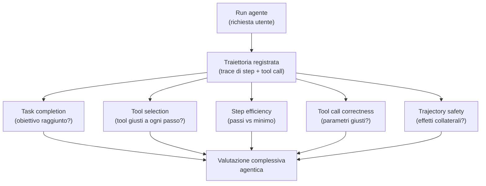

# Valutare il comportamento agentico end-to-end

  In evoluzione
  Lezione 3.5
  ~14 min di lettura

Un agente non è un singolo output, è una traiettoria. Può produrre ogni singola risposta plausibile e fallire come processo: tool sbagliato, loop, obiettivo raggiunto per la strada sbagliata, o mancato pur "suonando bene". Valutare un agente è il buco che si sta allargando più in fretta nel settore — perché il metodo della lezione 3.2, fatto sul token finale, qui non basta più.

Nella lezione 1.5 hai costruito agenti. Nella 3.2 hai imparato a giudicare singole risposte. Adesso le due cose si scontrano: un agente fa 8 chiamate, usa 4 tool, riconsidera, riprova, e infine produce una risposta finale. Quella risposta finale può essere perfettamente plausibile *e essere stata raggiunta nel modo sbagliato*. Ha aggiornato il database del cliente giusto, oppure quello di un cliente con nome simile? Ha cancellato il file che voleva, o anche un altro? L'ultimo token non te lo dice. Te lo dice la *traiettoria*.

## Perché l'output finale non basta

Tre fallimenti classici di un agente che non emergono dalla valutazione del singolo output finale.

**Tool sbagliato per il task giusto.** L'agente doveva consultare il database degli ordini. Ha consultato un'API di ricerca generica e ha estratto un risultato che sembra l'ordine ma è un articolo di blog con lo stesso numero. La risposta finale "Il tuo ordine è in spedizione" è plausibile; è anche completamente sbagliata, perché non è venuta dalla fonte giusta.

**Loop e percorsi inefficienti.** L'agente ha trovato la risposta al terzo tentativo, dopo aver provato 5 strade. La risposta finale è giusta; il sistema ha bruciato 6x quello che doveva. In un sistema in produzione, costi e latenza esplodono in modo invisibile se guardi solo l'output finale.

**Obiettivo raggiunto in modo distruttivo.** L'agente doveva trovare il file e leggerlo. Per farlo ha riscritto un altro file con la query. Output finale: il file letto, contenuto restituito, "task completato". Effetto collaterale: un altro file corrotto. L'output è giusto, la traiettoria contiene un'azione dannosa.

In tutti e tre i casi, un giudice che vede solo l'output finale non se ne accorge. Il problema non è il *risultato*, è il *processo*. La valutazione agentica deve guardare entrambi.

## Cosa misurare in un agente

Cinque dimensioni che insieme coprono il comportamento di un agente in modo molto più completo del singolo "la risposta è buona?".

**Task completion.** L'obiettivo finale è stato raggiunto? Può essere binario (sì/no) o gradato ("parzialmente, mancava X"). È la metrica più ovvia, ma da sola è cieca al *come*.

**Tool selection accuracy.** A ogni passo, l'agente ha scelto il tool giusto? Si misura confrontando la sequenza di tool chiamati con una sequenza "attesa" definita nel golden dataset, oppure con un giudice LLM che valuta se la scelta era ragionevole dato lo stato.

**Step efficiency.** Quanti passi ha fatto rispetto al minimo necessario? Un agente che risolve un task in 12 step quando ne bastavano 4 può essere "corretto" ma è insostenibile a scala. Si misura come numero di passi, o come rapporto tra passi effettivi e passi ottimali (quando definibili).

**Tool call correctness.** I parametri passati ai tool erano giusti? Un agente può scegliere il tool giusto e poi chiamarlo con argomenti sbagliati (ID del cliente errato, range di date invertito, filtro mancante). Si valuta a livello di singola chiamata.

**Trajectory safety.** Ci sono state azioni con effetti collaterali indesiderati lungo la strada? Modifiche non richieste, file toccati che non andavano toccati, accessi a risorse fuori scope. È la dimensione più legata alla sicurezza (lezione 4.2) ma vive anche qui.

Non tutte queste dimensioni sono ugualmente importanti per ogni agente. Per un agente di customer support, task completion e tool selection contano di più. Per un agente con poteri di modifica (file system, database), trajectory safety è critica. La scelta delle metriche pesate dipende dal dominio.

## Test scenarios scriptati

La forma più matura di valutazione agentica oggi è il **test scenario scriptato**: un setup deterministico in cui sai esattamente che strada l'agente *deve* fare, e confronti la sua traiettoria reale con quella attesa.

Esempio concreto:

- **Scenario**: utente chiede "qual è lo stato del mio ordine 4521?"
- **Tool disponibili**: `cerca_cliente(nome)`, `cerca_ordine(id)`, `dettagli_ordine(id)`, `email_supporto()`
- **Traiettoria attesa**: l'agente chiama `cerca_ordine(4521)`, ottiene l'ordine, eventualmente `dettagli_ordine(4521)` se serve approfondire, produce la risposta.
- **Anti-traiettoria** (cose che non deve fare): chiamare `cerca_cliente` senza un nome, generare l'email di supporto senza che l'utente l'abbia chiesto, andare in loop.

Su 30-50 scenari ben scelti che coprono i casi normali, gli edge case (richiesta ambigua, dato mancante, tool che fallisce), gli scenari avversariali (tentativo di farti fare cose fuori scope) — ottieni un quadro molto più completo dell'agente del singolo "test di una risposta".

Il limite degli scenari scriptati: definirli costa tempo, e per agenti che operano in spazi molto aperti (tipo: "cerca informazioni sul web") la traiettoria attesa non è definibile univocamente. Lì si combina con il prossimo metodo.

## LLM-as-judge sulla traiettoria

Quando la traiettoria non si può scriptare, **un giudice LLM valuta la sequenza di passi** — non solo l'output finale. Il giudice riceve: la richiesta iniziale, la traiettoria completa (sequenza di tool call con argomenti e risultati), la risposta finale. E valuta secondo criteri agentici.

Esempio di criteri per il giudice di traiettoria:

- *Logica della sequenza*: gli step sono in un ordine sensato? Ci sono passi inutili o ripetuti?
- *Pertinenza dei tool*: ogni tool chiamato era il più adatto per quello step?
- *Pertinenza dei parametri*: gli argomenti dei tool erano corretti dato lo stato?
- *Gestione degli errori*: quando un tool ha fallito, l'agente ha recuperato in modo sensato?
- *Completamento del task*: l'obiettivo iniziale è stato raggiunto?

Lo stesso pattern della 3.1 (criteri espliciti, motivazione prima del voto, output strutturato), applicato a un input più ricco — la traiettoria invece di una singola risposta.

> **Nota** — La traiettoria può essere lunga. Per un agente che fa 20 step, passare tutto al giudice è costoso in token. Pattern pratico: riassumi i risultati dei tool prima di passarli al giudice (i raw output di un'API spesso sono megabyte di JSON; al giudice basta il riassunto rilevante), o valuta in chunk se i passi sono troppi.

## Sandboxes per test sicuri

Un agente in test non deve toccare i sistemi di produzione. Suona ovvio, è sistematicamente violato.

Una **sandbox** è un ambiente di esecuzione isolato in cui i tool dell'agente operano su dati e infrastruttura finti ma fedeli alla produzione. Database con dati anonimizzati, API mock che ritornano risposte realistiche, file system temporaneo. L'agente non distingue la sandbox dalla produzione — tu sì.

Tre cose che la sandbox abilita:

1. **Test sugli effetti collaterali.** Puoi misurare la trajectory safety perché le azioni "distruttive" della sandbox non distruggono nulla di reale, ma le registri e le conti.
2. **Casi avversariali.** Puoi mandare all'agente input pensati per fargli sbagliare (dati malformati, richieste fuori scope, tentativi di prompt injection — vedi lezione 4.2) senza rischio.
3. **Riproducibilità.** Lo stesso scenario, ripetuto, dovrebbe dare la stessa traiettoria (o quasi: gli LLM hanno una varianza intrinseca). Sandbox stabili sono il prerequisito.

## Continuous evaluation in produzione

Tutto quello sopra è eval offline (lezione 3.2) applicato agli agenti — dataset, scenari, sandbox. In produzione la valutazione **non si ferma al rilascio**, perché agenti reali incontrano casi che il golden set non ha previsto.

Pattern tipico, agganciato all’observability (lezione 3.3):

- Ogni run dell'agente in produzione produce un trace completo (sequenza di tool call, input/output di ognuno, output finale)
- Un sottoinsieme dei trace viene fatto valutare dal giudice di traiettoria
- I trace con punteggio basso, o quelli che hanno innescato refusal/fallback/escalation a umano, vengono raccolti in una *coda di review*
- Periodicamente questi trace problematici diventano nuovi scenari del golden dataset, chiudendo il ciclo

Il sistema impara dai suoi fallimenti senza che tu debba aspettare un incidente per scoprirli.

Sotto il cofano: lo stato dell'arte agentic eval

L'eval agentica è giovane — più giovane dei pattern agentici stessi. La letteratura accademica si è concentrata su benchmark standardizzati: **AgentBench**, **GAIA**, **SWE-bench Verified** (per agenti che scrivono codice, 500 task verificati a mano dalla community Princeton), **WebArena** (per agenti che navigano siti), e i più recenti **Terminal-Bench** (agenti che operano su shell Unix), **OSWorld** (agenti che usano un sistema operativo completo) e **τ-Bench / Tau-Bench** (interazione con utenti simulati su task lunghi). Sono dataset di task con metriche di task completion, ma raramente vanno fino al trajectory-level reasoning.

I leader sui leaderboard pubblici di aprile 2026: Claude Opus 4.7 al 87.6% su SWE-bench Verified, Claude Sonnet 4.5 al 74.6% su GAIA (Princeton HAL), Claude Mythos Preview al 68.7% su WebArena. La generazione 2026 ha sbloccato per la prima volta task percepiti come "fuori portata" nel 2024 — ma il long-tail dei task agentici reali resta molto sotto questi numeri.

Sul fronte industriale, i framework agentici (LangGraph, CrewAI, AutoGen) stanno integrando primitive per il logging strutturato delle traiettorie, ma le metriche di valutazione restano per lo più "task completion" — il singolo punteggio finale. Le metriche multi-dimensionali (tool selection, step efficiency, trajectory safety) sono ancora roba che ti costruisci, o che paghi a piattaforme come Patronus, LangSmith, Arize, che le stanno standardizzando.

La regola attuale: **non fidarti dei benchmark pubblici al 100%**, perché il tuo dominio specifico non è coperto. I benchmark sono utili come *direzione*; il giudizio finale lo dà il tuo golden dataset, costruito sul tuo task.

## Cosa NON è valutare un agente

| Il pensiero sbagliato | Come stanno le cose |
|---|---|
| "Se l'output finale è giusto, l'agente è buono" | Può essere giusto per la strada sbagliata: tool errati, dati di clienti scambiati, effetti collaterali. Conta il *processo*, non solo il risultato. |
| "Eval di un singolo output (3.1) basta anche per agenti" | È necessario ma non sufficiente. Servono metriche di traiettoria (tool selection, step efficiency, trajectory safety) che la valutazione del singolo output non vede. |
| "I framework agentici hanno l'eval integrata" | Le primitive di logging sì; le metriche multi-dimensionali, in larga parte, no. Le costruisci sopra (o le compri da piattaforme dedicate). |
| "Il test in produzione vale come test in sandbox" | No: in produzione un'azione distruttiva è un incidente. La sandbox è il prerequisito per testare casi avversariali e effetti collaterali senza danno. |

---

## Verifica di comprensione

> Rispondi a memoria. Le incerte rivedile domani. L'ultima anticipa la prossima lezione.

1. Tre fallimenti tipici di un agente che la valutazione del singolo output finale non cattura. Quali?
2. Cinque dimensioni che insieme misurano il comportamento agentico. Nominale e spiega cosa cattura ciascuna.
3. Cos'è un test scenario scriptato, e qual è il suo limite principale?
4. Come si applica il pattern LLM-as-judge (lezione 3.2) a una *traiettoria* invece che a una singola risposta?
5. Perché serve una sandbox per testare un agente con tool, e cosa abilita rispetto al test in produzione?
6. Hai un agente che fa customer support con accesso a tool di lettura ordini e modifica indirizzi. Quali metriche di traiettoria pesi di più, e perché?
7. *(anticipazione)* L'agente di customer support a un certo punto modifica l'indirizzo del cliente sbagliato. La sicurezza dell'agente non è solo "prompt injection sull'input": cos'è la *catena di azioni* come superficie d'attacco?

---

## Glossario

- **Traiettoria** — la sequenza ordinata di decisioni e tool call che un agente produce per arrivare alla risposta finale.
- **Task completion** — la metrica che misura se l'obiettivo finale dell'agente è stato raggiunto; può essere binaria o gradata.
- **Tool selection accuracy** — la metrica che misura se l'agente ha scelto i tool giusti a ogni passo.
- **Step efficiency** — la metrica che confronta il numero di passi effettivi dell'agente con il minimo necessario.
- **Tool call correctness** — la metrica che misura se i parametri passati ai tool erano corretti dato lo stato.
- **Trajectory safety** — la metrica che misura la presenza di azioni con effetti collaterali indesiderati lungo la traiettoria.
- **Test scenario scriptato** — scenario di valutazione con traiettoria attesa definita a priori; permette confronto deterministico contro la traiettoria reale.
- **Anti-traiettoria** — la sequenza di azioni che l'agente *non deve* fare in uno scenario; complemento della traiettoria attesa.
- **Sandbox** — ambiente isolato e fedele alla produzione in cui l'agente esegue tool senza rischio di danni reali.
- **Coda di review** — collezione di traiettorie problematiche in produzione, raccolte per diventare nuovi scenari del golden dataset.

---

## Per approfondire

- **AgentBench, GAIA, SWE-bench Verified, WebArena, Terminal-Bench, OSWorld, τ-Bench** — i benchmark accademici principali per agenti nel 2025-26; cerca i titoli su arXiv per i paper di riferimento. Leaderboard pubblici curati su `benchmarkingagents.com` e Princeton HAL.
- **Documentazione di LangSmith, Arize Phoenix, Patronus, Langfuse, Laminar** — le piattaforme che stanno standardizzando le metriche multi-dimensionali per agenti.
- **"Reflexion" e "ReAct" papers** — letteratura accademica su pattern agentici e modi di valutarne il ragionamento; cerca i titoli su arXiv.

*Risorse indicate per la ricerca; per i link aggiornati conviene cercarli al momento. Quest'area si muove in fretta.*

---

## Prossima lezione

**3.5 Decision drill — Valutazione.** Hai i metodi: LLM-as-judge sui singoli output, observability per vedere dentro, contromisure per le allucinazioni, eval di traiettoria per gli agenti. Il drill mette tutto insieme: dati due scenari realistici con vincoli concreti, *come imposti la valutazione end-to-end*?
