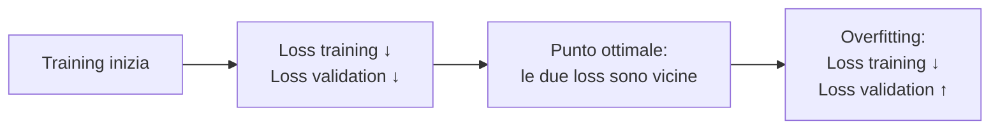

# Concetti ML che servono a chiunque

  Stabile
  Lezione 0.3
  ~14 min di lettura

Training, fine-tuning, overfitting, split dei dati, bias. Non il vocabolario: l'intuizione meccanica. Capire cosa il fine-tuning sposta davvero nel modello — e cosa invece non tocca — è il pezzo che rende sensata la griglia di decisione fine-tuning vs RAG che incontrerai alla lezione 1.7.

Nella lezione 0.2 abbiamo visto che un modello di embedding impara dagli esempi — coppie di testi simili e diversi — e che, dopo abbastanza esempi, lo spazio del significato emerge da solo. Ma abbiamo sorvolato su come funziona questo "imparare". Cos'è che cambia dentro, concretamente? Dove "vive" quello che il modello ha imparato? E, soprattutto: quando lo modifichiamo, cosa stiamo toccando davvero?

Queste sono le domande di questa lezione. Non ti servirà per addestrare un modello; ti servirà per capire le conseguenze di certe scelte architetturali — e per non confondere strumenti che fanno cose molto diverse.

## Cosa vuol dire "imparare" per un modello

Nella lezione 0.1 abbiamo visto che dentro un modello ci sono **parametri** — miliardi di numeri. All'inizio sono inizializzati in modo pseudo-casuale e il modello non sa fare niente di utile. L'addestramento (*training*) è il processo che li porta da numeri a caso a qualcosa di sensato.

Come? Con un ciclo semplice da descrivere, brutale da eseguire. Il modello vede un esempio — diciamo una frase con la parola finale nascosta — e prova a indovinare quella parola. Il suo tentativo viene confrontato con la risposta giusta tramite una **funzione di perdita** (*loss function*): una formula che misura quanto il tentativo era sbagliato. Se ha previsto "tavolo" quando la risposta era "azzurro", la loss è alta. Se era quasi giusto, è bassa.

Poi arriva la parte meccanica vera: un algoritmo chiamato **backpropagation** calcola, per ogni parametro, di quanto bisogna aggiustarlo per ridurre la loss. La direzione è quella del gradiente — in sostanza, la direzione in cui la loss scende più ripida. I parametri vengono poi aggiornati di un piccolo passo in quella direzione. Quel "piccolo passo" si chiama **learning rate** — tasso di apprendimento.

Ripetuto su miliardi di esempi, questo ciclo porta i parametri da casuali a utili. **Il modello "impara" nel senso che i suoi parametri si assestano su valori che minimizzano l'errore** su un oceano di esempi. Non c'è altra magia.

### Sotto il cofano: la discesa del gradiente

La regola di aggiornamento, scritta in formula, è:

$$\theta \leftarrow \theta - \eta \, \nabla_\theta L(\theta)$$

dove $\theta$ sono tutti i parametri del modello, $L(\theta)$ è la loss — l'errore totale calcolato su un batch di esempi — e $\eta$ (eta) è il learning rate. Il simbolo $\nabla_\theta L$ è il **gradiente**: un vettore che punta nella direzione in cui la loss cresce più velocemente. Sottraendo il gradiente invece di sommarlo, si va nella direzione in cui la loss *scende*.

Traduzione: "sposta ogni parametro di un piccolo passo nella direzione che riduce l'errore". Ripetuto miliardi di volte, questo gesto minimal porta i parametri da casuali a utili. Non c'è altra magia: è questa formula, applicata ancora e ancora.

Il learning rate $\eta$ è delicato: troppo grande e si salta oltre il minimo della loss, troppo piccolo e ci si mette un'eternità. In pratica si usano varianti più sofisticate della discesa del gradiente base (Adam, AdamW) che adattano il passo per ogni parametro, ma il principio è sempre questo.

## Split dei dati: train, validation, test

Per sapere se un modello sta imparando davvero — e non solo memorizzando gli esempi — i dati si dividono in tre parti.

**Training set** — il grosso: gli esempi su cui il modello viene addestrato, quelli che "vede" e su cui i parametri vengono aggiornati.

**Validation set** — esempi che il modello non ha mai visto durante il training. Vengono usati *durante* lo sviluppo per monitorare: il modello impara bene, o sta andando in overfitting? Le decisioni sul training (quando fermarsi, come regolare il learning rate) si prendono guardando la validation.

**Test set** — il banco di prova finale. Non va toccato fino a quando hai finito di decidere tutto: modello, iperparametri, ogni cosa. Il test set dà la stima onesta di quanto il modello funziona su dati davvero nuovi.

La regola d'oro è semplice: **il modello non deve mai "spiare" il test set durante lo sviluppo.** Se lo usi per orientare le scelte, non stai più misurando la generalizzazione — stai misurando quanto bene il tuo sistema si è adattato anche a quel campione. È come far scegliere le domande dell'esame allo studente: prende 30, ma non sai se ha capito.

## Overfitting: imparare troppo bene

Immagina uno studente che studia solo i compiti in classe degli anni precedenti, letteralmente a memoria. All'esame gli ripropongono gli stessi esercizi: va benissimo. Gli danno domande nuove sullo stesso argomento: crolla.

Un modello in **overfitting** fa la stessa cosa. Ha "memorizzato" i dati di training invece di estrarne i pattern generali. Sul training set va benissimo; su dati nuovi, va malissimo. Si diagnostica esattamente guardando questo gap: se la performance sul training set è molto migliore di quella sul validation set, sei in overfitting.

Come si combatte? Più dati aiuta sempre. Tecniche di **regolarizzazione** come il dropout — che disattiva casualmente un po' di neuroni durante il training, forzando il modello a non appoggiarsi su percorsi singoli — riducono la memorizzazione. E poi: fermarsi al momento giusto. Non continuare ad addestrare all'infinito sperando che migliori, perché dopo un certo punto la performance sui dati nuovi peggiora anche se quella sul training set continua a salire.

Il contrario è l'**underfitting**: il modello non è abbastanza potente, o ha visto troppo poco, e va male su tutto — sia training che validation. È meno comune con i modelli grandi moderni, ma segnala che qualcosa non va nel setup.

## Bias nei dati: la macchina impara quello che le dai

Un modello non valuta i dati che gli dai. Li assorbe. Se i dati contengono distorsioni sistematiche — i campioni coprono solo certi scenari, certi gruppi sono sovra- o sotto-rappresentati, le etichette riflettono errori umani sistematici — **il modello le impara**, e poi le riproduce in produzione.

Questo si chiama **bias nei dati** (*data bias*), e non è un problema etico astratto: è un problema pratico di qualità del sistema.

Esempio concreto: un classificatore di candidature addestrato sulle assunzioni storiche di un'azienda che ha preso prevalentemente uomini per ruoli tecnici finirà per penalizzare i profili femminili per quegli stessi ruoli. Non perché il modello sia "intenzionalmente" discriminatorio, ma perché ha imparato che "i profili che storicamente venivano scelti sembravano così". La causa è nel dato, non nel modello.

I bias più comuni da tenere d'occhio:

- **Bias di selezione**: i tuoi dati di training non rappresentano l'intera distribuzione reale — hai solo certi utenti, certi contesti, certe fasce orarie.
- **Bias di etichettatura**: chi ha etichettato i dati ha introdotto errori o interpretazioni sistematiche.
- **Bias temporale**: i dati sono vecchi e la distribuzione reale è cambiata nel tempo.

La diagnosi è semplice da enunciare e difficile da fare: analizzare i dati prima di addestrare, misurare le performance su sottogruppi diversi (non solo la media aggregata), aggiornare i dataset quando la distribuzione reale cambia. Non esiste un tool automatico che risolve il problema: serve giudizio.

## Fine-tuning: cosa sposta, cosa rimane

Qui sta il pezzo più importante di questa lezione, perché riguarda una delle confusioni più frequenti tra chi costruisce sistemi AI.

**Fine-tuning** significa prendere un modello già addestrato — che ha già una conoscenza generale del linguaggio, miliardi di parametri già regolati — e addestrarlo di nuovo su un dataset più piccolo e specifico. È come prendere qualcuno che sa già scrivere e ragionare, e fargli fare uno stage intensivo su un dominio preciso: il diritto notarile, il customer care di un prodotto, la medicina generale.

Il fine-tuning **aggiusta i pesi** del modello. Lo sposta verso uno stile, un formato, un tono, una terminologia diversi. Dopo il fine-tuning, il modello risponde *in un certo modo*: più formale, più conciso, più preciso nell'uso dei termini di un dominio.

Quello che il fine-tuning **non fa** è aggiungere fatti nuovi e recuperabili. Se il modello base non conosce i documenti della tua intranet, il fine-tuning non glieli porta dentro — al massimo gli insegna *come* rispondere quando si parla di certi argomenti, non *cosa* rispondere con precisione fattuale su quei documenti. Per i fatti aggiornabili e specifici, la mossa è **RAG** (lezione 1.1): dare al modello quei pezzi di documento nel contesto al momento della risposta, invece di cuocerli dentro i pesi.

La distinzione pratica:

| Vuoi... | Lo strumento è... |
|---|---|
| Cambiare il tono e lo stile delle risposte | Fine-tuning |
| Far usare terminologia specifica del dominio | Fine-tuning |
| Dare al modello accesso a documenti aggiornati | RAG |
| Ridurre le allucinazioni su fatti precisi e verificabili | RAG (il documento è nel contesto, verificabile) |
| Entrambe le cose | Fine-tuning + RAG (si combinano) |

La domanda non è "quale tecnica è migliore?" ma "quale problema stai risolvendo?". Usare il fine-tuning per portare fatti è come fotocopiare un libro nella testa di qualcuno sperando che lo ricordi parola per parola. Non funziona così — e questo spiega metà degli errori che si vedono nei sistemi LLM enterprise.

## Cosa NON è il training

| Il pensiero sbagliato | Come stanno le cose |
|---|---|
| "Il fine-tuning aggiunge fatti nuovi e recuperabili al modello" | No: sposta i pesi verso uno stile e un comportamento. I fatti aggiornabili vanno in RAG, non nel fine-tuning. |
| "Più dati di training = risultato sempre migliore" | Non se i dati contengono bias o errori. La macchina impara esattamente quello che le dai — distorsioni incluse. |
| "Un modello con loss bassa sul training set è pronto per la produzione" | Non se c'è overfitting: bassa loss in training può andare di pari passo con loss alta su dati nuovi. |
| "Fine-tuning e RAG fanno la stessa cosa, si sceglie uno o l'altro" | No: hanno obiettivi diversi. Spesso si usano insieme, perché correggono problemi distinti. |

---

## Verifica di comprensione

> Rispondi a memoria, senza rileggere. Le risposte incerte rivedile domani, non subito: lo stacco di un giorno le consolida. Le ultime due anticipano lezioni future.

1. Cosa cambia, concretamente, nei parametri di un modello durante il training?
2. Cos'è la loss function e cosa misura?
3. A cosa serve il validation set, e perché è diverso dal test set?
4. Cos'è l'overfitting, e come si riconosce guardando le curve di training?
5. Un'azienda vuole che il suo assistente risponda sempre in italiano formale, senza emoji. Fine-tuning o RAG?
6. Un'azienda vuole che il suo assistente sappia rispondere sulle specifiche tecniche dei prodotti in catalogo, aggiornate ogni settimana. Fine-tuning o RAG?
7. *(anticipazione)* Nella griglia di decisione della lezione 1.7, ci sono quattro opzioni: RAG, fine-tuning, prompt engineering, context engineering. Basandoti su questa lezione, in che situazioni escluderesti subito il fine-tuning?

---

## Glossario

- **Parametri (pesi)** — i numeri interni di un modello, modificati durante il training; è "dove vive" quello che il modello ha imparato.
- **Training (addestramento)** — la fase in cui i parametri vengono aggiornati mostrando al modello molti esempi e minimizzando la loss.
- **Loss function (funzione di perdita)** — la formula che misura quanto le previsioni del modello si discostano dalle risposte corrette.
- **Backpropagation** — l'algoritmo che calcola come modificare ogni parametro per ridurre la loss.
- **Discesa del gradiente** — la strategia di aggiornamento: sposta ogni parametro nella direzione che riduce la loss più velocemente.
- **Learning rate (tasso di apprendimento)** — la dimensione del passo di aggiornamento a ogni iterazione; troppo grande o troppo piccolo, entrambi causano problemi.
- **Gradiente** — il vettore che indica in che direzione e di quanto cresce la loss rispetto ai parametri; si sottrae per scendere verso il minimo.
- **Training set** — la parte dei dati su cui il modello viene addestrato.
- **Validation set** — dati mai visti durante il training, usati per monitorare e orientare le scelte durante lo sviluppo.
- **Test set** — la stima finale e onesta della performance su dati realmente nuovi; si usa solo alla fine.
- **Overfitting** — quando il modello memorizza i dati di training invece di estrarne pattern generali; va bene in training, male su dati nuovi.
- **Underfitting** — quando il modello non è abbastanza potente o ha visto troppo poco; va male su tutto.
- **Regolarizzazione** — tecniche (dropout, weight decay) che riducono l'overfitting durante il training.
- **Bias nei dati** — distorsioni sistematiche nei dati di training che il modello impara e riproduce in produzione.
- **Fine-tuning** — riaddestrare un modello già esistente su un dataset più piccolo e specifico; sposta i pesi verso un certo stile o comportamento, non aggiunge fatti recuperabili.

---

## Per approfondire

- **3Blue1Brown**, serie "Neural Networks" su YouTube — visualizza la discesa del gradiente e la backpropagation in modo straordinariamente chiaro, senza presupporre matematica avanzata.
- **Fast.ai** — corso pratico sull'apprendimento automatico che mostra overfitting, split dei dati e fine-tuning con codice reale.
- **"A Recipe for Training Neural Networks" di Andrej Karpathy** — post storico sulle best practice di training; cerca il titolo esatto su Google.

*Risorse indicate per la ricerca; per i link aggiornati conviene cercarli al momento.*

---

## Prossima lezione

**0.4 LLM vs ML classico: quando NON usare la GenAI.** Ora sai come funziona un modello e cosa cambia quando lo modifichi. Prima di costruire qualcosa con un LLM, vale la pena fermarsi e chiedere: un LLM è davvero lo strumento giusto? Spesso no — e capire quando è "no" è la prima decisione architettuale.
