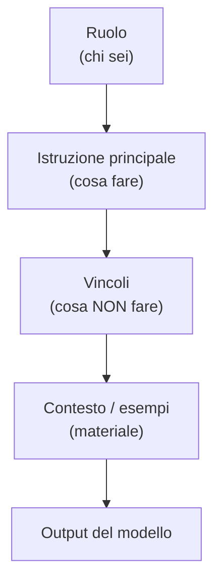

# Prompt engineering come disciplina

  In evoluzione
  Lezione 0.5
  ~13 min di lettura

Non è magia: il prompt engineering ha principi verificabili, è misurabile, e in produzione si versiona e testa come il codice. È il primo strumento pratico che usi con un LLM, e il prerequisito di metà delle lezioni che seguono.

Nella lezione 0.4 hai visto quando ha senso scegliere un LLM invece di qualcosa di più semplice. Una volta fatta quella scelta, la qualità di quello che il modello produce dipende in modo diretto da come costruisci il prompt.

"Prompt engineering" è un nome che inganna. Suona da guru, da rito sciamanico — trova le parole magiche e il modello farà miracoli. In realtà è una disciplina tecnica: ha principi, si misura, si itera. La differenza tra un prompt scritto bene e uno scritto male può essere la differenza tra un prodotto che funziona e uno che imbarazza l'azienda in produzione.

## Cosa sta succedendo sotto

Prima di entrare nelle tecniche, vale la pena chiarire il meccanismo. Nella lezione 0.1 hai visto che un LLM, dato un testo in ingresso, calcola una distribuzione di probabilità sul token successivo. Il prompt è tutto ciò che gli dai prima che lui inizi a generare: stabilisce il contesto, le aspettative, il formato, lo stile.

Il modello non "legge" il tuo prompt come lo leggerebbe un umano — non cerca l'intenzione dietro le parole. Usa il prompt per condizionare la distribuzione dei token successivi. Un prompt ambiguo produce token che possono andare in molte direzioni. Un prompt preciso restringe il ventaglio di opzioni plausibili verso quelle che vuoi.

Questa è l'implicazione pratica: **le istruzioni non si interpretano, si seguono letteralmente.** Se scrivi "rispondi in modo breve", il modello userà quella frase come segnale per produrre risposte più corte — ma "breve" è ambiguo. "Rispondi in massimo 50 parole" è inequivocabile. La specificità è una virtù.

## Zero-shot, one-shot, few-shot

La distinzione più fondamentale nel prompt engineering è quanti esempi includi nel prompt.

**Zero-shot**: dai solo l'istruzione, senza esempi. "Classifica il seguente testo come positivo, negativo o neutro." Funziona su modelli grandi e capaci, per task che il modello conosce bene. È il punto di partenza: se funziona, non c'è motivo di complicare.

**One-shot**: dai un esempio. "Classifica il testo come positivo, negativo o neutro. Esempio — *Questo prodotto è fantastico*: positivo. Ora classifica: *Non sono rimasto soddisfatto*." L'esempio calibra il formato atteso e riduce l'ambiguità su come rispondere.

**Few-shot**: dai più esempi, di solito tra 3 e 10. È la mossa quando lo zero-shot non è abbastanza preciso. Gli esempi mostrano non solo il formato ma anche i casi di confine — come gestire un testo ambiguo, cosa succede quando mancano informazioni.

La scelta non dipende dall'istinto: si prova zero-shot, si misura, e se non basta si aggiungono esempi. I few-shot example non si scelgono a caso: la loro qualità, il formato e la varietà dei casi coperti cambiano l'output in modo misurabile. Un esempio sbagliato fa danni — meglio zero esempi che un esempio fuorviante.

> **Nota** — Nei modelli di frontiera del 2026 (GPT-5.4/5.5, Claude Opus 4.7, Gemini 3.1) lo zero-shot copre ormai la maggior parte dei task non specializzati: il salto rispetto al 2024 è netto. Questo non elimina il few-shot: su task molto specializzati, con terminologia inusuale o format non standard, gli esempi fanno ancora la differenza. La regola pratica si è solo spostata: prova zero-shot prima, *aspettati* che basti più spesso di prima.

## Chain-of-thought: far ragionare ad alta voce

Per task che richiedono ragionamento — problemi con più passaggi, pianificazione, analisi — c'è una tecnica che fa una differenza sorprendente: il **chain-of-thought** (CoT), letteralmente "catena di pensieri".

L'idea è semplice: invece di chiedere solo il risultato, chiedi al modello di mostrare i passaggi del ragionamento prima della risposta finale. "Risolvi il problema passo per passo, poi dai la risposta." Funziona perché il modello genera i token in sequenza: se genera i passaggi intermedi prima della risposta, il contesto che ha costruito mentre scriveva quei passaggi lo aiuta a produrre una risposta finale migliore.

Il meccanismo può sembrare strano — "perché il modello funziona meglio se scrive i passaggi?" — ma è coerente con come genera testo. Ogni token prodotto entra nel contesto per generare il successivo. I passaggi intermedi di ragionamento *costruiscono* il contesto da cui emerge la risposta: non è che il modello "pensa di più", è che il testo che ha già generato lo informa su cosa generare dopo.

**Zero-shot CoT**: basta aggiungere "Pensa passo per passo" alla fine del prompt. Funziona su modelli capaci senza esempi aggiuntivi.

**Few-shot CoT**: mostri esempi di ragionamento completo — non solo input → risposta, ma input → ragionamento → risposta. Più potente, richiede più lavoro di preparazione degli esempi.

Quando non usarlo: su task dove il ragionamento intermedio non aggiunge niente (classificazione diretta, formattazione), o quando la latenza è un vincolo forte. I passaggi intermedi aumentano i token generati — e i token hanno un costo.

## Structured prompting: ruolo, istruzioni, vincoli, formato

I prompt in produzione raramente sono una riga. Un prompt strutturato ben fatto ha tipicamente quattro elementi.

**Ruolo** — "Sei un assistente specializzato in supporto clienti per software di contabilità." Il ruolo non è un trucco psicologico per il modello: è un modo efficace per restringere lo spazio delle risposte plausibili verso quelle di un esperto di dominio. I modelli hanno visto testi di "assistenti specializzati in X" e di "persone generiche" — il ruolo condiziona quale distribuzione di testi è più rilevante.

**Istruzione principale** — il task vero, descritto con precisione. Verbo specifico (classifica, riassumi, estrai, genera), vincoli di formato (bullet list, JSON, massimo N parole), criteri di qualità.

**Vincoli** — cosa *non* fare. "Non inventare informazioni non presenti nel testo." "Se la risposta non è nota, scrivi 'non so'." Spesso è la parte più importante: i modelli hanno un bias verso la generazione di testo plausibile, e un vincolo esplicito contrasta quel bias dove serve.

**Contesto ed esempi** — il materiale su cui lavorare, più eventuali esempi few-shot.

L'ordine conta. Mettere le istruzioni all'inizio del prompt, prima del materiale lungo, le fa "pesare" di più nell'attenzione del modello. Un'istruzione importante sepolta in fondo a un contesto di 10.000 token rischia di non essere rispettata — un fenomeno chiamato "lost in the middle" che la lezione 1.2 (context engineering) analizza in dettaglio.

## Prompt in produzione: versioning e testing

Qui sta la differenza tra fare prompt engineering da hobbyist e farlo da professionista.

**I prompt cambiano.** I modelli si aggiornano — spesso silenziosamente, senza che l'API lo annunci — e un prompt che funzionava ieri può comportarsi diversamente oggi. I requisiti di business cambiano. I dati su cui gira il sistema cambiano distribuzione. Un prompt non è un file di configurazione da toccare una volta sola: è un artefatto di sistema che va mantenuto.

**Versioning.** I prompt vanno in controllo di versione come il codice. Un cambio di una frase può far saltare l'intera pipeline; senza storia, non sai cosa hai cambiato e quando. Strumenti dedicati (LangSmith, PromptLayer) o anche un semplice file YAML in git fanno il lavoro. L'importante è la disciplina: nessun cambio al prompt senza un commit, nessun commit senza una descrizione del perché.

**Testing.** Come si misura se un prompt è migliorato? Serve un **golden dataset**: una raccolta di input con gli output attesi (o con criteri di valutazione). Quando cambi il prompt, lo passi sul dataset e confronti i risultati col baseline. Senza questo, "ho migliorato il prompt" è un'opinione, non un dato.

**A/B testing in produzione.** Per i sistemi a volume, si distribuisce il traffico tra due versioni del prompt e si misurano le metriche di qualità su dati reali. È lo stesso approccio dello split testing sul codice. L'argomento torna nella Parte 3 (valutazione): lì trovi i dettagli su come misurare la qualità degli output e costruire sistemi di valutazione automatica.

## I limiti: quando il prompt non basta

Il prompt engineering non è onnipotente. Ci sono scenari in cui non arriva dove serve.

**Conoscenza aggiornata o specifica al dominio.** Un LLM non sa cosa c'è nei tuoi documenti interni o su eventi post-training. Nessun prompt cambia questo. La soluzione è RAG (lezione 1.1): porti quei documenti nel contesto al momento della risposta.

**Stile e tono molto specifici.** Se hai bisogno che il modello risponda esattamente con una certa terminologia di settore e un formato fisso, i few-shot examples aiutano, ma il fine-tuning (lezione 0.3) può essere più efficace sulla stabilità a lungo termine.

**Comportamento garantito su tutti i casi.** Il prompt riduce la varianza ma non la elimina. Se hai bisogno di comportamento deterministico al 100%, il modello non è lo strumento giusto — o serve un livello di validazione programmatica sull'output.

**Task complessi su contesti molto lunghi.** Con context window grandi, le istruzioni all'inizio del prompt possono "svanire" per effetto del degrado di attenzione nel mezzo. È il problema che la lezione 1.2 affronta: a un certo punto, decidere cosa metti nel contesto è un lavoro a sé rispetto a come formuli le istruzioni.

## Cosa il prompt engineering non è

| Il pensiero sbagliato | Come stanno le cose |
|---|---|
| "Il prompt engineering è trovare le parole magiche" | È una disciplina tecnica con principi verificabili: si testa, si misura, si itera come il codice. |
| "Prompt lungo = prompt migliore" | Il segnale si diluisce nel rumore. Un prompt denso e preciso batte uno lungo e generico. |
| "I few-shot example si scelgono a caso" | La qualità, il formato e la varietà degli esempi cambiano l'output in modo misurabile. Un esempio sbagliato fa più danni di nessun esempio. |
| "Un prompt scritto bene una volta non si tocca più" | I modelli cambiano, i requisiti cambiano, i dati cambiano. Il prompt si versiona e si testa esattamente come il codice. |

---

## Verifica di comprensione

> Rispondi a memoria, senza rileggere. Le incerte rivedile domani. Le ultime due anticipano lezioni future.

1. Cosa cambia nel comportamento del modello quando aggiungi esempi few-shot a un prompt?
2. Perché il chain-of-thought migliora le performance su task di ragionamento?
3. Quali sono i quattro elementi di un prompt strutturato ben fatto?
4. Perché un prompt va messo in controllo di versione come il codice?
5. Il tuo LLM deve rispondere solo in base a documenti aziendali, senza inventare nulla. Come struttureresti il vincolo nel prompt?
6. *(anticipazione)* Il prompt non può portare al modello fatti aggiornati ogni giorno che stanno in un database esterno. Quale tecnica risolve questo?
7. *(anticipazione)* Come misureresti in modo sistematico se una nuova versione del prompt è migliore della precedente? Di quali artefatti avresti bisogno?

---

## Glossario

- **Prompt** — l'input testuale che dai al modello prima che generi la risposta; include istruzioni, contesto, vincoli ed eventuali esempi.
- **Prompt engineering** — la disciplina di progettare e ottimizzare i prompt per ottenere output di qualità da un LLM.
- **Zero-shot** — prompt senza esempi; si chiede il task direttamente, senza mostrare come si fa.
- **One-shot / few-shot** — prompt con uno o più esempi input-output che mostrano il comportamento atteso.
- **Chain-of-thought (CoT)** — tecnica che chiede al modello di esplicitare i passaggi di ragionamento prima della risposta finale; migliora i task multi-step.
- **System prompt** — istruzioni fisse che configurano il comportamento del modello per tutta la conversazione; separato dal messaggio dell'utente nella maggior parte delle API.
- **Prompt versioning** — mantenere la storia dei cambiamenti ai prompt in un sistema di controllo versione, come si farebbe con il codice.
- **Golden dataset** — un insieme di input con output attesi, usato per valutare in modo ripetibile la qualità di un prompt.
- **A/B testing dei prompt** — distribuzione del traffico tra due versioni di un prompt per misurare quale performa meglio su dati reali.
- **Lost in the middle** — fenomeno per cui le informazioni nel mezzo di un contesto molto lungo vengono "perse" dall'attenzione del modello; le istruzioni critiche vanno all'inizio.

---

## Per approfondire

- **"Chain-of-Thought Prompting Elicits Reasoning in Large Language Models"** — il paper che ha formalizzato il CoT; cercalo su Google Scholar o arXiv con questo titolo.
- **Anthropic Prompt Engineering Guide** e **OpenAI Prompt Engineering Guide** — documentazione ufficiale dei provider con best practice verificate; cerca "prompt engineering guide" sui rispettivi siti ufficiali.
- **LangSmith, PromptLayer** — strumenti per il versioning e il testing dei prompt; la loro documentazione mostra come si struttura un ciclo di valutazione in pratica.

*Risorse indicate per la ricerca; per i link aggiornati conviene cercarli al momento.*

---

## Prossima lezione

**1.1 RAG — Retrieval-Augmented Generation.** Hai ora i fondamenti completi: come funziona un LLM, come il significato diventa numeri, cosa il fine-tuning sposta, quando usare un LLM, e come parlargli. Il passo successivo è costruire il sistema più frequente in assoluto nei sistemi AI aziendali: RAG, il meccanismo che porta fatti freschi e specifici dentro la risposta di un LLM.
