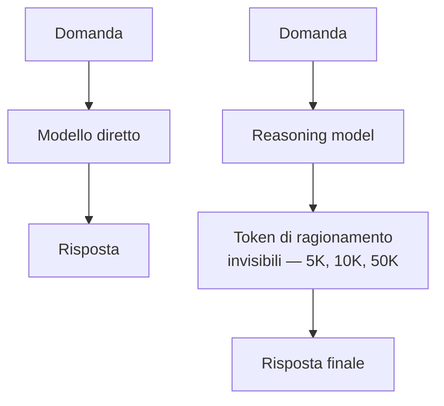
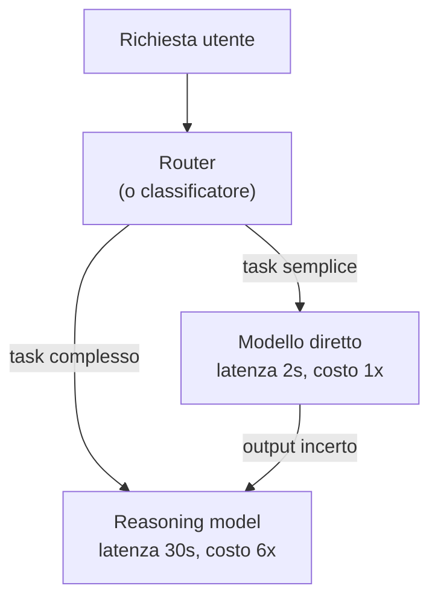

# Reasoning models — quando il pensiero costa, e quando vale

  In evoluzione
  Lezione 0.6
  ~13 min di lettura

Dal 2024 in poi è apparsa una nuova classe di modelli che, prima di rispondere, "pensa" — produce ragionamenti interni che non vedi, paghi, e che alzano molto la qualità su matematica, codice e pianificazione. Sono diventati lo standard sui task difficili. Sapere quando usarli, e quando sono solo soldi buttati, è una delle decisioni più frequenti del 2026.

Nella lezione 0.1 abbiamo descritto un LLM come una macchina che genera token, uno alla volta, a probabilità. Per anni è stato così: dai una domanda, parte la generazione, esce la risposta. Poi nel settembre 2024 OpenAI ha presentato **o1**, un modello che sembrava più lento e più costoso degli altri, ma che su problemi matematici e di codice **schiantava** la concorrenza. Da lì in poi tutti i grandi laboratori hanno tirato fuori la loro versione — Claude con *extended thinking*, Gemini con *reasoning budget*, DeepSeek con R1 — e oggi, maggio 2026, un sistema serio sceglie tra modelli "diretti" e **reasoning models** quasi a ogni endpoint.

La cosa interessante è che sotto il cofano la macchina è sempre la stessa: token che si srotolano. La novità sta in *cosa* viene generato prima di rispondere.

## L'idea: separare il pensare dal dire

Quando tu risolvi un problema difficile a mente, fai due cose distinte: prima **ragioni** — bozze, tentativi, ripensamenti — poi **scrivi** la risposta pulita. Lo stesso vale per un programmatore davanti a un bug: cinque minuti di "vediamo, se questo è null, allora... no aspetta..." e poi tre righe di codice. La parte sporca conta più di quella pulita, ma di solito non la vede nessuno.

I reasoning models fanno esattamente questo. Davanti a un problema, prima di scriverti la risposta finale producono una **catena di pensiero interna** — *chain-of-thought*, abbreviato CoT — fatta di token che ragionano, controllano, tornano indietro, riprovano. Questi token sono invisibili nell'output normale (alcuni provider mostrano un riassunto, altri solo un conteggio), ma esistono, occupano la finestra di contesto, e li paghi.

L'analogia onesta è quella dello **studente alla lavagna**. Il modello diretto è lo studente brillante che ti spara la risposta a memoria — veloce, spesso giusto, ma quando il problema è davvero ostico inciampa con sicurezza. Il reasoning model è lo studente più lento che riempie la lavagna di passaggi — impiega cinque volte tanto, costa cinque volte tanto, ma sul problema duro arriva dove l'altro si schianta. Su 2 + 2 sono indistinguibili. Su un integrale, no.

## Cosa cambia rispetto al chain-of-thought via prompt

Qui c'è una confusione classica che vale la pena chiarire subito. Nella lezione 0.5 hai visto il **chain-of-thought come tecnica di prompting**: scrivi "ragiona passo per passo" nel prompt e il modello, prima di rispondere, espone i passaggi. Ti chiederai: ma allora i reasoning models cos'hanno di diverso? Non è la stessa cosa fatta meglio?

No, è una cosa diversa per tre motivi che pesano.

**Primo: il CoT via prompt è un suggerimento, il reasoning è una capacità addestrata.** Quando scrivi "think step by step" su un modello normale, gli stai chiedendo di *imitare* il pattern di ragionamento che ha visto nei dati di training. Un reasoning model è stato **specificamente addestrato con reinforcement learning** a ragionare bene — riceve premi quando arriva alla risposta corretta dopo aver esplorato e corretto la rotta, non solo quando la spara giusta al primo colpo. Il risultato è qualitativamente diverso: il modello impara a *dubitare di sé stesso*, a verificare, a tornare indietro. Un modello normale a cui chiedi CoT raramente fa marcia indietro su un passaggio già scritto; un reasoning model lo fa di routine.

**Secondo: il ragionamento è strutturalmente nascosto.** Nel CoT via prompt i passaggi finiscono nella risposta — il cliente li vede, occupano i token di output che gli mostri. Nei reasoning models i passaggi vivono in un canale separato: paghi per generarli, ma non li mandi all'utente. L'API ti restituisce una risposta pulita più, di solito, un conteggio dei "reasoning tokens" consumati. Questo cambia *cosa* puoi mostrare al cliente.

**Terzo: la scala è completamente diversa.** Un CoT classico produce 200-500 token di ragionamento. Un reasoning model può produrne 5.000, 20.000, perfino 100.000 prima di darti la risposta finale. Non è "qualche frase in più di pensiero": è una sessione di lavoro vera e propria.

> **Curiosità** — Alla presentazione di o1, OpenAI ha mostrato che il modello, su problemi di matematica olimpica, generava traiettorie di ragionamento lunghissime con falsi tentativi e correzioni di rotta. Niente di magico: era stato addestrato a essere premiato per arrivare alla risposta giusta in fondo, indipendentemente da quanti vicoli ciechi avesse esplorato per strada.

## Il prezzo: latenza × 5-20, costo × 3-10

I numeri reali del 2026, mediati sui provider principali per task non-banali:

- **Latenza:** un modello diretto risponde in 1-3 secondi. Un reasoning model in 10-60 secondi su task medi, fino a diversi **minuti** sui task difficili. Non è un dettaglio: cambia totalmente il tipo di interfaccia che ci puoi costruire sopra.
- **Costo:** i reasoning tokens si pagano come gli output tokens — spesso anzi sono tariffati allo stesso prezzo dei più costosi. Una query che ne consuma 20.000 costa molto più di una risposta normale da 500 token. A fattore moltiplicativo: 3-10× il costo di una chiamata equivalente al modello diretto.
- **Throughput per chiamata:** una singola query occupa il modello per molto più tempo. Se hai vincoli di richieste/secondo, il reasoning model li satura prima.

Il **reasoning budget** è il parametro che governa tutto questo. La maggior parte dei provider ti lascia regolare *quanto* il modello può pensare — "low / medium / high", o un cap esplicito di reasoning tokens. Alzi il budget, alzi la qualità sui task difficili, alzi il costo proporzionalmente. Abbassi il budget, il modello pensa meno, su problemi facili va liscio e ti risparmi, su problemi difficili degrada verso il modello diretto.

Aggancio diretto al **triangolo qualità-latenza-costo** della lezione 5.3: i reasoning models spostano in modo brutale tutti e tre i vertici. Su task adatti compri qualità con latenza e costo. Su task non adatti compri solo latenza e costo, senza qualità in cambio — il peggior affare possibile.

## Quando vale (e quando butti soldi)

La regola di base è semplice: **i reasoning models guadagnano dove c'è un problema che si può sbagliare *concretamente* e ricontrollare *concretamente***. Dove il task ha una struttura verificabile, il pensiero in più paga. Dove il task è soft, no.

### Casi dove valgono (e di parecchio)

**Matematica e logica.** Il caso d'uso da manifesto. Un reasoning model risolve problemi di olimpiadi matematiche dove un modello diretto sbaglia il secondo passaggio e tira dritto con sicurezza. La differenza non è del 10%, è del 50% in più di accuratezza su questi benchmark.

**Codice complesso.** Non l'autocomplete di una funzione di 5 righe — quella la fa benissimo il modello diretto e in un quinto del tempo. Parliamo di: refactoring multi-file, debugging di problemi non banali, planning di un'implementazione che tocca pezzi diversi del sistema. Un reasoning model davanti a un bug oscuro esplora ipotesi, le scarta, ne prova altre — esattamente come fa un sviluppatore senior, solo a velocità di token.

**Planning multi-step.** Pianificare la risoluzione di un task in 10-20 sotto-passi, scegliere quali tool chiamare e in che ordine, anticipare cosa fare se un passo fallisce. Nei sistemi agentici della lezione 1.5, mettere un reasoning model come *planner* a inizio loop e un modello diretto come *esecutore* dei singoli passi è il pattern che sta diventando standard nel 2026.

**Analisi di documenti tecnici densi.** Confronto di contratti, analisi di policy, estrazione di vincoli da un capitolato. Qui il valore non è nella lunghezza dell'output ma nella *qualità del ragionamento sui vincoli incrociati*. Un modello diretto tende a perdere costraint sparsi; un reasoning model li tiene insieme.

**Task con verifica deterministica.** Generazione di SQL che deve girare, JSON che deve validare uno schema, configurazioni che devono superare un check. Quando esiste una funzione binaria che dice "questo output è valido sì/no", il reasoning model può iterare internamente sulla sua bozza prima di sputarla fuori — è dove brilla di più.

### Casi dove sono solo soldi buttati

**Chat conversazionale generica.** "Come stai", "spiegami in due righe cos'è X", "dimmi una battuta". Risposta veloce, sostanza modesta. Mettici un reasoning model e ottieni la stessa risposta dopo 30 secondi e a 5 volte il costo.

**Riassunti e parafrasi.** Il task è lineare: leggi, comprimi, scrivi. Non c'è quasi mai un "ricontrollo" che migliori il risultato. Modello diretto, sempre.

**Classificazione e routing.** "Questa richiesta utente è di tipo A, B o C?" — un modello piccolo diretto, magari un classificatore tradizionale (vedi lezione 0.4), batte qualsiasi reasoning model per latenza, costo e accuratezza pratica. Usare un reasoning model qui è una caricatura.

**Estrazione strutturata semplice.** "Da questa email tira fuori nome, data, importo." Function calling su un modello diretto (lezione 1.4) è la risposta. Il reasoning model non aggiunge segnale.

**Generazione creativa libera.** Scrivere un racconto, una poesia, un nome di prodotto. Non c'è "la risposta giusta" da verificare — il reasoning interno non ha contro cosa rimbalzare. A volte i reasoning models su task creativi vengono perfino *peggio*, perché iper-correggono verso risposte conservative.

**Quasi tutto ciò che è "user-facing in tempo reale".** Se l'utente sta aspettando una risposta in chat, 30 secondi sono un'eternità. A meno che tu non comunichi in modo esplicito "sto pensando, ci metto un po'" (cosa che alcuni assistenti fanno deliberatamente), il reasoning model rovina l'esperienza.

## L'architettura giusta: cascade e router

Nessun sistema serio nel 2026 usa *solo* reasoning models o *solo* modelli diretti. La risposta architetturale standard è un **cascade**: un modello piccolo o diretto prova per primo, e si **promuove** la richiesta a un reasoning model solo se serve davvero.

Due varianti del pattern:

**Router upfront.** Un piccolo modello di classificazione (o anche regole/heuristiche) decide *a priori* dove mandare la richiesta. Veloce, economico, ma fa errori — può mandare al reasoning model un task che il diretto avrebbe gestito, o viceversa.

**Escalation reattiva.** Il modello diretto prova, e se la sua risposta non passa un check di qualità (validazione strutturale, score di un giudice, signal di self-doubt come "non sono sicuro"), si rilancia la query sul reasoning model. Più costoso del router puro perché paghi due chiamate sulle escalation, ma più accurato. Il pattern domina in produzione 2026 per i sistemi con SLA di qualità seri.

Approfondito in 5.6 (caching e routing), ma il principio sta qui: **non scegli un modello, scegli una strategia di modelli.**

## Sotto il cofano: il reinforcement learning sui ragionamenti

Cosa cambia davvero, in addestramento, per produrre un reasoning model? Non lo vediamo in profondità — fuori scope della guida — ma il principio merita una riga onesta.

In sintesi: si prende un modello base (un LLM normale), gli si fanno generare lunghe catene di ragionamento su problemi con risposta verificabile (matematica, codice che gira, problemi con soluzione nota), e si **premiano** le catene che arrivano alla risposta giusta — *indipendentemente da come ci sono arrivate*. Catene piene di tentativi falliti e correzioni che però chiudono giusto vengono premiate. Catene lineari "perfette" ma che sbagliano la risposta, no.

Il metodo si chiama, a grandi linee, **reinforcement learning con reward verificabili**: RLHF (la tecnica con cui sono allineati gli LLM normali) usa giudici umani, qui invece il giudice è automatico — un programma che esegue il codice, un solver che verifica l'equazione. Senza umani nel loop si scala molto meglio: si possono generare e valutare milioni di traiettorie di ragionamento.

L'effetto netto sul modello: impara che "fermarsi e ripensarci" è una mossa redditizia, non una debolezza. Per questo lo vedi tornare indietro, contraddirsi, riprovare strade diverse. Non è teatro — è il comportamento per cui è stato premiato.

Cosa portare a casa: la qualità in più dei reasoning models **non è scalata con più parametri** (sono spesso modelli della stessa famiglia dei diretti, magari un po' più piccoli). È scalata con **più compute a runtime** — il famoso "test-time compute". È un modo diverso di spendere i FLOPs: meno in training, più in inferenza.

## Una nota sui prompt

I reasoning models vanno proddati diversamente dai modelli diretti, e questo è il dettaglio operativo che chi li usa per la prima volta sbaglia di più.

**Niente "think step by step".** È una redundanza inutile su un modello che è stato addestrato a pensare in modo strutturato. Anzi, può perfino confondere il suo ragionamento interno con quello richiesto. Dai il problema e basta.

**Niente few-shot esempi di ragionamento.** Idem — interferiscono con la traiettoria che il modello vorrebbe seguire da solo.

**Prompt più corti e diretti.** Spiega cosa vuoi, dai i vincoli, fermati. Il modello si occupa lui di decomporre, esplorare, controllare.

**Output finale: chiedi il formato che ti serve.** Se vuoi JSON, dillo. Se vuoi solo la risposta numerica, dillo. Il modello tiene il ragionamento per sé e ti restituisce la forma che gli chiedi.

I provider stanno pubblicando guide al prompting specifiche per i loro reasoning models (OpenAI per la famiglia o/GPT-5 thinking, Anthropic per Claude extended thinking): se ne usi uno seriamente in produzione, vale 10 minuti leggere quella ufficiale.

## Cosa NON sono i reasoning models

| Il pensiero sbagliato | Come stanno le cose |
|---|---|
| "Sono più intelligenti dei modelli normali" | Non in senso generale. Sono **specializzati nel ragionare meglio** su task verificabili. Su scrittura creativa o conversazione fluida un modello diretto può batterli. |
| "Eliminano le allucinazioni" | No. Riducono certi tipi di errore (matematica sbagliata, codice che non gira) ma su fatti del mondo possono comunque inventare con sicurezza. Vedi lezione 3.4. |
| "Sostituiscono i modelli diretti" | No, li **affiancano**. L'architettura giusta usa entrambi: cascade o router. |
| "Il ragionamento visibile è il ragionamento vero" | Quando un provider ti mostra un riassunto del ragionamento, è una *sintesi a posteriori*, non i token interni reali. Non fare debugging sui riassunti. |
| "Più reasoning budget = sempre meglio" | No, c'è un punto di rendimenti decrescenti. Su task semplici, alzare il budget non cambia nulla; su task difficili, dopo una certa soglia la qualità si flat. |

> **Il punto da tenere stretto** — Un reasoning model è un modo diverso di **spendere compute**: lo prendi dall'inferenza, non dal training. Più test-time compute = più qualità sui task adatti. Il "pensiero" non è metafora vuota — sono token reali, generati realmente, che paghi realmente. La domanda da farsi davanti a ogni endpoint del tuo sistema è: *questo task vale il pensiero in più?*

## Cosa dura, cosa evitare

Stabile **Il principio**: separare il pensare dal dire, scalare il compute a runtime, usare cascade. Questa idea regge per anni — è la direzione architetturale del settore, non un trend.

In evoluzione **I nomi dei modelli e i prezzi.** I modelli del 2026 non saranno quelli del 2027: cambieranno generazioni, prezzi, finestre di contesto. Non scrivere logica di sistema che dipende dal nome di un modello specifico — astraila dietro un router/gateway.

In evoluzione **Il prompting "giusto" per ogni reasoning model.** Ogni provider sta ancora calibrando le sue best practice. Quella di oggi non è quella di tra sei mesi. Tieni i prompt versionati (lezione 0.5) e ri-testali quando esce una nuova versione del modello.

A rischio **L'idea che il ragionamento "interno" resti opaco per sempre.** È un punto di tensione attivo nel settore: regulator e clienti enterprise spingono per trasparenza, alcuni provider stanno aprendo i chain-of-thought. Cosa è confidenziale e cosa no sui reasoning tokens è ancora in movimento.

---

## Verifica di comprensione

> Rispondi a memoria, senza rileggere — è lo sforzo di recuperare che fissa le cose. Le risposte incerte rivedile **domani**.

1. Qual è la differenza vera tra chain-of-thought via prompt e un reasoning model addestrato?
2. Cosa sono i "reasoning tokens" e perché contano sul conto?
3. Indica due casi d'uso dove un reasoning model vale il costo e due dove è solo soldi buttati.
4. Cos'è un cascade (o router) tra modelli, e perché è il pattern standard nei sistemi seri?
5. Perché scrivere "pensa passo per passo" in un prompt per reasoning model può essere controproducente?
6. *(anticipazione)* Hai un sistema di customer service con risposte in chat: che strategia di modelli adotti, e perché?
7. *(anticipazione)* Un agente che fa planning multi-step su 10 tool: dove ha senso mettere il reasoning model dentro l'architettura agentica?

---

## Glossario

- **Reasoning model** — classe di LLM che, prima di rispondere, genera una catena interna di token di ragionamento; addestrato con reinforcement learning per ragionare bene sui task verificabili.
- **Modello diretto** — un LLM "classico" che genera la risposta in un colpo, senza fase di ragionamento interno esplicito.
- **Chain-of-thought (CoT)** — generazione di passaggi di ragionamento prima della risposta. Può essere indotta via prompt su modelli diretti, o **addestrata strutturalmente** nei reasoning models.
- **Reasoning tokens** — i token interni di ragionamento prodotti dal modello e fatturati come output, tipicamente non mostrati all'utente.
- **Reasoning budget** — parametro che regola quanti reasoning tokens il modello può produrre prima della risposta finale.
- **Test-time compute** — compute speso al momento dell'inferenza (anziché in training) per alzare la qualità della risposta. È la risorsa principale che i reasoning models scalano.
- **Cascade / model routing** — pattern architetturale che usa modelli diversi (piccoli/diretti per task semplici, grandi/reasoning per task difficili) e li seleziona via classificatore o escalation.
- **RL con reward verificabili** — il metodo di addestramento che premia il modello quando arriva alla risposta corretta su problemi con verifica automatica (codice che gira, equazioni risolte, ecc.).

---

## Per approfondire

- **Annunci ufficiali dei provider** (OpenAI per o-series e GPT-5 thinking, Anthropic per Claude extended thinking, Google per Gemini reasoning): la fonte primaria per le linee guida di prompting specifiche per ciascun modello.
- **"Learning to reason with LLMs"** — pagina di OpenAI sul lancio di o1: il documento che ha aperto la categoria.
- **Paper DeepSeek-R1** — uno dei reasoning models open di prima generazione; il paper è inusualmente leggibile e mostra il metodo RL con reward verificabili in chiaro.
- **Benchmark di riferimento per il ragionamento**: AIME (matematica), GPQA (scienze livello PhD), SWE-bench (engineering reale), Codeforces. Sono i contesti dove i reasoning models hanno aperto il distacco dai diretti.

*Risorse indicate per la ricerca; cerca i link ufficiali al momento perché i nomi dei modelli cambiano in fretta.*

---

## Prossima lezione

Con questo si chiude la Parte 0. Hai i mattoni: come funziona un LLM, come ragiona in token e probabilità, come trasforma il significato in vettori, cosa sa fare il fine-tuning (e cosa no), quando l'AI non è la risposta giusta, come si proddano i modelli diretti e quelli che pensano. Da qui si entra nella **Parte 1**: dalle fondamenta alle scelte di costruzione, partendo dal pattern di gran lunga più diffuso in produzione — **1.1 RAG**.
