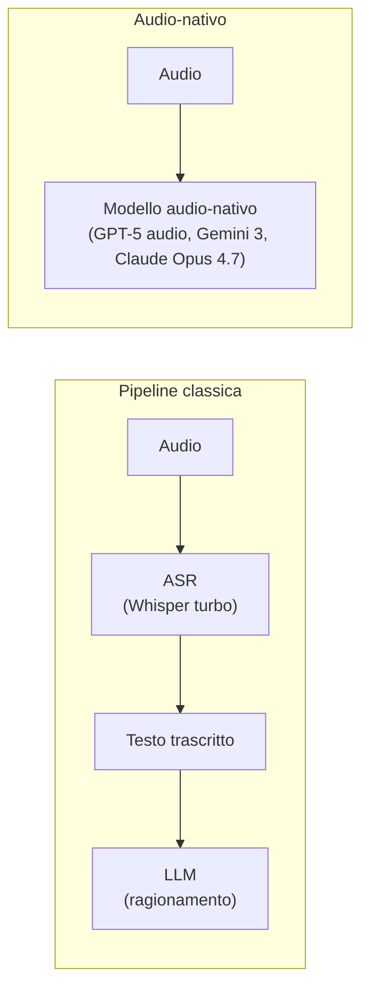

# Audio e speech

  Stabile
  Lezione 2.4
  ~9 min di lettura

Trascrivere il parlato è risolto bene da anni. Il salto è il modello che capisce non solo le parole ma il tono, le pause, l'intenzione — senza passare per la trascrizione. Quando basta Whisper e quando serve il multimodale audio-nativo è la domanda centrale di questa lezione.

L'audio è la modalità più vecchia nell'AI applicativa — i sistemi di riconoscimento vocale esistono da decenni. Ma l'arrivo dei transformer ha cambiato tutto in velocità: prima la qualità della trascrizione era mediocre; ora con modelli come Whisper la trascrizione è paragonabile o superiore a un umano su audio di qualità ragionevole. E i modelli audio-nativi, che ragionano sull'audio senza trascriverlo prima, aprono possibilità completamente nuove.

## ASR: dalla voce al testo

**ASR — Automatic Speech Recognition** — è la trascrizione del parlato in testo. Il modello di riferimento open-source è **Whisper** di OpenAI: addestrato su 680.000 ore di audio multilingue, produce trascrizioni di alta qualità in decine di lingue, con punteggiatura e speaker identification di base. La variante più usata nel 2026 è **whisper-large-v3-turbo** (rilasciato fine 2024 e diventato lo standard di fatto): solo 4 decoder layer invece di 32, ~6x più veloce di large-v3 con perdita di qualità minima — sweet spot per real-time e batch a basso costo.

Come funziona ad alto livello: l'audio viene convertito in uno spettrogramma — una rappresentazione visiva delle frequenze nel tempo — che viene poi processato da un encoder (simile al ViT per le immagini). L'encoder trasforma lo spettrogramma in una sequenza di vettori, che un decoder trasforma in testo.

Il risultato pratico: per la maggior parte degli use case di trascrizione — meeting, customer support, note vocali, sottotitoli — ASR dedicato come Whisper è la scelta migliore. È veloce, economico, altamente accurato, e i modelli on-premise permettono di non inviare audio sensibile a servizi esterni.

**I limiti dell'ASR classico:**
- Perde l'intonazione: la stessa frase detta con sarcasmo o entusiasmo produce lo stesso testo.
- Non distingue il significato implicito: "certo, bellissimo" con tono ironico → trascritto come "certo, bellissimo".
- Struggle su audio di bassa qualità, forti accenti regionali, parlato sovrapposto.
- Non può rispondere a domande sull'audio: produce testo, non comprensione.

## TTS: dal testo alla voce

**TTS — Text-to-Speech** — è la direzione inversa: sintetizzare audio a partire dal testo. La qualità è migliorata enormemente: i moderni sistemi TTS producono voci sintetiche difficilmente distinguibili da quelle umane, con intonazione naturale, ritmo e pause.

I casi d'uso tipici: accessibilità (lettura di contenuti per non vedenti), assistenti vocali, generazione di audio per video e podcast, interfacce voice-first.

La **voice cloning** — clonare la voce di una persona da pochi secondi di campione audio — è tecnicamente accessibile con modelli open-source. Apre possibilità di personalizzazione (es. un assistente che parla con la tua voce) ma anche rischi significativi (deepfake audio, frodi). Le implicazioni di sicurezza sono trattate nella lezione 4.3.

In evoluzione La qualità del TTS ha raggiunto un livello dove il problema non è più la qualità della voce ma l'espressività — variare tono, emozione, ritmo su richiesta. ElevenLabs, le voci realtime di OpenAI (sulla generazione GPT-5) e i modelli voce di Gemini 3 spingono in questa direzione.

## Modelli audio-nativi: ragionare sull'audio

Il salto qualitativo avviene con i **modelli audio-nativi** — modelli che ricevono l'audio grezzo come input (non la trascrizione) e ragionano su di esso direttamente.

GPT-5 in modalità audio (la famiglia `gpt-*-transcribe` e i modelli realtime di OpenAI sulla generazione 5), Gemini 3 con audio nativo, e i modelli voce di ElevenLabs sono esempi: l'audio entra come sequenza di token audio, viene processato dal transformer insieme al testo del prompt, e il modello risponde — in testo o audio.

Il vantaggio critico: il modello ha accesso all'intonazione, alle pause, al ritmo, all'emozione. Una frase pronunciata con frustrazione suona diversamente da una pronunciata con entusiasmo, e il modello audio-nativo può farne uso. Questo non è disponibile in nessuna pipeline ASR → testo → LLM, perché la trascrizione butta via quella informazione.

Casi d'uso dove conta:
- **Customer service vocale**: capire se il cliente è frustrato, non solo cosa dice
- **Coaching e feedback**: analizzare come qualcosa è detto, non solo cosa
- **Accessibilità avanzata**: comprendere il parlato di persone con difficoltà di articolazione
- **Traduzione con preservazione del tono**: non solo tradurre le parole, ma mantenere l'emozione

**Il costo di questa capacità:** i modelli audio-nativi sono significativamente più costosi dei modelli ASR dedicati. Whisper turbo on-premise è frazioni di centesimo al minuto. La modalità audio dei modelli di frontiera (GPT-5, Gemini 3) è ordini di grandezza più cara. La scelta tra i due è quasi sempre economica, non qualitativa.

## Speaker diarization

**Speaker diarization** — "chi parla quando?" — è il problema di separare e identificare speaker diversi in una registrazione audio. In una riunione di 5 persone, la trascrizione senza diarization è un flusso di testo; con diarization ogni frase è attribuita al parlante.

I modelli specializzati di diarization (pyannote, Whisper + diarization post-processing) funzionano bene su audio di qualità media con speaker ben separati. Il problema diventa difficile con parlato sovrapposto, ambienti rumorosi, o speaker molto simili in voce.

La maggior parte dei servizi ASR cloud (AWS Transcribe, Google Speech-to-Text, Azure Speech) offrono diarization integrata.

## Il confronto che conta: pipeline vs audio-nativo

| | Pipeline ASR + LLM | Modello audio-nativo |
|---|---|---|
| **Costo** | Basso | Alto |
| **Latenza** | Medio (2 step) | Basso (1 step) |
| **Comprensione del tono** | No (persa nella trascrizione) | Sì |
| **Qualità trascrizione** | Alta (Whisper è ottimo) | Comparabile |
| **Controllo e debugging** | Alto (vedi il testo intermedio) | Basso (black box) |
| **On-premise possibile** | Sì (Whisper open-source) | No (solo API) |

La regola pratica: **inizia con la pipeline ASR + LLM** (Whisper turbo + un modello testo qualunque della generazione 2026). È economica, controllabile, i modelli ASR sono maturi. Migra al modello audio-nativo solo se hai evidenza che il tono/emozione conta per il tuo use case — e sei pronto a pagare il costo.

## Cosa NON è

| Il pensiero sbagliato | Come stanno le cose |
|---|---|
| "ASR risolto = audio AI risolto" | ASR trascrive; non capisce il tono, l'emozione, il contesto dell'audio. Sono capacità diverse. |
| "Il modello audio-nativo è sempre meglio" | Molto più costoso. Per trascrizione pura, Whisper batte il rapporto qualità/prezzo dei modelli nativi. |
| "La voice cloning è solo per casi estremi" | È tecnicamente accessibile con modelli open-source. Le implicazioni di sicurezza e i rischi di deepfake audio sono reali e vanno considerati. |
| "Diarization è inclusa in ogni sistema ASR" | No: spesso è un passaggio separato o un'opzione a pagamento. |

---

## Verifica di comprensione

> Rispondi a memoria. Le incerte rivedile domani.

1. Cos'è l'ASR e perché Whisper è il modello di riferimento?
2. Qual è il limite strutturale di una pipeline ASR → LLM rispetto a un modello audio-nativo?
3. Nomina due casi d'uso dove il modello audio-nativo vale il costo aggiuntivo.
4. Cos'è la speaker diarization e in quale scenario è critica?
5. Un'azienda vuole trascrivere 10.000 ore di call center al mese e fare analisi del sentiment. Quale architettura scegli?

---

## Glossario

- **ASR (Automatic Speech Recognition)** — trascrizione automatica del parlato in testo.
- **TTS (Text-to-Speech)** — sintesi automatica di audio parlato a partire da testo.
- **Whisper** — modello ASR open-source di OpenAI, addestrato su 680k ore di audio multilingue; punto di riferimento per la trascrizione. La variante **large-v3-turbo** è lo standard di fatto nel 2026 (4 decoder layer, ~6x più veloce di large-v3 a parità di qualità sostanziale).
- **Spettrogramma** — rappresentazione visiva delle frequenze audio nel tempo; l'input tipico degli encoder audio.
- **Modello audio-nativo** — modello che riceve e ragiona sull'audio grezzo senza passare per la trascrizione.
- **Speaker diarization** — identificazione e separazione dei diversi parlanti in una registrazione audio.
- **Voice cloning** — tecnica che sintetizza la voce di una persona a partire da un campione audio breve.

---

## Per approfondire

- **Whisper di OpenAI** — modello open-source per ASR; la documentazione e il codice sono su GitHub.
- **pyannote.audio** — libreria open-source per speaker diarization; cerca su GitHub.
- **"Speak, Read and Prompt: High-Fidelity Text-to-Speech with Minimal Supervision"** — uno degli approcci moderni al TTS ad alta qualità; cerca il titolo su arXiv.

*Risorse indicate per la ricerca; per i link aggiornati conviene cercarli al momento.*

---

## Prossima lezione

**2.4 Generazione di immagini.** Il multimodale non è solo comprensione: è anche creazione. I diffusion model, l'idea di partire dal rumore e denoising progressivo, e i casi d'uso — e i limiti — della text-to-image generation.
