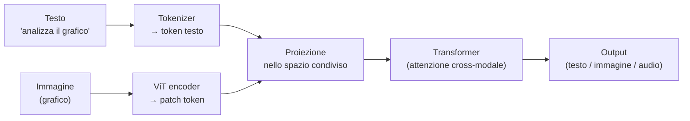

# Come funziona il multimodale

  Stabile
  Lezione 2.1
  ~12 min di lettura

Testo, immagini e audio finiscono tutti nello stesso spazio vettoriale — e da lì un transformer può ragionare su tutto insieme. Capire questo meccanismo spiega perché un modello può rispondere a "descrivi cosa non va in questo grafico" senza che tu gli abbia mai insegnato a leggere grafici.

Nella lezione 0.2 hai visto che gli embedding sono vettori che catturano il significato — e che testi simili producono vettori vicini nello spazio. L'idea centrale del multimodale è la stessa, allargata: **non solo il testo può diventare un vettore**. Anche le immagini, l'audio, i video possono essere rappresentati come vettori nello stesso spazio. E quando tutto abita lo stesso spazio, un modello può ragionare su tutto insieme.

## Il problema che risolve

Fino a qualche anno fa, ogni modalità aveva il suo modello dedicato: un sistema per il testo, un altro per le immagini (OCR + classificazione), un altro per l'audio (ASR — Automatic Speech Recognition, cioè la trascrizione del parlato). Queste pipeline separate hanno un limite strutturale: ogni step perde informazioni.

Trascrivere l'audio in testo e poi passarlo a un LLM perde il *tono* del parlante. Estrarre il testo da un'immagine con OCR e poi passarlo a un LLM perde il *contesto visivo* — dove sta il testo, che grafico lo circonda, che layout ha la pagina. Per molti task, questa perdita non conta. Per altri — ragionamento su documenti complessi, supporto clienti vocale con comprensione emotiva, analisi di dati visivi — conta moltissimo.

Il multimodale nativo risolve questo: un solo modello che ragiona su tutte le modalità *insieme*, senza step intermedi che degradano il segnale.

## Come ci arriva: encoder, proiezione, reasoning

Il principio meccanico è in tre passi.

**Passo 1 — Encoding per modalità.** Ogni modalità ha il suo "traduttore" in vettori. Il testo usa il tokenizer già visto in 0.1. Le immagini usano un **ViT — Vision Transformer**, che spezza l'immagine in patch regolari (tipicamente 16×16 pixel) e tratta ogni patch come un "token visivo": la stessa struttura del transformer testuale, ma applicata a pezzi di immagine. L'audio usa encoder simili, che operano sullo spettrogramma — la rappresentazione visiva delle frequenze nel tempo.

Sotto il cofano: ViT e le patch di immagine

Un ViT taglia l'immagine in una griglia di patch regolari. Ogni patch viene proiettata in un vettore di dimensione fissa (il "token visivo"), e questi token vengono passati a un transformer esattamente come i token testuali. Il transformer non "vede" l'immagine intera: vede una sequenza di vettori, ciascuno corrispondente a un rettangolo dell'immagine.

L'idea chiave: il transformer è agnostico rispetto alla sorgente dei token. Se gli dai token testuali o token visivi o una combinazione di entrambi, ragiona su tutti nello stesso modo con il meccanismo di attenzione. Questa uniformità è ciò che rende possibile il multimodale nativo.

Un'immagine 224×224 pixel con patch 16×16 produce (224/16)² = 196 token visivi. Un'immagine 1024×1024 ne produrrebbe migliaia — ecco perché i modelli multimodali hanno un costo token per immagine, che sale con la risoluzione.

**Passo 2 — Proiezione nello spazio condiviso.** Gli encoder di modalità diverse producono vettori in spazi propri. Per farli "dialogare", servono delle proiezioni lineari — strati di trasformazione che portano i vettori di ciascuna modalità in uno spazio condiviso. È qui che avviene la magia: dopo la proiezione, un vettore che rappresenta "un cane sul divano" (testo) e un vettore che rappresenta una foto di un cane sul divano abitano zone vicine dello stesso spazio.

Questo allineamento non è automatico: i modelli vengono addestrati su coppie (testo, immagine) in modo che i vettori corrispondenti convergano — un processo chiamato **contrastive training**. **CLIP — Contrastive Language-Image Pre-Training** — di OpenAI è il modello che ha reso popolare questo approccio e che sta alla base della maggior parte dei modelli vision-language attuali.

**Passo 3 — Reasoning condiviso.** Una volta nello stesso spazio, tutti i token — testuali, visivi, audio — vengono passati allo stesso transformer. Il meccanismo di attenzione lavora su tutto insieme: un token testuale può "guardare" un token visivo adiacente e viceversa. Questo è il **cross-modal reasoning** — la capacità di fare connessioni tra modalità che nessuna pipeline separata può fare.

## Nativo vs pipeline: la distinzione che conta

**Multimodale nativo** — un singolo modello riceve input di modalità diverse e ragiona su tutti insieme. I modelli di frontiera del 2026 — GPT-5.4/5.5, Gemini 3.1 Pro, Claude Opus 4.7 — sono tutti nativamente multimodali: gli mandi un'immagine e del testo e producono una risposta che ha considerato entrambi.

**Pipeline separata** — un modello per modalità in sequenza. Immagine → OCR model → testo → LLM. Audio → ASR model → trascrizione → LLM. I passaggi sono isolati e controllabili, ma ogni step perde informazione e il modello finale lavora solo sul testo estratto.

Nessuno dei due è sempre migliore. Il nativo eccelle quando il task richiede che le modalità si "parlino" — ragionare su un grafico con la legenda, capire il tono emotivo di una chiamata, leggere un documento con layout complesso. La pipeline eccelle quando vuoi il miglior modello specializzato per ciascun passo, vuoi sostituire un componente senza rifare tutto, o il costo è critico. La lezione 2.5 è dedicata a questa scelta.

## Cosa NON è il multimodale

| Il pensiero sbagliato | Come stanno le cose |
|---|---|
| "Multimodale = il modello vede l'immagine come un umano" | Il modello vede una sequenza di vettori numerici (le patch). Non "guarda" un'immagine nel senso umano. |
| "Un modello multimodale batte sempre i modelli specializzati" | Su task molto specifici (OCR su manoscritti, classificazione fine-grained di nicchia), i modelli dedicati spesso vincono ancora. |
| "Più modalità = sempre meglio" | Più modalità = più costo, più token, più complessità. Si usano solo le modalità che servono al task. |
| "Le pipeline separate sono obsolete" | No: in molti scenari (costo, controllo, best-in-class per singola modalità) le pipeline sono ancora la scelta giusta. |

---

## Verifica di comprensione

> Rispondi a memoria. Le incerte rivedile domani.

1. Cos'è un ViT e come "vede" un'immagine?
2. Cosa fa la proiezione nello spazio condiviso, e perché serve?
3. Cosa significa "cross-modal reasoning" e qual è un esempio concreto di task che lo richiede?
4. Qual è il vantaggio dell'architettura multimodale nativa rispetto a una pipeline separata?
5. *(anticipazione)* In quale situazione sceglieresti una pipeline separata invece del multimodale nativo, anche se il nativo è disponibile?

---

## Glossario

- **Multimodale nativo** — architettura in cui un singolo modello riceve e ragiona su input di modalità diverse senza step intermedi.
- **Pipeline separata** — architettura in cui modelli specializzati per ogni modalità si passano output in sequenza.
- **ViT (Vision Transformer)** — encoder che spezza un'immagine in patch regolari e le tratta come token, usando la stessa architettura transformer del testo.
- **Patch** — un rettangolo di pixel dell'immagine, unità base del ViT (tipicamente 16×16 pixel).
- **Contrastive training** — procedura di addestramento che avvicina nello spazio vettoriale le rappresentazioni di coppie correlate (es. un testo e l'immagine che descrive).
- **CLIP (Contrastive Language-Image Pre-Training)** — modello di OpenAI che ha allineato rappresentazioni testuali e visive; alla base di molti sistemi vision-language.
- **Cross-modal reasoning** — capacità di fare connessioni tra modalità diverse all'interno dello stesso modello.
- **Spettrogramma** — rappresentazione visiva delle frequenze audio nel tempo; input tipico degli encoder audio.
- **ASR (Automatic Speech Recognition)** — trascrizione automatica del parlato in testo.

---

## Per approfondire

- **"An Image is Worth 16x16 Words: Transformers for Image Recognition at Scale"** — il paper originale del ViT; cerca il titolo su arXiv.
- **"Learning Transferable Visual Models From Natural Language Supervision"** — il paper di CLIP di OpenAI; cerca il titolo su arXiv.
- **Documentazione tecnica dei modelli multimodali di frontiera** (GPT-5, Gemini 3, Claude Opus 4) — le guide ufficiali spiegano limiti di risoluzione, costo per immagine e capacità supportate (es. Claude Opus 4.7 ha portato la risoluzione nativa a 3.75 megapixel ad aprile 2026).

*Risorse indicate per la ricerca; per i link aggiornati conviene cercarli al momento.*

---

## Prossima lezione

**2.2 Vision: cosa sa fare l'AI sulle immagini.** Il meccanismo lo conosci. Ora scendi nelle capacità concrete: classificazione, object detection, OCR, document understanding, video — cosa funziona, dove fallisce, e quando il multimodale nativo è la scelta giusta o sbagliata.
