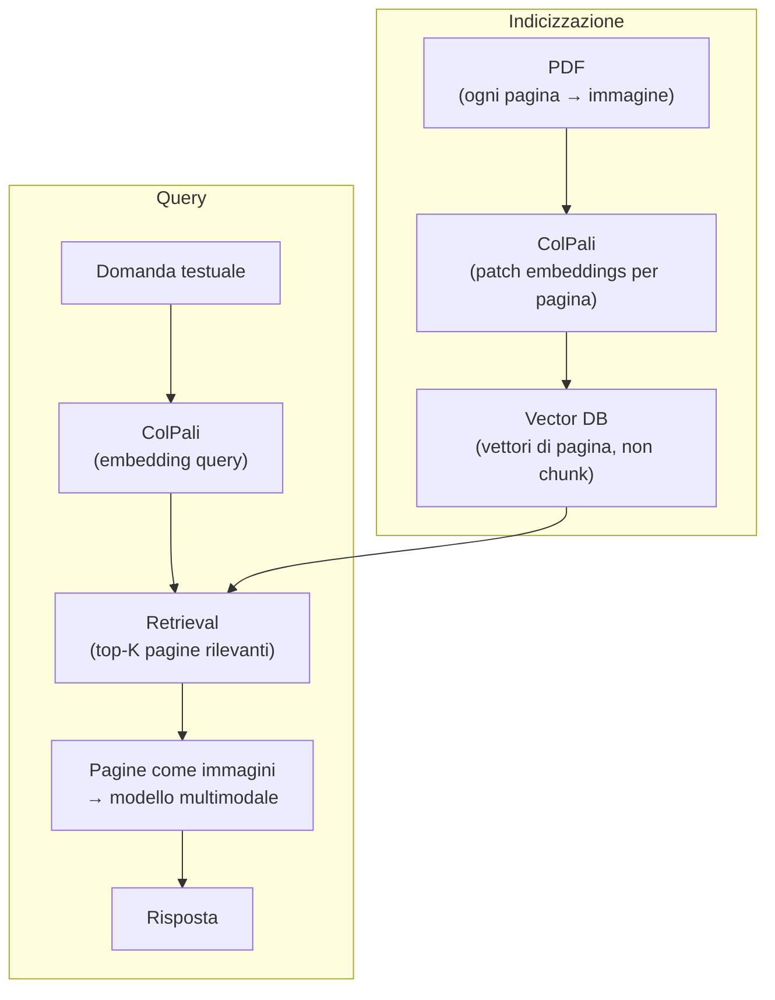

# Multimodal RAG — retrieval su documenti complessi

  In evoluzione
  Lezione 2.3
  ~13 min di lettura

Il RAG testuale funziona bene su documenti di testo puro. Smette di funzionare quando i documenti sono PDF con tabelle, grafici, layout multi-colonna, o immagini che contengono informazioni critiche. Multimodal RAG estende il retrieval alla dimensione visiva — non solo parole, ma layout e contenuto visivo.

Nella lezione 1.1 hai visto il ciclo RAG base: estrai il testo dai documenti, spezza in chunk, trasforma in embedding, retrieval per similarità. Funziona bene su documenti di testo lineare — articoli, note, transcript.

Il problema arriva appena il documento ha struttura visiva rilevante. Una slide deck dove le informazioni stanno in bullet points, frecce e titoli di sezione. Un rapporto finanziario con tabelle multi-colonna dove il significato di un numero dipende dall'intestazione della colonna. Un manuale tecnico con diagrammi dove la didascalia da sola non basta. Un contratto legale con un layout complesso dove le clausole sono annidate in modo non lineare.

Estrai il testo da questi documenti e ottieni una poltiglia: caratteri in ordine di posizione fisica, senza struttura, con le tabelle trasformate in sequenze di numeri senza intestazioni, con i titoli mescolati al testo dei paragrafi. Il modello di embedding produce un vettore da questa poltiglia, che è peggio di niente: indica "retrieval pertinente" su chunk che in realtà non contengono l'informazione nel contesto giusto.

## Il problema: il testo estratto perde il contesto visivo

Immagina una tabella di confronto tra prodotti:

| Prodotto | Peso | Prezzo | Disponibilità |
|---|---|---|---|
| A-100 | 2.3 kg | 450€ | Sì |
| B-200 | 1.8 kg | 380€ | No |

Estratta come testo grezzo diventa qualcosa come: `A-100 2.3 kg 450€ Sì B-200 1.8 kg 380€ No`. La query "qual è il prezzo del B-200?" potrebbe recuperare questo chunk, ma il modello vede una sequenza di numeri e non capisce quale è il prezzo e quale è il peso — perché le intestazioni delle colonne non sono vicine ai valori.

Stessa cosa per un grafico: un grafico a barre che mostra l'andamento dei ricavi trimestrali, estratto come testo, produce una caption vuota o una sequenza di valori senza assi. Nessun retrieval può fare buon uso di questo.

**Il testo estratto da documenti visivamente strutturati perde quasi sempre il contesto semantico che dà significato ai numeri e ai valori.**

## Approccio 1: estrazione strutturata e arricchita

La prima strategia è migliorare il processo di estrazione: invece di estrarre il testo grezzo, estrarre la struttura.

Per le **tabelle**: tool come `pdfplumber`, `camelot` o le API di Azure Document Intelligence riconoscono le tabelle nel PDF e le serializzano in modo strutturato (JSON, HTML, Markdown), preservando intestazioni di colonna e riga. Il chunk diventa "| A-100 | 2.3 kg | 450€ | Sì |" invece di "A-100 2.3 kg 450€ Sì" — e il modello capisce la struttura.

Per i **grafici e le immagini**: si può usare un modello di vision (GPT-5.4, Claude Opus) per generare una descrizione testuale del grafico al momento dell'indicizzazione. La descrizione viene usata come chunk per il retrieval. È costoso da fare su corpus grandi, ma produce chunk di alta qualità.

Il limite di questo approccio: è fragile su PDF con layout complessi o font non standard. I PDF generati da scansioni — immagini di documenti cartacei — non hanno testo estraibile; solo pixel.

## Approccio 2: embedding visivo della pagina intera

L'approccio più radicale è non estrarre il testo per niente: **trattare ogni pagina del PDF come un'immagine e usare un modello di vision per il retrieval direttamente sulle immagini**.

Il sistema di riferimento si chiama **ColPali** (2024, paper della ricerca di Google e collaboratori), e ha cambiato il modo di pensare al document retrieval.

### Come funziona ColPali

ColPali è un modello che produce **patch embeddings** da un'immagine di pagina: divide la pagina in patch (pezzi di immagine), trasforma ogni patch in un vettore, e al retrieval fa una corrispondenza "late interaction" tra i vettori della query e i vettori delle patch della pagina.

Sotto il cofano: late interaction con ColBERT

ColPali eredita il meccanismo di "late interaction" da ColBERT, un modello di retrieval testuale. In un bi-encoder classico, query e documento diventano ciascuno un vettore singolo, e la rilevanza è il loro prodotto scalare. In ColPali, la query produce N vettori (uno per token) e ogni pagina produce M vettori di patch. Il punteggio finale è la somma dei massimi prodotti scalari: per ogni token della query, cerca la patch della pagina più simile, e somma. Questo permette una corrispondenza fine-grained tra le parole della query e le zone specifiche della pagina — "trova il prezzo del B-200" può collegarsi alla patch che contiene quella cella della tabella, anche senza estrarre il testo.

Il risultato pratico: puoi fare retrieval su un corpus di PDF senza OCR, senza estrazione del testo, senza preprocessing complesso. La query in testo ("qual è la previsione di ricavi per il Q3?") viene confrontata direttamente con le immagini delle pagine. ColPali restituisce le pagine più rilevanti.

Poi, per rispondere, passi quelle pagine come immagini a un modello multimodale (GPT-5.4, Gemini, Claude), che legge la pagina visivamente e genera la risposta. Nessun chunk, nessun testo estratto.

### Quando ColPali batte l'estrazione testuale

ColPali eccelle su:
- **Documenti scansionati** (immagini di carta): nessun testo da estrarre, ColPali funziona comunque
- **Layout complessi**: tabelle, grafici, schemi, testo multi-colonna — ColPali li vede come un umano
- **Documenti misti**: metà testo, metà immagini — nessun preprocessing separato

ColPali è meno adatto quando:
- Il corpus è enorme e il costo di tenere le immagini (vs vettori testuali) è significativo
- Le domande sono puramente sul testo e non richiedono comprensione del layout
- Hai già un'ottima pipeline di estrazione strutturata che funziona bene sui tuoi documenti

## Approccio 3: retrieval ibrido visivo + testuale

Per corpus grandi e variegati, spesso il meglio è combinare: estrai il testo dove puoi (buona qualità), usa ColPali o embedding visivi dove il testo è inadeguato. Il retrieval ibrido fonde i due risultati con RRF (lezione 1.2) prima di passare le pagine al modello.

Questo è il pattern più robusto per pipeline enterprise con documenti eterogenei: contratti (testo strutturato), presentazioni (misto), documenti scansionati (immagini pure), report con grafici (misto).

## Cosa NON è

| Pensiero sbagliato | Come stanno le cose |
|---|---|
| "Basta passare il PDF come immagine al modello multimodale per fare RAG" | Passare un'intera pagina come immagine a ogni query è costoso e lento. Il retrieval serve a selezionare quale pagina passare — senza retrieval, passi tutte le pagine, che su corpus grandi è impossibile. |
| "ColPali non ha bisogno di un vector database" | ColPali produce vettori come qualunque altro embedding model. Un vector database è ancora necessario per cercare in modo efficiente su corpus di migliaia di pagine. |
| "L'OCR risolve il problema dei PDF complessi" | L'OCR estrae il testo ma perde struttura (tabelle, layout). Document understanding strutturato (Azure Document Intelligence, pdfplumber) è meglio dell'OCR grezzo; ColPali è meglio ancora su documenti con forte componente visiva. |
| "Multimodal RAG è sempre meglio del RAG testuale" | Su corpus di testo puro e semplice, il RAG testuale è più veloce, più economico e altrettanto accurato. Multimodal RAG porta complessità aggiuntiva che vale la pena solo dove la struttura visiva porta informazione non catturabile dal testo. |

## Quando scegliere cosa

- **Documenti di testo lineare** (blog, news, documentazione tecnica pura) → RAG testuale classico, nessun overhead visivo
- **Documenti con tabelle ben formate in PDF digitali** → estrazione strutturata (pdfplumber, camelot, Document Intelligence) + RAG testuale
- **Documenti scansionati o layout visivamente complessi** → ColPali o embedding visivi
- **Corpus misto enterprise** → retrieval ibrido visivo + testuale

## Verifica di comprensione

1. Perché il testo estratto da una tabella PDF con estrazione grezza è problematico per il retrieval?
2. Qual è la differenza fondamentale tra il retrieval con ColPali e il retrieval testuale classico?
3. Cosa fa la "late interaction" in ColPali che un bi-encoder classico non fa?
4. Hai un corpus di 50.000 presentazioni aziendali in PowerPoint, con grafici e immagini. Il RAG testuale funziona male. Quale approccio valuti per primo e perché?
5. *Domanda avanzata*: un collegaggio propone di usare ColPali su un corpus di 200 email di testo puro. Ha senso? Argomenta.

## Glossario della pagina

**ColPali** — modello di retrieval visivo che produce patch embeddings da immagini di pagina, usando late interaction per confrontarle con la query. Permette retrieval su PDF senza OCR.

**Patch embedding** — vettore che rappresenta una porzione (patch) di un'immagine. In ColPali, ogni pagina produce decine di patch embeddings, uno per zona dell'immagine.

**Late interaction** — meccanismo di scoring in cui query e documento producono ciascuno N vettori (non uno solo), e la rilevanza è calcolata come somma dei massimi prodotti scalari tra i vettori dei due.

**Document understanding** — capacità di interpretare un documento come struttura semantica (tabelle, sezioni, campi), non solo come sequenza di caratteri.

**Retrieval ibrido visivo** — pipeline che combina retrieval testuale e retrieval visivo, fondendo i risultati con RRF per gestire corpus eterogenei.

## Per approfondire

- Paper originale: cerca "ColPali efficient document retrieval vision language models 2024".
- Cerca "byaldi library ColPali" per un'implementazione Python pronta all'uso.
- Per confronti con l'estrazione strutturata, cerca "document AI benchmark PDF extraction 2024-2025".

## Prossima lezione

Hai visto come gestire documenti complessi con retrieval visivo. La prossima dimensione multimodale è l'audio: trascrizione, speech-to-text, quando usare un modello dedicato vs un multimodale. È la lezione 2.4.
