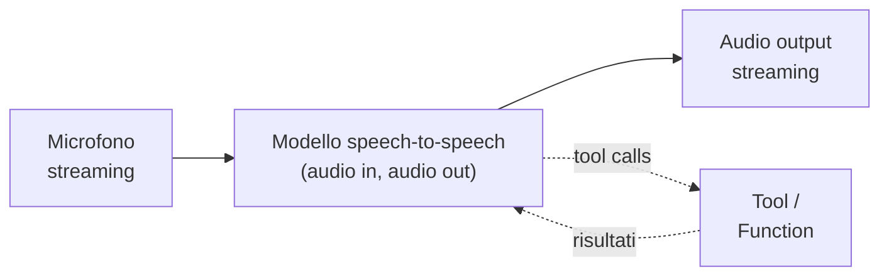

# Voice agents in tempo reale

  In evoluzione
  Lezione 2.7
  ~11 min di lettura

Parlare con un assistente vocale e sentirlo rispondere come una persona — non come Siri del 2015 con due secondi di pausa imbarazzante — è una delle aree dove l'AI applicativa è cambiata di più nel 2024-25. Sotto, però, non è "speech-to-text + LLM + text-to-speech": quella pipeline è morta per il real-time. Capire perché, e cosa l'ha rimpiazzata, è la lezione.

Nella lezione 2.3 (audio) hai visto come funzionano speech-to-text, text-to-speech e gli speech model multimodali. Nella 1.4 (agenti) hai visto cosa significa "agente" — un loop che chiama tool e ragiona. Qui mettiamo insieme i due pezzi sul terreno più ostile possibile: una **conversazione vocale in tempo reale**, dove il sistema deve sentirti, capirti, decidere, parlare, e farti sentire come se stessi parlando con qualcuno.

Il vincolo che cambia tutto è uno: **la latenza percepita.** In una chat scritta, due secondi di attesa sono accettabili. In una conversazione vocale, due secondi sono un'eternità. La soglia oltre la quale l'utente percepisce "lag" e l'illusione di naturalezza si rompe è **circa 800 millisecondi end-to-end** — dal momento in cui finisci di parlare al momento in cui senti la prima sillaba della risposta. Oltre quella soglia, parli sopra il sistema, ti scusi, ti senti goffo. Sotto, sembra naturale.

Quella soglia è il vincolo di design da cui dipende tutto il resto.

## Perché la pipeline STT → LLM → TTS è morta per il real-time

Per anni l'architettura standard di un voice agent è stata la **pipeline a tre stadi**: il microfono cattura audio, uno **STT** (speech-to-text, lezione 2.3) lo trascrive, un **LLM** legge il testo e genera una risposta, un **TTS** (text-to-speech) la sintetizza, le casse parlano. Sembra ragionevole. Non lo è più.

Sommi le latenze:

| Stadio | Latenza tipica |
|---|---|
| STT (streaming, fino al finale stabile) | 300-700 ms |
| LLM (prompt completo + first token) | 500-1500 ms |
| TTS (first audio byte) | 200-500 ms |
| Rete + buffering | 100-300 ms |
| **Totale end-to-end percepito** | **~1.1-3 secondi** |

Sei oltre la soglia degli 800ms quasi sempre. E hai un altro problema: ogni stadio butta via informazione. L'STT scarta il **tono di voce** (sei arrabbiato? ironico? incerto?). Il TTS deve indovinarlo di nuovo per generare la risposta, e di solito sbaglia: ti risponde con voce piatta, sempre uguale, a una battuta sarcastica. La conversazione "funziona" sul piano semantico ma muore sul piano umano.

Una pipeline così resta accettabile per casi *non* real-time: dettatura, trascrizione di meeting, voicebot telefonici di customer service dove la formalità è tollerata. Non per assistenti che vogliono sembrare veri.

## Cosa l'ha rimpiazzata: modelli speech-to-speech nativi

Il salto del 2024-25 è stato il rilascio di **modelli speech-to-speech nativi** — modelli multimodali che prendono audio in input e producono audio in output, senza passare dal testo intermedio. I nomi che senti nominare:

- **OpenAI Realtime API** (basata su GPT-4o e successivi). Streaming WebSocket bidirezionale: tu mandi chunk di audio, il modello manda chunk di audio.
- **Gemini Live** (Google). Stessa filosofia, stessa interfaccia bidirezionale.
- **Modelli open di Kyutai (Moshi)** e altri laboratori. Architetture più sperimentali ma indicano la direzione.

L'idea ingegneristica: un singolo modello che processa **token audio** in input e in output, dove il "token audio" è una rappresentazione discreta del segnale audio (vedi lezione 2.1 multimodalità). Niente STT esplicito, niente TTS esplicito. Il modello legge il tuo respiro, l'esitazione, il tono — perché tutto è dentro l'audio — e risponde con voce coerente.

Latenza tipica: **300-600 ms** dal silenzio alla prima sillaba. Sotto la soglia degli 800ms con margine. È questo salto che ha reso possibili gli assistenti vocali "che sembrano veri".

Il modello rimane un agente: durante la conversazione può chiamare tool (cercare sul web, consultare un database, mandare un'email — vedi lezione 1.4), e il risultato torna nel modello per essere "parlato" all'utente. Solo che tutto succede *durante* la conversazione, senza pause innaturali.

## Il problema delle interruzioni

L'aspetto più difficile da fare bene, e quello su cui la maggior parte dei sistemi naïve falliscono.

In una conversazione umana succede continuamente: l'altro inizia a parlare, dici "no, aspetta…" e lui si interrompe. Oppure stai rispondendo e capisci a metà che la tua risposta è sbagliata, ti correggi. Oppure l'altro butta lì un "uh-huh" mentre parli tu, per dirti "ti sto seguendo" senza farti smettere.

I sistemi del 2023 erano *turn-based* duri: tu parli, segnali fine-turno (premendo un bottone o con silence detection), il sistema parla, ti restituisce il turno. Robotico e bloccato. I sistemi real-time del 2024-25 devono fare tre cose insieme:

**Turn detection / VAD avanzato.** Il sistema deve capire **quando hai finito davvero** di parlare (non solo "300ms di silenzio") — distinguere una pausa di pensiero da una fine di frase. I modelli moderni usano **endpoint detection** che combina silenzio, intonazione finale, e contesto semantico (la frase è grammaticalmente compiuta?).

**Barge-in.** Se inizi a parlare *mentre il modello sta parlando*, il modello deve **smettere subito** — non finire la frase. Tecnicamente significa: il client cancella i chunk audio già emessi dalla coda di playback, il server smette di generare, e si rimette in ascolto. Implementazione delicata: se sbagli, il modello continua a parlare sopra di te (esperienza orrenda) o si interrompe per un colpo di tosse (fragile).

**Backchanneling.** I sistemi più sofisticati riconoscono che un "mhm, sì" mentre il modello parla è solo un segnale di ascolto, non un'interruzione vera — non rispondono, continuano.

Implementare bene queste tre cose è il 70% del lavoro di un voice agent serio nel 2026. I provider che offrono Realtime API forniscono primitive per queste cose (es. event di tipo `input_audio_buffer.speech_started`, `response.cancel`), ma la qualità finale dipende da come ci si lavora sopra.

## State della conversazione: dove vive

Una conversazione vocale è uno stato che evolve in tempo reale. Dove lo metti?

**Server-side, full state.** Il modello server mantiene tutta la conversazione in memoria: audio, trascrizioni parziali, tool call, risultati. Il client manda solo audio e riceve audio. Più semplice, ma se il client si disconnette (rete che casca, app in background), lo stato si perde — o devi reidratarlo, con costi.

**Client-side state, server stateless.** Ogni turno mandi al server tutto il context. Più resiliente, ma per audio è costoso in banda (l'audio è grosso).

**Ibrido (comune).** Il server tiene lo stato della sessione attiva ma sincronizza periodicamente un "summary" con il client; in caso di disconnessione il client può riprendere mostrando trascrizione del passato e ricreando la sessione.

Per quasi tutti i casi pratici del 2026, la **Realtime API server-side state** è la scelta di default. Lo trattati come una sessione effimera; se cade, ricominci.

## La rete è il problema reale (e non puoi farci nulla)

Tutto quello sopra assume rete decente. La realtà del mondo mobile è meno gentile.

**Jitter** (variazione del ritardo) di 100ms su una rete mobile saltuaria è normale. **Packet loss** del 2-5% in zone con copertura debole è comune. Per audio in streaming bidirezionale, questo significa:
- Buffer di playback più lunghi → latenza percepita più alta.
- Audio frammentato → il modello sente meno bene → trascrizioni interne peggiori → risposte sbagliate.
- Disconnessioni → sessioni perse.

Contromisure pratiche:
- **WebRTC** (non WebSocket grezzo): gestisce loss, jitter, e codec audio meglio. È quello che usano la maggior parte dei provider seri.
- **Codec audio adattivo** (Opus): si degrada gradualmente sotto banda calante, niente cutoff brutali.
- **Reconnect con session resume**: se la sessione cade, riconnetti e ricominci da dove eri, idealmente senza che l'utente debba ripetere.
- **Fallback graceful**: sotto un certo livello di qualità di rete, suggerisci all'utente di passare alla modalità chat scritta.

Nessuna di queste contromisure ti dà rete magica. Sono compensazioni parziali. La latenza percepita su una metro affollata sarà sempre peggio che a casa con Wi-Fi.

## Sotto il cofano: cosa significa "token audio"

Una nota tecnica perché il termine torna spesso e merita una riga.

Un modello speech-to-speech non processa il segnale audio analogico (44.100 campioni al secondo, troppo per un transformer). Lo **discretizza** in token audio: il segnale audio passa attraverso un encoder (tipicamente un **neural audio codec** tipo Encodec o SoundStream) che lo trasforma in una sequenza di token discreti — tipicamente 50-100 token al secondo, ciascuno scelto da un vocabolario di 1024-4096 simboli. Il transformer vede quei token come parole; alla fine, un decoder trasforma i token audio prodotti nuovamente in segnale audio.

In pratica significa: il modello *processa audio* con la stessa architettura con cui processa testo. Il prezzo è una piccola perdita di qualità acustica (il codec non è lossless), tollerabilissima per la voce. Il guadagno è enorme: un singolo modello con un singolo flusso di attenzione gestisce input e output di entrambe le modalità.

## Quando NON usare il real-time

Mantra ricorrente di queste lezioni: lo strumento migliore è spesso *non usare lo strumento più potente*. Per voice agents:

**Voicebot telefonici di customer service.** Costo per chiamata domina, latenza di 1.5-2s tollerata per la formalità del contesto. Pipeline STT→LLM→TTS classica può andare benissimo, costa meno, è più facile da debuggare.

**Dettatura / trascrizione.** Non serve l'output vocale. Solo STT (lezione 2.3), idealmente di alta qualità.

**Voicebot asincroni** (lascia un messaggio, ti richiamo). Niente real-time, niente problema.

**Comandi vocali offline** (smart home, embedded). Latenza accettabile, ma serve modello on-device leggero. La Realtime API non è on-device, è un servizio cloud.

Il real-time speech-to-speech ha senso quando l'esperienza target è "conversazione naturale" e ogni millisecondo di lag costa. Costo: i provider lo prezzano caro (~5-10x un completion testuale equivalente), e l'ingegnerizzazione richiede competenze diverse (WebRTC, audio handling). Se non ti serve quel grado di naturalezza, scendi di scalino e risparmi un ordine di grandezza.

## Cosa NON è

| Il pensiero sbagliato | Come stanno le cose |
|---|---|
| "Realtime API = STT + LLM + TTS più veloci" | No, è un modello unico che processa audio direttamente, niente passaggio dal testo. |
| "Sotto-1s di latenza è facile, basta GPU veloce" | No, la latenza vive nella catena rete + modello + buffering audio. Le GPU sono il problema *meno* grave. |
| "L'interruzione la gestisce il modello da solo" | No, serve logica di barge-in nel client (cancellare playback, mandare cancel event). |
| "Voice agent = chatbot con voce sopra" | No, le interruzioni, il tono, la latenza percepita cambiano il design. |
| "Funziona uguale su mobile e desktop" | No, jitter e packet loss su mobile rompono l'illusione. |
| "Il prezzo è simile a un'API testo" | No, 5-10x più costoso. Usa real-time solo se l'esperienza lo richiede. |

> **Il punto da tenere stretto** — Voice agent real-time = vincolo end-to-end **800ms percepito**. Lo rispetti solo con modelli **speech-to-speech nativi** + gestione seria di **interruzioni** e **rete**. Tutto il resto è sceneggiatura di pipeline che non regge sotto il microscopio del millisecondo.

## Cosa dura, cosa evitare

Stabile **Il principio**: la soglia di latenza percepita ~800ms è un dato di percezione umana, non di tecnologia. Vale fra 10 anni come oggi.

Stabile **WebRTC come trasporto** per audio bidirezionale interattivo. È lo standard del settore, non sta per essere rimpiazzato.

In evoluzione **Realtime API specifiche** (OpenAI, Gemini Live). Le interfacce esatte, i nomi degli event, i prezzi cambiano spesso. Aspettati churn.

In evoluzione **Modelli speech-to-speech open** (Moshi, futuri rilasci). Stanno arrivando ma la qualità e la latenza on-device del 2026 sono ancora dietro al cloud frontier.

A rischio **Pipeline STT+LLM+TTS** come architettura di default per voice agents pretenziosi. Sopravvive solo nei contesti dove l'1-2s di lag è tollerato.

Legacy **Voicebot a stati finiti** ("dì 1 per…", "dì 2 per…"). Solo nei contesti telefonici dove la conformità lo richiede.

---

## Verifica di comprensione

> Rispondi a memoria. Le incertezze: domani.

1. Qual è la soglia di latenza end-to-end oltre la quale una conversazione vocale smette di sembrare naturale?
2. Perché la pipeline STT → LLM → TTS classica fa fatica a stare sotto quella soglia?
3. Cosa significa "speech-to-speech nativo" e in cosa differisce dalla pipeline?
4. Cos'è il **barge-in** e perché è non-banale implementarlo?
5. Tre cose che la rete mobile (jitter, packet loss) fa a una conversazione vocale real-time.
6. Cosa sono i "token audio" e a cosa servono?
7. Tre scenari concreti dove **non** dovresti usare il real-time e ti basta una pipeline classica.
8. *(applicazione)* Stai progettando un assistente vocale che assista chirurghi in sala operatoria (mani occupate, latenza critica). Real-time o pipeline? Come gestisci l'interruzione? Cosa fai se cade la rete?

---

## Glossario

- **Voice agent real-time** — assistente conversazionale vocale a bassa latenza percepita (~800ms end-to-end).
- **STT / TTS** — Speech-To-Text / Text-To-Speech, le vecchie estremità della pipeline classica.
- **Speech-to-speech nativo** — modello multimodale che processa audio in input e produce audio in output senza passaggio dal testo.
- **Token audio** — rappresentazione discreta del segnale audio (~50-100 token/s) prodotta da un neural audio codec.
- **VAD (Voice Activity Detection) / Endpoint detection** — riconoscere quando un parlante ha finito di parlare (silenzio + intonazione + contesto).
- **Barge-in** — l'utente parla sopra il modello e il modello si interrompe immediatamente.
- **Backchanneling** — "uh-huh" / "mhm" che segnalano ascolto senza richiedere risposta.
- **WebRTC** — protocollo standard per audio/video bidirezionale a bassa latenza su web.
- **Jitter / Packet loss** — variazione del ritardo / perdita di pacchetti, i nemici della rete mobile.
- **Opus** — codec audio adattivo, standard per VoIP e real-time web.
- **Session resume** — ripresa di una sessione dopo disconnessione senza perdere stato conversazionale.

---

## Per approfondire

- **OpenAI Realtime API docs** — la documentazione ufficiale, da leggere riga per riga se ci si lavora. Sezione "events" e "guardrails" sono importanti.
- **Gemini Live API docs** — equivalente Google.
- **WebRTC for the Curious** (libro online, gratuito) — il riferimento per capire WebRTC in profondità.
- **Paper Moshi** (Kyutai, 2024) — il primo speech-to-speech open serio, leggibile come spiegazione architetturale.
- **Conversational design**: cercare gli articoli di Cathy Pearl ("Designing Voice User Interfaces") — la parte design/UX della voce, indipendentemente dalla tecnologia.

*Risorse indicate per la ricerca; la Realtime API è giovane e gli articoli pratici aggiornati vivono sui blog dei provider.*

---

## Prossima lezione

Hai chiuso la Parte 2 sul multimodale: come funziona (2.1), vision (2.2), audio non-real-time (2.3), generazione di immagini (2.4), pipeline vs nativo (2.5), drill (2.6), e ora il caso più estremo — voce in tempo reale (2.7). La Parte 3 — già vista — ti dà gli strumenti per valutare tutto questo. Il prossimo passo naturale è la Parte 4: **sicurezza**. Perché un voice agent che agisce, anche brillantemente, è anche un vettore di rischio nuovo da padroneggiare.
