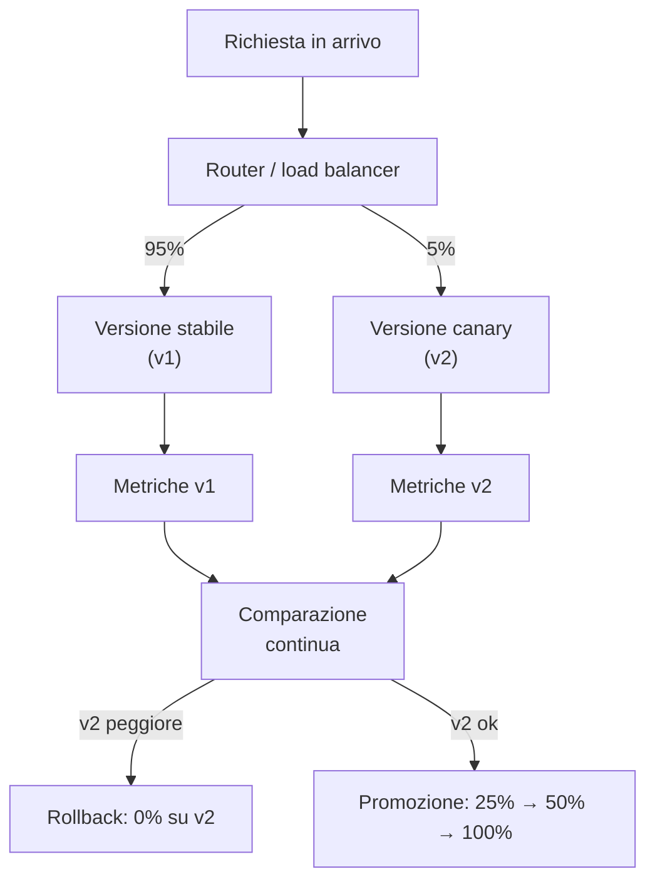
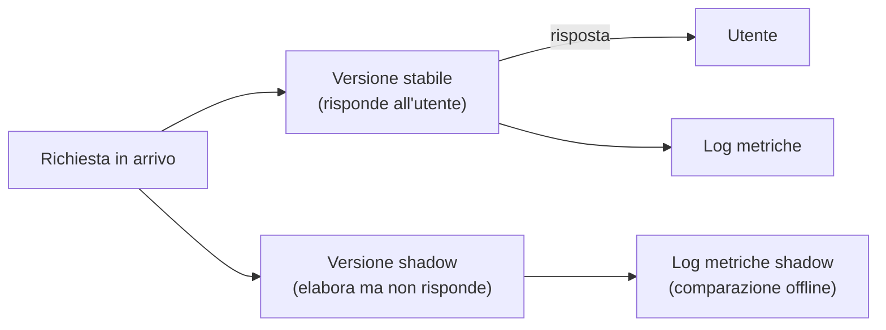

# Rollout sicuro: canary, A/B e shadow traffic per LLM

<div class="lesson-meta">
  <span class="badge-stato stabile">Stabile</span>
  <span>Lezione 6.4</span>
  <span>~12 min di lettura</span>
</div>

<p class="lesson-lead">Cambiare un modello, un prompt o una pipeline RAG in produzione senza far scoppiare tutto. Il deploy classico non basta — la "regressione" nei sistemi LLM è qualitativa, non binaria, e si misura su una distribuzione di output, non su un assert che passa o fallisce.</p>

Nella lezione 6.1 hai messo il sistema online. Nella 6.3 hai visto come monitorare il degrado silenzioso. Ora arriva il momento più rischioso della vita di un sistema AI in produzione: **cambiare qualcosa**. Nuovo modello, nuovo prompt di sistema, nuova pipeline di retrieval, nuovo chunking strategy.

Il problema è che con i sistemi LLM non esiste una test suite che ti dice con certezza "va bene". Un assert tradizionale è binario: passa o fallisce. La qualità di un LLM è una distribuzione: a volte migliora, a volte regredisce, spesso varia per topic o tipo di utente. Puoi avere un test set curato (lezione 3.1) che passa al 100%, e scoprire in produzione che la nuova versione risponde peggio su un segmento di query che non avevi rappresentato nel test set.

Il rollout sicuro serve a gestire questa incertezza: esponi il cambiamento a una parte controllata del traffico reale, misuri, decidi.

## Il deploy classico e perché non basta

Nel software tradizionale, un ciclo di rilascio ragionevole è:
1. Scrivi i test
2. Passa i test
3. Deploy in staging
4. Deploy in produzione con rollback pronto

Questo funziona quando "corretto" è verificabile con un test. Un endpoint REST che restituisce il prezzo di un prodotto: c'è un valore atteso, o non c'è.

Con un LLM, "corretto" è una questione di grado. Una risposta può essere tecnicamente accurata ma con un tono sbagliato. Accurata per la maggior parte degli utenti ma confusionaria per un segmento. Più concisa ma meno utile su domande complesse. Nessun unit test cattura queste sfumature sistematicamente.

In più, l'effetto di un cambio di modello o prompt può essere **non uniforme**: funziona meglio sulle query comuni, peggio sulle query rare — e le query rare sono spesso quelle su cui gli utenti si fidano di più del sistema (chiedono cose difficili, e si aspettano risposte affidabili).

## Canary release: la progressione controllata

Il **canary release** è il pattern standard per ridurre il rischio di regressione: invece di portare il 100% del traffico sul nuovo sistema in un colpo solo, si aumenta gradualmente la percentuale mentre si monitora.

Una progressione tipica:

```
5% del traffico → monitora 24-48h → ok? → 25% → monitora → ok? → 50% → ok? → 100%
```

Ad ogni step, misuri le metriche chiave (lezione 6.3) sul traffico che ha visto la nuova versione, le confronti con la baseline sulla vecchia versione, e decidi se continuare o fare rollback.



Il routing si implementa nel gateway (LiteLLM, Portkey, o un reverse proxy come Nginx/Envoy con sticky session). La chiave è che lo stesso utente veda sempre la stessa versione durante un singolo ciclo di test — mescolare le versioni su un utente produce dati confusi.

### Criteri di rollback automatico

Il canary vale qualcosa solo se hai criteri espliciti e automatici per fare rollback. "Mi sembra ok" non basta. I trigger tipici:

- **Error rate**: se gli errori HTTP/LLM sulla nuova versione superano il 2× del baseline → rollback automatico
- **Latenza P95**: se il P95 di latency sale del 20% → alert + rollback manuale o automatico
- **Score di qualità** (da LLM-as-judge, lezione 3.2): se il punteggio medio scende più di X punti rispetto al baseline → alert
- **Segnali utente**: thumbs-down, riformulazioni della query, escalation al supporto — tutto va monitorato aggregato per versione

<details>
<summary>Come implementare il routing con user affinity</summary>

La user affinity garantisce che lo stesso utente veda sempre la stessa versione durante il periodo di test. Si implementa con consistent hashing sull'user ID: `hash(user_id) % 100 < 5` invia al canary. Questo è deterministico — lo stesso utente finisce sempre nello stesso bucket — senza dover salvare stato. Se non hai user ID (API anonymous), si usa l'IP o un cookie. La user affinity è importante perché l'esperienza utente si misura su interazioni multiple, non su una singola risposta.
</details>

## A/B testing: misurare scelte qualitative

Il canary è per la sicurezza — verificare che la nuova versione non sia peggiore. L'**A/B testing** è per l'ottimizzazione — capire quale di due versioni produce risultati migliori su metriche di business.

Tipici scenari di A/B test per sistemi LLM:
- Prompt A vs prompt B: quale produce risposte che gli utenti trovano più utili?
- Modello X vs modello Y: quale riduce di più le escalation al supporto?
- Chunking strategy A vs B: quale produce risposte più accurate sulle domande di prodotto?

La differenza rispetto al canary è che nell'A/B vuoi esposizione **bilanciata** (50/50 o simile) su un periodo sufficiente per avere significatività statistica, e la metrica principale è un outcome di business, non una metrica tecnica.

La trappola degli A/B test su LLM: la metrica di qualità deve essere misurata sul traffico reale, non su un test set fisso. Un cambio di prompt che migliora i tuoi 200 casi di test potrebbe peggiorare le query che nessuno aveva pensato di includere nel test set. Per questo il confronto va fatto su campioni del traffico reale con LLM-as-judge applicato post-hoc.

**Significatività statistica**: con output qualitativi, hai bisogno di più campioni di quanti pensi. Se la differenza tra A e B è piccola (2-3 punti su una scala 1-5), servono facilmente 1.000+ coppie di confronto per avere confidenza statistica. Con traffico basso, un A/B test può richiedere settimane per produrre dati significativi.

## Shadow traffic: confronto a costo zero per l'utente

Lo **shadow traffic** è il modo più sicuro per testare un nuovo sistema: la nuova versione riceve le stesse richieste del sistema in produzione, le elabora, ma **i suoi risultati non vengono mai serviti all'utente**. L'utente vede sempre la risposta della versione stabile; la versione shadow gira "in ombra".



Il vantaggio: nessun rischio per l'utente. Anche se la versione shadow produce output terribili, l'utente non li vede mai. Puoi testare configurazioni sperimentali, nuovi modelli non ancora validati, varianti radicali del prompt.

Il costo: raddoppi (o moltiplichi) le inferenze. Ogni richiesta viene elaborata due volte. Con costi di inferenza già alti, il shadow traffic va usato su campioni del traffico, non su tutto, e per periodi limitati.

Lo shadow traffic è particolarmente utile per **testing pre-deployment senza impatto utente**: prima di fare il canary, gira in shadow su 10% del traffico per 48 ore, confronta le distribuzioni offline, poi decidi se fare il canary o tornare al disegno.

## La "regressione qualitativa": come misurarla

La difficoltà principale del rollout LLM è definire "regressione". Per un'API tradizionale: la risposta è corretta o non lo è. Per un LLM: la risposta è su una scala.

Tre approcci, in ordine crescente di accuratezza e costo:

**Segnali utente**: thumbs-down, query di riformulazione ("quello che intendevo era…"), escalation. Sono noisy ma economici da raccogliere. Utili come early warning, non come misura definitiva.

**LLM-as-judge automatizzato** (lezione 3.2): sulla stessa coppia (query, risposta), un giudice LLM valuta la risposta della v1 e quella della v2 su dimensioni predefinite. Scalabile, costoso se applicato a tutto il traffico — si fa su campioni. L'importante è che il giudice sia lo stesso per entrambe le versioni.

**Valutazione umana su campioni**: gold standard, ma non scalabile in tempo reale. Utile per validare i risultati dell'LLM-as-judge automatizzato su campioni critici.

In pratica: nella fase canary, usi segnali utente e LLM-as-judge automatizzato su campioni. La valutazione umana la riservi ai casi in cui l'LLM-as-judge segnala anomalie o per la decisione finale di promozione a 100%.

## Il ciclo completo di un cambio in produzione

Un cambio tipico (es. upgrade di modello) segue questo flusso:

1. **Shadow test** (2-3 giorni, 10% del traffico): confronto offline, nessun rischio utente
2. **Canary 5%** (24-48 ore): monitoraggio metriche tecniche + qualità su campioni
3. **Canary 25%** (2-3 giorni): metriche operative più stabili, A/B comparison aggregata
4. **Canary 50%** (1-2 giorni): confidence quasi definitiva, ultima chance di rollback
5. **100%**: promozione completa, la vecchia versione resta disponibile per rollback rapido per 48-72 ore

Il tempo totale è 10-15 giorni per un cambiamento con alto rischio (cambio di modello frontier). Per cambiamenti a basso rischio (piccola variazione di prompt su task secondario), puoi comprimere: shadow + canary rapido + promozione in 3-4 giorni.

## Cosa NON è

| Pensiero sbagliato | Come stanno le cose |
|---|---|
| "Se passa i test pre-produzione, il rollout è sicuro" | I test pre-produzione coprono i casi noti. Il traffico reale ha una coda lunga di query impreviste. Il canary esiste proprio per scoprire i casi che non avevi nel test set. |
| "Il shadow traffic non costa nulla" | Costa doppia inferenza. Su traffico ad alto volume con modelli costosi, può raddoppiare la fattura per il periodo del test. Si usa su campioni, non su tutto il traffico. |
| "Rollback significa tornare a zero rischi" | Il rollback è veloce (secondi, se il router è configurato bene) ma non risolve il danno già fatto: utenti che hanno visto risposte degradate, feedback negativi già scritti. Il monitoraggio precoce riduce l'esposizione; il rollback la termina. |
| "Con A/B test 50/50 misuro in metà del tempo" | Più utenti esposti accelerano la raccolta di campioni, ma la significatività statistica dipende dalla dimensione dell'effetto che cerchi. Un effetto piccolo richiede molti campioni anche con 50/50. |

## Verifica di comprensione

1. Perché il deploy tradizionale (test → staging → produzione) non basta per i sistemi LLM?
2. Descrivi la progressione tipica di un canary release. Quali metriche usi per decidere se continuare o fare rollback?
3. Qual è la differenza tra canary release e A/B testing? In quale scenario usi l'uno e in quale l'altro?
4. Cos'è la user affinity nel routing del canary e perché è importante?
5. Hai un shadow test in corso su 10% del traffico. Il costo mensile di inferenza è già alto. Il CTO ti chiede di spegnere il shadow. Cosa rispondi?

## Glossario della pagina

**Canary release** — strategia di rollout che espone una percentuale crescente di traffico alla nuova versione, con monitoring continuo e rollback automatico su soglie predefinite.

**A/B testing** — esperimento controllato che espone utenti a due versioni (A e B) per misurare quale produce risultati migliori su una metrica di business.

**Shadow traffic** — la nuova versione elabora le stesse richieste del sistema in produzione ma i suoi output non vengono serviti all'utente; confronto sicuro e offline.

**User affinity** — meccanismo che garantisce che lo stesso utente veda sempre la stessa versione durante un A/B test o canary; si implementa con consistent hashing sull'user ID.

**Regressione qualitativa** — peggioramento della qualità degli output LLM che non si manifesta come errore tecnico ma come degrado della distribuzione di risposte su una scala.

**LLM-as-judge** — uso di un modello LLM come valutatore automatico di copie (query, risposta) per confrontare versioni. Scalabile; va confrontato con valutazione umana per validare il giudice stesso.

## Per approfondire

- Cerca "canary deployment kubernetes" per implementazioni pratiche del routing a livello infrastruttura.
- Il post "How Shopify deploys LLM changes safely" (cerca su engineering blog Shopify) mostra un caso reale di canary su sistemi AI.
- Per la significatività statistica negli A/B test, cerca "A/B testing sample size calculator" — strumento pratico prima di disegnare un test.

## Prossima lezione

Hai gli strumenti per cambiare il sistema in sicurezza. La lezione 6.5 chiude la Parte 6 con un **decision drill di produzione**: uno scenario realistico ("il sistema funziona ma i costi sono raddoppiati") da affrontare come un senior engineer, con le domande giuste nell'ordine giusto.
