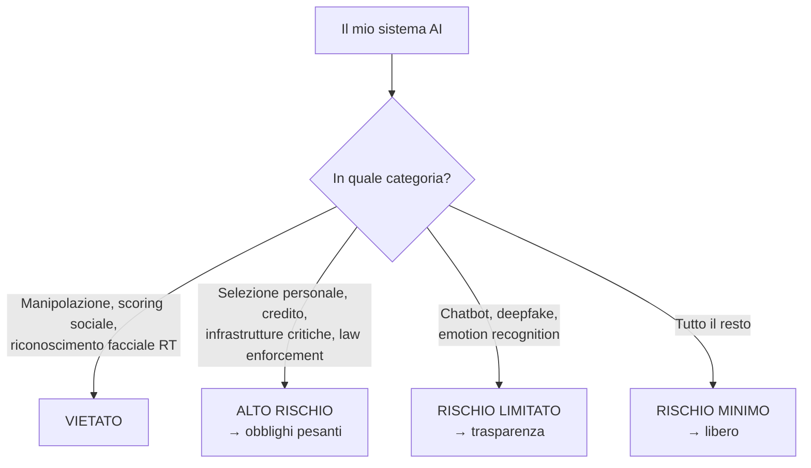

# EU AI Act e governance

  In evoluzione
  Lezione 4.4
  ~10 min di lettura

L'EU AI Act è il primo regolamento globale sui sistemi AI: classifica il rischio del tuo sistema e impone obblighi proporzionali. Non è un documento astratto — determina se puoi mettere in produzione quello che stai costruendo, e con quali requisiti. Capire dove cade il tuo progetto è il lavoro dell'AI engineer, non solo del legal.

Il GDPR regola i dati. L'EU AI Act — *Regulation (EU) 2024/1689*, in vigore dal 2024 con applicazione graduale — regola i **sistemi AI in quanto tali**: non cosa fanno con i dati, ma cosa fanno al mondo. L'approccio è a rischio proporzionale: più il sistema può fare danno, più gli obblighi sono pesanti.

## La piramide del rischio

L'AI Act divide i sistemi AI in quattro categorie. Il punto critico è capire in quale cade ciò che stai costruendo.

**Rischio inaccettabile — Vietati.** Sistemi che manipolano l'inconscio, sistemi di scoring sociale generalizzato, riconoscimento facciale real-time in spazi pubblici (con eccezioni molto limitate per le forze dell'ordine), sistemi che sfruttano le vulnerabilità di gruppi specifici. Non si deployano, punto.

**Alto rischio — Obblighi pesanti.** Sistemi usati in contesti ad alto impatto: selezione del personale, concessione di credito, scoring educativo, sistemi di sicurezza critica, sistemi usati da autorità di law enforcement, dispositivi medici con componente AI, infrastrutture critiche. Per questi:
- Valutazione del rischio documentata prima del deployment
- Dataset di training documentati e controllati
- Logging delle decisioni (traceability)
- Supervisione umana obbligatoria
- Trasparenza verso gli utenti
- Registrazione in una banca dati EU

**Rischio limitato — Obblighi di trasparenza.** Chatbot, sistemi che generano contenuto sintetico (deepfake, testi generati da AI), sistemi di emozioni detection. L'obbligo principale: informare l'utente che sta interagendo con un AI, o che il contenuto è sintetico. Per i chatbot: disclosure obbligatoria che non è un umano.

**Rischio minimo — Liberi.** Filtri antispam, AI nei videogiochi, sistemi di raccomandazione generici. Nessun obbligo specifico.

## GPAI — General Purpose AI Models

L'AI Act ha una sezione dedicata ai **GPAI** — modelli di uso generale, il termine tecnico per i modelli fondazionali come GPT-4, Claude, Gemini. Chi li crea (OpenAI, Anthropic, Google) ha obblighi specifici: documentazione, valutazione delle capability, notifica alla Commissione Europea per i modelli "ad alto impatto" (sopra una soglia di compute di training).

Per te come AI engineer che *usa* questi modelli, la cosa rilevante è diversa: **la responsabilità del sistema finale è tua**, non del provider del modello base. Se costruisci un sistema ad alto rischio usando un GPAI di frontiera (GPT-5, Claude Opus 4, Gemini 3) come componente, non puoi delegare la compliance al fatto che "è OpenAI/Anthropic/Google a fare il modello". Il sistema che metti in produzione sei tu, e sei tu che rispondi degli obblighi.

## Cosa cambia in pratica per chi costruisce

**Per la maggioranza dei progetti (rischio limitato o minimo):**
- Disclosure che l'utente sta interagendo con un AI (chatbot)
- Disclosure che il contenuto è generato da AI (testi, immagini)
- Nessun obbligo architetturale aggiuntivo

**Per sistemi ad alto rischio:**
La lista degli obblighi è lunga e richiede coinvolgimento del legal. Ma dal punto di vista dell'AI engineer, i punti tecnici sono:
- **Traceability obbligatoria**: log delle decisioni, input, output, versione del modello usato. Non è opzionale: serve per dimostrare che il sistema ha funzionato correttamente.
- **Human oversight**: il sistema non può prendere decisioni finali autonomamente su persone. Il modello propone, l'umano decide.
- **Testing documentato**: non basta che funzioni — devi documentare come hai testato, con quali dataset, quali casi limite hai esplorato.
- **Data governance**: i dataset di training (se fai fine-tuning) devono essere documentati — provenienza, qualità, bias noti.

**Timeline di applicazione (aggiornata al maggio 2026 — Digital Omnibus on AI):**
- Febbraio 2025: divieti (pratiche vietate) **già in vigore**
- Agosto 2025: obblighi per GPAI providers **già in vigore**
- **Dicembre 2026**: deadline ridotta (da 6 a 3 mesi) per le soluzioni di trasparenza sui contenuti generati da AI
- Agosto 2027: regulatory sandboxes obbligatori in ogni Stato membro (originalmente 2026)
- **Dicembre 2027**: obblighi per i sistemi ad alto rischio dell'**Annex III** (use-based: HR, credito, scoring educativo, law enforcement) — rinviati di 16 mesi dall'agosto 2026 originale
- Agosto 2028: obblighi per i sistemi ad alto rischio dell'**Annex I** (product-regulated: dispositivi medici, infrastrutture, equipaggiamento radio) — rinviati di un anno

Il rinvio è il risultato dell'accordo Council-Parliament del 7 maggio 2026, il cosiddetto **Digital Omnibus on AI**. La motivazione ufficiale: le standards-setting bodies europee non sono pronte sui requisiti tecnici, e l'industria non ha avuto tempo materiale di adeguare testing, documentazione e third-party assessment. Per chi costruisce ora un sistema potenzialmente high-risk, hai 18 mesi in più di quelli che pensavi. Approvazione formale prevista per giugno 2026, pubblicazione in Gazzetta Ufficiale a luglio.

In evoluzione L'AI Act è in vigore ma l'implementazione pratica continua a muoversi: il Digital Omnibus 2026 è la dimostrazione che le deadline sono *politiche*, non immutabili. Segui le comunicazioni della Commissione EU, dell'AI Office (creato dentro la Commissione) e dell'autorità nazionale (per l'Italia, l'AgID e il Garante per la protezione dei dati personali).

## Il punto di incertezza: dove finisce il "rischio limitato"

La classificazione non è sempre ovvia. Alcuni esempi di casi limite:

- Un assistente AI per selezione CV che filtra ma non decide → alto rischio (la selezione del personale è esplicitamente citata)
- Un chatbot di customer support assicurativo che fornisce informazioni sulla polizza → rischio limitato, ma se consiglia prodotti specifici entra in territorio di consulenza finanziaria regolamentata
- Un sistema che rileva anomalie comportamentali nei dipendenti → potenzialmente alto rischio se usato per decisioni occupazionali

Quando il confine è incerto, il principio prudenziale è trattare il sistema come alto rischio finché non si ha la conferma legale che non lo è.

## Cosa NON è l'EU AI Act

| Il pensiero sbagliato | Come stanno le cose |
|---|---|
| "Vale solo per le aziende UE" | Vale per tutti i sistemi che hanno effetti su persone nell'UE, indipendentemente da dove è l'azienda. |
| "Il provider del modello si preoccupa lui" | La responsabilità del sistema finale è del deployer — chi mette in produzione. |
| "È lo stesso del GDPR" | GDPR = protezione dei dati personali. AI Act = obblighi sui sistemi AI. Si applicano insieme, non in alternativa. |
| "Rischio minimo = nessun problema legale" | Restano applicabili GDPR, normativa del settore (salute, finanza), diritto dei consumatori. |

---

## Verifica di comprensione

> Rispondi a memoria. Le incerte rivedile domani.

1. Descrivi le quattro categorie di rischio dell'AI Act con un esempio per ciascuna.
2. Perché la responsabilità del sistema AI ricade sul deployer e non sul provider del modello base?
3. Quali tre obblighi tecnici concreti ha un sistema ad alto rischio?
4. Un'azienda vuole usare un LLM per analizzare i CV e produrre uno shortlist di candidati. In quale categoria cade? Quali obblighi comporta?
5. GDPR e AI Act si sovrappongono o si sostituiscono? Fai un esempio dove si applicano entrambi.

---

## Glossario

- **EU AI Act** — Regulation (EU) 2024/1689; il primo regolamento europeo che classifica e regola i sistemi AI in base al rischio.
- **GPAI** — General Purpose AI Models; modelli fondazionali di uso generale soggetti a obblighi specifici.
- **Alto rischio** — categoria di sistemi AI con obblighi pesanti: traceability, human oversight, testing documentato.
- **Rischio limitato** — categoria con obblighi di trasparenza; principalmente disclosure verso l'utente.
- **Deployer** — chi mette in produzione un sistema AI; porta la responsabilità della compliance del sistema finale.
- **Traceability** — capacità di ricostruire le decisioni di un sistema AI: input, output, versione del modello, timestamp.

---

## Per approfondire

- **Testo integrale dell'AI Act** — pubblicato in Gazzetta Ufficiale UE; cerca "Regulation EU 2024 1689" sul sito EUR-Lex.
- **Sito ufficiale della Commissione EU sull'AI Act** — digital-strategy.ec.europa.eu/en/policies/european-approach-artificial-intelligence.
- **AI Act Explorer** — strumenti di terze parti che permettono di navigare il regolamento; cerca "AI Act compliance tool".

*Risorse indicate per la ricerca; per i link aggiornati conviene cercarli al momento.*

---

## Prossima lezione

**4.5 Decision drill — Sicurezza e governance.** Tre scenari con classificazione AI Act, obblighi GDPR e guardrail tecnici da progettare. Lavoro concreto da architetto.
