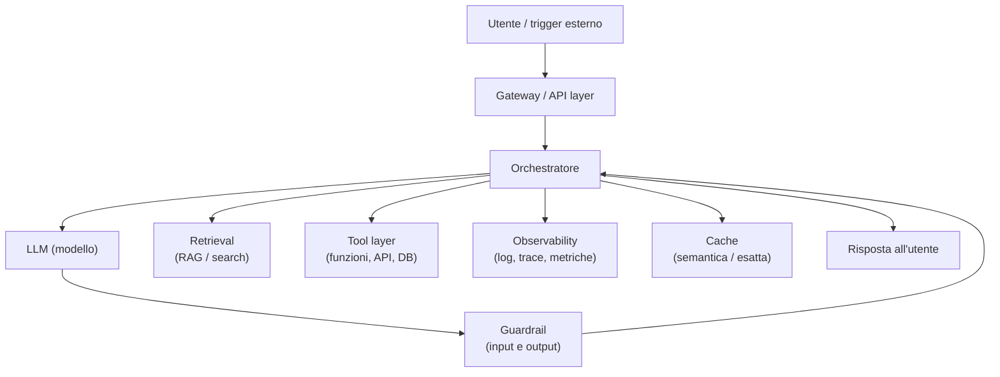

# Anatomia di un sistema AI

  Stabile
  Lezione 5.1
  ~11 min di lettura

Un sistema AI di produzione non è un LLM a cui si manda un messaggio. È un'orchestrazione di componenti — retrieval, tool, guardrail, observability, caching — in cui il modello è il motore di ragionamento, non il sistema intero. Capire l'anatomia è prerequisito per ogni decisione architettuale.

Quando vedi una demo di un LLM che risponde brillantemente alle domande, stai vedendo il 20% del sistema. Il restante 80% è ciò che porta la domanda giusta al modello, che valida l'output, che capisce quando qualcosa va storto, che tiene i costi sotto controllo. Saltare quella parte è il motivo per cui i prototipi funzionano e i sistemi di produzione no.

## I componenti e le loro responsabilità

Un sistema AI moderno ha una struttura riconoscibile, con variazioni a seconda del caso d'uso. I componenti principali:

**Gateway / API layer.** Il punto di ingresso. Gestisce autenticazione, rate limiting, routing verso la versione corretta del sistema. Non sa niente di AI: è infrastruttura standard. Ma è lui che decide se la richiesta entra nel sistema.

**Orchestratore.** Il cervello del sistema — non il modello. L'orchestratore gestisce il flusso: decide se andare in retrieval prima, quali tool chiamare, quante iterazioni fare, quando la risposta è pronta. Può essere un loop agentivo (come in 1.4) o un pipeline deterministico. Il punto chiave: **il controllo di flusso sta nell'orchestratore, non nel prompt del modello**.

**LLM.** Il componente che fa il ragionamento linguistico. Riceve il contesto preparato dall'orchestratore, produce un output. È importante ma non è il sistema: è un componente sostituibile. Se domani esce un modello migliore, lo scambi senza toccare il resto dell'architettura — se l'hai progettata bene.

**Retrieval (RAG).** Il sistema di recupero di informazioni rilevanti — tipicamente un vector store consultato tramite similarità semantica. Il retrieval prepara il contesto prima che il modello risponda. La qualità del retrieval determina in gran parte la qualità della risposta (lezione 1.1 per il meccanismo).

**Tool layer.** Le funzioni che il modello può chiamare per agire sul mondo: API esterne, query su database, invio email, esecuzione di codice. Ogni tool è una superficie d'attacco e un punto di failure. Vanno disegnati con i permessi minimi necessari (lezione 4.2).

**Guardrail.** Controlli sull'input (cosa arriva al modello) e sull'output (cosa torna all'utente). Input: filtra prompt che violano le policy, sanitizza il contenuto. Output: controlla che la risposta sia nel formato atteso, che non contenga informazioni che non dovrebbero uscire, che rispetti le regole di business. Non sono opzionali in produzione.

**Observability.** Il sistema di monitoring — log strutturati, trace delle richieste, metriche (latenza, costo per richiesta, tasso di errore, quality score). Senza observability sei cieco: non sai cosa fa il tuo sistema in produzione, non sai quando degrada, non sai cosa ottimizzare (lezione 6.3).

**Cache.** Riduce costo e latenza sulle richieste ripetitive. Due tipi: cache esatta (stessa stringa di input → stesso output) e cache semantica (input simili → risposta già calcolata, recuperata per similarità vettoriale). La cache semantica è specifica dell'AI e può ridurre significativamente il costo su workload con alta ripetizione.

## La distinzione fondamentale: orchestratore vs modello

È il punto che più spesso viene frainteso in fase di design.

Il modello sa ragionare sul linguaggio. Non sa, e non deve sapere, come è strutturato il tuo sistema, quali sono le tue regole di business, quando interrompere un loop, cosa loggare. Queste responsabilità stanno nel codice dell'orchestratore.

**Se metti la logica di controllo nel prompt**, hai un sistema fragile: il modello può "dimenticarla" su richieste lunghe, può essere overridato da un'injection, può interpretarla in modo diverso su input inusuali. **Se la metti nel codice**, hai garanzie deterministiche.

Esempio concreto: il massimo di tre iterazioni in un loop agentivo non si scrive "fai al massimo 3 tentativi" nel prompt. Si scrive un contatore nel codice dell'orchestratore che interrompe il loop dopo il terzo passo, indipendentemente da cosa dice il modello.

## I punti di failure e come progettarli

Ogni componente può fallire. In un sistema di produzione, la domanda non è "se" un componente fallisce, ma "come il sistema reagisce quando fallisce".

**LLM non disponibile.** Il provider va down, supera il rate limit, risponde lentamente. Il sistema deve avere un fallback: un modello alternativo, una risposta di default, un messaggio chiaro all'utente.

**Retrieval restituisce risultati scadenti.** Il vector store non trova niente di rilevante. Il sistema deve capirlo — tramite score di similarità o output del modello — e decidere: risponde con le proprie conoscenze generali (con caveat), chiede all'utente di riformulare, o dice che non ha le informazioni.

**Tool che fallisce.** Un'API esterna va down, un DB è irraggiungibile. Il modello non deve gestire questo: è il codice dell'orchestratore che cattura l'eccezione e decide cosa fare.

**Risposta fuori dai guardrail.** Il modello produce un output che non supera la validazione. Il sistema deve avere una policy: riprova (con un prompt diverso), produce una risposta di default, allerta il monitoring.

Il design dei failure path è parte del design architetturale, non un'aggiunta successiva.

## L'LLM è il 20% del sistema

Questa affermazione è deliberatamente provocatoria, ma utile. In un sistema di produzione maturo:

- Il retrieval determina la qualità dell'informazione disponibile al modello — se il retrieval è scarso, nessun modello salva la situazione
- I guardrail determinano la sicurezza e la conformità — senza, il modello produrrà prima o poi output inaccettabili
- L'observability determina la capacità di migliorare nel tempo — senza, non sai cosa ottimizzare
- La cache determina il costo reale a scala — senza, i costi esplodono
- L'orchestratore determina la robustezza — senza failure handling, il sistema è fragile

Il modello è centrale, ma non sufficiente. La maturità di un sistema AI si misura sugli altri componenti.

## Cosa NON è l'anatomia di un sistema AI

| Il pensiero sbagliato | Come stanno le cose |
|---|---|
| "Il sistema AI è il modello" | Il modello è un componente. Il sistema è l'orchestrazione di tutti i componenti. |
| "I guardrail servono per la sicurezza, non per la qualità" | I guardrail validano formato, contenuto e policy — sono sia sicurezza che qualità. |
| "Il controllo di flusso va nel prompt" | Il controllo di flusso va nel codice. Il prompt guida il ragionamento, non il sistema. |
| "L'observability si aggiunge dopo" | Senza observability dal primo giorno, non sai cosa ottimizzare. Va progettata insieme al sistema. |

---

## Verifica di comprensione

> Rispondi a memoria. Le incerte rivedile domani.

1. Nomina i sette componenti principali di un sistema AI e la responsabilità di ciascuno.
2. Qual è la differenza tra cache esatta e cache semantica?
3. Perché il controllo di flusso non deve stare nel prompt?
4. Un LLM provider va down durante la notte. Come progetti il sistema perché l'impatto sia minimo?
5. *(anticipa 5.2)* Hai un sistema che processa 10.000 documenti al giorno con latenza non critica. Quale pattern architetturale applichi?

---

## Glossario

- **Orchestratore** — componente che gestisce il flusso del sistema: quale componente chiamare, in quale ordine, con quali input, con quale policy di errore.
- **Guardrail** — controlli su input e output per garantire sicurezza, formato corretto e conformità alle policy.
- **Observability** — capacità di comprendere lo stato interno del sistema tramite log, trace e metriche.
- **Cache semantica** — cache che usa similarità vettoriale per riutilizzare risposte già calcolate su input simili (non identici).
- **Failure path** — il comportamento del sistema in caso di errore di un componente; deve essere progettato esplicitamente.
- **Fallback** — alternativa attivata quando il componente principale non è disponibile o produce un output non valido.

---

## Per approfondire

- **"Building LLM Applications"** di vari autori sul tema LLMOps — cerca guide su LangChain, LlamaIndex e blog di Anthropic/OpenAI sul production deployment.
- **LangSmith, Langfuse, Phoenix (Arize)** — strumenti di observability specifici per sistemi LLM; la documentazione mostra come si struttura il tracing.

*Risorse indicate per la ricerca; per i link aggiornati conviene cercarli al momento.*

---

## Prossima lezione

**5.2 Pattern di sistema.** Hai i componenti. Ora la domanda è come li colleghi: sincrono o asincrono, batch o real-time, queue o chiamata diretta. I pattern dei sistemi distribuiti applicati all'AI — con i trade-off che cambiano rispetto al software tradizionale.
