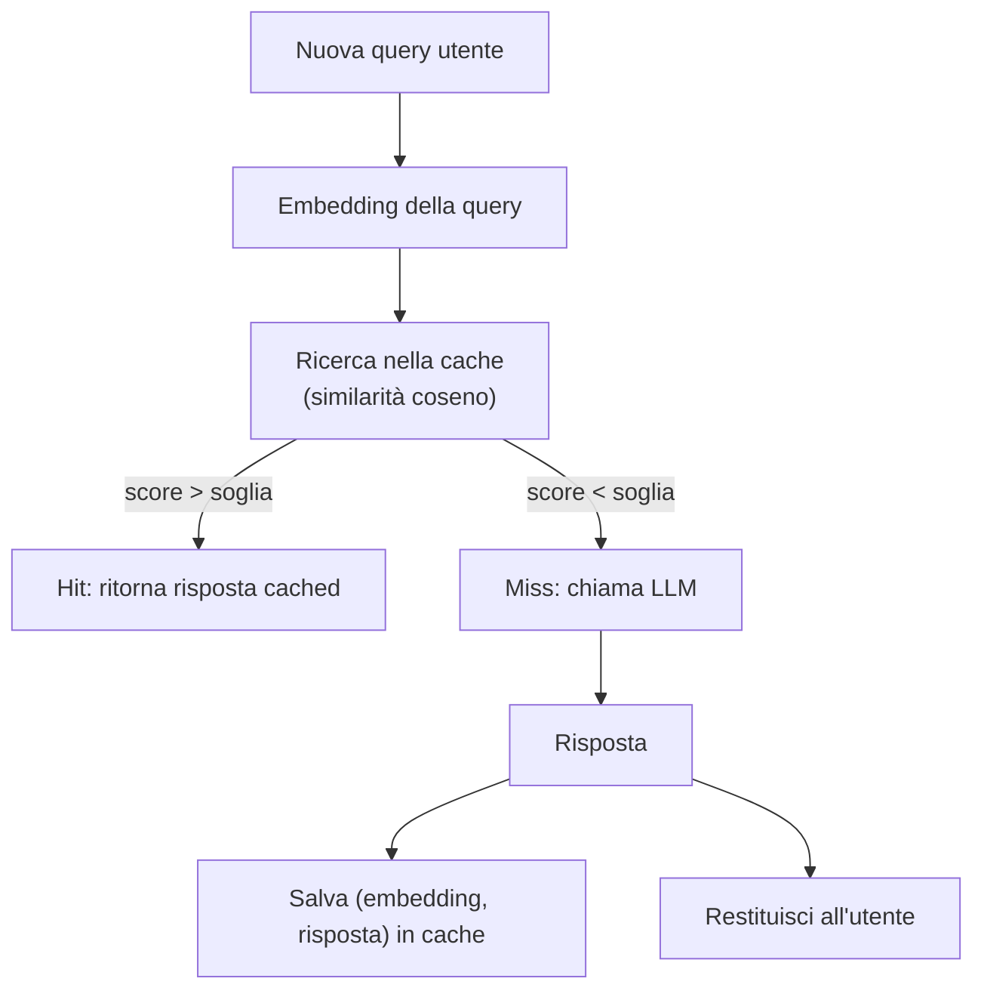
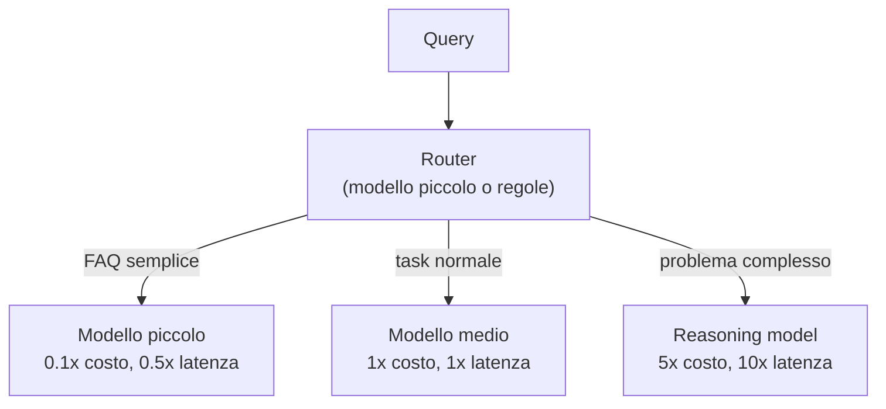
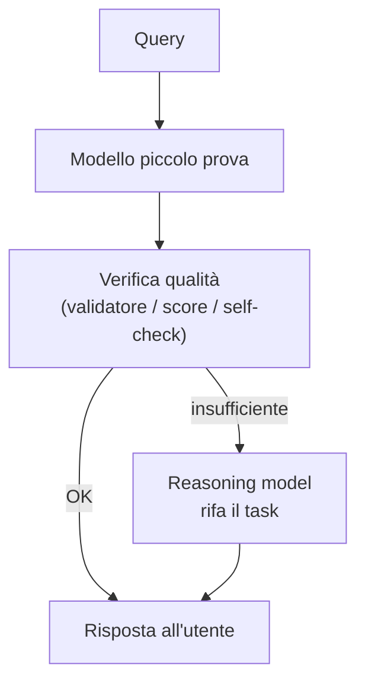

# Caching semantico e model routing

<div class="lesson-meta">
  <span class="badge-stato stabile">Stabile</span>
  <span>Lezione 5.6</span>
  <span>~12 min di lettura</span>
</div>

<p class="lesson-lead">Due pattern architetturali che, fatti bene, abbattono il costo dei sistemi LLM in produzione del 40-70% senza toccare la qualità. Sono richiamati nella 5.3 (triangolo) e nella 6.2 (FinOps), ma meritano la loro pagina: sono decisioni di design, non ottimizzazioni a runtime.</p>

Nella lezione 5.3 hai visto il triangolo qualità-latenza-costo: a parità di qualità, riduci costo e latenza con caching e con strategie di modelli multipli. Nella 0.6 sui reasoning models hai visto che mescolare modelli diretti e modelli pensanti è il pattern standard del 2026. Questa lezione è dove i due fili si annodano in un'architettura concreta.

Il punto da fissare: nessun sistema LLM serio in produzione manda *ogni* richiesta al modello più potente. Sarebbe come avere un'auto sportiva e usarla per andare a comprare il latte sotto casa — funziona, ma è uno spreco grottesco. Le richieste vanno **filtrate, riusate, e instradate** verso il modello che serve davvero.

## Cache esatta vs cache semantica

Nei sistemi software classici la cache è banale: stessa chiave → stesso valore. Memcached, Redis, HTTP cache — tutti funzionano così. Per gli LLM la stessa cache funziona, e ha senso averla, ma copre solo una parte del problema.

**Cache esatta** sui sistemi LLM significa: stessa stringa di input (prompt completo) → stessa risposta. Banale, efficace, latenza zero. Quando funziona? Quando l'input è davvero deterministico e ripetuto: API che chiedono sempre la stessa cosa, prompt costruiti programmaticamente che ripetono pattern identici, batch di documenti standardizzati.

Quando *non* funziona? Nel caso più frequente: utenti veri che fanno domande **simili ma non identiche**. "Come resetto la password?" e "Ho dimenticato la password, come faccio?" producono prompt diversi a livello di stringa. Per la cache esatta sono due richieste distinte. Per il sistema sono la stessa domanda.

Qui entra la **cache semantica**, ed è specifica dell'AI. L'idea: confronti gli input non per stringa identica ma per **significato** — con un embedding, esattamente come fa il RAG. Se la nuova query è abbastanza simile (per coseno) a una già vista, recuperi la risposta in cache invece di chiamare il modello.



Numericamente: in workload tipici customer-facing — domande su prodotti, FAQ, supporto — la cache semantica ben tarata cattura **30-60% delle query** che la cache esatta lascia passare. Su una bolletta da 10.000 €/mese di inferenza, è 3-6.000 € che torna in tasca.

## La trappola della soglia di similarità

La cache semantica ha un parametro che decide tutto: la **soglia di similarità**. Sopra la soglia, il sistema considera due query "uguali" e ritorna la risposta cached. Sotto, va al modello.

- **Soglia troppo alta** (es. 0.95): la cache cattura solo query quasi identiche, lasciando passare tante varianti riformulate. La hit rate è bassa, il risparmio modesto.
- **Soglia troppo bassa** (es. 0.80): la cache colpisce anche query *simili ma diverse* per davvero. "Come resetto la password" e "Come cambio l'indirizzo email" possono avere similarità sopra 0.80 e il sistema ritorna la risposta sbagliata.

La trappola: una cache semantica troppo aggressiva produce errori **silenziosi**. Il sistema risponde — risponde male, ma la cache non sa di aver sbagliato. È peggio di un errore visibile: l'utente prende una risposta confidente che non c'entra.

Le contromisure si stratificano:
- **Calibrare la soglia su un dataset reale**, non a occhio. Prendi 200-500 coppie di query reali, etichettale come "stessa intenzione" / "intenzione diversa", calcola la soglia che massimizza la precisione (pochi falsi positivi) accettando un recall più basso.
- **Soglie diverse per categoria di query.** "Reset password" e "Reset password ora" tollerano una soglia bassa. Domande tecniche con dettagli specifici no: il dettaglio è il punto.
- **Cache solo per certe categorie.** Un classificatore upstream decide se una query è "cacheabile" (FAQ, info statiche) o no (richieste personali con account-specific data).
- **Personalizzazione = no cache.** Se la risposta dipende dall'utente loggato — saldo, ordini, dati personali — la cache semantica è strutturalmente sbagliata. Mai. Punto.

> **Curiosità onesta** — Nel 2024 alcuni gateway LLM avevano la cache semantica attiva di default con soglie aggressive, e qualche team ha scoperto in produzione utenti che ricevevano la risposta di altri utenti sulla stessa query "simile". È diventato il caso da manuale per spiegare *perché* la soglia non si imposta a default e perché query con contesto personale non si cachano.

## Cache: dove la metti

Tre livelli classici, complementari, non alternativi:

**Cache esatta upstream (gateway level).** Prima ancora di chiamare il modello, controlli se quella *esatta* combinazione (modello + prompt + parametri) è già stata servita. Banale. Hit rate basso in volumi user-facing ma quei pochi hit costano zero e arrivano in microsecondi. Sempre attiva.

**Cache semantica (application level).** Sopra le query *user-intent*. Richiede un servizio di embedding + un vector store leggero (Redis con vector search, o un piccolo database vettoriale dedicato). Latenza aggiuntiva: 20-50 ms per la lookup, accettabile contro i 1-3 secondi di una chiamata LLM.

**Prompt caching (model level).** Una tecnica diversa, lato provider: alcuni LLM (Anthropic Claude con il *prompt caching*, OpenAI con *prompt caching* automatico) ti danno uno sconto del 50-90% sui token di input che riconoscono come **già visti** nei prompt precedenti. Non eviti la chiamata, ma paghi una frazione del costo per la parte ripetuta. È particolarmente utile per **system prompt lunghi e RAG context stabile** che si ripetono identici tra una query e l'altra.

I tre livelli si combinano: prompt caching abbatte il costo dei token statici (sistema, few-shot examples, contesto RAG comune), cache esatta cattura le ripetizioni perfette, cache semantica cattura le varianti naturali.

## Model routing: la decisione architetturale del 2026

Il secondo pattern. Anche assumendo zero hit di cache, **non vuoi mandare ogni richiesta al modello migliore**. Il modello migliore è il più costoso e il più lento. Per la maggior parte delle richieste è esagerato.

Il **model routing** è il pattern che instrada la richiesta verso il modello giusto per quella richiesta specifica. È diventato lo standard 2026 perché le opzioni di modelli si sono moltiplicate: modelli piccoli, modelli grandi, reasoning models, modelli specializzati per codice, modelli economici via batch — un sistema serio ne usa 3-5 in parallelo.

Due famiglie di pattern.

### Router upfront (classificazione a priori)

Un piccolo classificatore — può essere un modello leggero (~1B parametri), un modello tradizionale ML, o anche regole esplicite — guarda la query in arrivo e decide *prima* dove mandarla.



**Pro:** veloce (il router decide in millisecondi), economico (la chiamata vera è una sola), prevedibile.
**Contro:** il router può sbagliare. Se classifica un task complesso come semplice, manda al modello piccolo e ottieni una risposta scadente. Se classifica al contrario, paghi 5× il dovuto.

**Quando funziona:** quando le categorie di query sono ben distinte e c'è un signal chiaro nell'input (lunghezza, lessico, presenza di numeri/codice, tipo di richiesta). Customer service tipico è il caso d'uso da manuale.

### Escalation reattiva (cascade)

Più sofisticato. Il modello più piccolo *prova* per primo. Se la sua risposta non passa un **check di qualità**, la query viene **re-instradata** verso un modello più potente.



Il check di qualità può essere:
- **Validatore strutturale** — se l'output deve essere JSON valido o codice che compila, il fail è oggettivo.
- **LLM-as-judge leggero** — un modello giudice (vedi lezione 3.2) dà uno score "questa risposta è soddisfacente?".
- **Signal di self-doubt** — il modello stesso, prompt-ato a dichiarare la sua confidence, ammette "non sono sicuro".
- **Score di calibrazione** — la probabilità che il modello assegna al token finale; bassa confidence interna come segnale.

**Pro:** accuratezza altissima. Il task semplice viene servito dal modello giusto (piccolo, veloce, economico); il task complesso *finisce* sul modello giusto (grande, accurato).
**Contro:** sui task complessi paghi *due* chiamate, non una. Quindi conviene solo se la maggioranza dei task è semplice (>70-80%). Se metà delle query escala, il pattern costa più di un router-upfront sbagliato in eccesso.

**Quando funziona:** è il default nei sistemi 2026 con SLA di qualità seri, dove un singolo errore costa più della media-dei-task. Pattern dominante in code generation (compili → ok / non compili → rifai con modello migliore), structured output (schema valido → ok / non valido → riprova), e agenti con planning (planner piccolo prova → se il piano è troppo corto/incoerente, planner reasoning).

### Variante: routing per **modalità di task**, non per difficoltà

Una terza via che sta emergendo nel 2026: instradare in base al *tipo* di task, non alla sua difficoltà.
- Domande generaliste → modello di tipo X.
- Codice → modello specializzato code (Qwen-Coder, DeepSeek-Coder, Claude).
- Domande in italiano specifico → modello che eccelle nelle lingue europee.
- Long context → modello con finestra estesa nativa.

Questa è la versione "matura" del routing: scegli il modello che ha l'**affinità specifica** per il task, non solo la sua taglia. Richiede che tu conosca i tuoi modelli — benchmark sul tuo task, non sui leaderboard generici.

## Gateway LLM: l'infrastruttura del routing

Per implementare routing e caching senza disseminare logica nel codice applicativo, nel 2025-26 lo standard è il **gateway LLM**: un proxy che sta tra la tua applicazione e i provider, e a cui deleghi cache, routing, fallback, retry, logging, rate limiting.

Da chiamate sparse del tipo:
```python
openai_client.chat.completions.create(model="gpt-5", ...)
anthropic_client.messages.create(model="claude-4", ...)
```

passi a una chiamata uniforme verso il gateway, che dietro le quinte gestisce il resto. I gateway open-source di riferimento 2026 sono **LiteLLM** (più diffuso, multi-provider), **Portkey** (commerciale con buona componente open), **Helicone** (focus su observability), **OpenRouter** (servizio gestito multi-provider).

Vantaggi architetturali:
- **Disaccoppiamento dal provider**: cambi modello/provider senza toccare il codice applicativo.
- **Routing e cache come configurazione**, non come codice sparso.
- **Observability centralizzata**: log, costi, latenza di tutte le chiamate in un punto solo (aggancio a 3.2).
- **Fallback automatico**: se il provider primario va down, il gateway re-instrada al secondario.
- **Rate limiting unificato**: gestisci i budget per cliente/tenant centralmente.

Il rovescio: introduci un single point of failure se non lo rendi HA. Per setup serio, il gateway deve girare in alta disponibilità — o si sposta il problema invece di risolverlo.

## Costi reali: la matematica spicciola che convince

Vediamo i numeri di un workload medio. Mille query/ora user-facing, modello premium a 0.01 € a chiamata.

**Baseline (nessuna ottimizzazione):**
- 1.000 × 0.01 € × 24 × 30 = **7.200 €/mese**.

**Con cache esatta (hit rate 5%):**
- 950 chiamate/ora × 0.01 € × 24 × 30 = **6.840 €/mese**. Risparmio 5%.

**Con cache semantica ben tarata (hit rate aggiuntivo 35%):**
- 615 chiamate/ora × 0.01 € × 24 × 30 = **4.428 €/mese**. Risparmio 38%.

**Con cascade su modello piccolo (70% di chiamate finiscono sul piccolo a 0.002 € l'una, 30% escalano sul premium):**
- Cache copre 385, restano 615 alla pipeline.
- Modello piccolo (615 × 70%) × 0.002 € = 0.86 €/h
- Premium (615 × 30%) × 0.01 € = 1.85 €/h
- Totale: 2.71 €/h × 24 × 30 = **1.951 €/mese**. Risparmio totale 73%.

Queste cifre sono ottimistiche di proposito per illustrare la dinamica: in pratica, la combinazione cache + cascade su workload tipici si attesta intorno al **50-65% di risparmio** netto. Ma il punto è chiaro: l'ottimizzazione non è marginale, è **strutturale**.

E la latenza? Si abbassa anche quella: i hit di cache rispondono in 50 ms invece di 2 secondi, e il modello piccolo del cascade risponde in 0.5 secondi invece di 2. L'utente medio percepisce un sistema *più reattivo*, non solo più economico.

## Cosa NON sono caching e routing

| Il pensiero sbagliato | Come stanno le cose |
|---|---|
| "Cache semantica = cache esatta più furba" | No, sono cose diverse. La semantica può sbagliare; l'esatta no. Vanno usate insieme, con criteri diversi. |
| "Routing è un'ottimizzazione opzionale" | Nel 2026 è un'**architettura**, non un'optimization. Sistemi seri non hanno un modello solo. |
| "Cache semantica funziona sempre" | No, va calibrata sui tuoi dati. E non si applica a contenuti personalizzati per utente: lì è strutturalmente sbagliata. |
| "Cascade costa sempre meno" | No. Cascade costa meno solo se la maggior parte delle query si risolve al primo step. Se metà escala, è più caro del router upfront. |
| "Il gateway è solo plumbing" | Il gateway è dove vive l'**architettura del routing e del caching**. Sceglierlo bene equivale a un pezzo di design. |
| "Più cache è sempre meglio" | Caches multiple non aggiornate generano risposte vecchie. Servono TTL espliciti e meccanismi di invalidazione per contenuti che cambiano. |

> **Il punto da tenere stretto** — Caching e routing **non sono ottimizzazioni a runtime**: sono **decisioni di design** che cambiano l'architettura del sistema. Se le aggiungi come patch a posteriori, sbagli le interfacce. Se le progetti da subito (gateway + cache layer + categorie di routing), entrano naturalmente. L'asso è progettare il sistema per *avere* un router, anche se all'inizio routa tutto verso un solo modello.

## Cosa dura, cosa evitare

<span class="badge-stato stabile">Stabile</span> **I principi**: separare logica di routing dall'applicazione (gateway), combinare cache esatta + semantica, non cacciare contenuti personalizzati, cascade quando la qualità è critica e i task sono in maggioranza semplici. Questi reggono per anni.

<span class="badge-stato evoluzione">In evoluzione</span> **I gateway specifici** (LiteLLM, Portkey, OpenRouter). I leader cambieranno; l'astrazione resta. Disegna il sistema in modo che il gateway sia sostituibile.

<span class="badge-stato evoluzione">In evoluzione</span> **Il prompt caching dei provider.** Anthropic, OpenAI, Google offrono variazioni del meccanismo; i prezzi e le condizioni si stanno assestando. Vale rileggere le pagine prezzi ogni 6 mesi.

<span class="badge-stato rischio">A rischio</span> **Cache semantica come "feature plug-and-play".** Alcuni gateway la offrono con UI a un click e default aggressivi. Tentazione enorme, rischio reale. La cache semantica richiede calibrazione consapevole, non è un toggle.

---

## Verifica di comprensione

> Rispondi a memoria, senza rileggere. Risposte incerte: rivedile **domani**.

1. Cosa cattura la cache semantica che la cache esatta lascia passare?
2. Cos'è la soglia di similarità, e cosa succede se la metti troppo bassa?
3. Quali contenuti non vanno **mai** in cache semantica?
4. Differenza tra router upfront e cascade reattivo: quando uno batte l'altro?
5. Cos'è il prompt caching offerto dai provider, e a quali pezzi del prompt si applica meglio?
6. A cosa serve un gateway LLM, e quale vantaggio architetturale principale dà?
7. *(applicazione)* Stai progettando un assistente B2B con FAQ comuni + dati personalizzati per ogni cliente. Disegna a grandi linee la strategia di cache (cosa cachi e cosa no) e di routing.

---

## Glossario

- **Cache esatta** — riuso della risposta quando l'input è identico a uno già visto.
- **Cache semantica** — riuso della risposta quando l'input è semanticamente simile a uno già visto, misurato via embedding e similarità coseno.
- **Soglia di similarità** — il valore di coseno sopra cui due query sono considerate "uguali" dalla cache semantica. L'iperparametro più delicato.
- **Hit rate / Miss rate** — frazione di richieste servite dalla cache (hit) vs quelle che vanno al modello (miss).
- **TTL (Time-To-Live)** — durata massima di validità di una voce in cache prima di essere considerata stale.
- **Prompt caching** — sconto offerto dai provider sui token di input ripetuti tra chiamate; lavora sul modello, non sull'applicazione.
- **Model routing** — pattern architetturale che instrada la richiesta verso il modello più adatto (per difficoltà, per modalità, per costo).
- **Router upfront** — classifica la query *prima* di chiamare il modello, decide a priori dove mandarla.
- **Cascade / escalation reattiva** — prova un modello piccolo, escala su un modello grande se la qualità è insufficiente.
- **Gateway LLM** — proxy che centralizza routing, cache, fallback, observability, rate limiting verso i provider. Esempi: LiteLLM, Portkey, OpenRouter.
- **Fallback** — meccanismo che instrada automaticamente a un provider/modello alternativo quando il primario fallisce.

---

## Per approfondire

- **LiteLLM** — documentazione del gateway più diffuso nel 2026; copre cache, routing, fallback con configurazione dichiarativa.
- **Anthropic Prompt Caching** e **OpenAI Prompt Caching** — pagine ufficiali dei provider; il pricing e i caveat vanno letti direttamente alla fonte.
- **GPTCache** — libreria open-source per cache semantica LLM; codice leggibile, buona per capire come è fatto sotto.
- **Helicone** — gateway con focus su observability; utile come riferimento di cosa loggare.
- **Paper "FrugalGPT"** (Stanford, 2023) — il primo paper accademico a sistematizzare l'idea di cascade con risparmio dimostrato; concettualmente ancora valido.

*Risorse indicate per la ricerca; cerca le versioni attuali perché il settore si muove.*

---

## Prossima lezione

Hai chiuso la Parte 5: anatomia, pattern, triangolo qualità-latenza-costo, dati, caching e routing. Sai progettare un sistema AI sulla lavagna, ragionare sui trade-off e abbattere i costi con scelte architetturali. Il decision drill **5.5** ti farà esercitare il giudizio su scenari realistici. Dopo, la Parte 6 entra negli aspetti operativi: servire l'inferenza, gestire i costi a runtime, fare monitoring di un sistema vivo.
