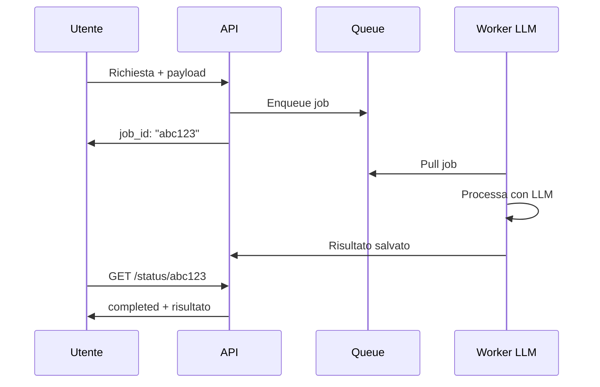

# Pattern di sistema

  Stabile
  Lezione 5.2
  ~10 min di lettura

Sincrono o asincrono, batch o real-time, queue o chiamata diretta: sono le scelte strutturali che determinano come il sistema risponde sotto carico. I pattern vengono dai sistemi distribuiti classici — ma con l'AI cambiano alcuni vincoli, in particolare la latenza e il costo variabile per richiesta.

Nella lezione 5.1 hai visto i componenti. Qui la domanda è come li colleghi. Due sistemi con gli stessi componenti ma pattern diversi hanno latenza, costo, e resilienza completamente diversi. La scelta del pattern avviene in fase di design — cambiarlo dopo è costoso.

## Il vincolo nuovo: latenza e costo variabile

Nei sistemi tradizionali, il costo per richiesta è relativamente stabile e prevedibile. Con un LLM, no: una richiesta che genera 50 token costa pochi centesimi; una che genera 2000 token — o che passa per un agente con 8 iterazioni — può costare 10-50 volte di più. E la latenza varia nella stessa proporzione.

Questo rende il **dimensionamento** più difficile e il **controllo del costo** più critico. I pattern scelti devono tenere conto di questa variabilità.

## Pattern 1 — Sincrono request-response

L'utente manda una richiesta, aspetta la risposta, la riceve. Il pattern più semplice e quello che la maggior parte delle persone immagina.

**Quando funziona:** latenza accettabile per l'utente (< 5-10 secondi), richiesta singola, nessuna dipendenza da sistemi lenti.

**Problema con l'AI:** la generazione di un testo lungo può richiedere 10-30 secondi. Una connessione HTTP che aspetta così tanto è fragile (timeout del client, del proxy, del load balancer). La soluzione è lo **streaming** — il modello invia i token man mano che li genera, invece di aspettare la risposta completa.

Lo streaming non riduce il tempo totale di generazione: riduce il tempo alla prima parola (*time to first token* — TTFT). L'utente vede la risposta che cresce, come su ChatGPT, invece di una schermata vuota per 15 secondi e poi testo che appare tutto insieme.

## Pattern 2 — Asincrono con job queue

L'utente manda una richiesta, riceve un job ID, può verificare lo stato in un secondo momento (polling o webhook). La richiesta viene accodata e processata quando ci sono risorse disponibili.

**Quando è la scelta giusta:**
- Elaborazione di documenti, immagini, audio — task che richiedono secondi o minuti
- Batch di richieste di diversi utenti da processare insieme
- Task dove la latenza non è critica (report generati di notte, analisi post-evento)
- Sistemi con picchi di carico irregolari — la queue assorbe i picchi invece di sovraccaricare il sistema

**Il vantaggio nascosto:** con una queue, puoi controllare esattamente il rate di consumo — n worker, m richieste al minuto. Questo è fondamentale per rispettare i rate limit dei provider LLM.

## Pattern 3 — Batch processing

Un insieme di richieste viene raggruppato ed elaborato insieme, tipicamente in finestre temporali (ogni ora, ogni notte). Non è un job queue — è elaborazione pianificata.

**Quando usarlo:**
- Indicizzazione di un corpus di documenti per RAG (si fa una volta, poi si aggiorna incrementalmente)
- Generazione di embedding per migliaia di item
- Report periodici su dati accumulati
- Fine-tuning o evaluation su dataset

**Vantaggio economico:** molti provider offrono **Batch API** con tariffe ridotte (tipicamente 50% in meno) per elaborazioni non urgenti con latenza di ore. Se il task non ha vincoli real-time, è quasi sempre conveniente.

## Pattern 4 — Streaming con gestione del flusso

Estensione del pattern sincrono per i casi in cui il modello è parte di una pipeline che deve processare dati in arrivo continuamente — es. analisi di log in tempo reale, trascrizione + analisi di audio in streaming, monitoring di feed social.

La differenza rispetto al semplice streaming della risposta: qui l'**input** è un flusso, non una singola richiesta. Richiede architettura event-driven con broker di messaggi (Kafka, Pub/Sub) e gestione dello stato tra eventi.

In evoluzione I pattern di streaming per l'AI si stanno consolidando ma non c'è ancora una best practice universale. Framework come LangGraph supportano workflow stateful; i cloud provider stanno aggiungendo primitive native per l'AI streaming.

## Scegliere il pattern: la griglia

| Caratteristica del task | Pattern consigliato |
|---|---|
| Risposta interattiva, latenza < 10s | Sincrono + streaming |
| Task lungo (> 30s) con utente in attesa | Asincrono (job ID + polling/webhook) |
| Migliaia di documenti da processare | Batch (anche con Batch API del provider) |
| Picchi di carico irregolari | Asincrono con queue |
| Input continuo (eventi, log, audio) | Streaming event-driven |
| Report notturni, indicizzazione | Batch schedulato |

## Composizione di pattern

I sistemi reali combinano pattern diversi per parti diverse del flusso.

**Esempio tipico:** un sistema di analisi documenti.
- L'upload del documento → asincrono (job queue), risposta immediata con job ID
- L'elaborazione in background → batch per l'embedding, sincrono per le query dell'utente sul documento già indicizzato
- Il report finale → webhook quando pronto

Non è necessario usare lo stesso pattern per tutto il sistema. La scelta si fa task per task.

## Il rate limiting e il backpressure

Con i LLM, il rate limiting del provider è un vincolo reale: OpenAI, Anthropic, Google hanno limiti su richieste al minuto e token al minuto. Superarli produce errori 429 (Too Many Requests).

**Backpressure** — il meccanismo con cui un componente "rallenta" i componenti a monte quando è sovraccarico. In un sistema con queue, la queue esercita backpressure naturale: se i worker non riescono a smaltire, la queue cresce e il sistema rallenta l'accettazione di nuove richieste. Meglio un rallentamento controllato che un crash.

I pattern corretti per gestire il rate limiting:
- **Retry con exponential backoff** — in caso di 429, riprova dopo 1s, poi 2s, poi 4s, ecc. Non fare retry immediati.
- **Coda con rate controller** — il worker consuma dalla queue a un rate controllato, sotto i limiti del provider.
- **Circuit breaker** — se il provider fallisce ripetutamente, smetti di chiamarlo per un periodo e usa un fallback.

## Cosa NON è un pattern di sistema

| Il pensiero sbagliato | Come stanno le cose |
|---|---|
| "Sincrono è sempre il più semplice" | Sincrono con task lunghi produce timeout e UX pessima. Lo streaming è quasi sempre meglio. |
| "Con una queue risolvo tutto" | La queue introduce complessità di stato, idempotenza, dead letter queue. Va usata quando necessario, non per default. |
| "Il batch è lento quindi peggio" | Il batch è ottimale per volume alto con latenza non critica. Spesso il 50% più economico. |
| "Il rate limiting è un problema del provider" | È un vincolo architetturale che devi gestire nel tuo sistema. Il provider non si adatta a te. |

---

## Verifica di comprensione

> Rispondi a memoria. Le incerte rivedile domani.

1. Qual è la differenza tra latenza totale e TTFT (*time to first token*)? Perché lo streaming migliora l'esperienza senza ridurre la latenza totale?
2. Quando scegli un pattern asincrono con queue rispetto a un sincrono?
3. Cos'è il backpressure e perché è utile?
4. Un'azienda deve generare embedding per 500.000 prodotti. Quale pattern usi e perché?
5. Come gestisci un errore 429 dal provider LLM in un sistema sincrono?

---

## Glossario

- **TTFT** — Time to First Token; il tempo che passa dalla richiesta all'arrivo del primo token nella risposta in streaming.
- **Job queue** — coda di lavori asincroni; i job vengono accodati e processati da worker indipendentemente dalla richiesta originale.
- **Backpressure** — meccanismo con cui un componente satura rallenta i componenti a monte per evitare sovraccarico.
- **Circuit breaker** — pattern che "apre il circuito" (smette di chiamare un servizio) quando rileva troppi fallimenti consecutivi, dando tempo al servizio di recuperare.
- **Exponential backoff** — strategia di retry che aumenta esponenzialmente il tempo di attesa tra un tentativo e il successivo.
- **Batch API** — variante dell'API del provider con tariffe ridotte per elaborazioni non urgenti con latenza di ore.

---

## Per approfondire

- **Documentazione delle Batch API** di OpenAI, Anthropic, Google — ogni provider documenta i propri limiti e le proprie tariffe batch.
- **"Designing Data-Intensive Applications"** di Martin Kleppmann — il riferimento classico sui pattern dei sistemi distribuiti; i capitoli su queue e stream si applicano direttamente.

*Risorse indicate per la ricerca; per i link aggiornati conviene cercarli al momento.*

---

## Prossima lezione

**5.3 Il triangolo qualità-latenza-costo.** Scelti i pattern, la domanda diventa: come calibri i parametri per stare dentro i vincoli? Ogni decisione (modello, temperatura, lunghezza del contesto, caching) sposta il sistema su questo triangolo. Capire il trade-off permette di ottimizzare invece di indovinare.
