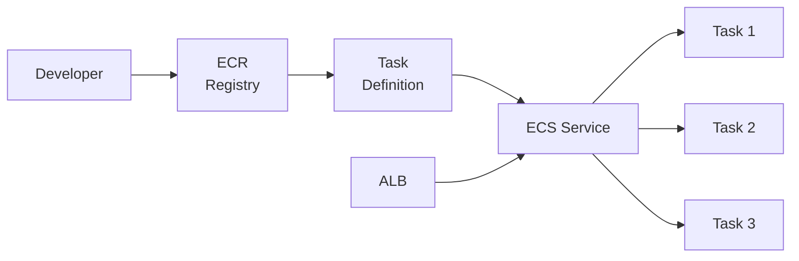

# Compute su AWS

  In evoluzione
  Lezione 5.2
  ~13 min di lettura

EC2, ECS/Fargate e Lambda sono i tre livelli di astrazione del compute su AWS. Stessa logica della lezione 2.3 — ora con prezzi reali, nomi reali, e le scelte che si fanno davvero in un progetto.

In 2.3 hai visto lo spettro VM → Container → Serverless in astratto. Qui quei concetti prendono un nome AWS e un numero in dollari. Il framework decisionale non cambia — cambia che adesso puoi aprire la console e farlo davvero.

## EC2 — la VM di AWS

**EC2** (*Elastic Compute Cloud*) è la VM di AWS. Scegli un tipo di istanza, un sistema operativo (via **AMI** — *Amazon Machine Image*, un'immagine precostituita), una regione, e hai una macchina virtuale che gira finché non la fermi.

I tipi di istanza seguono una logica: `famiglia.dimensione`. La famiglia dice il workload ottimizzato:
- `t4g`, `t3`: uso generale, *burstable* (CPU con crediti che accumuli a basso utilizzo e spendi a picco) — per workload variabili, dev/test, siti a traffico moderato.
- `m7g`, `m6i`: uso generale bilanciato CPU/RAM — per la maggior parte delle applicazioni in produzione.
- `c7g`, `c6i`: *compute optimized* — per CPU-intensive, encoding video, HPC.
- `r7g`, `r6i`: *memory optimized* — per database in-memory, cache, analytics.
- `p4`, `g5`: GPU — per ML training e inference.

La dimensione (`nano`, `micro`, `small`, `medium`, `large`, `xlarge`, `2xlarge`...) scala CPU e RAM in modo proporzionale.

**Prezzi di riferimento** (`us-east-1`, maggio 2026, on-demand):
- `t3.micro`: ~$0.0104/ora → ~$7.5/mese
- `t3.medium`: ~$0.0416/ora → ~$30/mese
- `m5.large`: ~$0.096/ora → ~$69/mese
- `m5.xlarge`: ~$0.192/ora → ~$138/mese

Le istanze **Spot** costano fino al 90% in meno ma possono essere terminate con 2 minuti di preavviso quando AWS ne ha bisogno. Per workload interrompibili (batch, ML training, rendering) sono la scelta ovvia. Per un'applicazione web in produzione, no.

Le istanze **Reserved** (1 o 3 anni) danno sconto del 30-60% in cambio di un impegno. Ha senso solo su workload stabili e previsti. I **Savings Plans** (più flessibili delle Reserved) coprono EC2 + Lambda + Fargate con un impegno di spesa oraria.

Storage su EC2: EBS, Instance Store, e cosa succede allo spegnimento

Ogni istanza EC2 ha un disco principale — per default un volume **EBS** (*Elastic Block Store*). EBS è storage persistente: i dati sopravvivono allo stop e al restart dell'istanza. Quando termini (distruggi) l'istanza, il volume EBS viene cancellato per default — ma puoi configurarlo per tenerlo.

**Instance Store** è diverso: è storage fisicamente attaccato all'host su cui gira la VM. Velocissimo, ma **non persiste**: se l'istanza si ferma, i dati spariscono. Utile come cache locale, buffer temporaneo, working directory per job di ML.

Tipi EBS comuni:
- `gp3` (*General Purpose SSD v3*): il default attuale. 3000 IOPS base, fino a 16000 IOPS configurabili separatamente dalla dimensione. Per la maggior parte dei workload.
- `io2` (*Provisioned IOPS SSD*): per database che richiedono IOPS garantiti e bassissima latenza.
- `st1` (*Throughput Optimized HDD*): per big data, data warehouse — sequenziale, economico, bassa latenza non garantita.

EBS ha snapshot incrementali verso S3 — ogni snapshot dopo il primo salva solo le differenze. Costo: ~$0.05/GB/mese. Ricordati di eliminare gli snapshot obsoleti: si accumulano in silenzio.

## ECS + Fargate — container gestiti

**ECS** (*Elastic Container Service*) è il servizio AWS per eseguire container senza dover gestire Kubernetes. Il concetto di orchestrazione l'hai visto in 2.2 — qui ECS è la versione AWS-nativa, più semplice da operare di EKS.

ECS ha due modalità di lancio:
- **EC2 launch type**: sei tu a gestire il cluster di istanze EC2 su cui girano i container. Più controllo, più responsabilità.
- **Fargate**: AWS gestisce l'infrastruttura sottostante — tu dichiari CPU e RAM del container, AWS trova dove farlo girare. Zero gestione di server. È il modo più comune per chi non ha un team DevOps dedicato.

Le unità base di ECS:
- **Task Definition**: il blueprint del container — immagine Docker, CPU, RAM, variabili d'ambiente, port mapping, policy IAM.
- **Task**: un'istanza in esecuzione di una Task Definition — un container (o gruppo di container side-car) che gira.
- **Service**: mantiene un numero target di Task in esecuzione, gestisce rolling update, integra con il load balancer.
- **Cluster**: contenitore logico per Task e Service.

**Prezzi Fargate** (`us-east-1`):
- CPU: ~$0.04048/vCPU/ora
- RAM: ~$0.004445/GB/ora
- Un task con 0.5 vCPU e 1 GB RAM costa ~$0.025/ora → ~$18/mese se gira 24/7.

Fargate ha un overhead rispetto a EC2 (~10-20% più costoso a parità di risorse), ma azzera il costo operativo di gestione dei server. Per team piccoli, spesso ne vale la pena.

**Integrazione con ECR**: le immagini container si spingono su **ECR** (*Elastic Container Registry*) — il registry managed di AWS. Si autentica con IAM, si usa come Docker Hub ma privato e integrato con ECS/Lambda. Costo: ~$0.10/GB/mese di storage + $0.09/GB di data transfer fuori da AWS.

## Lambda — serverless su AWS

**Lambda** è la funzione serverless di AWS. Carica codice (Python, Node.js, Java, Go, .NET, Ruby — o un container Docker), definisci il trigger, AWS esegue quando arriva un evento e non esegue mai altrimenti.

Il modello di prezzo Lambda è diverso da EC2 e Fargate:
- **Requests**: $0.20 per 1 milione di invocazioni
- **Duration**: $0.0000166667 per GB-secondo

Un calcolo concreto: funzione Python con 128 MB di memoria, tempo medio 100ms, 1 milione di invocazioni/mese:
- Requests: $0.20
- Duration: 1M × 0.1s × 0.128 GB × $0.0000166667 = **$0.21**
- Totale: **~$0.41/mese**

Confronto: lo stesso carico su un `t3.micro` (~$7.5/mese) su cui l'applicazione gira 24/7 non converge — ma se il traffico non è distribuito uniformemente (picchi la sera, silenzio la notte), Lambda vince nettamente.

I **trigger** sono il cuore del modello Lambda: cosa fa partire la funzione:
- **API Gateway / ALB**: richieste HTTP → Lambda come backend HTTP
- **SQS**: messaggi in coda → Lambda come worker
- **S3 events**: file caricato → Lambda per processing
- **EventBridge**: evento schedulato (cron) o da altro servizio
- **DynamoDB Streams / Kinesis**: stream di dati → Lambda per processing real-time

**Cold start** (già visto in 2.3) in Lambda: la prima invocazione dopo un periodo di inattività avvia un nuovo container — latenza da 100ms (Python, Node) a 2-5s (Java, .NET senza ottimizzazioni). **Provisioned Concurrency** mantiene N istanze precaldate a costo fisso (~$0.015/GB-ora), eliminando il cold start per le funzioni critiche in latenza.

**Limiti Lambda da tenere a mente**:
- Timeout massimo: 15 minuti (non per le API sincrone: usa 29s come massimo pratico dietro API Gateway)
- Payload massimo: 6 MB sincrono, 256 KB per SQS
- Memoria: 128 MB – 10 GB
- Storage effimero `/tmp`: 512 MB default, fino a 10 GB

Lambda Layers e dipendenze

Le dipendenze (librerie Python, npm packages) si possono includere nel deployment package — un ZIP con il codice e le librerie. Se le librerie pesano molto (es. `pandas`, `numpy`), il pacchetto diventa grande e lento da deployare.

I **Lambda Layers** sono un meccanismo per condividere dipendenze tra funzioni: crei un layer con le librerie, lo attacchi alle funzioni che ne hanno bisogno. Il layer viene cachato separatamente e non si ricarica a ogni deploy della funzione. Limite: fino a 5 layer per funzione, 250 MB decompressi totali.

Con i container Lambda (immagine Docker fino a 10 GB) le dipendenze vanno nell'immagine e il problema si riduce — al costo di cold start leggermente più lenti.

## Quando scegliere cosa

Il framework decisionale di 2.3 si traduce in scelte AWS concrete:

| Criterio | EC2 | ECS/Fargate | Lambda |
|---|---|---|---|
| Workload | Sostenuto, prevedibile | Sostenuto, containerizzato | Spiky, event-driven |
| Stato | Stateful (database, file locali) | Stateful con EFS/EBS | Stateless |
| Durata task | Ore/giorni | Minuti/ore | Max 15 min |
| Startup time | Minuti | 5-30 secondi | 100ms-5s |
| Controllo OS | Pieno | Parziale | Nessuno |
| Costo base | Fisso (anche a vuoto) | Fisso (anche a vuoto) | Zero a vuoto |
| Ops | Alta | Media | Bassa |

**Regola pratica 2026**: inizia con Lambda se il workload è event-driven o hai poco traffico. Passa a Fargate quando Lambda non basta (timeout, memoria, latenza). Valuta EC2 solo se hai bisogno di controllo fine sull'OS o hai un database che gira sulla VM.

## Cosa non è

| Il pensiero sbagliato | Come stanno le cose |
|---|---|
| "Lambda è sempre più economico di EC2" | Lambda conviene su workload spiky o a basso volume. Per un'API con 1000 req/secondo di traffico sostenuto, EC2 o Fargate costano meno. |
| "Fargate è Kubernetes" | Fargate è un modo di eseguire container senza gestire server — ECS è l'orchestratore, non K8s. EKS è il servizio AWS per Kubernetes, ed è più complesso. |
| "Le istanze EC2 si fermano da sole" | No. Un'istanza running ti costa anche se non ci gira niente sopra. Devi fermarla esplicitamente o usare Lambda/Fargate che si azzerano quando non c'è traffico. |
| "Spot instances sono rischiose per tutto" | Sono rischiose solo per workload che non possono essere interrotti. Per ML training (con checkpoint), batch, CI runner sono la scelta razionale: 90% di risparmio con architettura adeguata. |

## Verifica di comprensione

> Rispondi a memoria. Le risposte incerte rivedile domani.

1. Cos'è un AMI e a cosa serve quando lanci un'istanza EC2?
2. Qual è la differenza tra EC2 launch type e Fargate in ECS?
3. Un'applicazione Lambda ha latenza di 3 secondi sulla prima richiesta, poi 50ms. Qual è la causa e come si risolve?
4. Nomina tre trigger comuni per una funzione Lambda.
5. Quando conviene usare Spot instances?
6. Quanto costa (approssimativamente) tenere una Lambda Python da 128 MB attiva per 1 milione di invocazioni da 100ms?
7. *(anticipazione)* Hai una Lambda che deve salvare risultati su S3. Come gli dai accesso senza inserire credenziali nel codice?

## Glossario della lezione

- **EC2** (*Elastic Compute Cloud*): servizio VM di AWS. Scegli tipo istanza, OS, e hai un server virtuale.
- **AMI** (*Amazon Machine Image*): immagine precostituita di un sistema operativo per avviare istanze EC2.
- **Istanza Spot**: istanza EC2 a costo ridotto (fino al 90%) che AWS può terminare con 2 minuti di preavviso.
- **Savings Plans**: impegno di spesa oraria su AWS in cambio di sconto su EC2, Lambda, Fargate.
- **ECS** (*Elastic Container Service*): orchestratore di container managed di AWS.
- **Fargate**: modalità di esecuzione ECS/EKS senza gestione server — AWS gestisce l'host.
- **Task Definition**: blueprint ECS che definisce container, risorse, permessi.
- **ECR** (*Elastic Container Registry*): registry Docker managed di AWS, integrato con ECS e Lambda.
- **Lambda**: servizio serverless AWS — esegue codice su evento, paga solo il tempo di esecuzione.
- **Cold start**: latenza alla prima invocazione Lambda dopo inattività, dovuta all'avvio del container.
- **Provisioned Concurrency**: istanze Lambda pre-riscaldate che eliminano il cold start, a costo fisso.
- **EBS** (*Elastic Block Store*): storage a blocchi persistente per istanze EC2.

## Per approfondire

- **AWS EC2 pricing**: cerca "Amazon EC2 pricing" su `aws.amazon.com/ec2/pricing` — il calcolatore ufficiale con tutti i tipi istanza.
- **AWS Lambda pricing**: `aws.amazon.com/lambda/pricing` — calcolatore con esempi per casi d'uso comuni.
- **AWS Fargate pricing**: `aws.amazon.com/fargate/pricing` — confronto con EC2 per decidere la modalità.

## Prossima lezione

Sai come far girare il codice su AWS. La prossima lezione copre come i componenti si parlano in modo asincrono: SQS (code), SNS (pub/sub), EventBridge (event bus), Step Functions (orchestrazione di workflow). I concetti li hai già dalla lezione 2.4 — qui prendono forma con i servizi AWS reali.
