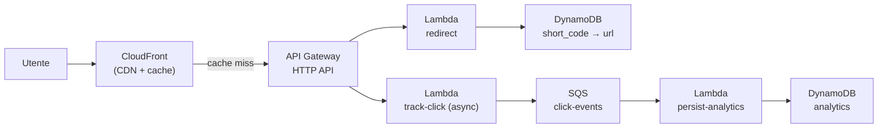

# Decision drill — URL shortener su AWS

<div class="lesson-meta">
  <span class="badge-stato stabile">Stabile</span>
  <span>Lezione 4.8</span>
  <span>~10 min di lettura</span>
</div>

<p class="lesson-lead">URL shortener completo su AWS — il progetto-tipo che i colloqui cloud del 2026 usano per capire se sai disegnare un sistema reale. Non è complesso di per sé: è un test di giudizio architetturale, costi, sicurezza e monitoring.</p>

Questo drill è diverso dai precedenti. Non c'è una risposta singola "giusta" — ci sono scelte difendibili e scelte che rivelano gap di comprensione. L'obiettivo è farti ragionare come un architetto cloud junior che spiega le sue decisioni, non come qualcuno che recita una lista di servizi.

---

## Lo scenario

**Contesto**: startup che vuole lanciare un servizio di URL shortening — tipo bit.ly. Requisiti:
- Crea URL corte (`https://srt.io/abc123` → `https://sito-lungo.com/path/lungo`)
- Redirect HTTP 301/302 in meno di 100ms
- Traccia click (timestamp, user-agent, IP anonimizzato)
- Gestisce fino a 10.000 redirect/secondo nei momenti di picco
- Budget infrastruttura: &lt;$100/mese a regime
- Team di 2 sviluppatori, nessun ops dedicato
- Conformità GDPR per i dati di tracking (IP anonimizzato)

**Domande**:

1. Disegna l'architettura AWS. Quali servizi usi? Giustifica ogni scelta.
2. Dove memorizzi la mappatura short_code → URL originale?
3. Come gestisci i 10.000 redirect/secondo senza saturare il backend?
4. Qual è il tuo modello IAM? Chi ha accesso a cosa?
5. Come sai se il sistema funziona? Quali metriche e alert configuri?
6. Stima il costo mensile a 1 milione di redirect/giorno.

---

<details>
<summary>Griglia di valutazione — cosa nominerebbe un senior</summary>

### Architettura difendibile



**CloudFront come prima difesa**: la maggior parte dei redirect per URL popolari viene servita dalla CDN senza toccare il backend. Un redirect `301` (permanente) rimane in cache nel browser dell'utente; un redirect `302` (temporaneo) passa dal backend ogni volta. Scegliere 302 permette di aggiornare il target senza invalidare il cache del browser — ma costa in termini di carico. La scelta tra 301 e 302 è una decisione di prodotto, non solo tecnica.

**DynamoDB per la mappatura**: accesso per chiave (`short_code`), latenza single-digit ms, nessun problema di connessioni con Lambda. La partition key è `short_code`. Schema minimo:

```
short_code (PK) | original_url | created_at | created_by | expires_at (TTL)
```

TTL per gli URL che scadono — DynamoDB li cancella automaticamente.

**Tracking asincrono**: la Lambda di redirect non aspetta la persistenza del click. Mette un evento su SQS e risponde subito. Una seconda Lambda legge da SQS e scrive l'analytics su DynamoDB (o su S3 per aggregazioni future). Così il redirect è veloce e il tracking non è nel critical path.

**Generazione dello short_code**: 6 caratteri alfanumerici (a-z, A-Z, 0-9) = 62^6 = ~56 miliardi di combinazioni. Per generarli: UUID v4 troncato a 6 caratteri + check di collisione su DynamoDB (ConditionalWrite — scrivi solo se `short_code` non esiste già). Se collisione, ritenta con un altro codice.

### Modello IAM

**IAM Role per Lambda redirect**:
```json
{
  "Statement": [{
    "Effect": "Allow",
    "Action": ["dynamodb:GetItem"],
    "Resource": "arn:aws:dynamodb:eu-west-1:123456789:table/short-urls"
  }, {
    "Effect": "Allow",
    "Action": ["sqs:SendMessage"],
    "Resource": "arn:aws:sqs:eu-west-1:123456789:click-events"
  }]
}
```

Principio del **least privilege**: la Lambda di redirect ha solo `GetItem` su DynamoDB (non `PutItem`, non `DeleteItem`) e `SendMessage` su SQS (non `ReceiveMessage`). Ogni Lambda ha il suo IAM Role con i permessi minimi necessari.

**IAM Role per Lambda persist-analytics**: solo `PutItem` su DynamoDB analytics e `ReceiveMessage`/`DeleteMessage` su SQS.

### Metriche e alert

| Cosa monitorare | Metrica CloudWatch | Alert |
|---|---|---|
| Redirect falliti | Lambda `Errors` / `Invocations` | Error rate > 1% per 2 minuti |
| Latenza redirect | Lambda `Duration` P99 | P99 > 80ms per 5 minuti |
| Coda SQS che cresce | `ApproximateAgeOfOldestMessage` | Age > 60 secondi |
| DynamoDB throttling | `ThrottledRequests` | Qualsiasi throttle |
| API Gateway 5xx | `5XXError` | > 0.5% per 3 minuti |

Alert → SNS Topic → email del team + canale Slack. Non PagerDuty per un team di 2 a budget contenuto.

X-Ray attivo sulla Lambda di redirect per tracciare la breakdown di latenza (quanto va su DynamoDB, quanto su SQS).

### Stima costi

A 1 milione di redirect/giorno (~30M/mese):

| Servizio | Calcolo | Costo/mese |
|---|---|---|
| Lambda redirect | 30M invocazioni × ~10ms × 128MB | ~$1.50 |
| Lambda tracking | 30M invocazioni × ~5ms × 128MB | ~$0.75 |
| Lambda persist | 30M invocazioni × ~20ms × 128MB | ~$1.50 |
| API Gateway HTTP API | 30M richieste × $1/milione | ~$30 |
| DynamoDB on-demand | 30M read (redirect) + 30M write (analytics) | ~$15 |
| SQS | 30M messaggi × $0.40/milione | ~$12 |
| CloudFront | ~30M request (assume 50% cache hit → 15M origin) + ~50GB transfer | ~$10 |
| CloudWatch Logs | ~5GB/mese | ~$2.50 |
| **Totale stimato** | | **~$73/mese** |

Dentro il budget di $100/mese. Se il traffico 10x, i costi scalano in modo prevedibile (tutto pay-per-use).

### Trappole comuni che rivelano gap

- **Usare RDS invece di DynamoDB**: accesso per chiave, nessuna query relazionale → DynamoDB è la scelta naturale. RDS aggiunge costi fissi (~$15-30/mese per `db.t3.micro`) e il problema connection pooling con Lambda.
- **Fare tracking sincrono**: se la scrittura dell'analytics è nel critical path del redirect, rallenta la risposta e aumenta la latenza percepita dall'utente.
- **Dimenticare CloudFront**: senza CDN, ogni redirect è una chiamata API Gateway + Lambda + DynamoDB. Con CloudFront, gli URL popolari vengono serviti dalla cache edge.
- **IAM Role unico per tutte le Lambda**: antipattern. Le Lambda hanno requisiti di accesso diversi; un unico role con tutti i permessi viola il least privilege.
- **Nessun alert sulla coda SQS**: se la Lambda di persist-analytics smette di funzionare, la coda cresce indefinitamente. L'alert su `ApproximateAgeOfOldestMessage` lo cattura in minuti.
- **301 per default senza rifletterci**: un 301 viene cachato dal browser dell'utente per sempre (o finché non svuota la cache). Se vuoi poter aggiornare il target dell'URL corta, usa 302. Se l'URL è definitiva, 301 riduce il carico sul backend.

### GDPR e IP anonimizzato

Il requisito di anonimizzare l'IP non è un dettaglio: è obbligatorio per GDPR se raccogli dati di navigazione di utenti EU. L'approccio standard è troncare l'IP nella Lambda di tracking prima di passarlo su SQS (`10.20.30.40` → `10.20.30.0`). Non servono servizi aggiuntivi — basta farlo nel codice prima di serializzare il messaggio.

</details>

---

## Riflessione finale

La Parte 4 ti ha portato dall'orientarsi nella console AWS alla capacità di disegnare un sistema completo con compute, storage, networking, IaC e monitoring. Questo drill è il test che mette insieme tutti i pezzi.

Se hai risposto alle domande prima di aprire la griglia — e sei riuscito a giustificare le scelte principali (DynamoDB vs RDS, tracking asincrono, IAM per Lambda) — hai la comprensione giusta per affrontare scenari reali e colloqui su cloud architecture.

Le prossime Parti del percorso entrano nel cloud avanzato: multi-region, disaster recovery, FinOps, sicurezza enterprise. Ma i fondamentali che hai ora — modelli di servizio, prezzi, pattern di integrazione, IAM, observability — sono la base su cui tutto il resto si costruisce.
