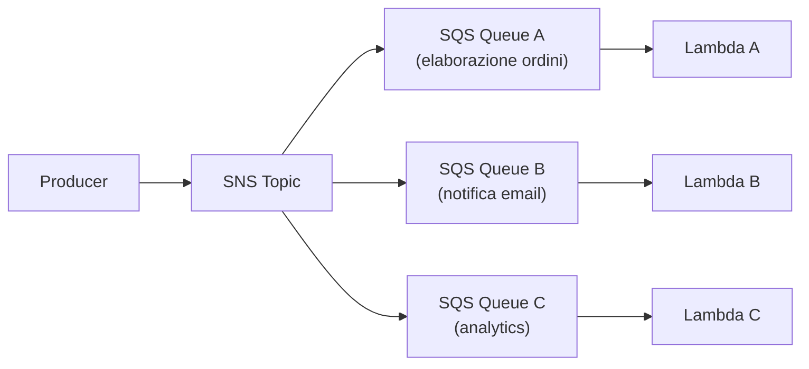
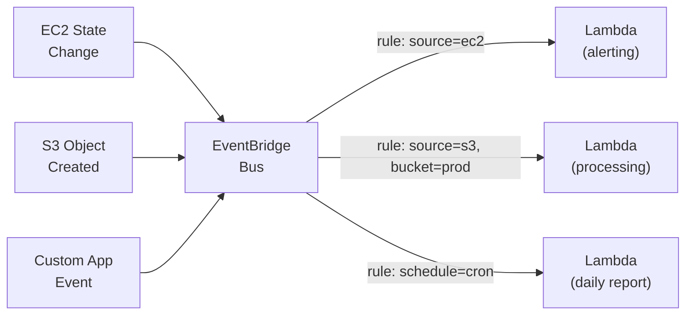

# Messaggistica ed eventi su AWS

<div class="lesson-meta">
  <span class="badge-stato evoluzione">In evoluzione</span>
  <span>Lezione 4.3</span>
  <span>~12 min di lettura</span>
</div>

<p class="lesson-lead">SQS, SNS, EventBridge e Step Functions sono i quattro mattoni della comunicazione asincrona su AWS. I concetti li hai già dalla lezione 2.4 — qui ogni concetto ha un nome, un prezzo, e un comportamento specifico da conoscere.</p>

In 2.4 hai visto perché l'asincrono batte il sincrono su certi workload: disaccoppiamento, resilienza, elaborazione indipendente. Ora quei pattern diventano servizi reali. La mappa è semplice: **SQS** per le code, **SNS** per il pub/sub, **EventBridge** per l'event bus con routing avanzato, **Step Functions** per orchestrare workflow complessi con stato.

## SQS — code di messaggi

**SQS** (*Simple Queue Service*) è il servizio di code AWS. Il produttore manda un messaggio alla coda, il consumatore lo legge quando è pronto. La coda fa da buffer tra i due — se il consumatore è lento, i messaggi aspettano.

SQS ha due varianti:
- **Standard Queue**: throughput illimitato, consegna *at-least-once* (un messaggio può arrivare più volte), ordine *best-effort* (non garantito). Per la maggior parte dei workload.
- **FIFO Queue**: ordine garantito, consegna *exactly-once* (deduplication ID), throughput limitato a 3000 messaggi/secondo con batching. Per workload dove l'ordine conta (transazioni finanziarie, sequenze di comandi).

Parametri chiave di SQS:
- **Visibility Timeout**: dopo che un consumatore legge un messaggio, il messaggio diventa invisibile agli altri consumatori per un periodo (default 30s). Se il consumatore non lo elimina entro quel tempo (perché ha fallito), il messaggio torna visibile. Serve per garantire che almeno un consumatore lo elabori.
- **Message Retention Period**: quanto a lungo SQS tiene i messaggi non consumati (default 4 giorni, max 14).
- **DLQ** (*Dead Letter Queue*): dopo N tentativi falliti, i messaggi finiscono in una coda separata per l'ispezione. È il meccanismo per gestire i messaggi "poison" — quelli che crashano il consumatore a ripetizione.

**Prezzo SQS**: ~$0.40 per 1 milione di richieste (Standard). Le prime 1 milione/mese sono gratuite. A volumi normali è praticamente gratis.

**Lambda + SQS**: il pattern più comune. Lambda legge da SQS in batch (fino a 10 messaggi per invocazione), elabora, e SQS elimina i messaggi elaborati con successo. Se Lambda fallisce, i messaggi restano nella coda e vengono riprocessati. Dopo N fallimenti → DLQ.

## SNS — pub/sub fan-out

**SNS** (*Simple Notification Service*) è il servizio pub/sub di AWS. Un produttore pubblica su un **topic** SNS; tutti i sottoscrittori (*subscriber*) ricevono il messaggio in parallelo. È il fan-out: un evento → N destinatari.

I subscriber SNS possono essere: Lambda, SQS (il pattern più usato), HTTP endpoint, email, SMS, AWS mobile push.

Il pattern **SNS → SQS** è il pattern di fan-out standard:



SNS senza SQS manda il messaggio direttamente a Lambda o HTTP — ma se il destinatario è down, il messaggio si perde. SNS + SQS aggiunge il buffer: se Lambda è down, i messaggi aspettano in SQS. Il combo è quasi sempre preferibile al solo SNS.

**SNS Message Filtering**: ogni sottoscrittore può definire un filtro sugli attributi del messaggio. Es. il subscriber "notifica-email" riceve solo i messaggi con `event_type: "order_completed"`, non tutti. Questo evita di mandare ogni messaggio a ogni subscriber per poi scartarlo dentro la Lambda.

**Prezzo SNS**: ~$0.50 per 1 milione di notifiche. Praticamente gratis a volumi normali.

## EventBridge — event bus con routing intelligente

**EventBridge** è l'event bus managed di AWS. Più potente di SNS per due motivi: **routing rules** basate sul contenuto dell'evento (non solo sugli attributi) e integrazione con decine di servizi AWS come sorgenti native.

L'architettura base: eventi entrano nel **bus**, le **rules** filtrano e instradano verso i **target**.



**Event pattern matching**: le rule di EventBridge matchano su qualsiasi campo del JSON dell'evento. Es.:

```json
{
  "source": ["aws.s3"],
  "detail-type": ["Object Created"],
  "detail": {
    "bucket": { "name": ["mio-bucket-prod"] },
    "object": { "key": [{ "prefix": "uploads/" }] }
  }
}
```

**EventBridge Scheduler**: programma invocazioni di Lambda, Step Functions, SQS a orari o rate specifici. Sostituisce i cron su EC2 con un servizio managed, con retry automatici e log.

**Prezzo EventBridge**: ~$1.00 per milione di eventi custom. Gli eventi dei servizi AWS nativi (EC2, S3, ecc.) sono gratuiti.

<details>
<summary>EventBridge vs SNS: quando usare quale</summary>

Il confine non è sempre netto, ma la logica è questa:

**SNS** è il punto di partenza per fan-out semplice: un messaggio → N subscriber senza logica di routing complessa. Se hai un'app che manda notifiche a email + Lambda + SQS su ogni evento, SNS è la scelta ovvia.

**EventBridge** vince quando:
- Hai bisogno di routing avanzato (match su campi arbitrari dell'evento, non solo attributi).
- Vuoi ricevere eventi nativi dai servizi AWS (cambio di stato EC2, upload S3) senza codice produttore.
- Vuoi scheduling avanzato con retry e stato (EventBridge Scheduler).
- Stai costruendo un'architettura event-driven a microservizi dove ogni servizio pubblica/consuma eventi con schemi definiti.

In pratica: molti sistemi usano entrambi. SNS per il pub/sub applicativo classico, EventBridge per il routing infrastrutturale e i cron.
</details>

## Step Functions — orchestrazione di workflow

**Step Functions** risolve un problema diverso dagli altri tre: come orchestrare sequenze di operazioni con stato, branching, retry, e gestione degli errori — senza scrivere la logica di orchestrazione nell'applicazione.

Immagina un processo di onboarding utente: verifica email → crea account → invia email di benvenuto → se non risponde entro 24 ore → invia reminder. Con Lambda standalone gestiresti questo con DynamoDB come stato + EventBridge per i timer + codice che coordina i passaggi. Con Step Functions definisci il workflow in JSON/YAML come macchina a stati; AWS gestisce l'esecuzione, lo stato, i retry, i timeout.

**Standard** vs **Express Workflow**:
- **Standard**: esecuzione lunga fino a 1 anno, stato persistente, audit trail completo. Per processi di business critici (ordini, pagamenti, approvazioni).
- **Express**: alta frequenza, bassa latenza, durata max 5 minuti, semantica *at-least-once*. Per orchestrazione di microservizi in tempo reale.

**Prezzo Step Functions Standard**: $0.025 per 1000 transizioni di stato. Un workflow con 10 step eseguito 100.000 volte/mese = $25.

## Idempotenza: il pattern critico

Con qualsiasi sistema di messaggistica, i messaggi possono arrivare più di una volta (SQS Standard garantisce *at-least-once*). Il consumatore deve essere **idempotente**: elaborare lo stesso messaggio N volte deve avere lo stesso effetto di elaborarlo una volta.

Il pattern standard: ogni messaggio ha un `idempotency_key` univoco (UUID, hash dell'input). Prima di elaborare, il consumatore controlla in DynamoDB se quell'ID è già stato processato. Se sì, restituisce il risultato precedente senza ri-elaborare. Se no, elabora e salva l'ID con il risultato e un TTL.

Senza idempotenza, un messaggio riprocessato dopo un crash può creare doppioni — ordini duplicati, email duplicate, addebiti doppi.

## Cosa non è

| Il pensiero sbagliato | Come stanno le cose |
|---|---|
| "SQS FIFO è sempre meglio dello Standard" | FIFO garantisce ordine e deduplication ma ha throughput limitato (~3000 msg/s) e costa di più. Standard gestisce throughput illimitato. Se l'ordine non conta, Standard è la scelta corretta. |
| "SNS consegna garantisce che il messaggio arrivi" | SNS senza SQS come buffer è best-effort: se il destinatario è down, il messaggio si perde. SNS + SQS è il pattern robusto. |
| "Step Functions è per tutti i workflow" | Step Functions ha un costo per transizione di stato. Per workflow semplicissimi (A chiama B chiama C), il costo supera il beneficio. Usalo dove la complessità di orchestrazione è reale. |
| "EventBridge sostituisce completamente SNS" | Diversi punti di forza. SNS è più semplice per fan-out classico. EventBridge aggiunge routing avanzato e sorgenti native AWS. Coesistono nello stesso sistema. |

## Verifica di comprensione

> Rispondi a memoria. Le risposte incerte rivedile domani.

1. Cos'è il Visibility Timeout in SQS e perché serve?
2. Quando usi una FIFO Queue invece di una Standard Queue?
3. Qual è il pattern SNS → SQS e perché è più robusto del solo SNS?
4. Cosa succede a un messaggio SQS che ha fallito N volte la rielaborazione?
5. In cosa differisce EventBridge da SNS per il routing dei messaggi?
6. Cos'è l'idempotenza e perché è critica con SQS Standard?
7. *(anticipazione)* Hai un processo di ordine e-commerce: validazione pagamento → riserva stock → notifica spedizione → se non spedito in 24 ore → escalation. Quale servizio AWS useresti per orchestrare questo?

## Glossario della lezione

- **SQS** (*Simple Queue Service*): servizio di code AWS. Disaccoppia produttore e consumatore con buffer persistente.
- **FIFO Queue**: variante SQS con ordine garantito e deduplication — throughput limitato.
- **Visibility Timeout**: periodo in cui un messaggio SQS letto è invisibile agli altri consumatori.
- **DLQ** (*Dead Letter Queue*): coda separata dove SQS manda i messaggi che hanno fallito N volte.
- **SNS** (*Simple Notification Service*): servizio pub/sub — un topic, N subscriber.
- **Fan-out**: pattern in cui un evento viene inviato a N destinatari in parallelo.
- **EventBridge**: event bus managed AWS con routing avanzato e integrazione nativa con servizi AWS.
- **Step Functions**: servizio AWS per orchestrare workflow come macchine a stati.
- **Idempotenza**: proprietà di un'operazione che produce lo stesso risultato se eseguita N volte.

## Per approfondire

- **AWS SQS Developer Guide**: cerca "Amazon SQS Developer Guide" su `docs.aws.amazon.com` — include la sezione sui pattern con Lambda.
- **EventBridge pattern matching**: cerca "Amazon EventBridge event patterns" su `docs.aws.amazon.com`.
- **AWS Step Functions Workshop**: cerca "AWS Step Functions Workshop" su `catalog.workshops.aws` — tutorial hands-on con esempi reali.

## Prossima lezione

Sai come i componenti si parlano. La prossima lezione copre dove i dati stanno fermi: S3 per gli oggetti, EBS per i blocchi, RDS per i database relazionali, DynamoDB per i document store NoSQL ad alto throughput.
