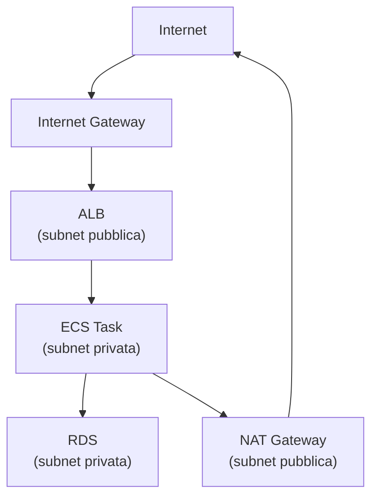

# Networking su AWS

<div class="lesson-meta">
  <span class="badge-stato evoluzione">In evoluzione</span>
  <span>Lezione 5.5</span>
  <span>~12 min di lettura</span>
</div>

<p class="lesson-lead">VPC, subnet, security group, API Gateway — la rete AWS in pratica. I concetti universali li hai visti in 1.1 e 1.2. Qui ogni pezzo ha un nome AWS, un comportamento preciso, e una serie di errori comuni che costano ore di debugging.</p>

Il networking è la parte di AWS che causa più problemi ai principianti — non perché sia complicata, ma perché gli errori sono silenziosi: il traffico non passa, non sai perché, e la console non te lo dice chiaramente. Questa lezione ti dà il modello mentale per capire dove guardare.

## VPC — la tua rete privata

**VPC** (*Virtual Private Cloud*) è la rete privata isolata in cui vivono le tue risorse AWS. Quando lanci un'istanza EC2, un cluster ECS, un database RDS — tutte vivono in una VPC. AWS crea una **Default VPC** in ogni regione con configurazione semplificata; per la produzione ne crei una dedicata.

Una VPC ha un blocco CIDR — un range di indirizzi IP privati. Standard comune: `10.0.0.0/16` — 65536 indirizzi.

All'interno della VPC, le risorse si dividono in **subnet** — sottoreti con il proprio range IP. Le subnet hanno due caratteristiche fondamentali:
- **AZ**: ogni subnet vive in una singola Availability Zone. Risorse in AZ diverse devono essere in subnet diverse.
- **Pubblica vs privata**: una subnet è *pubblica* se ha una route verso un **Internet Gateway** (IGW). È *privata* se non ce l'ha — le risorse dentro non sono raggiungibili direttamente da internet.

Il pattern standard per un sistema produzione:



- Le subnet **pubbliche** ospitano: ALB (*Application Load Balancer*), NAT Gateway, bastion host.
- Le subnet **private** ospitano: applicazioni (ECS, Lambda in VPC, EC2), database, cache.
- Il **NAT Gateway** permette alle risorse nelle subnet private di fare richieste verso internet (aggiornamenti, chiamate API esterne) senza essere raggiungibili da internet. Costo: ~$0.045/ora (~$32/mese) + $0.045/GB processato. È uno dei costi nascosti più frequenti — ricordati di eliminarlo se non serve.

## Security Group — firewall per le risorse

I **Security Group** sono firewall stateful a livello di risorsa — ogni istanza EC2, task ECS, database RDS ne ha almeno uno.

Un security group ha regole **inbound** (traffico in entrata) e **outbound** (traffico in uscita). Le regole specificano: protocollo, range di porte, sorgente/destinazione (IP CIDR o altro security group).

Il comportamento chiave: **default deny**. Tutto il traffico in entrata è bloccato per default; devi aprire esplicitamente quello che vuoi. Il traffico in uscita è aperto per default.

Il modo più sicuro di configurare le regole: usa security group come sorgente invece di CIDR. Invece di dire "apri la porta 5432 all'IP 10.0.1.0/24", dici "apri la porta 5432 al security group `sg-app`". Questo è più robusto perché funziona indipendentemente dagli IP delle istanze (che possono cambiare) e è leggibile: "il database accetta connessioni dall'applicazione".

```
Security Group: sg-database
  Inbound:
    - Port 5432 (PostgreSQL), Source: sg-application
    - Port 5432, Source: sg-bastion (solo per accesso DBA)
  Outbound:
    - All traffic (default)
```

**Errori comuni**:
- Security group circolare: A→B e B→A bloccano entrambi per un errore di ordine. I SG sono stateful: se la connessione TCP è stabilita, le risposte passano automaticamente.
- NACL vs Security Group: i **NACL** (*Network Access Control List*) sono firewall *stateless* a livello di subnet — raramente necessari se i SG sono configurati bene. I principianti spesso li confondono.

<details>
<summary>VPC Endpoints: evitare il traffico che esce da AWS</summary>

Quando una Lambda o un'istanza EC2 in VPC chiama S3 o DynamoDB, il traffico di default passa per internet (via NAT Gateway se in subnet privata). Questo ha due costi: il costo del NAT Gateway e, in certi scenari, problemi di sicurezza (dati aziendali che escono dalla rete AWS).

I **VPC Endpoints** risolvono il problema: creano un percorso privato tra la VPC e i servizi AWS, senza passare per internet. Esistono due tipi:
- **Gateway Endpoint**: per S3 e DynamoDB. Gratuito. Si aggiunge una route nella route table.
- **Interface Endpoint** (PrivateLink): per la maggior parte degli altri servizi (SQS, SNS, Lambda API, ecc.). ~$0.01/ora + $0.01/GB.

Per qualsiasi sistema che fa molte chiamate S3 o DynamoDB da Lambda in VPC, il Gateway Endpoint è quasi sempre da attivare — riduce i costi del NAT e migliora la sicurezza.
</details>

## Route 53 — DNS di AWS

**Route 53** è il servizio DNS di AWS. Tre funzioni principali:
1. **Domain registration**: acquisti e gestisci domini direttamente da AWS.
2. **DNS hosting**: gestisci i record DNS (A, CNAME, MX, TXT) per il tuo dominio in **Hosted Zones**.
3. **Health checks e routing policies**: Route 53 può fare health check sugli endpoint e instradare il traffico in base a regole di routing avanzate.

Le **routing policy** sono la parte non ovvia:
- **Simple**: un record → un IP. Il caso base.
- **Weighted**: distribuzione del traffico tra endpoint con pesi percentuali. Utile per deployment canary (10% al nuovo, 90% al vecchio).
- **Latency-based**: Route 53 instrada verso la regione con latenza più bassa per l'utente.
- **Failover**: primario + secondario. Se il primario fallisce il health check, Route 53 instrada al secondario.
- **Geolocation**: instrada in base al paese/continente dell'utente.

Prezzo Route 53: $0.50/mese per hosted zone + $0.40 per milione di query. Economico.

## API Gateway — endpoint HTTP managed

**API Gateway** è il servizio AWS che espone un endpoint HTTP/HTTPS e lo collega a Lambda (o altri backend). È il "front door" del pattern serverless: internet → API Gateway → Lambda.

Due varianti principali:
- **HTTP API**: più semplice, più economico ($1.00 per milione di richieste), latenza più bassa. Per la maggior parte dei casi.
- **REST API**: più configurabile (throttling per metodo, response mapping, request/response transformation, API keys), più costoso ($3.50 per milione di richieste). Per API con requisiti di gestione avanzata.

**Throttling**: API Gateway limita le richieste per proteggere il backend. Default: 10.000 req/secondo per account per regione (burst fino a 5.000 req/secondo). Configurabile per stage e per metodo.

**Integrazione con Lambda**: API Gateway invoca Lambda sincronicamente. Ogni richiesta HTTP → una invocazione Lambda. Il timeout massimo di API Gateway è 29 secondi — il timeout Lambda deve stare sotto quel limite.

**ALB come alternativa**: per workload ad alto traffico e bassa latenza, un **ALB** (*Application Load Balancer*) + ECS Fargate è spesso più economico di API Gateway + Lambda. API Gateway costa $1-3.50 per milione di richieste; ALB costa ~$0.008/LCU/ora (praticamente gratis a bassi volumi, competitivo a volumi alti). La scelta dipende dal volume e dal modello di deployment.

## Cosa non è

| Il pensiero sbagliato | Come stanno le cose |
|---|---|
| "La Default VPC di AWS è sicura per la produzione" | La Default VPC ha tutte le subnet pubbliche e configurazioni permissive. Va bene per test rapidi, non per produzione. Crea una VPC dedicata con subnet pubbliche/private separate. |
| "I Security Group proteggono da tutto" | I SG proteggono il traffico di rete in entrata. Non proteggono da vulnerabilità nell'applicazione, da IAM misconfiguration, da dati esposti su S3. Sono uno strato, non l'unico. |
| "API Gateway è necessario per ogni Lambda HTTP" | ALB può invocare Lambda direttamente con Function URL o come target group. Per bassa complessità, Function URL (gratis) o ALB sono alternative valide ad API Gateway. |
| "NAT Gateway è sempre necessario nelle subnet private" | NAT Gateway serve solo se le risorse nelle subnet private devono fare richieste outbound verso internet. Se comunicano solo con altri servizi AWS (via VPC Endpoint), non serve — e risparmi ~$32/mese. |

## Verifica di comprensione

> Rispondi a memoria. Le risposte incerte rivedile domani.

1. Qual è la differenza tra una subnet pubblica e una privata in AWS?
2. Perché si usa un NAT Gateway e quanto costa?
3. Come configuri un security group perché solo l'applicazione (non internet) possa accedere al database?
4. Cos'è un VPC Endpoint e quando conviene usarlo?
5. Qual è il timeout massimo di una Lambda invocata tramite API Gateway?
6. Route 53 Weighted routing: a cosa serve in un deployment canary?
7. *(anticipazione)* Il tuo database RDS non è raggiungibile dalla Lambda. Il security group del database ha la porta 5432 aperta. Cosa controlli per primo?

## Glossario della lezione

- **VPC** (*Virtual Private Cloud*): rete privata isolata in cui vivono le risorse AWS.
- **Subnet**: sottorete in una VPC, legata a una singola AZ. Pubblica (ha route verso IGW) o privata.
- **IGW** (*Internet Gateway*): gateway che connette una VPC a internet.
- **NAT Gateway**: permette a risorse in subnet private di fare richieste outbound senza essere raggiungibili da internet.
- **Security Group**: firewall stateful a livello di risorsa. Default deny inbound, default allow outbound.
- **NACL** (*Network Access Control List*): firewall stateless a livello di subnet.
- **VPC Endpoint**: percorso privato tra VPC e servizi AWS senza passare per internet.
- **Route 53**: servizio DNS di AWS con routing policy avanzate.
- **Hosted Zone**: contenitore Route 53 per i record DNS di un dominio.
- **API Gateway**: servizio per esporre endpoint HTTP/HTTPS e collegarli a Lambda o altri backend.
- **ALB** (*Application Load Balancer*): load balancer AWS layer 7, alternativa ad API Gateway per ECS.

## Per approfondire

- **AWS VPC documentation**: cerca "Amazon VPC User Guide" su `docs.aws.amazon.com` — la sezione "How Amazon VPC works" con i diagrammi è il punto di partenza.
- **AWS re:Invent networking talks**: cerca "AWS networking fundamentals re:Invent" su YouTube — i talk annuali con animazioni delle route table e VPC peering.

## Prossima lezione

Hai l'infrastruttura completa: compute, storage, messaggistica, networking. La prossima lezione chiude il ciclo con il Terraform/CDK su AWS — l'IaC specifico per AWS, tra cui le scelte tra Terraform provider AWS, CDK, e CloudFormation, con un progetto concreto.
