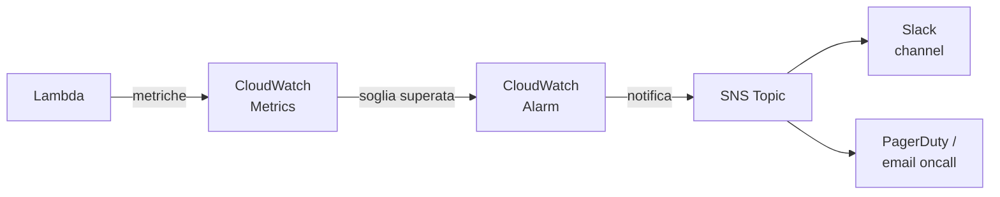

# Observability (CloudWatch)

<div class="lesson-meta">
  <span class="badge-stato evoluzione">In evoluzione</span>
  <span>Lezione 5.7</span>
  <span>~11 min di lettura</span>
</div>

<p class="lesson-lead">CloudWatch è il sistema di osservabilità di AWS — log, metriche, alert. Sapere come configurarlo non è optional: è la differenza tra trovare un problema in 5 minuti o in 5 ore durante un incident.</p>

L'infrastruttura è deployata, l'applicazione gira. Ma come sai se funziona? Come sai quando si rompe? Come ricostruisci cosa è successo tre ore fa? La risposta è CloudWatch — e questa lezione ti dà il modello mentale per usarlo, non solo per configurarlo.

## CloudWatch Logs

**CloudWatch Logs** è il sistema di logging di AWS. I log arrivano in **Log Groups** — contenitori logici, di solito uno per applicazione o servizio. Dentro ogni Log Group ci sono **Log Streams** — flussi separati, tipicamente uno per istanza o per Lambda invocation.

Lambda scrive automaticamente i log in CloudWatch (ogni `print()` o `logging.info()` finisce in un Log Stream sotto `/aws/lambda/NomeFunzione`). ECS/Fargate usa il log driver `awslogs` nel Task Definition:

```json
"logConfiguration": {
  "logDriver": "awslogs",
  "options": {
    "awslogs-group": "/ecs/mia-app",
    "awslogs-region": "eu-west-1",
    "awslogs-stream-prefix": "ecs"
  }
}
```

**Retention policy**: per default i log non scadono mai — e CloudWatch Logs costa $0.50/GB ingestito + $0.03/GB archiviato al mese. Per evitare sorprese, imposta sempre la retention: 7 giorni per dev, 30-90 giorni per produzione, 1 anno per compliance.

**CloudWatch Logs Insights**: linguaggio di query SQL-like per analizzare i log. Utile durante un incident per rispondere a domande come "quanti errori 500 ci sono stati nelle ultime 2 ore" o "quali user_id hanno avuto timeout":

```
fields @timestamp, @message
| filter @message like /ERROR/
| stats count() by bin(5m)
| sort @timestamp desc
```

**Structured logging**: invece di loggare stringhe libere, logga JSON. CloudWatch Insights può filtrare e aggregare su campi JSON specifici. È la base per log-based metrics e alert accurati.

## CloudWatch Metrics

**CloudWatch Metrics** sono dati numerici nel tempo — la CPU di un'istanza EC2, la latenza media di Lambda, il numero di messaggi in coda SQS.

Ogni metrica appartiene a un **Namespace** (es. `AWS/Lambda`, `AWS/EC2`, `AWS/SQS`) e ha **Dimensions** che la identificano (es. `FunctionName=ProcessOrder`). AWS pubblica automaticamente metriche di default per ogni servizio; puoi aggiungere metriche custom per la tua applicazione (es. ordini processati, tempo di risposta end-to-end).

Le metriche custom costano $0.30/metrica/mese. Non esagerare: 10-20 metriche chiave per applicazione sono più utili di 200 metriche di rumore.

**Metriche chiave da monitorare per servizio**:
- **Lambda**: `Errors`, `Duration`, `Throttles`, `ConcurrentExecutions`
- **API Gateway**: `4XXError`, `5XXError`, `Latency`, `IntegrationLatency`
- **SQS**: `ApproximateNumberOfMessagesVisible`, `NumberOfMessagesSent`, `ApproximateAgeOfOldestMessage`
- **RDS**: `CPUUtilization`, `DatabaseConnections`, `FreeStorageSpace`, `ReadLatency`
- **ECS/Fargate**: `CPUUtilization`, `MemoryUtilization`

## CloudWatch Alarms

Gli **Alarms** sono la reazione automatica a una metrica che supera una soglia. Un Alarm ha tre stati: `OK`, `ALARM`, `INSUFFICIENT_DATA`.

Configurazione di un alarm: scegli la metrica, la soglia (es. "error rate > 1%"), il periodo di valutazione (es. "per 3 periodi consecutivi di 1 minuto"), e l'azione (notifica SNS → email/Slack, autoscaling, Lambda).

**L'errore classico**: mettere alert su conteggio errori assoluto invece che su error rate. Se il tuo traffico cresce 10x, anche 10 errori al minuto è un tasso basso. Se il traffico cala del 90% durante la notte, 2 errori al minuto potrebbe essere il 100% delle richieste. L'alert su error rate (`Errors / Invocations > 0.01`) è quasi sempre più utile dell'alert su `Errors > 10`.



**Composite Alarms**: alarm che dipendono da altri alarm con logica AND/OR. Utile per ridurre il rumore: "alertami solo se CONTEMPORANEAMENTE la latency è alta AND l'error rate è alto" — esclude i picchi di latency isolati che non impattano la disponibilità.

## X-Ray — distributed tracing

Le metriche e i log ti dicono *cosa* è successo. Il tracing ti dice *perché* e *dove*. **X-Ray** è il servizio di distributed tracing di AWS.

X-Ray traccia ogni richiesta attraverso i componenti: Lambda chiama DynamoDB, DynamoDB è lento, X-Ray ti mostra la latency breakdown per ogni hop. Genera una **service map** automatica del sistema.

Per attivarlo su Lambda: abilita `Active Tracing` nel configuration della funzione + aggiungi il layer X-Ray SDK. Sulle funzioni Python:

```python
from aws_xray_sdk.core import xray_recorder, patch_all
patch_all()  # traccia automaticamente boto3 (DynamoDB, S3, SQS, ecc.)
```

Il **sampling** è importante: X-Ray non traccia il 100% delle richieste per default (costo + volume). Il sampling di default è 1 req/secondo + 5% del resto. Per debug intenso si alza temporaneamente; in produzione normale si lascia il default.

Costo X-Ray: $5.00 per milione di trace registrati (oltre il free tier di 100K/mese). A basso volume è praticamente gratis.

<details>
<summary>Log-based metrics: creare metriche dai log</summary>

Alcuni eventi applicativi non sono metriche CloudWatch native — "pagamento fallito", "utente bannato", "ordine superato il timeout SLA". Puoi creare **Metric Filters** su un Log Group: CloudWatch cerca un pattern nel log stream e pubblica una metrica custom ogni volta che il pattern appare.

Esempio: ogni volta che un log contiene `"event": "payment_failed"`, CloudWatch incrementa la metrica `PaymentFailures`. Poi ci aggiungi un Alarm a soglia.

Il vantaggio: non modifichi il codice Lambda per pubblicare una metrica — la estrai dai log JSON che già scrivi. Il limite: dipende dalla qualità dello structured logging. Se logghi stringhe libere, i pattern sono fragili.
</details>

## Cosa non è

| Il pensiero sbagliato | Come stanno le cose |
|---|---|
| "CloudWatch è solo per i log" | CloudWatch è metrics + logs + alarms + dashboards + Logs Insights + Contributor Insights + Synthetics. È l'intera piattaforma di observability AWS, non solo un log viewer. |
| "Se non ho alert attivi, l'applicazione funziona" | Senza alert attivi, sai che l'applicazione è rotta solo quando te lo dice un utente. Gli alert proattivi su metriche e log-based metrics invertono il flusso. |
| "X-Ray rallenta l'applicazione" | X-Ray con sampling default aggiunge latency trascurabile (microsecondi per la scrittura async dei trace). Il costo reale è economico; il costo di non averlo durante un incident è molto più alto. |
| "Le retention policy sono un dettaglio" | A $0.50/GB ingestito, 90 giorni di log di produzione per un'app media costano facilmente $50-200/mese. Con retention a 30 giorni e compressione, molto meno. La policy di retention è una decisione di costo. |

## Verifica di comprensione

> Rispondi a memoria. Le risposte incerte rivedile domani.

1. Cos'è un Log Group e come è diverso da un Log Stream?
2. Perché è meglio fare alert su error rate invece che su conteggio errori assoluto?
3. Cosa sono le metriche custom CloudWatch e quando le usi?
4. Cos'è X-Ray e cosa ti dice che i log da soli non ti dicono?
5. Cos'è il sampling in X-Ray e perché esiste?
6. Perché impostare la retention dei log è importante dal punto di vista economico?
7. *(anticipazione)* Il tuo sistema Lambda + DynamoDB ha latenza alta. CloudWatch Metrics mostra che `Duration` di Lambda è normale. Dove guardi per isolare il problema?

## Glossario della lezione

- **CloudWatch Logs**: servizio AWS per raccolta e query dei log. Organizzati in Log Groups e Log Streams.
- **Log Group**: contenitore CloudWatch per i log di un'applicazione o servizio.
- **Log Stream**: flusso di log within un Log Group — tipicamente una per istanza o Lambda.
- **CloudWatch Metrics**: dati numerici nel tempo per ogni servizio AWS. Namespace + Dimensions.
- **CloudWatch Alarm**: regola che monitora una metrica e attiva azioni quando supera una soglia.
- **Composite Alarm**: alarm che dipende da altri alarm con logica AND/OR.
- **CloudWatch Logs Insights**: motore di query SQL-like per analizzare i log CloudWatch.
- **Metric Filter**: regola su Log Group che pubblica una metrica CloudWatch quando trova un pattern nei log.
- **X-Ray**: servizio di distributed tracing AWS — traccia richieste attraverso più componenti.
- **Service Map** (X-Ray): grafico automatico dei componenti e delle dipendenze tracciati da X-Ray.
- **Sampling** (X-Ray): meccanismo che traccia solo una percentuale delle richieste per ridurre costi e volume.

## Per approfondire

- **CloudWatch Logs Insights query syntax**: cerca "CloudWatch Logs Insights query syntax" su `docs.aws.amazon.com` — la reference completa con esempi.
- **AWS Observability best practices**: cerca "AWS Observability Best Practices" su `aws-observability.github.io` — guida curata da AWS con architetture di riferimento.

## Prossima lezione

L'ultima lezione della Parte 5 è un decision drill completo: URL shortener su AWS da zero — architettura, IAM, costi, monitoring. Il tipo di esercizio che compare nei colloqui per ruoli cloud nel 2026.
