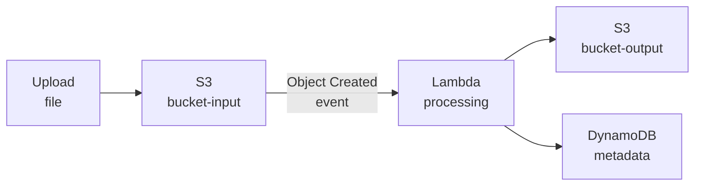

# Storage e database su AWS

<div class="lesson-meta">
  <span class="badge-stato evoluzione">In evoluzione</span>
  <span>Lezione 5.4</span>
  <span>~13 min di lettura</span>
</div>

<p class="lesson-lead">S3, EBS, RDS, DynamoDB — quattro famiglie di storage con modelli di accesso, prezzi e garanzie completamente diversi. Scegliere quello sbagliato non è un dettaglio implementativo: è una decisione architetturale che condiziona costi e scalabilità per anni.</p>

Il concetto di base l'hai visto in 0.3 e 0.5: oggetti, blocchi, file, database relazionali, NoSQL. Qui ogni famiglia prende un nome AWS, un prezzo, e una serie di comportamenti che cambiano le decisioni. Il frame è sempre lo stesso: **modello di accesso → famiglia di storage**.

## S3 — object storage

**S3** (*Simple Storage Service*) è il servizio di object storage di AWS e, de facto, lo standard dell'industria per i file binari nel cloud. Il modello è semplice: chiave → valore. Ogni oggetto (file) ha una chiave univoca (path), un payload (i byte del file), e metadati. Nessuna struttura directory reale — solo una stringa usata come chiave.

S3 è infinitamente scalabile, non devi fare provisioning: metti un file, esiste. Lo elimini, sparisce. AWS gestisce la replica, la durabilità (99.999999999% — undici 9), la distribuzione geografica.

**Classi di storage S3** — la leva di costo principale:
- **Standard**: accesso frequente. ~$0.023/GB/mese. Latenza millisecondi.
- **Intelligent-Tiering**: sposta automaticamente gli oggetti tra livelli caldi e freddi in base all'accesso. Buono per dati con pattern di accesso imprevedibile.
- **Standard-IA** (*Infrequent Access*): ~$0.0125/GB/mese + fee per retrieval. Per backup, dati acceduti raramente.
- **Glacier Instant Retrieval**: archivio con accesso in millisecondi, ~$0.004/GB/mese. Per dati rari ma con requisito di accesso rapido.
- **Glacier Flexible Retrieval**: retrieval in minuti/ore. Per archivi con accesso molto raro.
- **Glacier Deep Archive**: ~$0.00099/GB/mese. Il più economico, retrieval in ore. Per compliance a lungo termine.

**Sicurezza S3**: per default un bucket S3 è privato. Un **bucket policy** (documento JSON, simile alle IAM policy) controlla chi può leggere o scrivere. La configurazione più pericolosa è il bucket pubblico — la causa di molti data breach AWS. Dal 2023 AWS ha aggiunto un "Block Public Access" a livello account che impedisce di rendere pubblico un bucket per sbaglio.

**Versioning**: S3 può mantenere versioni multiple dello stesso oggetto. Se abiliti il versioning e sovrascrivi un file, la versione precedente rimane recuperabile. Utile per accidenti e per audit.

**S3 come sorgente eventi**: ogni operazione su S3 (PUT, DELETE, COPY) può triggerare una notifica verso Lambda, SQS, SNS. È la base di molte pipeline di processing dati: file caricato su S3 → Lambda si attiva → processa → risultato su altro bucket.



## EBS — block storage per EC2

**EBS** (*Elastic Block Store*) è lo storage a blocchi di AWS — il disco virtuale che attacchi a un'istanza EC2. Funziona come un HD o SSD: il sistema operativo ci scrive file, database, log, come su qualsiasi disco fisico.

A differenza di S3 (accesso tramite API HTTP), EBS si presenta come device block — `/dev/xvda`, `/dev/sdb` — e viene montato come filesystem dal sistema operativo. Puoi farmatarlo ext4, xfs, NTFS.

Un volume EBS è attaccato a una singola istanza EC2 alla volta (nella stessa AZ). Non è condiviso. Per storage condiviso tra più istanze serve **EFS** (*Elastic File System*) — un filesystem NFS managed, più costoso ma condivisibile tra istanze e Fargate task.

Il tipo EBS più comune oggi è **gp3**: SSD general purpose, 3000 IOPS e 125 MB/s inclusi a prescindere dalla dimensione, upgrade fino a 16000 IOPS e 1000 MB/s separatamente a pagamento. ~$0.08/GB/mese.

EBS è persistente — i dati sopravvivono a stop e restart dell'istanza — ma non è un backup. Per i backup usa gli **snapshot** EBS (incrementali, su S3 nella stessa regione). Costo snapshot: ~$0.05/GB/mese.

## RDS — database relazionale managed

**RDS** (*Relational Database Service*) è il servizio AWS per database relazionali managed. Supporta PostgreSQL, MySQL, MariaDB, Oracle, SQL Server, e il suo motore proprietario **Aurora** (compatibile PostgreSQL e MySQL, con architettura storage distribuita che AWS dichiara fino a 5x più veloce di MySQL standard).

"Managed" qui significa: AWS gestisce backup automatici (point-in-time recovery fino a 35 giorni), patch del motore, failover su istanza di standby (Multi-AZ), monitoring. Non gestisci il server, il sistema operativo, la replica. Gestisci lo schema, le query, le connessioni.

**Scelte di istanza RDS**: stessa logica delle istanze EC2 — famiglia + dimensione. `db.t3.micro` per dev/test (incluso nel free tier), `db.m5.large` per produzione leggera, `db.r5.2xlarge` per workload memory-intensive.

**Multi-AZ**: RDS mantiene una replica sincrona in un'altra AZ. In caso di failure dell'istanza primaria, il failover automatico è in 1-2 minuti. Quasi sempre obbligatorio in produzione. Costo: ~2x rispetto all'istanza singola.

**Read Replicas**: repliche asincrone in sola lettura — fino a 5 per PostgreSQL/MySQL, fino a 15 per Aurora. Scalano il read throughput e possono essere in regioni diverse (cross-region replica). Costo: costo dell'istanza replica + traffico replicazione.

**Aurora vs RDS standard**: Aurora ha uno storage distribuito su 6 copie in 3 AZ (vs 2 copie Multi-AZ di RDS). Failover in secondi (vs 1-2 min). Più costoso (~20%), ma per sistemi ad alta disponibilità la differenza di failover time vale spesso il costo.

<details>
<summary>Connection pooling con RDS: il problema che nessuno ti dice</summary>

RDS ha un limite di connessioni parallele — determinato dalla RAM dell'istanza. Un `db.t3.micro` (1 GB RAM) supporta ~90 connessioni. Un `db.m5.large` (8 GB RAM) ~600 connessioni.

Lambda scala a migliaia di istanze parallele. Se ogni Lambda apre una connessione a RDS, esaurisci le connessioni in pochi minuti sotto carico. Il risultato: `too many connections` error.

La soluzione è **RDS Proxy**: un proxy managed che fa connection pooling tra Lambda (o ECS) e RDS. Le Lambda parlano con RDS Proxy, che mantiene un pool di connessioni reali al database. Riduce il numero di connessioni RDS di un ordine di grandezza. Costo: ~$0.015/vCPU/ora dell'istanza RDS sottostante.

Alternativa: usare DynamoDB dove Lambda + alto throughput è il pattern principale — DynamoDB non ha questo problema.
</details>

## DynamoDB — NoSQL chiave-valore/documento

**DynamoDB** è il database NoSQL fully managed di AWS. Nessun server da gestire, nessun cluster da configurare, nessuna connessione da gestire: scrivi, leggi, DynamoDB scala.

Il modello dati è diverso da un database relazionale. Ogni tabella ha una **partition key** (obbligatoria) e opzionalmente una **sort key**. La partition key determina su quale shard fisico finisce l'item — la scelta della partition key è la decisione di design più importante in DynamoDB.

```
Tabella Orders:
  Partition Key: customer_id
  Sort Key: order_date
  Altri attributi: total, items, status (schema flessibile, non fisso)
```

**Modalità di capacità**:
- **On-Demand**: paga per ogni read/write unit. Zero provisioning, scala automaticamente. Prezzo: $1.25 per milione di write request, $0.25 per milione di read request. Perfetto per workload imprevedibili.
- **Provisioned**: dichiari le read/write capacity units (RCU/WCU). Meno flessibile, ma più economico a throughput stabile e prevedibile.

**Punti di forza di DynamoDB**:
- Latenza single-digit millisecond a qualsiasi scala.
- Nessun problema di connection pooling con Lambda.
- **TTL** (*Time To Live*): imposti un attributo timestamp su un item, DynamoDB lo cancella automaticamente dopo quella data. Perfetto per sessioni, cache, idempotency keys.
- **DynamoDB Streams**: ogni modifica agli item genera un evento in uno stream — leggibile da Lambda. È il CDC (*Change Data Capture*) built-in di DynamoDB.

**Quando NON usare DynamoDB**: query relazionali complesse (JOIN, aggregazioni su più attributi, GROUP BY), reporting ad hoc, schemi che cambiano frequentemente e richiedono transazioni ACID complesse tra molte tabelle. DynamoDB supporta transazioni, ma sono costose (2x il costo normale) e limitate a 100 operazioni per transazione.

La regola pratica: se il tuo access pattern è "dammi l'item con questa chiave" o "dammi tutti gli item di questo utente ordinati per data", DynamoDB è la scelta. Se hai bisogno di query arbitrarie su qualsiasi combinazione di attributi, vai su RDS.

## Cosa non è

| Il pensiero sbagliato | Come stanno le cose |
|---|---|
| "S3 è come un filesystem" | S3 è object storage con accesso tramite API HTTP. Non ha directory reali, non si monta come drive (senza tool aggiuntivi), non ha latenza da filesystem. Ottimizzato per throughput su file grandi, non per accesso casuale a byte. |
| "RDS è sempre la scelta sicura" | RDS con Lambda sotto carico ha il problema delle connessioni. RDS senza Multi-AZ ha downtime di minuti su failure. RDS non scala orizzontalmente per le write. Sono caratteristiche note, non difetti — ma vanno considerate. |
| "DynamoDB è economico per ogni workload" | DynamoDB in modalità On-Demand costa molto su workload ad altissimo write throughput sostenuto. A 100M write/giorno, Provisioned con auto-scaling è molto più economico. |
| "EBS e S3 sono intercambiabili" | EBS è un disco block device per istanze EC2, accesso locale, latenza bassa, non condivisibile. S3 è object storage globale, accesso HTTP, ottimizzato per throughput su file grandi. Usi di base completamente diversi. |

## Verifica di comprensione

> Rispondi a memoria. Le risposte incerte rivedile domani.

1. Qual è la differenza tra S3 Standard e S3 Glacier Deep Archive? Quando usi uno o l'altro?
2. Cos'è il versioning S3 e perché è utile?
3. Perché EBS non può essere condiviso tra più istanze EC2? Qual è l'alternativa?
4. Cos'è il Multi-AZ in RDS e cosa cambia in caso di failure?
5. Perché Lambda + RDS ha il problema delle connessioni? Come si risolve?
6. Cos'è la partition key in DynamoDB e perché la sua scelta è critica?
7. *(anticipazione)* Stai costruendo un sistema di sessioni utente: 10 milioni di utenti, ogni sessione scade dopo 30 giorni, l'accesso è sempre per user_id. Quale database AWS sceglieresti e perché?

## Glossario della lezione

- **S3** (*Simple Storage Service*): object storage infinitamente scalabile. Chiave → file.
- **Versioning S3**: mantiene versioni multiple di ogni oggetto nel bucket.
- **EBS** (*Elastic Block Store*): storage a blocchi persistente per istanze EC2. Disco virtuale.
- **EFS** (*Elastic File System*): filesystem NFS managed, condivisibile tra più istanze.
- **RDS** (*Relational Database Service*): database relazionale managed (PostgreSQL, MySQL, Aurora, ecc.).
- **Multi-AZ**: replica sincrona RDS su altra AZ per failover automatico in 1-2 minuti.
- **Read Replica**: replica asincrona RDS in sola lettura per scalare il read throughput.
- **Aurora**: motore database AWS-proprietary compatibile PostgreSQL/MySQL, storage distribuito.
- **RDS Proxy**: proxy managed per connection pooling tra Lambda/ECS e RDS.
- **DynamoDB**: NoSQL fully managed, latenza single-digit ms, nessun server da gestire.
- **Partition Key**: chiave che determina su quale shard DynamoDB finisce un item.
- **TTL** (*Time To Live*): attributo DynamoDB per cancellazione automatica degli item scaduti.
- **DynamoDB Streams**: stream di modifiche agli item DynamoDB, leggibile da Lambda.

## Per approfondire

- **AWS S3 pricing**: `aws.amazon.com/s3/pricing` — tabella completa delle classi di storage e dei costi di retrieval.
- **DynamoDB best practices**: cerca "DynamoDB best practices" su `docs.aws.amazon.com` — la guida alla scelta della partition key è la sezione più importante.
- **AWS Database Migration Guide**: cerca "choosing the right database" su `aws.amazon.com/products/databases` — il decision tree ufficiale.

## Prossima lezione

Hai le risorse di compute e storage. La prossima lezione chiude il quadro infrastrutturale con il networking AWS: VPC, subnet, security group, e API Gateway — come il traffico entra nel sistema, dove si ferma, e come si muove tra i componenti.
