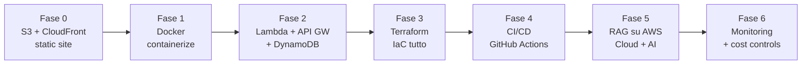

# Capstone — sistema end-to-end su AWS

<div class="lesson-meta">
  <span class="badge-stato evoluzione">In evoluzione</span>
  <span>Lezione 8.2</span>
  <span>~16 min di lettura</span>
</div>

<p class="lesson-lead">Sai come funziona ogni pezzo dell'architettura. Adesso costruisci il sistema per davvero: un RAG assistant deployato su AWS con IaC, CI/CD e monitoring. Il punto in cui i due playbook — Cloud e AI — si chiudono in un solo artefatto.</p>

Tutta la teoria converge qui. Il Capstone non è un esercizio accademico: è il sistema che metti su GitHub, che mostri al colloquio, e su cui eserciti il muscolo dell'ingegnere che ragiona su trade-off reali invece di seguire tutorial.

Il sistema che costruiamo è un **RAG assistant** — *Retrieval-Augmented Generation*, un sistema che arricchisce le risposte di un LLM con documenti recuperati in tempo reale — deployato su AWS con infrastruttura Terraform, pipeline CI/CD su GitHub Actions e monitoring operativo. È il punto naturale di convergenza: il cloud è il piano su cui l'AI gira.

## Il progetto che evolve — sei fasi

Il SYLLABUS descrive un "Progetto che evolve": un sistema che cresce incrementalmente, una fase per volta. Ogni fase è deployabile, dimostrabile, e aggiunge un livello di maturità reale. Non parti da zero al capstone: arrivi con ogni pezzo già costruito.



**Fase 0 — App statica su S3 + CloudFront.** Parti dalla cosa più semplice che esiste: un frontend statico (HTML/React build) caricato su S3, servito via CloudFront con HTTPS automatico. Impari la console, vedi i costi reali (quasi zero), tocchi le policy del bucket e la distribuzione CDN. Non è triviale: è la fondamenta di tutto.

**Fase 1 — Containerizza.** Prendi il backend (anche solo un "Hello World" con endpoint `/health`) e mettilo in un Dockerfile. Fallo girare localmente, poi su ECS/Fargate. Impari come funziona ECR (*Elastic Container Registry*, il registry Docker di AWS), come si scrive un task definition ECS, e cosa significa "il container non si avvia" in produzione.

**Fase 2 — API serverless reale.** Un endpoint concreto: Lambda + API Gateway + DynamoDB. L'esempio standard è un URL shortener (POST `/shorten` → restituisce slug; GET `/:slug` → redirect), ma il pattern vale per qualsiasi API. Aggiungi IAM least privilege dal primo giorno: il ruolo Lambda legge solo la tabella che gli serve, nient'altro. Aggiungi CloudWatch Logs per vedere cosa succede.

**Fase 3 — IaC tutto con Terraform.** Riproduci esattamente lo stesso sistema della Fase 2, ma tutto scritto in Terraform. Nessun click nella console. `terraform plan` mostra cosa cambierà; `terraform apply` lo esegue; `terraform destroy` smonta tutto. Il risultato è un repo con `main.tf`, `variables.tf`, `outputs.tf` — infrastruttura versionata, riproducibile in qualsiasi account in 5 minuti.

**Fase 4 — CI/CD automatico.** Un workflow GitHub Actions che fa:
1. `terraform fmt -check` e `terraform validate` su ogni pull request
2. `terraform plan` che posta il diff come commento sulla PR
3. `terraform apply` su merge su `main`

A questo punto ogni modifica all'infrastruttura passa da Git, è revisionabile e rollbackabile.

**Fase 5 — Il RAG su AWS.** Qui i due playbook si incontrano. Aggiungi:
- Un **servizio di ingestion** (Lambda o ECS job): legge documenti da S3, genera embedding via Bedrock o un endpoint self-hosted, li scrive su **OpenSearch Serverless** o **pgvector su RDS**.
- Un **endpoint di retrieval** (ECS/Fargate o Lambda): prende la domanda dell'utente, genera l'embedding, fa la similarity search, restituisce i chunk rilevanti.
- Un **endpoint di generazione** (Lambda): prende la domanda + i chunk recuperati, chiama l'LLM (Bedrock API o endpoint ECS su GPU), restituisce la risposta.
- **ElastiCache** (Redis) come semantic cache: le domande simili già viste non fanno una nuova chiamata all'LLM.

**Fase 6 — Monitoring e cost controls.** Il sistema gira. Adesso aggiungi:
- CloudWatch Alarm su latenza P95 > 2 s e error rate > 1%
- X-Ray tracing end-to-end per capire dove si perdono i millisecondi
- Budget alert su AWS (soglia €30/mese, alert al 70% e al 90%)
- Tag su tutte le risorse per il cost allocation: senza tag, Cost Explorer ti mostra un blob opaco

## La struttura Terraform

Un progetto Terraform pulito non è un unico `main.tf` da 800 righe. È una struttura a moduli che rispecchia i livelli dell'architettura:

```
infrastructure/
├── main.tf              # provider AWS, backend S3 per lo stato remoto
├── variables.tf         # region, environment (dev/prod), parametri
├── outputs.tf           # API endpoint URL, nomi risorse principali
└── modules/
    ├── networking/      # VPC, subnet, security group, NAT Gateway
    ├── compute/         # ECS cluster, task definition, Lambda
    ├── data/            # RDS, DynamoDB, ElastiCache, OpenSearch
    ├── api/             # API Gateway, routes, authorizer
    ├── storage/         # S3 buckets, CloudFront, policy
    ├── iam/             # ruoli e policy per ogni servizio
    └── monitoring/      # CloudWatch alarms, dashboards, budget
```

Lo **stato remoto** su S3 con lock su DynamoDB è obbligatorio appena collabori con qualcuno — o appena hai più di un ambiente. Senza stato remoto condiviso, due `terraform apply` paralleli corrompono l'infrastruttura.

```hcl
terraform {
  backend "s3" {
    bucket         = "my-terraform-state-bucket"
    key            = "capstone/terraform.tfstate"
    region         = "eu-west-1"
    dynamodb_table = "terraform-state-lock"
    encrypt        = true
  }
}
```

I due ambienti (`dev` e `prod`) usano workspace Terraform separati o directory separate. Non condividono mai lo stesso stato.

## Il workflow CI/CD

```yaml
# .github/workflows/infra.yml
name: Infrastructure

on:
  pull_request:
    paths: ["infrastructure/**"]
  push:
    branches: [main]
    paths: ["infrastructure/**"]

jobs:
  plan:
    if: github.event_name == 'pull_request'
    runs-on: ubuntu-latest
    steps:
      - uses: actions/checkout@v4
      - uses: hashicorp/setup-terraform@v3
      - run: terraform -chdir=infrastructure init
      - run: terraform -chdir=infrastructure plan -no-color
        env:
          AWS_ACCESS_KEY_ID: ${{ secrets.AWS_ACCESS_KEY_ID }}
          AWS_SECRET_ACCESS_KEY: ${{ secrets.AWS_SECRET_ACCESS_KEY }}

  apply:
    if: github.ref == 'refs/heads/main'
    runs-on: ubuntu-latest
    steps:
      - uses: actions/checkout@v4
      - uses: hashicorp/setup-terraform@v3
      - run: terraform -chdir=infrastructure init
      - run: terraform -chdir=infrastructure apply -auto-approve
        env:
          AWS_ACCESS_KEY_ID: ${{ secrets.AWS_ACCESS_KEY_ID }}
          AWS_SECRET_ACCESS_KEY: ${{ secrets.AWS_SECRET_ACCESS_KEY }}
```

Nota: le credenziali AWS nel workflow dovrebbero usare **OIDC** (*OpenID Connect*) invece di access key statiche nei secret — OIDC genera credenziali temporanee per ogni run, senza segreti da ruotare. È il pattern raccomandato nel 2026.

## Il punto di sintesi Cloud + AI

Il RAG assistant è il punto in cui i due percorsi di studio si chiudono in un artefatto unico. Il **cosa fa il sistema** (RAG, embedding, LLM, guardrail) viene dalla guida AI — lezioni 2.1, 3.x, 4.x. Il **dove gira e come sopravvive** viene da questa guida — VPC, ECS, S3, IAM, CloudWatch, Terraform, CI/CD.

La scelta infrastrutturale che dipende dall'AI: **dove metto il vettore store?** La lezione 6.7 di questa guida e la lezione 2.1 della guida AI convergono qui. La risposta dipende dal volume, dalla frequenza di aggiornamento e dal budget: pgvector su RDS per sistemi piccoli con DB relazionale già presente; OpenSearch Serverless per volumi medi senza gestione server; Pinecone o Weaviate self-hosted su ECS per controllo massimo.

La scelta di costo che dipende dall'AI: **quando fare caching semantico?** ElastiCache (Redis) con embedding delle domande come chiave: se la similarità coseno tra la nuova domanda e una domanda già in cache supera 0.95, si restituisce la risposta cached. Su un sistema con domande ricorrenti, questo riduce le chiamate LLM del 40-60%.

## Cosa non è

| Il pensiero sbagliato | Come stanno le cose |
|---|---|
| "Il capstone è un tutorial da seguire passo per passo" | È un sistema da costruire con le proprie scelte. I tutorial ti dicono cosa fare; il capstone ti chiede di decidere perché. |
| "Prima finisco tutto, poi aggiungo IaC e CI/CD" | IaC e CI/CD si aggiungono alla Fase 3 e 4, non alla fine. Partire con i click nella console e poi riscrivere tutto in Terraform è il doppio del lavoro. |
| "Il sistema è finito quando funziona" | Un sistema senza monitoring, senza budget alert e senza procedure di rollback non è finito — è un sistema che non si sa quando si romperà. La Fase 6 non è opzionale. |
| "Basta un ambiente (prod)" | Dev e prod separati sono la differenza tra un sistema che si può testare senza paura e uno che ogni modifica è una scommessa. Su AWS, con Terraform workspace, il costo è quasi zero. |

## Verifica di comprensione

1. Perché lo stato Terraform va su S3 con lock DynamoDB e non in locale?
2. Qual è la differenza tra un workflow CI/CD che fa `plan` su PR e `apply` su merge?
3. Dove vive il semantic cache nel RAG assistant, e come funziona il meccanismo di cache hit?
4. Quali sono le sei fasi del Progetto che evolve e cosa aggiunge ciascuna?
5. Perché IAM OIDC è preferibile alle access key statiche nel workflow GitHub Actions?
6. Spiega la struttura a moduli di un progetto Terraform: perché non un singolo `main.tf`?
7. Quali metriche metti in alarm su CloudWatch per un RAG assistant in produzione?

## Glossario della pagina

- **RAG** — *Retrieval-Augmented Generation*: sistema che arricchisce le risposte di un LLM recuperando documenti rilevanti in tempo reale prima di generare la risposta.
- **ECR** — *Elastic Container Registry*: registry Docker gestito da AWS.
- **Task definition ECS**: specifica che descrive come far girare un container su ECS (immagine, CPU, RAM, ruolo IAM, variabili d'ambiente).
- **Stato remoto Terraform**: file di stato condiviso su S3 che permette a più persone o ambienti di usare la stessa infrastruttura senza conflitti.
- **Terraform workspace**: ambienti isolati (dev/prod) con stati separati nello stesso backend S3.
- **OIDC** — *OpenID Connect*: protocollo di autenticazione federata che consente a GitHub Actions di ottenere credenziali AWS temporanee senza secret statici.
- **Semantic cache**: cache di risposte AI indicizzata per similarità semantica, non per chiave esatta. Due domande simili ottengono la stessa risposta cached.
- **pgvector**: estensione PostgreSQL per lo storage e la ricerca di vettori; disponibile su RDS Aurora e PostgreSQL.

## Per approfondire

- **Documentazione Terraform AWS Provider** (`registry.terraform.io/providers/hashicorp/aws`): riferimento per ogni risorsa AWS in Terraform; ha esempi per ogni servizio.
- **GitHub Actions per AWS con OIDC** (`docs.github.com`): cerca "Configuring OpenID Connect in Amazon Web Services" per il setup senza access key statiche.
- **AWS Samples su GitHub** (`github.com/aws-samples`): repository ufficiali con esempi architetturali completi, molti con Terraform o CDK incluso.
- **Guida AI, lezione 2.1** — RAG: architettura del sistema di retrieval, chunking, embedding. Il lato AI del capstone.
- **Guida AI, lezione 5.6** — Architettura di un sistema AI in produzione: dove vivono i componenti AI su infra reale.

## Prossima lezione

Hai costruito il sistema. La prossima lezione risponde alla domanda che viene dopo: **come lo presento in modo che conti davvero**? Portfolio, certificazioni, GitHub repo — la differenza tra un progetto che resta nel cassetto e uno che ti fa passare il filtro del colloquio.
