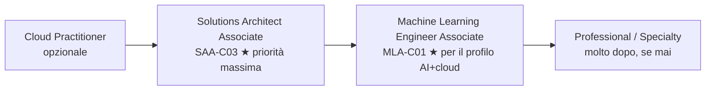

# Il portfolio che fa assumere

<div class="lesson-meta">
  <span class="badge-stato stabile">Stabile</span>
  <span>Lezione 7.3</span>
  <span>~10 min di lettura</span>
</div>

<p class="lesson-lead">Un sistema deployato su GitHub racconta più di cento riassunti. Ma solo se è costruito nel modo giusto — con le decisioni visibili, l'IaC presente, e i progetti nell'ordine in cui chi assume vuole vederli.</p>

Il mercato del lavoro cloud nel 2026 ha un filtro doppio: un sistema automatizzato che cerca parole chiave (leggi: certificazioni) e un essere umano che guarda i progetti reali. Superare il primo senza il secondo porta a colloqui che non vanno da nessuna parte. Superare il secondo senza il primo significa che il tuo profilo non viene neanche visto. Servono entrambi, ma con proporzioni precise.

**La regola di base**: una certificazione senza portfolio è una prova debole — dice che hai studiato per un esame. Un portfolio senza certificazione non passa i filtri automatici. **Il Sweet spot è: una cert forte + due o tre progetti ben costruiti su GitHub.**

## Come ragiona chi assume nel 2026

Un hiring manager cloud guarda le cose in quest'ordine:

1. **Il titolo del job description ha "AWS" o "cloud"**: cerca SAA-C03 nel CV. Se non c'è, spesso il profilo non passa nemmeno allo screening umano.
2. **Supera il filtro**: guarda GitHub. Se i repo sono vuoti o hanno solo tutorial copiati, il colloquio è formale.
3. **I repo ci sono**: legge un README. Se il README dice solo "come si usa" e non "perché ho scelto questa architettura", l'impressione è junior.
4. **Il README è solido**: guarda il codice e l'IaC. Se l'infrastruttura è tutta click nella console e non c'è un file Terraform, sa che il candidato non lavora come lavora il team.
5. **Tutto c'è**: fa domande sui trade-off ("perché DynamoDB e non RDS?", "come hai gestito i costi?", "cosa romperesti prima?"). Qui vince o perde.

Il punto critico è il passaggio 3→4→5. La maggior parte dei candidati cade tra il 3 e il 4.

## Le due cert che contano (e l'ordine giusto)



**Cloud Practitioner (CLF-C02)**: opzionale. Segnale debole da solo — serve per principianti assoluti o per ottenere il voucher sconto sulla cert successiva. Se hai già toccato AWS concretamente, puoi saltarla.

**Solutions Architect Associate (SAA-C03)**: la cert con il **ROI più alto** dell'intero ecosistema cloud. Copre la gamma più ampia di pattern architetturali, compare in più job description di qualsiasi altra cert AWS, e la puoi preparare in 4-6 settimane di studio mirato se hai già le basi di questa guida. È *la* cert da avere.

**Machine Learning Engineer Associate (MLA-C01)**: lanciata nel 2024, costruita apposta per il profilo AI + cloud — deployment, MLOps, inferenza scalabile, SageMaker, Bedrock. Per chi punta all'AI Cloud Engineer o all'AI Solution Architect è la terza cert naturale dopo SAA, molto più centrata del vecchio Developer Associate. Timeline tipica: 3-4 settimane da SAA, se hai già studiato la guida AI.

Le cert Professional e Specialty vengono molto dopo, se e quando un ruolo specifico le richiede. Non correrci dietro prima.

## I tre progetti che contano

Non servono dieci progetti. Servono tre, fatti bene, con un arco narrativo chiaro.

**Progetto 1 — URL shortener serverless**: Lambda + API Gateway + DynamoDB + IAM least privilege + CloudWatch. Il progetto-tipo che i colloqui cloud 2026 vogliono vedere — dimostra che sai costruire una API serverless reale, configurare i permessi minimi e fare il primo monitoring. Terraform dalla prima riga. Tempo: un weekend.

**Progetto 2 — RAG assistant su AWS**: il capstone di questa guida. ECS/Fargate + OpenSearch o pgvector + Bedrock/endpoint self-hosted + ElastiCache semantic cache + S3 + CloudWatch alarms. È il progetto che dimostra la sinergia Cloud + AI — la competenza più richiesta nel 2026. Terraform completo, CI/CD su GitHub Actions. Tempo: una-due settimane.

**Progetto 3 — Reference architecture con IaC (opzionale)**: un repo che implementa la reference architecture della lezione 7.1 in Terraform modulare, con due ambienti (dev/prod) e documentazione delle decisioni architetturali. Non deve girare in produzione 24/7 — serve come "archivio di ragionamento" per il colloquio. Dimostra maturità da architetto.

Due progetti sono già sufficienti per passare la maggior parte dei colloqui cloud/AI del 2026. Il terzo distingue chi vuole il ruolo senior.

## Come strutturare il repo

La struttura di un repo che convince non è la struttura che "funziona" — è la struttura che **racconta le decisioni**.

```
rag-assistant-aws/
├── README.md                    ← il documento più importante
├── architecture/
│   ├── diagram.png              ← diagramma del sistema
│   └── decisions/               ← ADR: Architecture Decision Records
│       ├── 001-vector-store.md  ← "perché pgvector e non Pinecone"
│       └── 002-cache-strategy.md
├── infrastructure/              ← Terraform modulare (vedi 7.2)
├── services/
│   ├── ingestion/               ← servizio di embedding
│   ├── retrieval/               ← similarity search
│   └── generation/              ← chiamata LLM
├── .github/
│   └── workflows/               ← CI/CD pipeline
└── docs/
    ├── local-setup.md           ← come girare in locale
    └── cost-estimate.md         ← stima costi mensili
```

La cartella `decisions/` è il segnale più forte di maturità architettuale. Un **ADR** (*Architecture Decision Record*) è un documento brevissimo — 15-20 righe — che risponde a: "quale problema avevamo, quali opzioni abbiamo valutato, cosa abbiamo scelto e perché". I hiring manager lo leggono e capiscono immediatamente il livello.

## Il README che fa la differenza

Il README è il tuo pitch. Non descrive solo *cosa fa* il sistema — racconta *come funziona* e *perché è fatto così*.

**Struttura che funziona:**

```markdown
# RAG Assistant su AWS

Sistema di question-answering su documenti aziendali, 
deployato su AWS con Terraform e GitHub Actions CI/CD.

## Architettura

[diagramma]

**Stack**: ECS/Fargate · OpenSearch Serverless · AWS Bedrock · 
ElastiCache · Lambda · API Gateway · Terraform · GitHub Actions

**Scelte chiave:**
- pgvector su RDS invece di Pinecone → nessun servizio esterno, 
  costo inferiore a 1M documenti, stessa latenza sotto i 10k query/s
- ElastiCache semantic cache → riduzione del 50% delle chiamate Bedrock
  su domande ricorrenti (misurato in 2 settimane di staging)
- ECS invece di Lambda per il retrieval → cold start inaccettabile su
  query P99 con modello di embedding da 768 dimensioni

## Costo stimato

~$45/mese su ambiente dev (traffic: 500 req/giorno).
Budget alert a $60, anomaly detection abilitata.

## Come deployare

terraform init && terraform apply  # ~4 minuti
```

La sezione "Scelte chiave" è quella che distingue un README tecnico da uno generico. Ogni scelta ha una motivazione con numeri dove possibile.

## La combinazione che passa i colloqui

Il colloquio cloud/AI nel 2026 segue uno schema prevedibile:

1. **Domande di sistema**: "Come hai gestito il failover?", "Cosa succede se OpenSearch è down?", "Come hai controllato i costi?"
2. **Domande di trade-off**: "Perché ECS e non Lambda?", "Perché DynamoDB e non RDS?", "Cosa cambieresti se il budget fosse la metà?"
3. **Review del codice/IaC**: guardano il Terraform, il CI/CD, la struttura IAM.

Se hai il capstone ben costruito e gli ADR scritti, le domande 1 e 2 sono già nella documentazione. Le risposte vengono naturali perché le hai già pensate quando hai costruito.

La SAA-C03 ti dà il vocabolario e la credibilità. Il progetto dimostra che sai applicarlo. Insieme passano sia il filtro automatico che quello umano.

## Cosa non è

| Il pensiero sbagliato | Come stanno le cose |
|---|---|
| "Faccio dieci progetti piccoli invece di tre grandi" | La quantità non scala. Tre progetti profondi, con IaC e documentazione, battono dieci tutorial copiati. Un hiring manager guarda il primo repo per 3 minuti. |
| "La cert Professional è più impressionante della SAA" | La SAA ha il ROI più alto per chi cerca il primo ruolo cloud. La Professional è per chi ha già 2+ anni di esperienza su AWS e vuole un ruolo senior specifico. |
| "Il portfolio conta solo per i junior" | I senior cambiano lavoro con portfolio su GitHub, non solo con il CV. La differenza è che il senior ha anche un track record di system design documentato. |
| "Terraform è opzionale — posso mostrare i click nella console" | Nel 2026, IaC è lo standard. Un sistema senza IaC dice "non ho lavorato in team" o "non so riprodurre l'infrastruttura". È un segnale negativo forte. |

## Verifica di comprensione

1. Qual è l'ordine giusto delle certificazioni AWS per un profilo AI+cloud? Perché?
2. Cosa contiene un ADR (Architecture Decision Record) e perché è un segnale di maturità?
3. Descrivi la struttura ideale del README di un progetto cloud per un colloquio.
4. Quali sono i tre progetti che contano e cosa dimostra ciascuno?
5. Perché la MLA-C01 è più centrata del Developer Associate per un profilo AI+cloud?
6. Come risponderesti alla domanda "perché DynamoDB e non RDS?" al colloquio, se la risposta è già nel tuo ADR?
7. Quante certificazioni AWS costituiscono il "sweet spot" e quali?

## Glossario della pagina

- **SAA-C03** — *Solutions Architect Associate*: certificazione AWS con il più alto ROI per profili cloud generalisti. Copre architettura, networking, sicurezza e costi.
- **MLA-C01** — *Machine Learning Engineer Associate*: certificazione AWS per deployment, MLOps e inferenza scalabile. Complementare alla SAA per profili AI+cloud.
- **ADR** — *Architecture Decision Record*: documento brevissimo che cattura una decisione architetturale: contesto, opzioni valutate, scelta e motivazione.
- **ROI** — *Return on Investment*: rapporto tra valore ottenuto e sforzo investito. Nel contesto delle certificazioni: rilevanza nelle job description vs tempo di preparazione.
- **Screening automatico**: prima fase di selezione dei CV, spesso basata su parole chiave (nomi di servizi, certificazioni, tool). Passa prima del contatto umano.
- **Sweet spot cert**: la combinazione minima di certificazioni che massimizza la visibilità nei filtri automatici e la credibilità tecnica. Per cloud+AI: SAA-C03 + MLA-C01.

## Per approfondire

- **AWS Certification** (`aws.amazon.com/certification`): percorsi ufficiali, guide di studio e exam readiness per SAA-C03 e MLA-C01.
- **"How I passed the AWS SAA"** — cerca post recenti del 2025-2026 su Medium o Dev.to: raccolgono risorse di studio verificate e timeline realistiche.
- **Architecture Decision Records** — cerca "ADR GitHub template": esistono template standard, il più usato è quello di Michael Nygard (MADR). Disponibili su GitHub con licenza aperta.
- **AWS re:Post** (`repost.aws`): community ufficiale AWS dove i professionisti discutono di architettura, certificazioni e best practice aggiornate al 2026.

## Prossima lezione

Hai completato i sette blocchi del Cloud Playbook. Se vuoi andare oltre — verso ruoli da Solution Architect senior o enterprise — la Parte 8 copre i quattro temi che nei colloqui SA chiedono sempre: Well-Architected Framework, governance multi-account, migrazione di sistemi legacy, e consapevolezza multi-cloud.
