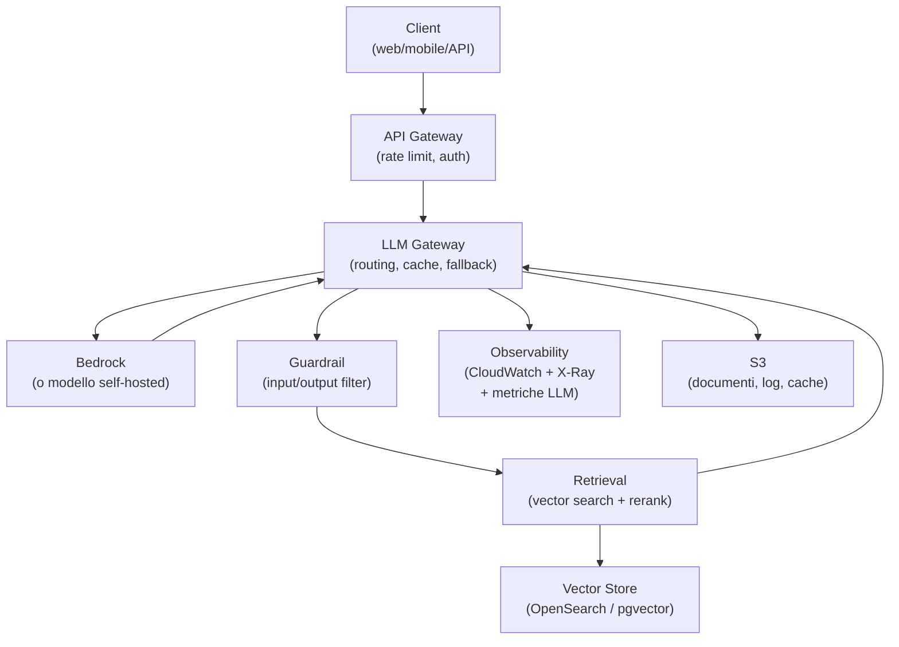
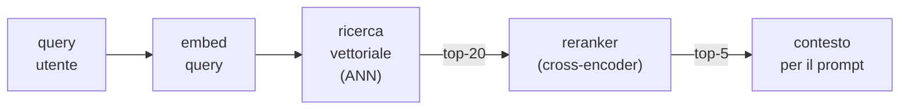
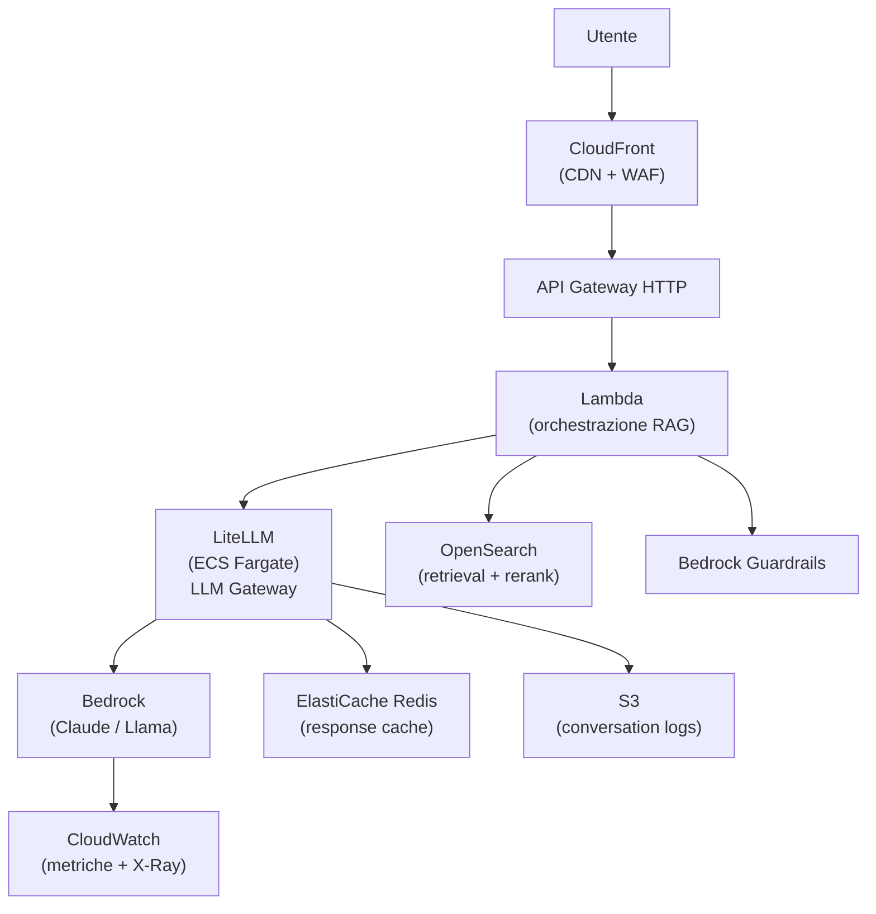

# Architettura di un sistema AI in produzione

<div class="lesson-meta">
  <span class="badge-stato evoluzione">In evoluzione</span>
  <span>Lezione 6.6</span>
  <span>~14 min di lettura</span>
</div>

<p class="lesson-lead">Un sistema AI in produzione non è solo "chiama l'API dell'LLM". È un'architettura con più strati — routing, retrieval, guardrail, observability — ognuno con le sue responsabilità. Questa lezione disegna il quadro completo e mostra come i pezzi si connettono su AWS.</p>

Le lezioni precedenti hanno coperto i singoli componenti. Qui li assembli. L'obiettivo è uscire con un'immagine mentale chiara di dove vivono i vari pezzi e come parlano tra loro — la base per progettare (o valutare) sistemi AI reali.

## La visione d'insieme



Non è un diagramma teorico. Ogni rettangolo è un componente deployato, con costi, latenza e failure mode propri. Li vediamo uno per uno.

## API Gateway — il guardiano dell'ingresso

Il punto di ingresso di ogni richiesta. Su AWS: **API Gateway HTTP** (più veloce, ~$1/milione di richieste) o **REST** (più feature, più caro).

Qui vivono:
- **Autenticazione**: JWT validation, API key, Cognito — niente arriva al backend senza essere autenticato.
- **Rate limiting**: throttling per utente o per API key — protegge il sistema da burst improvvisi e da abusi.
- **Routing**: le richieste di chat vanno a un Lambda, le richieste di ingestion documenti vanno a un altro, le health check ancora altrove.

Non mettere logica di business qui. API Gateway è un layer di entry, non il cervello del sistema.

## LLM Gateway — il pezzo che mancava

Il **LLM gateway** è il componente che la maggior parte dei tutorial non mostra, ma che ogni sistema AI serio ha in produzione. È un proxy tra la tua applicazione e i modelli LLM.

Cosa fa:

**Routing multi-modello**: "usa Claude 3.5 Sonnet per le domande complesse, Haiku per le semplici, GPT-4o-mini come fallback se Bedrock è down". Il routing può essere basato su regole (lunghezza del prompt, tipo di task) o dinamico (load, cost per token).

**Fallback automatico**: se Bedrock restituisce un errore 5xx o supera il timeout, il gateway prova automaticamente il secondo provider. Per l'utente è trasparente.

**Rate limiting e budget enforcement**: il gateway tiene traccia dei token usati per cliente/progetto e blocca le richieste quando il budget mensile è esaurito.

**Semantic cache**: centralizzata qui — tutte le applicazioni che passano per il gateway condividono la stessa cache. Non ogni applicazione la reimplementa da zero.

**Logging centralizzato**: ogni richiesta — prompt, risposta, token usati, latenza, modello — finisce in S3 o CloudWatch Logs. Essenziale per debugging, evaluation e compliance.

Opzioni pratiche:
- **LiteLLM** (open-source): proxy leggero, supporta 100+ provider, deployment facile su ECS/Lambda. La scelta per team che vogliono controllo pieno.
- **Portkey** (managed): SaaS, zero infrastruttura, buona dashboard. La scelta per team che non vogliono gestire l'infrastruttura del gateway.
- **Helicone** (managed): focalizzato sull'observability LLM, meno feature di routing.
- **AWS Bedrock native**: se usi solo Bedrock, hai rate limiting e logging nativi — non serve un gateway esterno per casi semplici.

<details>
<summary>Perché non mettere la logica di routing nell'applicazione</summary>

In teoria potresti fare routing nel codice applicativo:

```python
if len(prompt) > 4000:
    response = call_claude_sonnet(prompt)
else:
    response = call_claude_haiku(prompt)
```

Il problema emerge con più team e più applicazioni. Ogni applicazione reimplementa il routing, il fallback, il rate limiting. Quando cambi provider o aggiorni le regole di routing, devi aggiornare 10 codebase diverse. Il gateway centralizza tutto questo in un punto — un'unica API interna, e sotto cambia quello che vuoi senza toccare le applicazioni.

</details>

## Retrieval — il motore del RAG

Se il sistema usa RAG — Retrieval-Augmented Generation, il pattern in cui si recuperano documenti rilevanti prima di generare la risposta — il layer di retrieval è il componente più critico per la qualità.

Il pipeline classico:



**ANN** — Approximate Nearest Neighbor — è l'algoritmo di ricerca vettoriale: trova i chunk più vicini all'embedding della query nello spazio vettoriale. "Approssimato" perché la ricerca esatta su milioni di vettori è troppo lenta — gli algoritmi ANN (HNSW, IVF) trovano i vicini più probabili in millisecondi con un'accuratezza &gt;95%.

**Reranker**: un secondo modello (cross-encoder) che prende la query e i top-N risultati della ricerca vettoriale e li rimette in ordine per rilevanza semantica. Il reranker è più preciso del semplice embedding perché confronta query e documento insieme (non separatamente come fa il bi-encoder della ricerca vettoriale). Costo: una seconda inferenza, ma su un modello piccolo (~100ms).

Su AWS: **OpenSearch** con k-NN (HNSW) è la scelta managed più comune. **pgvector** su RDS se hai già PostgreSQL. Il reranker gira su un Lambda o un ECS container separato (o direttamente come feature di Bedrock Knowledge Bases).

## Guardrail — filtri di sicurezza

I **guardrail** filtrano l'input dell'utente e l'output del modello. Dove vivono nell'architettura dipende da cosa stai filtrando:

- **Input guardrail**: prima di inviare al modello. Blocca prompt injection, contenuti inappropriati, richieste fuori scope.
- **Output guardrail**: prima di restituire all'utente. Rileva allucinazioni, PII (Personally Identifiable Information — dati personali) non desiderati, claim rischiosi.

Su AWS: **Bedrock Guardrails** è il servizio managed — configuri topic denied, filtri contenuto, rilevamento PII con una sola chiamata API. Alternativa: librerie open-source come **Guardrails AI** o **NeMo Guardrails** di NVIDIA, deployate come sidecar o Lambda separata.

Il costo dei guardrail non è zero: ogni check aggiunge 50-200ms di latenza. Nella pipeline completa, questo si somma. Valuta quali guardrail sono bloccanti (sincroni) e quali possono essere asincroni (log-and-review).

## Observability — vedere cosa succede

Un sistema AI senza osservabilità è una scatola nera. Le metriche standard (CPU, memory, latenza HTTP) non bastano — hai bisogno di metriche LLM-specifiche.

Le metriche che contano davvero per un sistema AI:

| Metrica | Perché conta | Come misurarla |
|---|---|---|
| Token/secondo (throughput) | Capire la saturazione del modello | Log del LLM gateway |
| Latenza Time-to-First-Token (TTFT) | Esperienza utente percepita | CloudWatch custom metric |
| Cache hit rate (esatta + semantica) | Efficacia del caching | Redis + pgvector metrics |
| Costo per richiesta ($ per query) | FinOps — sono nella soglia? | Token usati × prezzo provider |
| Tasso di fallback su modello secondario | Stabilità del provider primario | LLM gateway logs |
| Retrieval precision@k | Qualità del RAG | Evaluation pipeline separata |

Su AWS: **CloudWatch** per metriche infrastrutturali e custom metrics, **X-Ray** per distributed tracing end-to-end, **OpenSearch** o **S3 + Athena** per l'analisi dei log delle conversazioni.

Il tracing X-Ray è particolarmente utile: strumentando ogni componente (Lambda, ECS, Bedrock con il proxy), ottieni la mappa completa della latenza — "il 70% del tempo totale è nel reranker, non nel modello" è il tipo di insight che X-Ray ti dà in 5 minuti.

## Architettura su AWS — la configurazione pratica



Componenti e costi indicativi per ~50K query/giorno:

| Componente | Scelta AWS | Costo indicativo/mese |
|---|---|---|
| API Gateway HTTP | API Gateway | ~$1.50 |
| Orchestrazione RAG | Lambda (512MB, ~2s avg) | ~$15 |
| LLM Gateway | LiteLLM su ECS Fargate (0.5 vCPU) | ~$20 |
| Modello LLM | Bedrock Claude Haiku (50K req, ~1K token avg) | ~$750 |
| Vector store | OpenSearch t3.medium (single-AZ) | ~$60 |
| Response cache | ElastiCache Redis t3.micro | ~$25 |
| Log storage | S3 Standard (30 giorni retention) | ~$5 |
| **Totale** | | **~$876/mese** |

Il costo del modello domina. La leva più grande è il caching (riduzione 30-60% delle chiamate al modello) e il cascading verso modelli più economici per le query semplici.

## Cosa non è

| Il pensiero sbagliato | Come stanno le cose |
|---|---|
| "Aggiungo il LLM gateway solo se ho più provider" | Il gateway vale anche con un solo provider — per il logging centralizzato, il rate limiting e la cache. Senza gateway, implementi questi aspetti in ogni applicazione. |
| "I guardrail rendono il sistema sicuro" | I guardrail riducono il rischio — non lo eliminano. Un sistema di guardrail ben configurato blocca la maggior parte degli attacchi noti, ma nuovi vettori di prompt injection emergono continuamente. Treat it as defense-in-depth, non come silver bullet. |
| "Il reranker è sempre necessario" | Per corpus piccoli (&lt;10K documenti) e query semplici, la ricerca vettoriale sola può essere sufficiente. Il reranker porta un beneficio significativo su corpus grandi e query semanticamente complesse. Misura prima di aggiungerlo. |
| "Lambda è sempre la scelta giusta per l'orchestrazione RAG" | Lambda funziona bene per richieste brevi. Se la pipeline RAG supera i 15 minuti (timeout Lambda), o se hai bisogno di connessioni persistenti al vector store per performance, ECS o un container dedicato sono più appropriati. |

## Verifica di comprensione

1. Qual è la responsabilità principale del LLM gateway? Elenca almeno tre funzioni.
2. Perché il reranker migliora la qualità del retrieval rispetto alla sola ricerca vettoriale?
3. Cos'è il TTFT (Time-to-First-Token) e perché è una metrica importante per l'esperienza utente?
4. In quale punto dell'architettura inseriresti il check per il rilevamento di PII nell'output? Perché?
5. Hai 50K query/giorno. Il costo del modello è $750/mese. Stimi che il 40% delle query potrebbe usare un modello più economico (3× più economico). Quanto risparmieresti con il cascading?
6. X-Ray mostra che il 65% della latenza totale è nel componente di retrieval OpenSearch. Quali sono le possibili cause e come investigheresti?
7. *(anticipazione)* Devi deployare il tuo corpus di documenti nel vector store. Hai 1M di documenti. Quale servizio AWS useresti per la pipeline di ingestion (chunking → embedding → ingestion in OpenSearch)?

## Glossario della lezione

- **LLM gateway**: proxy tra applicazione e provider LLM — gestisce routing, fallback, caching, rate limiting e logging.
- **Guardrail**: filtro su input/output del modello — blocca contenuti inappropriati, PII, prompt injection.
- **ANN (Approximate Nearest Neighbor)**: algoritmo di ricerca vettoriale che trova i vicini più probabili in modo efficiente su corpus grandi.
- **Reranker (cross-encoder)**: modello che valuta la rilevanza di query e documento insieme — più preciso degli embedding separati, usato per riordinare i risultati del retrieval.
- **TTFT (Time-to-First-Token)**: latenza dal momento della richiesta al primo token generato — misura l'esperienza percepita dall'utente.
- **LiteLLM**: proxy open-source per LLM — supporta 100+ provider con un'API unificata.
- **Bedrock Guardrails**: servizio AWS managed per filtri di contenuto, topic denied e rilevamento PII su Bedrock.

## Per approfondire

- **LiteLLM**: cerca "LiteLLM proxy" su `docs.litellm.ai` — guida completa con routing, fallback e caching.
- **Bedrock Guardrails**: cerca "Amazon Bedrock Guardrails" su `docs.aws.amazon.com` — configurazione filtri e metriche.
- **AWS reference architecture per RAG**: cerca "Generative AI Application Builder on AWS" su `aws.amazon.com/solutions` — soluzione reference completa.

## Prossima lezione

L'architettura è chiara. Il layer di retrieval dipende da un vector store — e scegliere quello giusto (pgvector, OpenSearch, Pinecone, Weaviate) ha impatto su costi, latenza e complessità operativa. La prossima lezione confronta le opzioni concrete.
