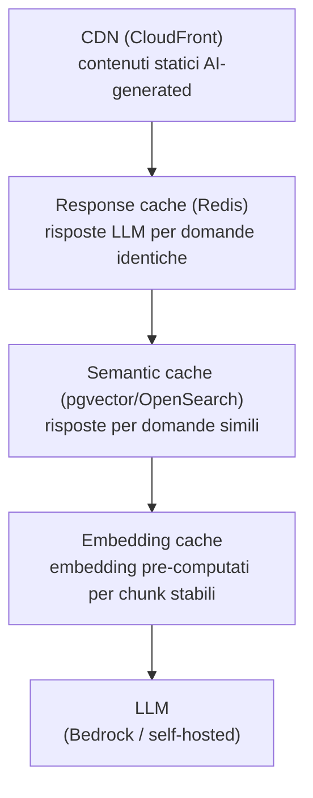
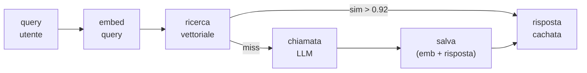

# Caching e CDN strategies

<div class="lesson-meta">
  <span class="badge-stato evoluzione">In evoluzione</span>
  <span>Lezione 5.4</span>
  <span>~11 min di lettura</span>
</div>

<p class="lesson-lead">Il caching non è una sola cosa — è uno stack di livelli. Ognuno taglia una fetta diversa di latenza e costo. Capire quale livello attivare e dove è la differenza tra un sistema AI scalabile e uno che va bene solo in demo.</p>

Nella lezione 5.3 hai visto semantic cache e prompt caching come leve di costo. Qui andiamo più in profondità: ogni livello dello stack, come si implementa su AWS, e quando non cachare è la scelta giusta.

## I livelli del caching per sistemi AI

Lo stack ha quattro livelli distinti — dalla risposta all'utente fino al modello:



Ogni livello ha caratteristiche diverse di **hit rate**, **costo** e **complessità**. Non devi sempre implementarli tutti — dipende dal tuo caso d'uso.

## Livello 1 — Response cache esatta

La più semplice e con hit rate più basso (5-20% in produzione per la maggior parte delle app). Funziona bene per:
- FAQ aziendali — "quali sono gli orari?" → risposta fissa
- Comandi testuali ripetuti — "riassumi questo documento ID:123" → se il documento non cambia, la risposta non cambia
- API esterne che usano il tuo sistema come backend e mandano le stesse query

Implementazione: hash della richiesta normalizzata (lowercase, strip spazi) → chiave Redis → TTL basato sulla volatilità del contenuto.

```
richiesta_normalizzata → SHA256 → "cache:resp:a3f9c..." → Redis GET → hit/miss
```

**TTL**: non una costante globale. La pagina di supporto "come resetto la password?" può stare in cache una settimana. La risposta su "qual è lo stato del mio ordine 1234?" non va in cache affatto (dato dinamico utente-specifico).

**Invalidazione**: per contenuti che cambiano per eventi (aggiornamento della knowledge base, nuovo documento caricato) usa la pattern `cache:resp:namespace:*` con un namespace per versione del corpus, poi invalida il namespace quando il corpus cambia.

## Livello 2 — Semantic cache

Copre quello che la cache esatta non copre: domande **simili ma non identiche**. "Come faccio il reset password?" e "devo reimpostare la mia password" sono la stessa richiesta semantica.

Il meccanismo:
1. Calcola l'embedding della nuova domanda
2. Cerca nell'indice vettoriale le domande già risposte con alta similarità (cosine similarity &gt; 0.92, da calibrare per il tuo caso)
3. Se trovi un match sopra soglia, restituisci la risposta cachata
4. Se no, chiama il modello, salva domanda + embedding + risposta



**Soglia di similarità**: il parametro critico. Troppo bassa (0.85) → risposte sbagliate a domande diverse. Troppo alta (0.98) → hit rate bassissimo, quasi inutile. Calibra su un campione reale delle tue query.

Su AWS: **pgvector** su RDS PostgreSQL se hai già un database PostgreSQL (zero infrastruttura aggiuntiva). **OpenSearch** con k-NN se hai già OpenSearch nel cluster. Evita Pinecone solo per la semantic cache — è overkill e costoso se è l'unico uso.

<details>
<summary>Eviction e freshness — il problema dei dati stale</summary>

La semantic cache ha un problema che la cache esatta non ha: non sai facilmente quando una risposta è diventata obsoleta. Se la knowledge base cambia (nuovo prodotto, aggiornamento policy), le risposte cachate potrebbero essere vecchie.

Strategie:

**TTL globale**: il più semplice. Ogni entry scade dopo N giorni. Scegli N in base alla velocità di cambiamento del dominio. Per una knowledge base aziendale stabile: 7-14 giorni. Per news o dati real-time: non cachare semanticamente.

**Versioning del corpus**: aggiungi la versione della knowledge base alla chiave di cache (o come filtro nella ricerca vettoriale). Quando aggiorni il corpus, incrementi la versione → le vecchie entry non vengono più matchate e scadono naturalmente per TTL.

**Invalidazione selettiva**: più complessa. Quando cambia un documento specifico, calcola quali domande cachate avevano quell'embedding come fonte più vicina e invalida solo quelle.

</details>

## Livello 3 — Embedding cache

Gli embedding per i tuoi documenti non cambiano finché il documento non cambia. Computarli ogni volta è uno spreco puro.

**Dove applica**: pipeline RAG con un corpus di documenti che si aggiorna raramente. Ogni chunk di documento viene embeddato una volta, salvato nel vector store, e non ricalcolato finché il documento non viene aggiornato.

Questo non è esattamente un "cache" classico — è la normale persistenza del vector store. La distinzione importante è: non richiamare il modello di embedding a runtime per i documenti già nel corpus. Lo chiami solo per la query dell'utente (che è nuova ogni volta) e per i nuovi documenti aggiunti.

**Embedding delle query**: le query utente non si cachano a livello di embedding (ogni query è diversa), ma si cachano a livello di risposta — è la semantic cache del livello 2.

## Livello 4 — CDN per contenuti AI-generated

Quando il tuo sistema AI genera contenuto che è **uguale per tutti gli utenti** — una pagina di FAQ generata da AI, un riassunto di un documento pubblico, una descrizione prodotto generata — quel contenuto può essere servito da **CloudFront** come qualsiasi asset statico.

Il pattern:
1. AI genera il contenuto (una volta, o periodicamente)
2. Salvato su S3
3. CloudFront distribuisce l'asset agli edge POP globali
4. Latenza per l'utente finale: 10-50ms invece di 500ms+

Non è applicabile per contenuto personalizzato per utente o contenuto real-time. Ma per i casi dove funziona, il risparmio è enorme: zero costo LLM per tutte le richieste dopo la prima.

**Cache-Control headers**: la chiave per CloudFront. Imposta `max-age` appropriato per la frequenza di aggiornamento del contenuto. Per una FAQ che cambia raramente: `max-age=86400` (un giorno). Per contenuto generato on-demand che vuoi solo distribuire: `max-age=3600`.

## Quando NON cachare

Il caching introduce complessità e può dare risposte sbagliate. Non cachare quando:

- **Il dato è utente-specifico**: "qual è il saldo del mio conto?", "mostrami le mie email" — ogni risposta è diversa per ogni utente (o per lo stesso utente in momenti diversi).
- **Il contenuto è volatile**: prezzi in tempo reale, news, dati di sistema live.
- **La richiesta è sempre unica per costruzione**: editor AI, generazione codice su input molto variabili, conversazioni creative.
- **La compliance richiede audit trail completo**: in alcuni contesti regolamentati, ogni risposta deve essere tracciata con il log della chiamata al modello. Una risposta cachata "rompe" la tracciabilità.

## Cosa non è

| Il pensiero sbagliato | Come stanno le cose |
|---|---|
| "Semantic cache = caching più intelligente della cache esatta" | Sono due strumenti diversi per usi diversi. La cache esatta è O(1) con hash, latenza microsecondo, hit rate basso. La semantic cache è O(log n) con ricerca vettoriale, latenza ~1ms, hit rate potenzialmente molto più alto per app conversazionali. Non è un upgrade — è un caso d'uso diverso. |
| "Un TTL basso è sempre più sicuro" | Un TTL troppo basso svuota la cache continuamente e nega i benefici. La scelta del TTL deve riflettere la velocità reale di cambiamento del dato, non una paura generica di stale data. |
| "CloudFront serve per accelerare le chiamate al LLM" | CloudFront non può fare da proxy per le chiamate real-time a un LLM — il contenuto AI deve essere pre-generato e statico per essere cacheabile su CDN. CloudFront accelera la distribuzione, non la generazione. |

## Verifica di comprensione

1. Hai una FAQ aziendale con 500 domande-risposta generate da AI. Quale livello di caching useresti e perché? Quale TTL?
2. Qual è la differenza pratica tra response cache esatta e semantic cache in termini di hit rate e latenza?
3. Cos'è il versioning del corpus nella semantic cache e quando serve?
4. Quando è sensato servire contenuto AI da CloudFront?
5. Un utente chiede "quanto costa il piano Pro?" — la risposta va in semantic cache? Perché sì o no?
6. In una pipeline RAG, quali embedding ha senso cachare e quali no?
7. *(anticipazione)* Hai lo stack di caching a posto. Ora il tuo sistema AI deve scalare a 10K req/sec di picco su Kubernetes — qual è il primo problema da affrontare per i container GPU?

## Glossario della lezione

- **Semantic cache**: cache basata su similarità vettoriale tra domande — restituisce risposte a query simili senza richiamare il modello.
- **Response cache esatta**: cache con chiave = hash della richiesta normalizzata.
- **TTL (Time To Live)**: durata massima di una entry in cache prima che scada.
- **Invalidazione**: processo di rimozione anticipata di entry dalla cache quando il dato sottostante cambia.
- **Cache-Control**: header HTTP che indica a CDN e browser per quanto tempo cachare una risorsa.
- **Soglia di similarità**: valore di cosine similarity (es. 0.92) sopra il quale una risposta cachata viene considerata valida per la nuova query.
- **Eviction**: rimozione di entry dalla cache per scadenza TTL o per pressione di memoria (LRU).

## Per approfondire

- **Redis su ElastiCache**: cerca "Amazon ElastiCache for Redis" su `docs.aws.amazon.com` — guida con pattern comuni per caching applicativo.
- **pgvector**: cerca "pgvector" su `github.com/pgvector/pgvector` — README con esempi di index e query.
- **CloudFront Cache Policies**: cerca "CloudFront cache policies" su `docs.aws.amazon.com` per la configurazione di TTL e header.

## Prossima lezione

Il caching ti protegge dalla latenza e dai costi. Ma quando il traffico cresce davvero — 10K req/sec, workload GPU eterogenei, job di batch che competono con l'inferenza real-time — hai bisogno di un orchestratore. Kubernetes, Karpenter e il GPU scheduling sono il prossimo tassello.
