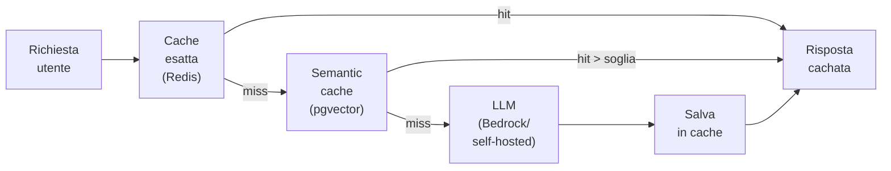

# Ottimizzare i costi di inferenza

  In evoluzione
  Lezione 6.3
  ~12 min di lettura

I costi AI in produzione crescono in modo non lineare e sorprendente. Le tre leve che li controllano — caching, batching, scelta del modello — possono ridurre la bolletta del 70-90% senza toccare la qualità percepita dall'utente.

Il problema non è teorico. Molti team lanciano un'applicazione AI con costi accettabili in fase di prototipo, poi il traffico cresce e si trovano con una bolletta mensile nell'ordine dei migliaia di euro che non si aspettavano. Questa lezione è una mappa di dove finiscono quei soldi e come tenerli sotto controllo.

## Dove vanno i costi di inferenza

Prima di ottimizzare, capire cosa stai misurando. Per le API managed il costo è diretto: **dollari per token**. Per il self-hosted è indiretto: **costo dell'istanza GPU / token processati**.

Tre fattori moltiplicano il costo di token in modo silenzioso:

**1. Il system prompt ripetuto.** Se ogni richiesta ha un system prompt di 500 token, e fai 1M di richieste al giorno, stai pagando 500M token di input solo per il prompt di sistema — indipendentemente dal contenuto dell'utente. Su Claude 3.5 Sonnet: 500M × $3/1M = **$1.500/mese solo di system prompt**.

**2. Il contesto che cresce.** In una chat multi-turno, ogni messaggio porta con sé tutto lo storico. Al turno 10, stai mandando 9 turni precedenti + system prompt + messaggio attuale. Il costo per turno cresce linearmente con la lunghezza della conversazione.

**3. Output prolisso.** I token di output costano 3-5× più dei token di input (per la maggior parte dei provider). Un modello che risponde con 500 token quando 150 basterebbero sta triplicando il costo di output.

## Caching — la leva più potente

Il **caching** delle risposte è la riduzione di costo più immediata. Se la stessa domanda (o una simile) è già stata risposta, restituisci il risultato cachato invece di richiamare il modello.

**Cache esatta**: funziona per FAQ, template fissi, risposte predeterminate. Hai una stringa → hash → lookup in Redis. Costo del lookup: microsecondi, praticamente zero.

**Semantic cache**: confronta l'embedding della nuova domanda con quelli di domande già risposte. Se la similarità supera una soglia, restituisce la risposta esistente. Utile per domande simili ma non identiche ("cos'è il RAG?" e "spiega il RAG" → stessa risposta). Costo: una ricerca vettoriale (~1ms) invece di una chiamata LLM (~500ms + costo token).

Su AWS: Redis su **ElastiCache** per cache esatta, **OpenSearch** con k-NN o **RDS pgvector** per semantic cache.

**Prompt caching** (feature di alcuni provider): Anthropic e AWS Bedrock offrono il caching del system prompt lato provider — il provider tiene in cache il KV-state del prompt di sistema tra richieste consecutive. Riduce il costo del system prompt del 90% e la latenza. Da attivare sempre se disponibile.

## Batching — processa insieme, paga meno

Il **batching** è il raggruppamento di più richieste in una singola chiamata al modello. Su GPU, processare 16 richieste insieme richiede quasi lo stesso tempo di processarne 1 — il parallelismo della GPU viene sfruttato al massimo.

Per self-hosted con vLLM: il batching è automatico (continuous batching). Non devi fare niente — vLLM aggrega le richieste in arrivo e le processa insieme.

Per API managed: il batching asincrono (Batch API) è disponibile su Anthropic e AWS Bedrock. Mandi un batch di richieste, le ricevi entro 24 ore, con sconto del 50% sul prezzo standard. Ideale per:
- Elaborazione documenti che non richiedono risposta real-time
- Generazione di embedding per un corpus di testi
- Valutazione automatica (LLM-as-judge) di un dataset

Il trade-off è latenza: non va bene per applicazioni interattive.

## Scelta del modello giusto

Non ogni task richiede il modello più potente. Usare Claude 3.5 Sonnet per classificare il sentiment di una recensione è come usare un martello pneumatico per piantare un chiodo.

La scala pratica (maggio 2026):

| Task | Modello appropriato | Costo indicativo |
|---|---|---|
| Classificazione, routing, estrazione semplice | Modelli piccoli (Haiku, Flash, Llama 3 8B) | $0.25-0.80/1M token |
| Ragionamento medio, RAG, summarization | Modelli medi (Sonnet, GPT-4o-mini, Llama 3 70B) | $3-15/1M token |
| Ragionamento complesso, coding avanzato | Modelli grandi (Sonnet Max, GPT-4o, Claude Opus) | $15-75/1M token |
| Matematica, logica formale, ricerca | Reasoning models (o1, R2, DeepSeek R1) | $15-60/1M token |

Il pattern **cascading**: usa il modello piccolo per default, chiama il grande solo se il piccolo non è sicuro della risposta (bassa confidence, risposta ambigua). Riduce il costo medio del 60-80% mantenendo la qualità sui casi difficili.

Quantizzazione — modelli più leggeri per il self-hosted

Per i modelli self-hosted, la **quantizzazione** riduce la dimensione del modello in VRAM e aumenta il throughput, con una perdita di qualità spesso trascurabile per applicazioni produzione.

Tecniche principali:
- **INT8**: pesi a 8 bit invece di 16. ~50% di VRAM in meno, perdita qualità &lt;1% per molti task.
- **INT4 (GPTQ, AWQ)**: pesi a 4 bit. ~75% di VRAM in meno, perdita qualità 2-5%. Usabile per molte applicazioni.
- **GGUF** (llama.cpp): quantizzazione efficiente per CPU/GPU consumer. Gira anche su laptop senza GPU dedicata.

Esempio pratico: Llama 3 70B in float16 richiede ~140 GB VRAM (4 GPU A100). In INT4 (AWQ): ~35 GB — una singola A100 80GB. Il throughput aumenta perché la GPU legge meno dati dalla VRAM.

Su AWS: le istanze `g5` con vLLM supportano AWQ nativamente. Per i modelli su Bedrock la quantizzazione è gestita da AWS (trasparente all'utente).

## Context window management

Il costo della conversazione multi-turno esplode se non lo gestisci. Strategie:

**Summarization progressiva**: ogni N turni, chiedi al modello di fare un riassunto della conversazione e usa quello come contesto invece dello storico completo. Riduce i token di contesto di 5-10×.

**Window sliding**: tieni solo gli ultimi K turni nello storico, scarta i più vecchi. Semplice, efficace per conversazioni che non richiedono memoria a lungo termine.

**Memory selettiva**: estrai solo i fatti rilevanti dalla conversazione (nome utente, preferenze, decisioni prese) e costruisci un contesto strutturato invece di passare la trascrizione intera.

## Cosa non è

| Il pensiero sbagliato | Come stanno le cose |
|---|---|
| "Il caching abbassa la qualità" | La cache restituisce risposte già generate dal modello. La qualità è identica. L'unico rischio è staleness — risposte outdated per domande su eventi recenti. Si gestisce con TTL appropriato. |
| "Il batching aumenta la latenza per tutti" | Il batching asincrono (Batch API) aumenta la latenza. Il continuous batching di vLLM invece migliora il throughput senza aumentare la latency dei singoli token — le richieste vengono accodate e processate in micro-batch trasparenti. |
| "Usare il modello più potente è sempre la scelta sicura" | È la scelta più costosa. Un modello sovradimensionato per il task non migliora la qualità — spesso peggiora (tende a sovra-ragionare e allungare le risposte). Usa il modello più piccolo che supera la tua evaluation. |
| "I costi di output sono uguali all'input" | No. I token di output costano tipicamente 3-5× più dei token di input. Istruire il modello a essere conciso ("rispondi in massimo 3 frasi") è un'ottimizzazione di costo reale. |

## Verifica di comprensione

1. Un system prompt di 800 token, 2M richieste al giorno, $3/1M token input. Quanto costa al mese solo il system prompt?
2. Cos'è il prompt caching lato provider e come funziona?
3. Qual è la differenza tra cache esatta e semantic cache? Quando usi l'una e l'altra?
4. Cos'è il continuous batching di vLLM e perché migliora il throughput senza aumentare la latenza?
5. Descrivi il pattern "cascading" per la scelta del modello.
6. Un'applicazione di chat ha conversazioni che durano mediamente 20 turni. Come gestiresti il crescere del contesto per contenere i costi?
7. *(anticipazione)* Hai già la cache LRU in Redis per le risposte. Cosa aggiungeresti per coprire anche le domande semanticamente simili?

## Glossario della lezione

- **Prompt caching** (lato provider): feature Bedrock/Anthropic che mantiene in cache il KV-state del system prompt tra richieste, riducendo costo e latenza.
- **Semantic cache**: cache che usa la similarità vettoriale per restituire risposte a domande simili, non solo identiche.
- **Continuous batching**: tecnica vLLM che aggrega richieste in arrivo in micro-batch, massimizzando l'utilizzo GPU senza aumentare la latenza percepita.
- **Batch API**: API asincrona (Anthropic, Bedrock) che processa gruppi di richieste con latenza di ore, a costo 50% inferiore.
- **Cascading**: pattern che usa modelli piccoli per default e modelli grandi solo per i casi di difficoltà elevata.
- **Quantizzazione**: tecnica per ridurre la precisione numerica dei pesi del modello (INT8, INT4), diminuendo la VRAM necessaria.
- **Summarization progressiva**: strategia che comprime lo storico di una conversazione in un riassunto per ridurre i token di contesto.

## Per approfondire

- **Anthropic prompt caching**: cerca "prompt caching" su `docs.anthropic.com` — documentazione con esempi di risparmio reali.
- **AWS Bedrock Batch inference**: cerca "Amazon Bedrock batch inference" su `docs.aws.amazon.com` — guida completa con API e prezzi.
- **LiteLLM**: cerca "LiteLLM proxy" su `docs.litellm.ai` — proxy open-source che gestisce caching, routing e fallback tra provider.

## Prossima lezione

Hai il costo sotto controllo. La prossima lezione entra nel caching a livello di sistema — semantic cache per LLM, edge caching degli embedding, CDN per i contenuti statici AI-generated: le leve di latenza e costo che la maggior parte dei team scopre tardi.
