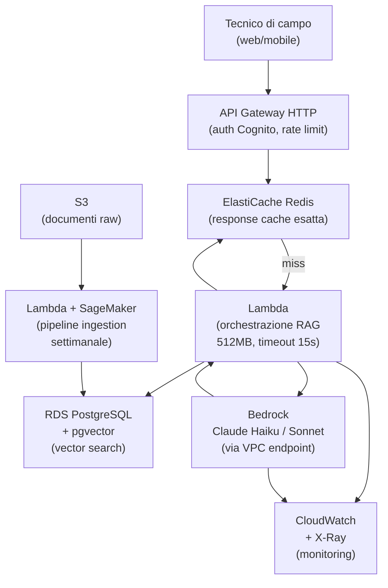

# Decision drill — Deploy RAG su AWS

  Stabile
  Lezione 6.9
  ~14 min di lettura

Tutto quello che hai imparato nella Parte 6 si applica qui. Lo scenario ha vincoli reali — budget, latenza, volume — e non c'è una risposta unica. Allenati a decidere e giustificare prima di leggere la valutazione.

---

## Lo scenario

Sei l'AI Engineer di una media impresa manifatturiera italiana. L'azienda ha una knowledge base di documentazione tecnica — manuali di prodotto, procedure operative, FAQ del supporto — e vuole un assistente AI che risponda alle domande dei tecnici di campo.

**Vincoli:**
- Budget infrastruttura: **$500/mese** massimo
- Latenza: **p95 &lt; 2 secondi** dalla richiesta alla risposta completa
- Volume: **50.000 query/giorno** (picco mattutino 08-10, resto distribuito)
- Corpus: **800.000 documenti** (PDF, DOCX, testo), aggiornamento settimanale (~5.000 nuovi documenti/settimana)
- Lingua: italiano principalmente, alcuni documenti in inglese
- Privacy: i documenti sono riservati, non possono uscire dalla VPC aziendale
- Team: 2 sviluppatori, nessuna esperienza K8s, esperienza AWS media

**La domanda:** disegna l'architettura completa, scegli ogni componente, stima i costi mensili, identifica i rischi principali.

---

Prendi carta e penna. Prima di leggere oltre, disegna l'architettura e stima i costi. Dedica almeno 15 minuti. La valutazione segue.

---

## Valutazione — cosa avrebbe nominato un senior

### Scelta del modello: Bedrock, non self-hosted

Con $500/mese e un team di 2 sviluppatori senza K8s, il self-hosted è fuori budget operativo. Il costo non è solo l'istanza GPU — è il tempo di gestione. Un'istanza `g5.xlarge` per l'inferenza costa ~$200/mese, ma richiede gestione continua (aggiornamenti, monitoring, scaling). Con un team piccolo, questo assorbe tutto il tempo.

**Scelta corretta**: AWS Bedrock. I vincoli di privacy ("non escono dalla VPC") si rispettano con i **VPC endpoints per Bedrock** — il traffico non esce su internet pubblico, rimane nella rete AWS.

Modello: **Claude 3 Haiku** come default (veloce, economico, buona qualità per Q&A su testo), **Claude 3.5 Sonnet** come escalation per le query complesse (routing basato su lunghezza o confidence del retrieval).

### Vector store: pgvector, non OpenSearch

800.000 documenti × chunk medi di ~400 token = circa 2-4M chunk dopo il chunking. Con embedding da 1536 dimensioni: ~16GB di vettori.

OpenSearch gestisce questo, ma costa ~$200/mese per un cluster production-ready (`r6g.large.search` × 2 nodi). Con un budget di $500 totali, $200 solo per il vector store lascia poco spazio.

**pgvector su RDS PostgreSQL `db.r7g.large`** (2 vCPU, 16GB RAM) a ~$120/mese gestisce 4M vettori con latenza p95 &lt;10ms per la ricerca vettoriale. L'overhead rispetto a OpenSearch: nessuna ricerca ibrida keyword+vettoriale nativa (si fa con una query SQL + full-text search PostgreSQL separata). Per questo caso d'uso (testo tecnico italiano con query prevalentemente semantiche), la ricerca ibrida migliorebbe la qualità ma non è essenziale per il first deploy.

**Nota critica**: se il requisito di ricerca ibrida emerge come importante dopo il deploy, pgvector può essere affiancato da un indice full-text PostgreSQL (GIN su `tsvector`) — senza aggiungere infrastruttura.

### Architettura completa

### Stima costi mensili

| Componente | Scelta | Costo/mese |
|---|---|---|
| API Gateway HTTP | 50K req/giorno × 30 = 1.5M req | $1.50 |
| Lambda orchestrazione | 1.5M req × 2s × 512MB | ~$18 |
| ElastiCache Redis | `cache.t3.micro` (response cache) | ~$14 |
| RDS PostgreSQL + pgvector | `db.r7g.large`, Single-AZ | ~$120 |
| Bedrock Claude Haiku | 1.5M req × 1000 token avg (60% con cache hit) | ~$135 |
| Bedrock Claude Sonnet | 10% req escalation × 2000 token avg | ~$75 |
| S3 (documenti + log) | 500GB storage + PUT/GET | ~$15 |
| Lambda + SageMaker ingestion | Pipeline settimanale, ~5000 doc × batch embedding | ~$20 |
| CloudWatch + X-Ray | Metriche custom + tracing 5% sampling | ~$25 |
| VPC Endpoints (Bedrock) | Interface endpoint | ~$14 |
| **Totale** | | **~$437/mese** |

Dentro budget. Il margine di ~$63 copre i picchi.

Il 60% di cache hit è la chiave: 40% delle richieste arrivano al modello, le altre sono servite dalla cache Redis (response esatta). Con semantic cache su pgvector, questo può salire al 70-75% — ma il primo deploy parte con la cache esatta che è più semplice.

### Gestione della latenza p95 &lt; 2 secondi

Il path critico: Lambda cold start (~200ms, mitigato con provisioned concurrency per le ore di picco) + ricerca vettoriale pgvector (~50ms) + prompt construction (~10ms) + Bedrock Haiku TTFT (~400ms) + generazione (~800ms) = ~1.5s median.

Per il p95: il tail della latenza è dominato da Bedrock nei momenti di carico. Con il rate limiting di Bedrock (requests per minute per account), il sistema può fare queueing durante il picco mattutino. **SQS + Lambda** come buffer: le richieste entrano in coda, vengono processate entro 2 secondi. Se il picco è breve, il buffer assorbe.

Alternativa: **Provisioned Throughput su Bedrock** (~$500/mese fisso per una unità su Haiku) garantisce latenza costante e niente throttling — ma da solo supera il budget. Prima verifica se il throttling è un problema reale in produzione, poi valuta.

### Pipeline di ingestion settimanale

5.000 nuovi documenti/settimana:
1. Upload su S3 → trigger evento S3
2. Lambda di chunking (300-400 token, overlap 15%) — gira in parallelo su Lambda
3. Batch embedding su Bedrock (Titan Embeddings v2, $0.02/1M token) via Batch API — asincrono, costo ~$5 per batch settimanale
4. Bulk insert in pgvector via `COPY` (più veloce degli INSERT singoli)
5. Reindex HNSW se l'indice supera il 20% di nuovi vettori

**Modello di embedding**: Titan Embeddings v2 di Bedrock (multilingual, supporta italiano, 1024 dimensioni, economico) — non serve OpenAI embedding API, resta tutto in AWS.

### Rischi principali

**1. Cold start Lambda al picco mattutino**: il burst 08-10 può causare spike di latenza per i cold start. Mitiga con **provisioned concurrency** per 2-5 istanze Lambda nelle ore di picco (costo aggiuntivo ~$15/mese).

**2. Indice HNSW in RAM**: con 4M vettori da 1024 dimensioni (Titan), l'indice occupa ~16GB. Il `db.r7g.large` ha 16GB RAM — al limite. Se il corpus cresce oltre 5M chunk, serve upgrade a `db.r7g.xlarge` (32GB, ~$240/mese) — questo rompe il budget. Monitora la dimensione dell'indice da subito.

**3. Qualità del retrieval in italiano**: i modelli di embedding sono generalmente più forti in inglese. Titan Embeddings v2 supporta italiano, ma verifica su un sample reale prima del deploy. Se la qualità è insufficiente, considera `multilingual-e5-large` self-hosted su Lambda container.

**4. Aggiornamento documenti esistenti**: i 5.000 nuovi documenti/settimana includono anche aggiornamenti di documenti già nel vector store? Un documento aggiornato deve avere i vecchi chunk rimossi e quelli nuovi inseriti. Gestisci con un `document_id` come chiave — al re-ingest, DELETE dei vecchi chunk per quel document_id prima del nuovo INSERT.

### Trappole comuni

- **Iniziare con OpenSearch** perché "scala meglio" — supera il budget, aggiunge complessità operativa non necessaria per il volume attuale.
- **Self-hosted per privacy** — i VPC endpoints risolvono la privacy senza self-hosting. Bedrock non espone i dati all'addestramento dei modelli.
- **Semantic cache dal giorno 1** — aggiungi complessità che non è necessaria finché non hai dati reali sul pattern delle query. Prima la cache esatta, poi misuri il cache hit rate e valuti.
- **Lambda con timeout 15s come scelta definitiva** — Lambda è un ottimo punto di partenza, ma se la pipeline RAG cresce (reranker + guardrail + cache multi-livello), il timeout diventa un vincolo. Tieni in mente ECS Fargate come next step.

---

## Griglia di valutazione

Un senior avrebbe citato questi punti — confronta con il tuo disegno:

| Criterio | Risposta attesa |
|---|---|
| Modello LLM | Bedrock (privacy via VPC endpoint), Haiku default + Sonnet escalation |
| Vector store | pgvector su RDS (budget, corpus size, zero ops aggiuntivo) |
| Cache | Redis response cache esatta, hit rate ~60% |
| Ingestion | Lambda + Bedrock Batch Embedding, chunking 300-400 token con overlap |
| Latenza | Path critico &lt; 1.5s median, provisioned concurrency per il picco |
| Budget | ~$437/mese — dentro la soglia con margine |
| Rischio principale | Indice HNSW al limite della RAM — monitorare da subito |
| Privacy | VPC endpoint Bedrock, niente traffico su internet pubblico |

Non è necessario aver trovato tutto. L'obiettivo è il ragionamento: hai identificato i trade-off, hai giustificato le scelte in base ai vincoli, hai notato i rischi. Questo è il valore di un AI Engineer rispetto a uno che segue un tutorial.

## Prossima tappa

Hai completato la Parte 6 — Cloud per l'AI. Il prossimo blocco (Parte 7) copre le operazioni in produzione: monitoring avanzato, incident response, SRE per sistemi AI. Oppure puoi saltare alla Parte 9 (Architettura enterprise) se il tuo obiettivo è la visione d'insieme prima di scendere nei dettagli operativi.
