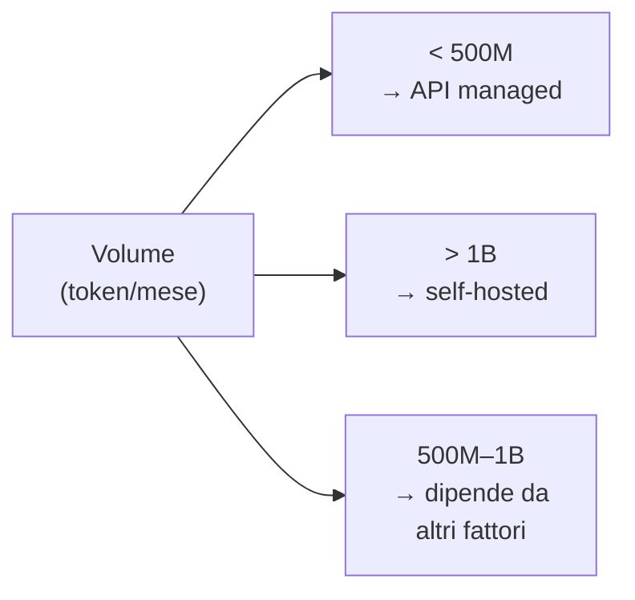

# Servizi AI gestiti vs self-hosted

  In evoluzione
  Lezione 6.2
  ~11 min di lettura

Usare un'API AI gestita o ospitare il modello tu stesso? È il build-vs-buy più frequente dell'ingegneria AI applicativa. La risposta giusta dipende da volume, latenza, privacy e controllo — non da una preferenza ideologica.

Hai già incontrato questo frame nella guida AI (parte architettura). Qui lo vedi dalla parte dell'infrastruttura: cosa significa concretamente ospitare un modello su AWS, cosa ti dà Bedrock che non avresti gestendo tu stesso, e quando il calcolo cambia.

## L'opzione gestita: AWS Bedrock

**AWS Bedrock** è il servizio di API AI managed di AWS. Dà accesso a modelli di Anthropic (Claude), Meta (Llama), Mistral, Amazon (Titan, Nova) e altri tramite un'unica API, senza gestire server, GPU, scaling o aggiornamenti.

Il modello di pricing è **pay-per-token**: paghi solo i token processati, niente costi fissi. Claude 3.5 Sonnet su Bedrock costa ~$3/1M token in input, ~$15/1M token in output (prezzi maggio 2026, soggetti a variazioni). A bassi volumi — prototipazione, uso interno, applicazioni con traffico imprevedibile — è quasi sempre la scelta ottimale.

Bedrock gestisce per te:
- Scaling automatico (da 0 a migliaia di richieste/secondo)
- Alta disponibilità e failover
- Aggiornamenti del modello (trasparenti o con versione pinned)
- Conformità (SOC 2, HIPAA, GDPR — già certificati AWS)
- **Nessun dato di training sui tuoi input** (per default, con Bedrock i tuoi prompt non finiscono nel training del fornitore)

**SageMaker** è l'altro servizio AI gestito di AWS, più orientato al ciclo completo MLOps: training, experiment tracking, model registry, endpoint di inferenza, pipeline. Per chi parte con modelli custom o fine-tuned, SageMaker è il layer gestito che evita di costruire l'infrastruttura da zero. È più complesso di Bedrock — usalo quando il workflow va oltre la semplice inferenza da API.

## L'opzione self-hosted: modello su EC2/ECS GPU

Self-hosted significa deployare il modello su infrastruttura che controlli tu — tipicamente EC2 GPU, ECS con GPU support, o EKS con GPU node pools.

I vantaggi reali:
- **Costo a volume alto**: a partire da ~10-50M token/giorno (dipende dal modello), il costo per token di un'istanza GPU dedicated scende sotto quello delle API managed.
- **Latenza controllabile**: nessuna variabilità di rete verso endpoint esterni, nessuna coda condivisa tra clienti.
- **Privacy totale**: i dati non escono mai dall'infrastruttura. Per dati sensibili (sanitari, legali, finanziari) questo può essere un requisito non negoziabile.
- **Customizzazione**: puoi modificare il modello, applicare quantizzazione, aggiungere adattatori LoRA, usare versioni non disponibili nelle API managed.

I costi nascosti del self-hosted:
- **Operazioni**: patching, monitoring, scaling, gestione dei failure. Qualcuno deve farlo — è ingegneria continua.
- **Cold start e disponibilità**: se il servizio GPU va giù, non c'è failover automatico. Vai costruire la ridondanza.
- **Costo fisso**: paghi la GPU anche quando non risponde a nessuna richiesta. A basso volume, le API managed sono sempre più economiche.

## Il calcolo del breakeven

Il punto di pareggio tra managed e self-hosted dipende dal volume. Esempio concreto per un modello tipo Llama 3 8B:

- `g5.xlarge` (A10G, 24 GB VRAM): ~$1/ora on-demand = ~$720/mese
- Throughput realistico con vLLM su A10G: ~2.000-4.000 token/secondo
- Token/mese a utilizzo 50%: ~2.6 miliardi
- Costo per milione di token: ~$0.27

Un'API managed equivalente (es. Llama 3 8B su Bedrock o Groq): $0.20-0.80/1M token.

Quindi il breakeven è intorno ai 500M-1B token/mese, a seconda del modello e del provider. **Sotto quel volume, le API managed quasi sempre vincono sul puro costo**, includendo il costo del tempo di engineering per gestire l'infrastruttura.

AWS Bedrock Provisioned Throughput — un ibrido

Bedrock offre anche il **Provisioned Throughput**: acquisti capacità dedicata per un modello specifico (1-6 mesi di commitment), a un prezzo per ora fisso invece che per token. 

Vantaggi rispetto al pay-per-token standard: latenza prevedibile, nessuna throttling condivisa, costo per token più basso ad alto utilizzo. È l'opzione per chi vuole la comodità del managed con costi più vicini al self-hosted a volumi alti.

Il calcolo: se usi un modello Bedrock full-time (>50% di utilizzo delle ore acquistate), Provisioned Throughput è quasi sempre più economico del pay-per-token. Sotto il 30% di utilizzo, non vale.

## Decision framework

La domanda non è "managed è meglio di self-hosted" — è "quale scenario sei in questo momento":

| Scenario | Scelta |
|---|---|
| Prototipo, MVP, traffico imprevedibile | API managed (Bedrock, OpenAI, Anthropic) |
| Volume > 1B token/mese, team ops disponibile | Self-hosted su GPU, vLLM |
| Dati sensibili, non possono uscire dall'infra | Self-hosted, o Bedrock con VPC endpoint |
| Latenza P99 critica (&lt;100ms), no variabilità | Self-hosted con istanze dedicated |
| Vuoi fine-tuning continuo o modello custom | Self-hosted o SageMaker endpoint |
| Team piccolo, nessun ops, AWS already | Bedrock — nessun overhead |

Il segnale più utile: **quanto vale il tuo tempo di engineering**. Self-hosted è infrastruttura da mantenere. Se hai un team di 2 persone che deve fare prodotto, le 10 ore/settimana per gestire il cluster GPU valgono più della differenza di costo.

## Cosa non è

| Il pensiero sbagliato | Come stanno le cose |
|---|---|
| "Self-hosted è sempre più economico" | È più economico solo ad alto volume e con buon utilizzo dell'istanza. A basso volume o con picchi irregolari, le API managed battono il self-hosted anche sul solo costo hardware. |
| "Bedrock non è sicuro per i dati aziendali" | Bedrock non usa i tuoi input per il training (per policy AWS). Con VPC endpoint il traffico non esce dalla rete AWS. Per requisiti di data residency e audit, Bedrock ha le stesse certificazioni del resto di AWS. |
| "Self-hosted mi dà più controllo sul modello" | Solo se conosci il modello abbastanza da trarne vantaggio. Per la maggior parte delle applicazioni, il "controllo" extra si traduce in overhead di gestione senza beneficio tangibile. |
| "SageMaker è solo per training" | SageMaker ha endpoint di inferenza gestiti, autoscaling, A/B testing tra versioni di modello, model registry. È un'infrastruttura MLOps completa, non solo training. |

## Verifica di comprensione

1. Qual è il vantaggio principale di AWS Bedrock rispetto a una GPU self-hosted a basso volume di traffico?
2. Cos'è il Provisioned Throughput di Bedrock e quando conviene?
3. Nomina due scenari in cui self-hosted vince chiaramente su managed.
4. Perché il "costo nascosto" del self-hosted include il tempo di engineering?
5. Un'azienda sanitaria deve processare referti medici con un LLM. I dati non possono uscire dall'infrastruttura aziendale. Quale opzione sceglieresti?
6. A quale volume mensile di token circa inizia ad avere senso valutare self-hosted per un modello medio?
7. *(anticipazione)* Hai scelto self-hosted. Qual è il framework di serving più usato oggi per LLM open-source, e perché?

## Glossario della lezione

- **AWS Bedrock**: servizio AWS di accesso a modelli AI di terze parti (Anthropic, Meta, Mistral, Amazon) tramite API pay-per-token.
- **AWS SageMaker**: piattaforma MLOps gestita AWS per training, deployment e gestione del ciclo di vita dei modelli.
- **Provisioned Throughput** (Bedrock): capacità dedicata acquistata a commitment mensile, per latenza prevedibile e costo per token ridotto ad alto utilizzo.
- **Self-hosted**: modello AI deployato su infrastruttura propria (EC2 GPU, ECS, EKS).
- **vLLM**: framework open-source per serving efficiente di LLM, con KV-cache e batching dinamico.
- **Breakeven point**: volume di traffico a cui il costo self-hosted eguaglia il costo managed.

## Per approfondire

- **AWS Bedrock pricing**: cerca "Amazon Bedrock pricing" su `aws.amazon.com` — tabella aggiornata di tutti i modelli disponibili con costo per token.
- **SageMaker documentation**: cerca "Amazon SageMaker Developer Guide" su `docs.aws.amazon.com` — sezione "Deploy models for inference".

## Prossima lezione

Hai scelto il tuo modello di deployment. Ora il problema reale: in produzione, i costi AI crescono in modo non lineare e sorprendente. La prossima lezione entra nel dettaglio — caching, batching, scelta dell'istanza — le tre leve che controllano la bolletta AI.
