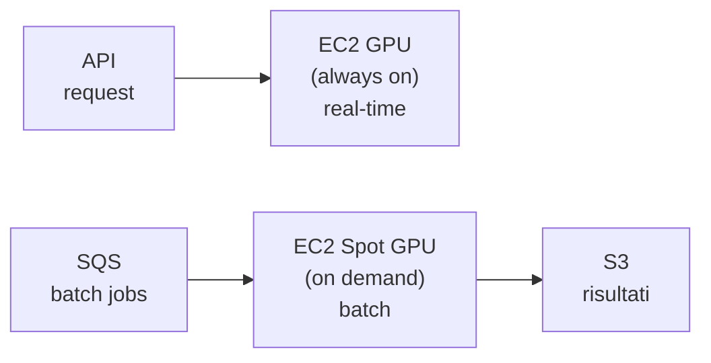

# GPU nel cloud

  In evoluzione
  Lezione 6.1
  ~12 min di lettura

Le GPU sono la risorsa più costosa e più scarsa del cloud AI. Capire perché costano, come si provisiona e quando evitarle è la differenza tra un sistema AI sostenibile e una bolletta che esplode.

Fino alla Parte 5 hai lavorato con CPU — EC2, ECS, Lambda, tutto su processori general-purpose. I carichi AI cambiano le carte in tavola. Un modello da 7 miliardi di parametri su CPU richiede decine di secondi per risposta; sulla GPU giusta, millisecondi. La differenza non è un dettaglio: è ciò che rende un sistema usabile.

## Perché le GPU

Una CPU moderna ha 8-64 core, ottimizzata per operazioni sequenziali complesse. Una GPU ha migliaia di core minuscoli, progettata per fare la stessa operazione su migliaia di numeri in parallelo — esattamente quello che serve per moltiplicare matrici grandi, l'operazione fondamentale dei modelli neurali.

La misura che conta in pratica è la **VRAM** (*Video RAM*) — la memoria sulla GPU stessa. Ogni parametro del modello occupa spazio in VRAM (un modello da 7B parametri in float16 occupa ~14 GB). Se il modello non entra nella VRAM, non gira. Non è negoziabile.

Regola pratica per stimare: `parametri × 2 byte (float16) = VRAM minima`. Per inferenza in produzione aggiungi ~20% per i buffer di attivazione. Per il fine-tuning, moltiplica per 4-6× (gradienti + ottimizzatore).

## Famiglie GPU su AWS

AWS offre GPU tramite le istanze **EC2 con acceleratori**. Le famiglie principali:

| Famiglia | GPU | VRAM | Uso tipico | Prezzo on-demand |
|---|---|---|---|---|
| `g4dn.xlarge` | NVIDIA T4 (1 GPU) | 16 GB | Inferenza modelli medi, fine-tuning piccolo | ~$0.526/ora |
| `g5.xlarge` | NVIDIA A10G (1 GPU) | 24 GB | Inferenza LLM fino a 13B, image generation | ~$1.006/ora |
| `g5.12xlarge` | NVIDIA A10G (4 GPU) | 96 GB | Modelli grandi, batch inference | ~$5.672/ora |
| `p3.2xlarge` | NVIDIA V100 (1 GPU) | 16 GB | Training, modelli legacy | ~$3.06/ora |
| `p4d.24xlarge` | NVIDIA A100 (8 GPU) | 320 GB | Training di grandi modelli | ~$32.77/ora |
| `p5.48xlarge` | NVIDIA H100 (8 GPU) | 640 GB | Training state-of-the-art | ~$98.32/ora |
| `inf2.xlarge` | AWS Inferentia2 | 32 GB | Inferenza ottimizzata, costo basso | ~$0.758/ora |
| `trn1.2xlarge` | AWS Trainium | 32 GB | Training ottimizzato AWS | ~$1.343/ora |

Le istanze **Inferentia** e **Trainium** sono chip proprietari AWS. Inferentia2 per inferenza ha un costo per token spesso 30-50% più basso delle GPU NVIDIA equivalenti — ma richiede compilazione del modello con il loro SDK (Neuron). Vale il costo di migrazione se l'uso è intensivo.

**GPU Spot**: come per EC2, le GPU sono disponibili in modalità Spot a sconti del 60-90%. Per training (workload interrompibile con checkpoint) è quasi sempre la scelta giusta. Per inferenza in produzione (richiede disponibilità garantita) si usano istanze On-Demand o Reserved.

Multi-GPU e distribuzione del modello

Quando un modello non entra in una singola GPU, si distribuisce su più GPU con tecniche di **parallelismo**:

- **Tensor parallelism**: divide ogni layer del modello su più GPU. Richiede comunicazione continua tra GPU — ideale su istanze con NVLink (connessione GPU ad alta velocità, tipo le p4d/p5).
- **Pipeline parallelism**: divide il modello in stadi, ogni GPU gestisce alcuni layer. Meno comunicazione, ma introduce "pipeline bubbles" (GPU idle mentre aspettano il layer precedente).

Su AWS, per modelli molto grandi si usa **EKS con GPU node pools** o **SageMaker Training** che gestisce automaticamente la distribuzione. Per inferenza di modelli grandi in produzione, il framework più usato oggi è **vLLM** — gestisce KV-cache, batching dinamico e parallelismo automaticamente.

## Serving a bassa latenza vs batch inference

Le GPU si usano in due modi fondamentalmente diversi, e la scelta dell'infrastruttura cambia:

**Real-time inference** (richiesta → risposta in &lt;2 secondi):
- Serve istanza GPU sempre accesa — il cold start di una GPU (caricare il modello in VRAM) è nell'ordine dei minuti, inaccettabile per uso interattivo.
- Pattern: EC2 GPU in Auto Scaling Group con scaling basato su latenza P99, o ECS Fargate con GPU support (limitato, per modelli piccoli).
- ALB davanti, almeno 1 istanza minima sempre up.

**Batch inference** (elabora migliaia di item in coda, latenza non critica):
- Spot GPU + SQS queue. Molto più economico: paghi solo quando elabori.
- Pattern: Lambda triggerata da SQS → EC2 Spot GPU on-demand → risultati su S3 → notifica su SNS.
- Il costo per item può essere 5-10× inferiore al real-time.

## Quando NON usare GPU

La tentazione è mettere una GPU dappertutto. È quasi sempre sbagliato.

- **Modelli piccoli** (classificatori, embedding, reranker leggeri): girare benissimo su CPU, spesso con latenza accettabile. Una `c5.2xlarge` ($0.34/ora) batte una `g4dn.xlarge` ($0.53/ora) in costo per richiesta se il modello è piccolo.
- **API managed** (OpenAI, Anthropic, Bedrock): non hai GPU, non hai server — paghi per token. Per la maggior parte delle applicazioni questa è la scelta giusta fino a quando i costi non diventano un problema strutturale (vedi 5.3).
- **Prototipazione e sviluppo**: usa API managed. Le GPU costano anche quando il modello non risponde a nessuna richiesta.

## Cosa non è

| Il pensiero sbagliato | Come stanno le cose |
|---|---|
| "Più VRAM = più veloce" | VRAM determina quale modello puoi caricare, non la velocità di inferenza. La velocità dipende da bandwidth memoria, compute (TFLOPS) e ottimizzazione del serving. Una T4 con modello ottimizzato batte una A100 con modello generico. |
| "GPU Spot non si può usare per inferenza" | Si può — con l'architettura giusta. Spot Fleet con fallback su On-Demand, health check su ALB, rolling restarts. Aziende grandi lo fanno. Ma richiede ingegneria dedicata. |
| "AWS Inferentia è solo per modelli AWS" | Inferentia supporta modelli PyTorch/TensorFlow compilati con Neuron SDK. Funziona con BERT, T5, Llama e altri modelli open. Non è solo per Bedrock. |
| "Il cold start GPU non è un problema" | Caricare un modello da 13B in VRAM richiede 2-5 minuti. Per un'applicazione interattiva è devastante. Il warm-up strategy (tenere istanze calde, provisioned concurrency equivalente) va pianificato dall'inizio. |

## Verifica di comprensione

1. Quanto VRAM serve (minimo) per fare inferenza con un modello da 13B parametri in float16?
2. Cos'è la differenza principale tra real-time inference e batch inference in termini di infrastruttura?
3. Perché AWS Inferentia può costare meno di una GPU NVIDIA a parità di throughput?
4. In quale caso ha senso usare istanze GPU Spot invece di On-Demand?
5. Un modello di embedding piccolo (110M parametri) deve classificare 10.000 testi al giorno. GPU o CPU? Perché?
6. Cos'è il cold start GPU e come lo mitighi in un sistema real-time?
7. *(anticipazione)* Stai scegliendo tra ospitare un modello Llama 3 8B su EC2 GPU e usare l'API Bedrock di AWS. Quali variabili consideri per decidere?

## Glossario della lezione

- **VRAM** (*Video RAM*): memoria integrata nella GPU. Il modello deve entrare interamente in VRAM per girare.
- **Float16**: rappresentazione a 16 bit dei pesi del modello. Dimezza la VRAM rispetto a float32, con perdita di precisione trascurabile per l'inferenza.
- **Tensor parallelism**: tecnica di distribuzione del modello su più GPU dividendo i layer.
- **vLLM**: framework open-source per serving efficiente di LLM, con KV-cache e batching dinamico.
- **AWS Inferentia**: chip proprietario AWS ottimizzato per inferenza, alternativa economica alle GPU NVIDIA.
- **AWS Trainium**: chip proprietario AWS ottimizzato per training.
- **Neuron SDK**: toolkit AWS per compilare modelli PyTorch/TensorFlow per Inferentia e Trainium.
- **Batch inference**: elaborazione asincrona di molti item, senza vincolo di latenza real-time.
- **Cold start GPU**: tempo necessario per caricare un modello in VRAM prima della prima inferenza.

## Per approfondire

- **AWS EC2 GPU instances**: cerca "Amazon EC2 accelerated computing instances" su `aws.amazon.com` — tabella aggiornata di tutte le famiglie GPU con prezzi.
- **vLLM**: cerca "vLLM documentation" su `docs.vllm.ai` — il riferimento per il serving efficiente di LLM open-source.
- **AWS Neuron SDK**: cerca "AWS Neuron documentation" su `awsdocs.github.io/aws-neuron-sdk` — guide per compilare e deployare su Inferentia.

## Prossima lezione

Hai capito la GPU come risorsa. La prossima lezione affronta la domanda che viene prima: ospitare il modello tu stesso su GPU, o usare un servizio AI gestito come AWS Bedrock? I costi, i trade-off, e quando cambia la risposta.
