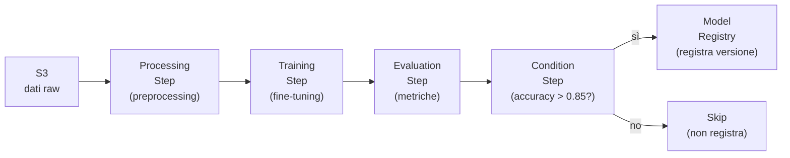
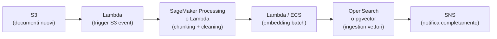

# Training pipeline gestiti

<div class="lesson-meta">
  <span class="badge-stato evoluzione">In evoluzione</span>
  <span>Lezione 6.8</span>
  <span class="badge-stato opzionale">Opzionale</span>
  <span>~12 min di lettura</span>
</div>

<p class="lesson-lead">Non devi addestrare un modello da zero per avere bisogno di una training pipeline. Ogni volta che hai un corpus da ingestire, un fine-tuning da eseguire, o una pipeline di preprocessing da ripetere in modo affidabile, stai facendo MLOps — e SageMaker esiste per renderlo gestibile senza inventare l'infrastruttura da zero.</p>

Questa lezione non è sulla matematica dell'addestramento. È su come organizzare, versionare e far girare in modo affidabile le pipeline che preparano i dati e aggiornano i modelli — il 70% del lavoro reale di un AI Engineer.

## Il problema che le pipeline risolvono

Senza una pipeline strutturata, il workflow tipico è: "ho uno script Python che fa tutto — scarica dati da S3, li preprocessa, chiama il modello, salva i risultati". Funziona in locale. In produzione:

- Come lo riproduci tra sei mesi?
- Come logghi quale versione dei dati ha prodotto quale modello?
- Come riparti dall'ultimo step se il job crasha al 90%?
- Come mostri al team cosa è andato storto in un run specifico?

Una **pipeline MLOps** risponde a queste domande: ogni step è un container isolato e versionato, gli input/output sono tracciati, il grafo di dipendenze è esplicito, ogni run ha un log completo.

## SageMaker Pipelines — la pipeline managed di AWS

**SageMaker Pipelines** è il sistema di orchestrazione MLOps di AWS. Una pipeline è una sequenza di **step**, ognuno dei quali gira in un container separato su un'istanza EC2 gestita da SageMaker.



I tipi di step principali:

- **ProcessingStep**: preprocessing dei dati — normalizzazione, chunking, feature engineering. Gira su istanze `ml.m5` o `ml.c5` (CPU).
- **TrainingStep**: addestramento o fine-tuning del modello. Gira su istanze GPU (`ml.g5`, `ml.p4d`).
- **EvaluationStep / ProcessingStep**: calcola le metriche del modello valutato su un test set.
- **ConditionStep**: biforcazione — prosegui solo se una metrica supera una soglia (es. accuracy &gt; 0.85).
- **ModelStep / RegisterModel**: registra il modello nel Model Registry con metadata, metriche, e artifact path su S3.

Ogni step ha `inputs` (dati da S3 o output di step precedenti) e `outputs` (salvati automaticamente su S3). Se un run fallisce, SageMaker tiene lo stato — riparti dallo step fallito senza rifare tutto da capo.

<details>
<summary>Spot instances nei TrainingStep — risparmiare il 60-70% sul training</summary>

Il training è spesso il step più costoso della pipeline — può durare ore su GPU costose. SageMaker supporta le **Managed Spot Training**: usa istanze Spot (interrompibili, ~70% più economiche) e gestisce automaticamente i checkpoint.

Se l'istanza viene interrotta, SageMaker riprende il training dall'ultimo checkpoint salvato su S3. Per il codice: il training script deve salvare checkpoint periodici (ogni N step o N minuti) — questa è l'unica modifica necessaria.

```python
# Nel training script: salva checkpoint ogni 100 step
if step % 100 == 0:
    model.save_pretrained(f"/opt/ml/checkpoints/step-{step}")
```

La configurazione nello step:
```python
estimator = HuggingFace(
    use_spot_instances=True,
    max_wait=7200,     # attendi fino a 2h per spot availability
    max_run=3600,      # training max 1h
    checkpoint_s3_uri=f"s3://{bucket}/checkpoints/",
)
```

Il risparmio su un job di fine-tuning da $100 (on-demand) diventa ~$30 (spot). Vale quasi sempre per il training asincrono.

</details>

## Model Registry — versionare i modelli come il codice

Il **SageMaker Model Registry** è il catalogo dei modelli prodotti dalle pipeline. Ogni versione di modello ha:

- **Artifact**: il file del modello salvato su S3 (weights, tokenizer, config)
- **Metriche**: accuracy, F1, latenza di inferenza, VRAM richiesta — tutto quello che è stato misurato nell'evaluation step
- **Metadata**: data di training, versione del dataset, hyperparameter usati, SHA del codice
- **Approval status**: `PendingManualApproval` → `Approved` → deploy in produzione

Il flusso tipico: ogni run della pipeline crea una nuova versione nel registry con status `PendingManualApproval`. Un ingegnere o un processo automatico (se le metriche superano una soglia) approva la versione. Solo le versioni approvate vengono deployate.

Questo è il controllo di qualità sulla porta del deployment — niente finisce in produzione senza passare dall'approval.

## Feature Store — dati condivisi tra pipeline

Il **SageMaker Feature Store** risolve un problema sottovalutato: la stessa feature (es. "embedding del documento X") viene calcolata più volte in pipeline diverse, da team diversi, potenzialmente in modo inconsistente.

Il Feature Store è un catalogo di feature calcolate, con due layer:

- **Online store**: bassa latenza (~10ms), per l'inferenza real-time — "dammi le feature di questo utente adesso"
- **Offline store**: S3 + Athena, per il training — "dammi tutte le feature degli ultimi 30 giorni per questo Feature Group"

Per una pipeline RAG con documenti che si aggiornano raramente, il Feature Store serve meno (gli embedding stanno nel vector store). Diventa rilevante quando hai feature tabellari — dati utente, contesto storico, attributi calcolati — che alimentano sia il training sia l'inferenza.

## S3 come spina dorsale

Tutto passa per S3: dati raw di input, output di ogni step, checkpoint del training, artifact del modello nel registry. S3 è il "filesystem condiviso" della pipeline.

Il pattern di organizzazione su S3 che funziona in produzione:

```
s3://my-ml-bucket/
  data/
    raw/YYYY-MM-DD/        # dati di input versionati per data
    processed/pipeline-run-id/   # output del preprocessing
  models/
    model-name/version/    # artifact del modello
  checkpoints/
    run-id/step-N/         # checkpoint del training
  evaluation/
    run-id/                # metriche JSON dell'evaluation
```

La versione per data sui dati raw ti permette di riprodurre esattamente un training fatto sei mesi fa: sai quale giornata di dati è stata usata, e i dati di quella data sono ancora su S3 (con lifecycle policy che ritarda la cancellazione di almeno 90 giorni).

## Pipeline di ingestion documenti (il caso RAG)

Per un sistema RAG, la "training pipeline" più importante non è il fine-tuning — è la **pipeline di ingestion** che aggiorna il corpus nel vector store.



Il chunking — la suddivisione di un documento lungo in pezzi più piccoli (chunk) da embeddare separatamente — è il passo critico per la qualità del RAG. Regola pratica: chunk di 300-500 token con overlap del 10-20% (i chunk si sovrappongono leggermente ai bordi per non perdere contesto alla giunzione).

Per corpus grandi, il batching del calcolo degli embedding (Bedrock Batch API o vLLM batch) riduce il costo del 50%.

## Cosa non è

| Il pensiero sbagliato | Come stanno le cose |
|---|---|
| "SageMaker Pipelines serve solo per addestrare modelli da zero" | SageMaker Pipelines è uno strumento di orchestrazione generico. Ogni step è un container che esegue codice Python arbitrario — preprocessing, embedding batch, evaluation, ingestion in OpenSearch. Puoi costruire qualsiasi pipeline dati/ML, non solo il training. |
| "Il Feature Store sostituisce il vector store" | Sono cose diverse. Il Feature Store gestisce feature tabellari (numeri, categorie, attributi) con un'API di lookup per chiave. Il vector store gestisce embedding e supporta la ricerca per similarità. Non si sovrappongono. |
| "Con i checkpoint non perdo niente se il job crasha" | I checkpoint salvano lo stato del modello ogni N step. Se il job crasha tra due checkpoint, perdi il lavoro dall'ultimo checkpoint al crash. Checkpoint più frequenti riducono la perdita ma aumentano l'I/O su S3. Trova l'equilibrio in base al costo dell'istanza. |

## Verifica di comprensione

1. Cos'è un ConditionStep in SageMaker Pipelines e perché è utile prima della registrazione del modello?
2. Come funziona il Managed Spot Training e quale modifica richiede al codice di training?
3. Qual è la differenza tra online store e offline store nel Feature Store?
4. In una pipeline RAG di ingestion, cos'è il chunking e perché usare un overlap tra chunk?
5. Come organizzeresti S3 per tracciare esattamente quale versione dei dati ha prodotto quale versione del modello?
6. Un evaluation step calcola accuracy = 0.78, sotto la soglia di 0.85. Cosa succede nel grafo della pipeline con un ConditionStep?
7. *(anticipazione)* Hai tutto: vector store popolato, modello, architettura, pipeline di aggiornamento. È il momento del drill: deployare un RAG completo su AWS con vincoli reali di budget e latenza.

## Glossario della lezione

- **SageMaker Pipelines**: servizio AWS per orchestrare pipeline MLOps — sequenza di step containerizzati con tracciamento input/output.
- **ProcessingStep**: step di preprocessing dati in SageMaker Pipelines — gira su istanze CPU managed.
- **TrainingStep**: step di addestramento/fine-tuning in SageMaker Pipelines — gira su istanze GPU managed.
- **ConditionStep**: step che introduce una biforcazione nella pipeline basata su una condizione (es. metrica > soglia).
- **Model Registry**: catalogo SageMaker dei modelli con versioni, metriche, artifact e approval workflow.
- **Feature Store**: catalogo SageMaker di feature calcolate — online store (bassa latenza) e offline store (S3 per training).
- **Chunking**: suddivisione di documenti lunghi in pezzi più piccoli (chunk) per l'embedding — step critico della pipeline RAG.
- **Managed Spot Training**: modalità SageMaker che usa istanze Spot con checkpoint automatici — riduce il costo del training del 60-70%.

## Per approfondire

- **SageMaker Pipelines**: cerca "Amazon SageMaker Pipelines" su `docs.aws.amazon.com` — guida completa con esempi di pipeline in Python SDK.
- **SageMaker Feature Store**: cerca "Amazon SageMaker Feature Store" su `docs.aws.amazon.com`.
- **Chunking strategies**: cerca "chunking strategies for RAG" su `docs.aws.amazon.com/bedrock` — guida di Bedrock Knowledge Bases sulle strategie di chunking.

## Prossima lezione

Hai tutti i componenti. Il drill finale ti chiede di metterli insieme sotto pressione: deploy di un RAG completo su AWS con un budget di $500/mese, latenza p95 &lt; 2 secondi, 50K query/giorno. Decidi, giustifica, stima i costi.
