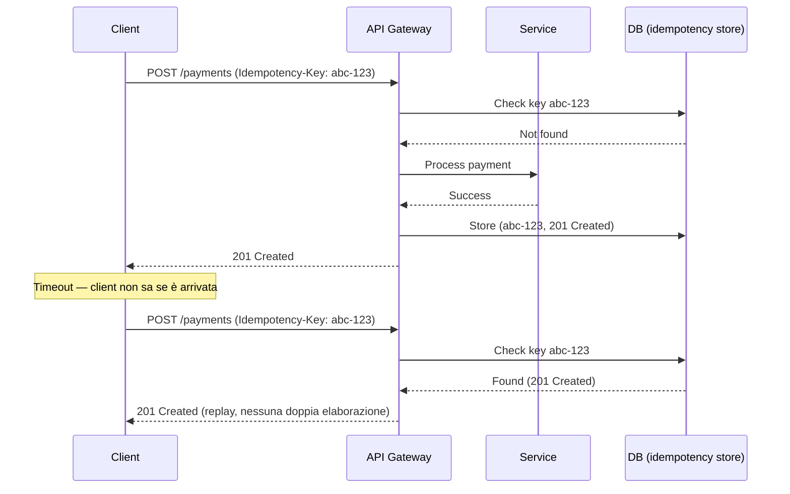

# API design per servizi cloud

<div class="lesson-meta">
  <span class="badge-stato stabile">Stabile</span>
  <span>Lezione 2.5</span>
  <span>~12 min di lettura</span>
</div>

<p class="lesson-lead">L'interfaccia conta più del runtime. Un'API mal progettata diventa un debito tecnico permanente — client da aggiornare, contratti rotti, versioning complicato. Le decisioni si prendono all'inizio, raramente dopo.</p>

Hai un servizio che gira su Lambda, Fargate, o EC2. Il runtime è un dettaglio: si può cambiare. L'API pubblica è quasi immutabile — una volta che i client ci costruiscono sopra, romperla significa rompere tutti i client. È qui che si accumula la maggior parte del debito tecnico nel cloud.

L'**idea in una frase**: un'API è un contratto — REST lo formalizza sulle risorse, GraphQL sulle query client-driven, gRPC sui tipi binari — la scelta dipende da chi consuma e come.

## REST: le risorse come fondamento

**REST** (*Representational State Transfer*) è lo stile architetturale dominante per le API HTTP. I principi fondamentali:

- **Risorse, non azioni**: l'URL identifica una risorsa (`/users/123`), il metodo HTTP definisce l'azione (`GET` per leggere, `POST` per creare, `PUT`/`PATCH` per aggiornare, `DELETE` per eliminare). Sbagliato: `POST /createUser`. Giusto: `POST /users`.
- **Stateless**: ogni richiesta contiene tutto il necessario per essere elaborata. Il server non mantiene sessioni. Lo stato del client sta nel client o in un token (JWT — JSON Web Token).
- **Rappresentazioni**: lo stesso endpoint può restituire JSON, XML, o altro a seconda dell'`Accept` header.
- **Codici HTTP semantici**: `200 OK`, `201 Created`, `400 Bad Request`, `401 Unauthorized` (non autenticato), `403 Forbidden` (autenticato ma senza permessi), `404 Not Found`, `409 Conflict`, `429 Too Many Requests`, `500 Internal Server Error`. Usarli correttamente non è cosmesi — i client li usano per decidere come reagire.

Una API REST ben progettata è autodocumentante: guardando l'URL e il metodo HTTP, il comportamento è prevedibile.

## GraphQL: quando il client sa cosa vuole

**GraphQL** è un linguaggio di query per le API, sviluppato da Facebook (oggi Meta). Il client specifica *esattamente* quali campi vuole nella risposta — il server non decide. Esempio:

```graphql
query {
  user(id: "123") {
    name
    email
    orders(last: 5) {
      id
      total
    }
  }
}
```

Questo elimina due problemi comuni di REST: **over-fetching** (il server restituisce campi che il client non usa) e **under-fetching** (il client deve fare N richieste per assemblare i dati di cui ha bisogno, il famoso problema N+1).

**Quando GraphQL vince**: frontend con requisiti dati variabili (mobile vs web chiedono dati diversi dallo stesso endpoint), team di frontend che lavorano velocemente e non vogliono aspettare nuovi endpoint dal backend, sistemi con dati molto relazionali (social graph, cataloghi prodotto complessi).

**Quando REST è meglio**: API pubbliche (REST è più facile da consumare per chiunque), servizi semplici con endpoint stabili, team che non ha familiarità con GraphQL (la curva di apprendimento e il tooling sono significativi).

## Versioning: il problema che si rimanda troppo

Quando cambi un'API (aggiungi un campo obbligatorio, cambi il formato di una risposta, rimuovi un endpoint), i vecchi client si rompono. Il versioning è il meccanismo per gestire la coesistenza di versioni diverse.

Tre approcci comuni:

- **URI versioning** (`/v1/users`, `/v2/users`): più esplicito, più semplice da implementare, ma prolifera gli endpoint.
- **Header versioning** (`Accept: application/vnd.api+json; version=2`): non inquina l'URL, ma richiede più configurazione gateway.
- **Backward compatibility**: non versioni, ma eviti breaking changes. Aggiungi campi nuovi senza rimuovere quelli vecchi, rendi nuovi campi opzionali. Ideale quando possibile, ma non sempre fattibile.

La regola pratica: **non rompere mai i contratti esistenti**. Depreca prima (restituisci un header `Deprecation: true`, logga l'utilizzo), poi rimuovi dopo almeno un ciclo di notifica ai client. In un sistema pubblico, questo significa mesi.

## Rate limiting e idempotenza

**Rate limiting** — limitare il numero di richieste per client per finestra temporale — serve a due cose: protegge il backend da abusi intenzionali (DoS) e da client mal configurati (loop accidentali). Senza rate limiting, un singolo client può saturare il servizio.

L'implementazione corretta restituisce:
- `429 Too Many Requests` quando il limite è superato
- Header `Retry-After: 60` (secondi da aspettare) o `X-RateLimit-Remaining: 0` per informare il client

**Idempotenza nelle API** (diverso dall'idempotenza delle code, ma stesso principio): le operazioni di modifica (`POST`, `PUT`, `DELETE`) devono essere sicure da ripetere. Se il client invia una richiesta, non riceve risposta (timeout), e la rimanda — il server deve gestirla senza duplicazioni.

Il pattern standard: il client genera un `Idempotency-Key` (UUID), lo include nella richiesta. Il server salva (chiave, risposta) — se arriva una seconda richiesta con la stessa chiave, restituisce la risposta salvata senza rielaborare. Stripe, PayPal, e la maggior parte delle API di pagamento lo richiedono.



## Autenticazione: chi sei e cosa puoi fare

L'autenticazione nelle API cloud usa quasi sempre token stateless:

**JWT** (*JSON Web Token*): token firmato (con chiave privata o shared secret) che contiene claims (chi sei, quali ruoli hai, quando scade). Il server non deve fare una query al database per validarlo — verifica la firma e legge i claims direttamente. Stateless, scalabile, ma: la revoca è complessa (il token è valido finché non scade — se lo rubi, hai accesso fino alla scadenza).

**OAuth 2.0 + OIDC**: per autenticazione delegata (login con Google, Apple, il proprio IdP aziendale). Il server riceve un access token dal provider, lo verifica, e usa lo user ID per autorizzare. AWS Cognito, Auth0, Keycloak sono implementazioni comuni.

**API Key**: semplice, adatto per API machine-to-machine dove l'utente è un servizio. La chiave va sempre nell'header (`Authorization: Bearer <key>`), mai nell'URL (l'URL finisce nei log).

<details>
<summary>Paginazione: le tre strategie a confronto</summary>

Restituire tutti i risultati in una risposta non scala. Le tre strategie di paginazione:

**Offset pagination** (`?page=3&limit=20`): il più intuitivo, ma inefficiente su grandi dataset (la query deve saltare N righe, costoso su database). E se vengono inserite righe nuove tra una pagina e l'altra, potresti vedere duplicati o saltare risultati.

**Cursor pagination** (`?after=cursor_opaque_string&limit=20`): il cursore è un riferimento stabile all'ultimo elemento restituito (spesso base64 di un ID o timestamp). Non soffre dei problemi di offset con inserzioni concorrenti. È il pattern usato da Twitter, GitHub, Stripe per le loro API.

**Keyset pagination**: simile al cursore, ma usa un valore del dataset direttamente come chiave (`?after_id=123&limit=20`). Performante se `id` è indicizzato, ma espone dettagli interni dell'implementazione.

La regola pratica: usa offset per dataset piccoli e stabili (lista di categorie), cursor/keyset per feed, risultati di ricerca, o qualsiasi cosa con inserzioni frequenti.
</details>

## Cosa non è

| Il pensiero sbagliato | Come stanno le cose |
|---|---|
| "REST e HTTP sono la stessa cosa" | HTTP è il protocollo di trasporto. REST è uno stile architetturale che usa HTTP. Puoi usare HTTP in modo non-RESTful (es. `POST /getUser` — azione nel path, verbo sbagliato). |
| "GraphQL è sempre meglio di REST" | GraphQL aggiunge complessità: schema da mantenere, caching più difficile (no URL univoci per risposta), rate limiting per query invece di endpoint. Per API semplici o pubbliche, REST è più adeguato. |
| "JWT non ha bisogno di validazione"| Il client può decodificare il payload JWT senza verificare la firma (è solo base64). Il server DEVE verificare la firma prima di fidarsi dei claims. Un JWT non firmato o con firma non valida è spazzatura. |
| "Il rate limiting è solo per la sicurezza" | È anche protezione dagli errori del cliente stesso — un loop buggy che chiama l'API 10.000 volte al secondo può distruggere il backend senza che il client lo sappia. Il rate limiting salva anche i clienti onesti. |

## Verifica di comprensione

> Rispondi a memoria. Le risposte incerte rivedile domani.

1. Qual è la differenza tra `401 Unauthorized` e `403 Forbidden`? Quando usi l'uno e quando l'altro?
2. Cos'è il problema N+1 nelle API REST e come GraphQL lo risolve?
3. Come funziona un Idempotency-Key e perché è necessario nelle API di pagamento?
4. Perché la cursor pagination è preferibile all'offset pagination per i feed?
5. Qual è il rischio principale di JWT per la revoca dei token?
6. Un client riceve `429 Too Many Requests`. Qual è la risposta corretta del client?
7. *(anticipazione)* AWS API Gateway gestisce rate limiting, autenticazione, e versioning. In che modo alleggerisce il servizio backend da queste responsabilità?

## Glossario della lezione

- **REST** (*Representational State Transfer*): stile architetturale per API HTTP basato su risorse.
- **GraphQL**: linguaggio di query per API dove il client definisce la struttura della risposta.
- **gRPC**: framework RPC di Google basato su Protocol Buffers — binario, tipizzato, efficiente.
- **Over-fetching**: il server restituisce più dati del necessario (problema REST).
- **Under-fetching**: il client deve fare più richieste per ottenere i dati necessari (problema REST).
- **JWT** (*JSON Web Token*): token firmato contenente claims, stateless.
- **Idempotency-Key**: identificatore univoco di una richiesta, usato per evitare doppia elaborazione.
- **Rate limiting**: limitazione del numero di richieste per client per finestra temporale.
- **Cursor pagination**: tecnica di paginazione basata su un riferimento stabile all'ultimo elemento.
- **OAuth 2.0**: standard di autorizzazione delegata.
- **OIDC** (*OpenID Connect*): layer di autenticazione sopra OAuth 2.0.

## Per approfondire

- **Stripe API docs** (`docs.stripe.com`): il gold standard di API design — versioning, idempotency keys, webhook, paginazione cursor-based, tutti spiegati in produzione reale.
- **GitHub REST API docs** (`docs.github.com/en/rest`): altro esempio di REST API pubblica ben progettata con cursor pagination.
- **"API Design Patterns"** (Geewax): il riferimento teorico più completo su pattern REST, versioning, e design delle risorse.

## Prossima lezione

Le API gestiscono i dati a riposo e in transito tramite request/response. Ma quando hai stream di dati continui — log, eventi di sistema, transazioni finanziarie real-time — il modello request/response non regge. La prossima lezione introduce i dati in movimento: stream processing, event sourcing, Change Data Capture.
# API design per servizi cloud

<div class="lesson-meta">
  <span class="badge-stato evoluzione">Bozza</span>
  <span>Lezione 2.5</span>
</div>

> Lezione in arrivo. Vedi il [SYLLABUS](/cloud/SYLLABUS), punto 2.5.
