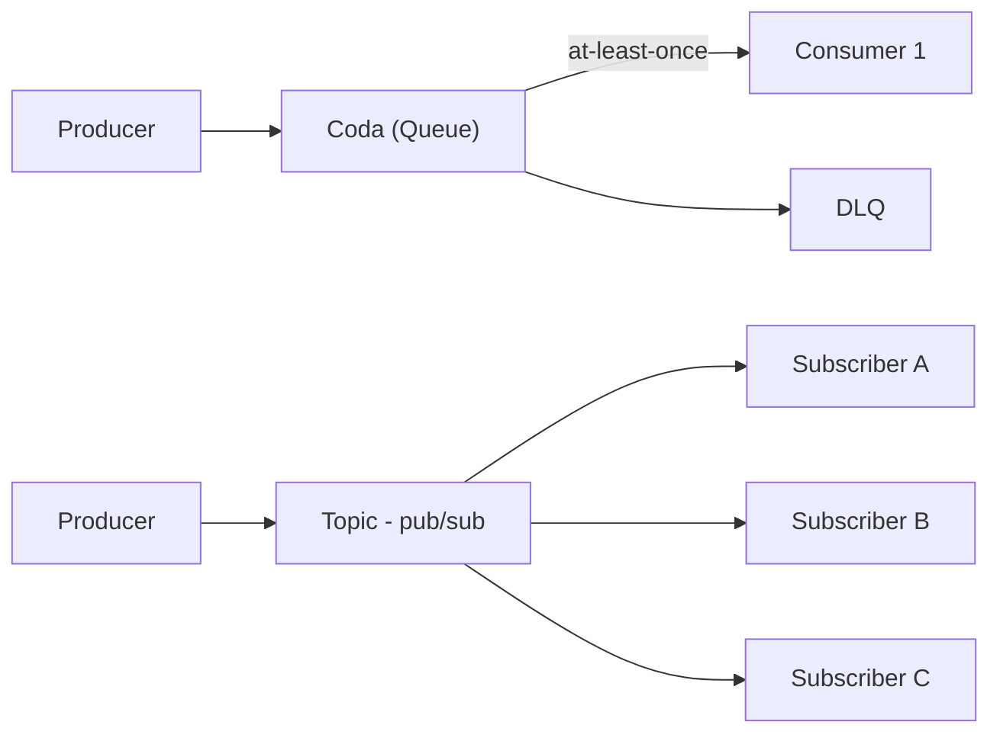

# Async ed event-driven

  Stabile
  Lezione 2.4
  ~11 min di lettura

Non tutto il lavoro deve essere sincrono. Quando l'utente non ha bisogno di aspettare la risposta, una coda cambia tutto — ridisegna la resilienza, il costo e la scalabilità del sistema.

Nella maggior parte delle applicazioni web, il pattern è: il client chiama un'API, l'API risponde. Sincrono, diretto, intuitivo. Ma questo schema porta con sé un'assunzione implicita: il lavoro deve essere fatto *ora*, *da questo servizio*, *prima che la risposta torni*. Quando quella assunzione non regge, il sistema soffre.

L'**idea in una frase**: il modello asincrono disaccoppia chi produce il lavoro da chi lo consuma — il producer non aspetta, il consumer lavora al suo ritmo, il sistema regge i picchi senza rompersi.

## Quando il sincrono non basta

Considera un'applicazione che, quando un utente si registra, deve: inviare un'email di benvenuto, creare il profilo nel servizio CRM, inviare un evento a Google Analytics, e scattare uno screenshot della homepage dell'utente per la dashboard admin. In modo sincrono, l'API di registrazione aspetta che tutto questo finisca prima di rispondere `201 Created`. Problema:

- Se il CRM è lento (risponde in 3 secondi), l'utente aspetta 3 secondi per completare la registrazione
- Se lo screenshot service è down, la registrazione fallisce
- Se arrivano 1.000 registrazioni in un minuto, il CRM e il servizio email devono gestire 1.000 richieste simultanee

La risposta corretta: l'API registra l'utente nel database, risponde `201` in 50ms, e **pubblica un evento** su un sistema di messaggistica. Il CRM, il servizio email, Analytics — ognuno consuma l'evento per conto suo, al proprio ritmo. Se lo screenshot service è down, l'evento resta in coda e viene processato quando torna su. Il picco di 1.000 registrazioni non abbatte i servizi downstream perché la coda assorbe il burst.

## Code: il buffer tra producer e consumer

Una **coda** (*queue*) è il meccanismo più semplice di comunicazione asincrona: il producer inserisce messaggi, uno o più consumer li leggono ed elaborano. I messaggi restano in coda finché un consumer li processa con successo — se il consumer crasha a metà elaborazione, il messaggio non è perso, torna disponibile per un altro consumer (o lo stesso, al riavvio).

Due pattern di consegna:

**At-least-once delivery**: il messaggio è consegnato almeno una volta, ma in caso di errore potrebbe essere consegnato più volte. Il consumer deve essere **idempotente** — elaborare lo stesso messaggio due volte deve produrre lo stesso risultato di elaborarlo una volta. È il default di quasi tutte le code distribuite.

**Exactly-once delivery**: il messaggio è consegnato esattamente una volta. Più costoso da garantire, richiede coordinamento tra producer, coda, e consumer. Disponibile in sistemi come Kafka con transazioni, o SQS FIFO con deduplication ID.

**Dead Letter Queue (DLQ)**: quando un messaggio fallisce l'elaborazione N volte (es. 3 tentativi), invece di bloccare la coda viene spostato in una DLQ — una coda di "messaggi problematici" che puoi ispezionare manualmente, riprocessare, o ignorare. Senza DLQ, un messaggio malformato può bloccare il consumer in un loop infinito di retry.

## Pub/sub: fan-out a N consumer

Nella coda classica, un messaggio viene elaborato da *un solo* consumer (anche se ci sono più consumer in concorrenza — ognuno prende messaggi diversi). Il pattern **publish/subscribe** (*pub/sub*) è diverso: un producer pubblica un messaggio su un **topic**, e tutti i subscriber ricevono una copia.

Esempio: l'evento "ordine completato" viene pubblicato su un topic `orders.completed`. Il servizio di fatturazione si sottoscrive e genera la fattura. Il servizio di warehouse si sottoscrive e aggiorna le scorte. Il servizio analytics si sottoscrive e aggiorna i KPI. Tutti e tre ricevono lo stesso evento, elaborandolo in modo indipendente. Aggiungere un quarto subscriber non richiede modifiche al producer.

Questo è il **principio di Open/Closed** applicato all'architettura: il sistema è aperto all'estensione (nuovi subscriber) senza modificare il producer.

## Event bus: eventi con routing intelligente

Un **event bus** è l'evoluzione del pub/sub: invece di subscribere a un singolo topic, i consumer definiscono **regole** che filtrano gli eventi per attributi (tipo di evento, campo del payload, source). Solo gli eventi che matchano la regola vengono consegnati.

Esempio: l'event bus riceve tutti gli eventi dell'applicazione. La Lambda che gestisce i pagamenti falliti riceve solo `{ "type": "payment.failed" }`. Il sistema di notifiche push riceve `{ "type": "order.shipped", "region": "EU" }`. Gli altri eventi passano senza essere consegnati a questi consumer.

## Idempotenza: la proprietà che non si può ignorare

Con la consegna at-least-once, il consumer riceve lo stesso messaggio più di una volta in caso di errore o timeout. Se il consumer **non è idempotente**, il risultato è:

- Email di benvenuto inviata due volte
- Addebito sul conto fatto due volte
- Notifica duplicata

L'idempotenza si ottiene solitamente con un **idempotency key**: un identificatore univoco del messaggio che il consumer salva in un database dopo averlo elaborato. Prima di elaborare un nuovo messaggio, controlla se l'ID è già presente — se sì, salta. Questa logica va implementata nel consumer, non si può delegare alla coda.

## Cosa non è

| Il pensiero sbagliato | Come stanno le cose |
|---|---|
| "Le code garantiscono exactly-once per default" | La maggior parte delle code (SQS standard, Kafka senza transazioni) garantisce at-least-once. Exactly-once richiede configurazione specifica e overhead. Il consumer deve essere idempotente quasi sempre. |
| "Async è sempre meglio di sync" | Il modello asincrono aggiunge complessità: debugging più difficile, nessuna risposta immediata all'utente, necessità di idempotenza. Per operazioni che l'utente deve vedere subito (login, checkout), il sincrono è più semplice e corretto. |
| "Pub/sub e code sono la stessa cosa" | Nella coda ogni messaggio va a un consumer. In pub/sub ogni messaggio va a tutti i subscriber. Il pattern di scaling e di disaccoppiamento è diverso. |
| "La DLQ si gestisce sola" | La DLQ è un buffer, non un cestino. I messaggi in DLQ rappresentano fallimenti reali — vanno monitorati, analizzati, e spesso riprocessati manualmente. Un alert sulla dimensione della DLQ è obbligatorio in produzione. |

## Verifica di comprensione

> Rispondi a memoria. Le risposte incerte rivedile domani.

1. Cosa significa "at-least-once delivery" e qual è la conseguenza per il consumer?
2. Cos'è un'idempotency key e perché serve?
3. Qual è la differenza tra coda e pub/sub in termini di chi riceve il messaggio?
4. Un ordine viene processato e poi il consumer crasha prima di fare il commit. Cosa succede al messaggio in una coda standard?
5. Quando sceglieresti un event bus (routing per regola) invece di un pub/sub classico?
6. Cos'è la DLQ e cosa deve succedere quando è non vuota?
7. *(anticipazione)* SQS, SNS ed EventBridge su AWS: quale corrisponde a coda, quale a pub/sub, quale a event bus?

## Glossario della lezione

- **Coda** (*queue*): struttura FIFO dove i messaggi attendono di essere elaborati da un consumer.
- **Producer**: chi pubblica messaggi su una coda o topic.
- **Consumer**: chi legge e processa i messaggi.
- **At-least-once delivery**: garanzia di consegna: il messaggio arriva almeno una volta, possibilmente più.
- **Exactly-once delivery**: garanzia più forte: il messaggio viene elaborato esattamente una volta.
- **Idempotenza**: proprietà per cui elaborare lo stesso messaggio N volte produce lo stesso risultato di elaborarlo una volta.
- **Idempotency key**: identificatore univoco del messaggio usato dal consumer per evitare doppia elaborazione.
- **Pub/sub** (*publish/subscribe*): pattern in cui un messaggio viene consegnato a tutti i subscriber del topic.
- **Event bus**: sistema di routing eventi con regole di filtro per attributi del messaggio.
- **DLQ** (*Dead Letter Queue*): coda di messaggi che hanno superato il numero massimo di tentativi di elaborazione falliti.

## Per approfondire

- **AWS docs**: "What is Amazon SQS", "What is Amazon SNS", "What is Amazon EventBridge" su `docs.aws.amazon.com` — tre servizi, tre pattern, coperti nella lezione 5.3.
- **"Enterprise Integration Patterns"** (Hohpe, Woolf): il catalogo di pattern di messaggistica. Non serve leggerlo tutto — i capitoli su Message Channel, Message Router, e Dead Letter Channel coprono il 90% dei casi pratici.

## Prossima lezione

Sai come i servizi si parlano in modo asincrono. Ma come si espongono verso il mondo esterno? Ogni servizio ha bisogno di un'API — e le scelte di design (REST vs GraphQL, versioning, rate limiting, idempotenza) determinano quanto sarà manutenibile e scalabile nel tempo. La prossima lezione copre API design per servizi cloud.
# Async ed event-driven

  Bozza
  Lezione 2.4

> Lezione in arrivo. Vedi il [SYLLABUS](/cloud/SYLLABUS), punto 2.4.
