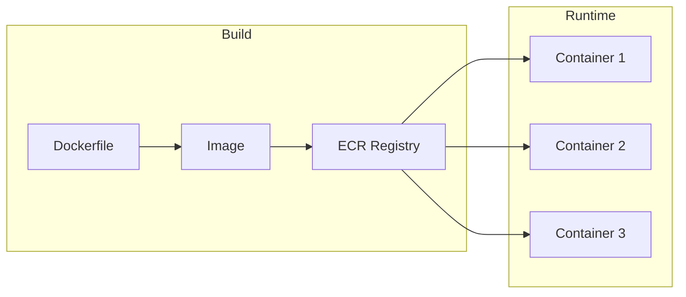

# Container

<div class="lesson-meta">
  <span class="badge-stato stabile">Stabile</span>
  <span>Lezione 2.1</span>
  <span>~11 min di lettura</span>
</div>

<p class="lesson-lead">Un container risolve il problema più antico del software distribuito: "sul mio computer funzionava". Non è una VM leggera — è un confine di isolamento che include tutto ciò che serve per eseguire il codice, ovunque.</p>

Nelle lezioni precedenti hai visto dove far girare il codice: EC2 (VM), Lambda (serverless). I container stanno nel mezzo, e nel 2026 sono il formato di deployment dominante per la stragrande maggioranza dei sistemi web. Capire i container non è optional per chi lavora in cloud.

L'**idea in una frase**: un container è un processo isolato che porta con sé il proprio ambiente di esecuzione — librerie, runtime, dipendenze — ma condivide il kernel del sistema operativo host.

## Il problema che i container risolvono

Immagina di sviluppare un'applicazione Python che usa `numpy 1.24`, `psycopg2 2.9`, e un driver specifico per una libreria C. Funziona perfettamente sulla tua macchina. Poi il collega con Ubuntu 22.04 prova a farla girare sul suo laptop — versione Python diversa, librerie di sistema diverse — e ottiene un errore criptico. Poi arriva la produzione, con un'AMI Linux diversa ancora, e tutto esplode in modi nuovi.

La risposta tradizionale era documentare tutto in un `README.md` sperando che nessuno saltasse un passaggio. La risposta moderna è il container: **impacchetti l'applicazione insieme all'intero ambiente di esecuzione** — Python di quella versione, quelle librerie, quei file di configurazione — in un'unica unità portabile. Se gira nella tua macchina, gira su qualsiasi macchina con un container runtime. Il README diventa codice.

## Immagini e container: la distinzione fondamentale

Ci sono due concetti che vengono spesso confusi:

Un'**immagine** è il template — il file statico, immutabile, che descrive cosa deve contenere l'ambiente. È come un file ISO di un sistema operativo. Si costruisce a partire da un **Dockerfile**: un file di testo con istruzioni sequenziali che descrivono lo stato finale dell'ambiente.

```dockerfile
FROM python:3.11-slim
WORKDIR /app
COPY requirements.txt .
RUN pip install -r requirements.txt
COPY . .
CMD ["python", "main.py"]
```

Ogni riga (`FROM`, `RUN`, `COPY`) crea un **layer**: uno strato incrementale sull'immagine precedente. I layer sono cachati — se cambi solo il codice applicativo nell'ultimo `COPY`, Docker non reinstalla le dipendenze. Questo rende le build veloci e le immagini piccole.

Un **container** è un'istanza in esecuzione di un'immagine — come un processo avviato da un eseguibile. Puoi avviare dieci container dalla stessa immagine: sono isolati l'uno dall'altro (filesystem, rete, processi), ma condividono il kernel dell'host.

Le immagini vengono salvate in un **registro** (*container registry*): **Docker Hub** è il pubblico di riferimento; **Amazon ECR** (*Elastic Container Registry*) è quello managed su AWS — si integra direttamente con ECS e Lambda.

## Isolamento: cosa separa un container da una VM

La differenza tecnica tra container e VM è dove avviene l'isolamento:

Una **VM** (macchina virtuale) include un intero sistema operativo guest — kernel compreso — che gira sopra un hypervisor. È isolamento forte, ma paga il prezzo: avvio in secondi/minuti, decine o centinaia di MB di overhead per il kernel guest, e un hypervisor che intermedia tutte le operazioni hardware.

Un **container** usa direttamente il kernel del sistema operativo host tramite due meccanismi del kernel Linux: **namespaces** (isolamento di processi, rete, filesystem, utenti) e **cgroups** (*control groups*, limitazione di CPU e memoria). Non c'è hypervisor, non c'è kernel guest. Il risultato: avvio in millisecondi, overhead minimo, densità molto più alta (puoi eseguire decine di container su una VM che prima ospitava un solo servizio).

<details>
<summary>Sotto il cofano: namespaces e cgroups</summary>

**Namespaces** — ogni container ha la propria "vista" del sistema:
- `pid` namespace: il container vede solo i propri processi. Il PID 1 dentro il container non corrisponde al PID 1 dell'host.
- `net` namespace: ogni container ha la propria interfaccia di rete virtuale, il proprio stack TCP/IP, i propri indirizzi IP.
- `mnt` namespace: filesystem isolato — il container vede solo il proprio filesystem root, non quello dell'host.
- `user` namespace: mappatura degli utenti — l'utente root dentro il container non è il root dell'host (con configurazione corretta).

**cgroups** — limitano le risorse:
```
memory.limit_in_bytes = 512m    # Max 512 MB di RAM
cpu.shares = 512                 # Metà CPU rispetto a un container con 1024
```
Se il container supera il limite di memoria, il kernel OOM-killer (*Out-Of-Memory killer*) termina il processo. Definire i limit è fondamentale in produzione: un container senza limiti può consumare tutta la RAM dell'host e abbattere gli altri container.

Implicazione di sicurezza: i container condividono il kernel. Una vulnerabilità nel kernel Linux è potenzialmente una vulnerabilità per tutti i container sull'host. Per carichi ad alto rischio, le VM restano lo strato di isolamento forte.
</details>

## Il Dockerfile in pratica: sicurezza e dimensioni

Due principi che fanno la differenza tra un Dockerfile di produzione e uno di tutorial:

**Usa immagini base minimali**. `python:3.11` pesa ~900 MB perché include compilatori, tool di sviluppo, librerie varie. `python:3.11-slim` pesa ~120 MB. `python:3.11-alpine` pesa ~50 MB (usa musl libc invece di glibc — attenzione alla compatibilità con alcune librerie C). Meno software nell'immagine = minore superficie d'attacco, immagini più veloci da scaricare.

**Ordina le istruzioni per massimizzare il cache**. I layer vengono ricreati da quando avviene la prima modifica in poi. Metti le istruzioni che cambiano raramente (installazione dipendenze) prima di quelle che cambiano spesso (copia del codice):

```dockerfile
# ✅ Corretto: le dipendenze sono cachate finché requirements.txt non cambia
COPY requirements.txt .
RUN pip install -r requirements.txt
COPY . .          # solo questo layer si ricrea a ogni cambio del codice

# ❌ Sbagliato: ogni cambio al codice invalida anche la cache delle dipendenze
COPY . .
RUN pip install -r requirements.txt
```

**Non eseguire come root**. Per default i container girano come `root` — se un attaccante riesce a eseguire codice nel container, ha tutti i permessi. Aggiungi `USER appuser` in fondo al Dockerfile dopo aver creato un utente non privilegiato.



*La stessa immagine nel registry genera istanze di container identiche in qualsiasi ambiente: dev, staging, produzione.*

## Cosa non è

| Il pensiero sbagliato | Come stanno le cose |
|---|---|
| "Un container è una VM leggera" | Una VM virtualizza l'hardware e include un kernel OS completo. Un container è un processo isolato che condivide il kernel host. L'isolamento è diverso per tipo e forza. |
| "Docker e container sono la stessa cosa" | Docker è il tool più diffuso per costruire ed eseguire container, ma non l'unico. Il container format standard è OCI (*Open Container Initiative*). Podman, containerd, nerdctl sono alternative. |
| "I container sono sicuri per default" | I container condividono il kernel host. Eseguire come root, usare `--privileged`, o montare socket Docker sono configurazioni pericolose che riducono l'isolamento a quasi nulla. |
| "Containerizzare risolve i problemi di architettura" | Un monolite mal scritto containerizzato è ancora un monolite mal scritto. I container migliorano il deployment e la portabilità, non l'architettura interna. |

## Verifica di comprensione

> Rispondi a memoria. Le risposte incerte rivedile domani.

1. Qual è la differenza tra un'immagine e un container?
2. Perché l'ordine delle istruzioni in un Dockerfile impatta le performance della build?
3. Cosa sono i namespaces Linux e quale problema risolvono nel contesto dei container?
4. Perché usare `python:3.11-slim` invece di `python:3.11` in produzione?
5. Cosa succede se un container non ha limiti di memoria configurati e il processo inizia a leakare?
6. Dove si conservano le immagini su AWS e come si collega a ECS?
7. *(anticipazione)* Hai tre container che compongono un'applicazione (web, api, database). Come li fai girare insieme e chi gestisce il restart se uno crasha?

## Glossario della lezione

- **Container**: processo isolato con ambiente di esecuzione proprio che condivide il kernel host.
- **Immagine** (*container image*): template statico e immutabile da cui si avviano i container.
- **Dockerfile**: file di testo con istruzioni sequenziali per costruire un'immagine.
- **Layer**: strato incrementale di un'immagine; cachato e riusato nelle build successive.
- **Container registry**: repository di immagini (Docker Hub, Amazon ECR).
- **ECR** (*Elastic Container Registry*): registry managed di AWS, integrato con ECS e Lambda.
- **Namespace** (Linux): meccanismo del kernel che isola la "vista" del sistema per ogni container.
- **cgroup** (*control group*): meccanismo del kernel che limita CPU e memoria per ogni container.
- **OCI** (*Open Container Initiative*): standard aperto per il formato delle immagini e il runtime.

## Per approfondire

- **"Play with Docker"** (`labs.play-with-docker.com`): ambiente browser per sperimentare senza installare nulla.
- **Docker docs**: "Get started" su `docs.docker.com` — il tutorial ufficiale copre build, run, registry in 30 minuti.
- **AWS docs**: "What is Amazon ECR" su `docs.aws.amazon.com/ecr` — come spingere un'immagine su ECR e usarla con ECS.

## Prossima lezione

Ora sai costruire un container. Ma un container da solo non scala, non si riavvia da solo se crasha, e non sa come distribuirsi su più macchine. Serve qualcosa che li orchestri. La prossima lezione introduce Kubernetes — non per imparare ad amministrarlo, ma per capire cosa fa e quando ha senso usarlo.
