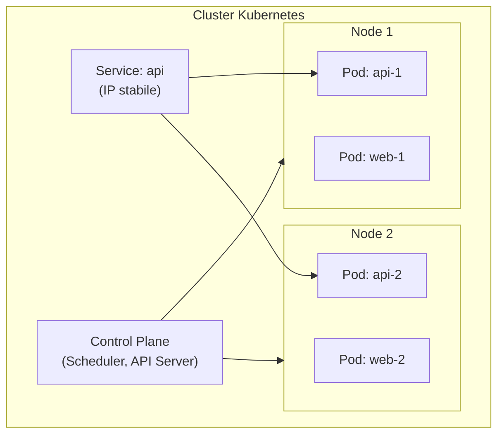

# Orchestrazione e Kubernetes (concetti)

  In evoluzione
  Lezione 2.2
  ~10 min di lettura

Kubernetes non si impara per diventare cluster admin. Si impara per capire quando è la risposta giusta — e quando è un cannone per ammazzare una zanzara.

Hai un container che gira bene in locale. Devi farne girare cento in produzione, distribuiti su più macchine, con restart automatico se uno crasha, scaling automatico se il traffico cresce, e zero downtime durante i deploy. Chi gestisce tutto questo? È la domanda a cui risponde un **orchestratore**.

L'**idea in una frase**: Kubernetes è il sistema operativo del datacenter distribuito — gestisce dove girano i container, quanti ne servono, e cosa fare quando qualcosa va storto.

## Il problema dell'orchestrazione

Finché hai un container, Docker basta. Quando ne hai dieci su una macchina, Docker Compose basta. Quando ne hai centinaia su decine di macchine, hai bisogno di qualcosa che risponda a domande come:

- Su quale macchina metto questo container? Ha abbastanza CPU e RAM?
- Se quella macchina va giù, come sposto il container su un'altra?
- Quante istanze di questo servizio mi servono adesso? E tra un'ora?
- Come aggiorno 50 istanze senza abbattere il servizio?
- Come fa il servizio A a trovare il servizio B se l'indirizzo IP cambia ogni volta che un container si riavvia?

**Kubernetes** (*K8s*) risponde a tutte queste domande. Nato in Google (internamente si chiamava Borg), open source dal 2014, è diventato lo standard de facto per l'orchestrazione di container nei sistemi di medie e grandi dimensioni.

## I concetti chiave (senza diventare admin)

Kubernetes ha un vocabolario preciso. Non serve memorizzarlo tutto, ma questi termini escono in ogni conversazione:

**Pod**: l'unità di deployment minima. Non è un container singolo — è uno o più container che condividono rete e storage. Nella pratica, il 95% dei Pod ha un container solo. Il Pod è effimero: viene creato, gira, e viene distrutto. Non ha un IP fisso.

**Deployment**: descrive lo *stato desiderato* del tuo servizio — "voglio 3 repliche di questo Pod, con questa immagine". Kubernetes si occupa di fare sì che la realtà corrisponda alla descrizione. Se un Pod crasha, il Deployment lo ricrea. Se aggiorni l'immagine, il Deployment sostituisce i Pod uno alla volta (*rolling update*).

**Service**: dato che i Pod hanno IP effimeri, come fa il servizio A a chiamare il servizio B? Tramite un Service: un endpoint stabile con un IP virtuale fisso (o un DNS name) che bilancia il traffico verso i Pod dell'applicazione target. I Pod possono venire e andare, il Service resta.

**Namespace**: divisione logica del cluster. Puoi mettere il team frontend in `namespace: frontend` e il team backend in `namespace: backend`, con policy di rete e permessi separati.

**Node**: una macchina (VM o fisica) nel cluster. Il **Control Plane** (il "cervello" di K8s) decide su quale Node far girare ogni Pod basandosi sulle risorse disponibili. I **Worker Nodes** eseguono i Pod.

*Il Control Plane decide dove girare i Pod; il Service espone un endpoint stabile indipendentemente da quale Node ospita il Pod.*

## Cosa fa K8s che Docker non fa

**Self-healing**: se un Pod crasha o il Node su cui gira si guasta, K8s ricrea il Pod su un altro Node. Non devi fare niente — il Deployment garantisce che il numero di repliche desiderato sia sempre soddisfatto.

**Horizontal Pod Autoscaler (HPA)**: K8s monitora l'utilizzo di CPU (o metriche custom) e scala automaticamente il numero di repliche. Se il traffico triplica, il numero di Pod triplica. Quando scende, i Pod in eccesso vengono terminati.

**Rolling updates e rollback**: quando aggiorni l'immagine di un Deployment, K8s sostituisce i Pod gradualmente — crea uno nuovo, aspetta che sia healthy, abbatte il vecchio, ripete. Se qualcosa va storto, un singolo comando esegue il rollback all'immagine precedente.

**Service discovery e DNS interno**: ogni Service nel cluster ha un DNS name del tipo `api.backend.svc.cluster.local`. I Pod lo risolvono automaticamente senza configuration management manuale.

## K8s non è per tutti: quando serve davvero

Kubernetes ha un costo reale di complessità. Un cluster managed (EKS su AWS, GKE su Google, AKS su Azure) richiede conoscenza di YAML verboso, di networking complesso, di gestione di certificati, RBAC, storage classes. Il cluster control plane managed costa (EKS costa $0,10/ora = ~$72/mese al 2026 solo per il control plane, prima di un singolo worker node).

K8s vale la complessità quando:
- Hai **molti servizi** (decine) con cicli di vita diversi
- Hai bisogno di scaling automatico orizzontale sofisticato
- Il tuo team ha già competenze K8s e il costo di gestione è ammortizzato
- Hai requisiti di portabilità multi-cloud (stesso manifest YAML su AWS, GCP, on-premise)

**Non vale la complessità quando:**
- Hai 2-3 servizi: ECS Fargate su AWS (gestisce container senza gestire cluster) è più semplice e adeguato
- Hai workload spiky/event-driven: Lambda + SQS batte K8s per semplicità e costo
- Sei una startup early-stage: la complessità operativa di K8s è un peso che non ti puoi permettere

EKS, ECS Fargate, e il confine della scelta su AWS

Su AWS hai due percorsi principali per i container:

**Amazon ECS** (*Elastic Container Service*) con **Fargate**: non gestisci nodi. Definisci il Task (= descrizione del container), ECS/Fargate trova la capacità, la gestisce, scala, si occupa del networking. È l'astrazione "container as a service" — il punto di ingresso consigliato per chi non ha bisogno di K8s.

**Amazon EKS** (*Elastic Kubernetes Service*): K8s managed. AWS gestisce il control plane, tu gestisci i worker nodes (o usi EKS Fargate per non gestire neanche quelli). Se hai già K8s nel DNA del team, EKS è il modo di portarlo su AWS senza gestire etcd e il control plane da solo.

La decisione pratica nel 2026: se non hai una ragione esplicita per K8s (team già K8s-fluent, requisiti di portabilità, workload che K8s gestisce meglio), inizia con ECS Fargate.

## Cosa non è

| Il pensiero sbagliato | Come stanno le cose |
|---|---|
| "K8s è necessario per qualsiasi sistema in produzione" | La maggior parte dei sistemi di piccole e medie dimensioni gira benissimo su ECS Fargate, Lambda, o un singolo server ben configurato. K8s è per problemi specifici di scala e complessità. |
| "K8s gestisce il codice applicativo" | K8s gestisce dove e quante istanze dei container girano. La qualità del codice, la logica dell'applicazione, la struttura del database — tutto questo è tuo. |
| "Imparare K8s significa diventare cluster admin" | Capire i concetti (Pod, Deployment, Service) è utile a tutti. Gestire un cluster in produzione (networking, upgrade, storage, disaster recovery) è un ruolo da senior/SRE. Questa lezione ti dà il primo, non il secondo. |
| "Un Pod = un container" | Un Pod può avere più container (pattern sidecar: il proxy mTLS di Istio, un agente di logging). Nella pratica la maggior parte dei Pod ha un container solo, ma il disaccoppiamento è intenzionale. |

## Verifica di comprensione

> Rispondi a memoria. Le risposte incerte rivedile domani.

1. Cos'è un Pod in Kubernetes? In cosa differisce da un container Docker?
2. Perché K8s usa i Service invece di indirizzi IP diretti per la comunicazione tra Pod?
3. Cosa fa un Deployment K8s quando un Pod crasha?
4. Descrivi un rolling update: come aggiorna K8s 10 repliche di un servizio senza downtime?
5. In che situazione sceglieresti ECS Fargate invece di EKS?
6. Qual è il costo fisso di un cluster EKS su AWS (solo control plane, al 2026)?
7. *(anticipazione)* Hai un servizio che deve scalare da 2 a 50 repliche in 30 secondi durante i picchi. K8s lo gestisce da solo o serve configurazione?

## Glossario della lezione

- **Orchestratore**: sistema che gestisce il ciclo di vita, il placement e lo scaling di container su un cluster.
- **Pod**: unità di deployment minima in K8s; uno o più container con rete e storage condivisi.
- **Deployment**: specifica lo stato desiderato (quante repliche, quale immagine); K8s lo mantiene.
- **Service**: endpoint stabile (IP virtuale + DNS) che bilancia il traffico verso i Pod.
- **Node**: macchina (VM o fisica) che esegue i Pod nel cluster.
- **Control Plane**: componenti K8s che prendono decisioni di scheduling e gestione del cluster.
- **HPA** (*Horizontal Pod Autoscaler*): scala il numero di repliche in base all'utilizzo di risorse.
- **EKS** (*Elastic Kubernetes Service*): K8s managed su AWS.
- **ECS** (*Elastic Container Service*): orchestratore container managed di AWS, alternativa a K8s.
- **Fargate**: runtime serverless per ECS/EKS — non gestisci i nodi worker.

## Per approfondire

- **Kubernetes docs**: "Concepts" su `kubernetes.io/docs/concepts` — la documentazione ufficiale ha ottimi diagrammi sui componenti del Control Plane.
- **AWS docs**: "What is Amazon ECS" e "What is Amazon EKS" su `docs.aws.amazon.com` — confronto diretto tra le due opzioni container su AWS.
- **"Kubernetes: Up and Running"** (Burns, Hightower, Beda) — il libro di riferimento, scritto dagli autori originali. Non serve leggerlo tutto: i primi 5 capitoli coprono il 90% dei concetti.

## Prossima lezione

Ora hai il quadro completo dello spettro di astrazione: VM bare-metal, container orchestrati, serverless. La prossima lezione mette fianco a fianco i tre modelli con numeri reali — costi, latenza, cold start, lock-in — e costruisce il framework di decisione che userai in ogni progetto.
# Orchestrazione e Kubernetes (concetti)

  Bozza
  Lezione 2.2

> Lezione in arrivo. Vedi il [SYLLABUS](/cloud/SYLLABUS), punto 2.2.
