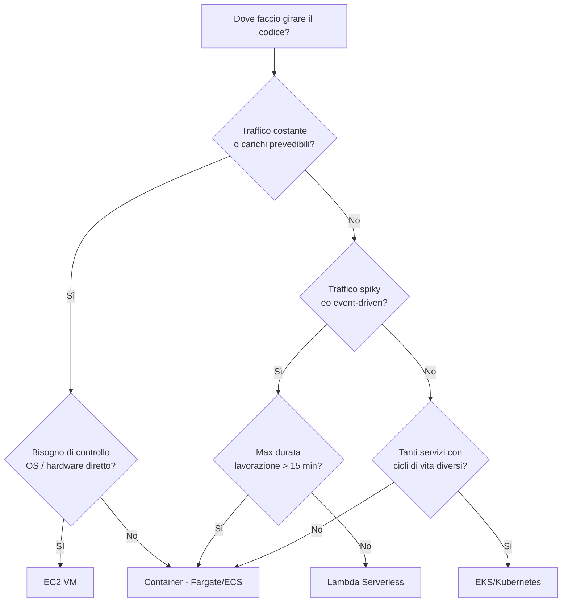

# VM vs Container vs Serverless

  Stabile
  Lezione 2.3
  ~12 min di lettura

Tre modelli di esecuzione, tre set di trade-off. La scelta giusta dipende dal profilo del traffico, dal budget operativo, e dalla tolleranza al lock-in — non dalla preferenza personale.

Hai ora il quadro completo: VM (lezione 0.3), container (2.1), serverless (accennato con Lambda in 0.3). Questa lezione li mette in fila con numeri reali e costruisce il framework di decisione che userai ogni volta che devi scegliere dove far girare il codice.

L'**idea in una frase**: VM per controllo e prevedibilità, container per portabilità e densità, serverless per semplicità operativa e costo a zero-traffico — la scelta dipende dal profilo del carico, non dalla tecnologia.

## Lo spettro di astrazione

Le tre opzioni sono punti lungo uno spettro: da più controllo/responsabilità a meno controllo/responsabilità.

**VM** (*Virtual Machine*, es. AWS EC2): noleggi una macchina virtuale. Scegli il sistema operativo, installi quello che vuoi, gestisci patch di sicurezza, backup, scaling manuale. Hai accesso SSH diretto. Sei responsabile di tutto sopra l'hypervisor.

**Container** (es. AWS ECS Fargate, Amazon EKS): il provider gestisce il sistema operativo e il runtime dei container. Tu definisci l'immagine del container, Fargate si occupa del resto — placement, networking, restart. Non gestisci i nodi.

**Serverless** (es. AWS Lambda): il provider gestisce tutto tranne il codice. Non c'è server da provisioning, non c'è scaling da configurare, non c'è sistema operativo. Scrivi una funzione, la carichi, viene eseguita su richiesta. Paghi solo quando viene invocata.

La tabella riassume le dimensioni chiave:

| Dimensione | VM (EC2) | Container (Fargate) | Serverless (Lambda) |
|---|---|---|---|
| Gestione OS | Tua | Provider | Provider |
| Avvio (cold) | 1-3 min | 10-30 sec | 100ms-5s |
| Avvio (warm) | — | 1-5 sec | &lt;100ms |
| Costo a zero traffico | Paghi comunque | Paghi comunque | $0 |
| Scaling automatico | Manuale / ASG | ECS Service scaling | Automatico |
| Stato (stateful) | ✅ Facile | ✅ Con storage attach | ❌ Difficile |
| Max durata esecuzione | Illimitata | Illimitata | 15 min (Lambda) |
| Vendor lock-in | Basso | Medio (OCI standard) | Alto |

## VM: quando il controllo vale la complessità

Una VM su EC2 è la scelta giusta quando:

- Il codice ha **dipendenze di sistema specifiche** che non si containerizzano facilmente (driver hardware, licenze software tied all'hostname, applicazioni legacy)
- Hai bisogno di **accesso persistente al filesystem** con performance I/O elevate (database che non usi come servizio managed, workload con scritture intensive su EBS)
- Il **carico è prevedibile e stabile**: hai 5 istanze che girano 24/7 sotto carico costante — pagare per ora è più economico del modello serverless
- Devi **accedere all'hardware direttamente**: istanze con GPU (P3, G4dn, G5), istanze bare metal per workload HPC

Il costo di una VM è fisso per il tempo che è accesa — scala quando la spegni, non automaticamente. **Auto Scaling Group (ASG)** può aggiungere e rimuovere istanze in base a metriche, ma richiede configurazione e il ciclo di scaling richiede minuti, non secondi.

## Container: il punto di equilibrio moderno

I container su Fargate o ECS sono il punto di equilibrio per la maggior parte delle applicazioni web nel 2026. Motivi:

- **Portabilità**: la stessa immagine gira in dev, staging, produzione. Nessuna sorpresa da "funzionava sul mio laptop"
- **Densità**: puoi eseguire decine di container su una VM che prima ospitava un solo servizio
- **Deployment prevedibile**: rolling update, blue/green, rollback — tutti gestiti dall'orchestratore
- **Startup time ragionevole**: un container Fargate parte in 10-30 secondi, accettabile per la maggior parte degli use case

Il costo su Fargate si paga per vCPU e GB-RAM allocati per la durata del task. Non è zero a zero traffico — ma è più economico di EC2 per workload non-costanti se configurato correttamente.

## Serverless: il modello event-driven per eccellenza

Lambda è la scelta giusta per un profilo di traffico specifico: **spiky, event-driven, imprevedibile**. L'applicazione riceve 0 richieste per ore, poi ne riceve 1.000 in 10 secondi, poi torna a zero.

Con EC2 o Fargate, pagheresti per tutta la capacità di picco anche durante le ore vuote. Con Lambda, paghi $0 quando non c'è traffico. Il modello di costo Lambda al 2026:
- ~$0,20 per 1 milione di invocazioni
- ~$0,0000166667 per GB-secondo di computazione

Una Lambda da 128 MB che risponde in 100ms, invocata 1 milione di volte: circa $0,21 di invocazioni + $0,21 di computazione = **~$0,42 totali**. Per lo stesso carico su un'istanza EC2 t3.micro sempre accesa: ~$8/mese. La differenza è 20×.

Il cold start: quando il serverless fa male

Il **cold start** è il tempo aggiuntivo per la prima invocazione di una Lambda (o quando non ci sono istanze warm): il runtime deve essere inizializzato, le dipendenze caricate, il codice avviato. I tempi variano:
- Python/Node.js, Lambda leggera: 100-500ms
- Java con Spring Boot: 2-8 secondi
- Container image Lambda: 1-10 secondi

Se l'applicazione ha requisiti di latenza stretti (es. API che deve rispondere in &lt;200ms p99), il cold start diventa un problema. Soluzioni:
- **Provisioned Concurrency**: Lambda mantiene N istanze sempre warm. Costo: ~$0,015 per GB-ora per la capacità provisionata (al 2026). Costoso, ma elimina il cold start.
- **Scegliere runtime leggeri**: Python e Node.js hanno cold start 10-20× inferiori a Java.
- **Ridurre la dimensione del deployment package**: meno dipendenze = cold start più veloce.

**Edge compute** — Cloudflare Workers, Lambda@Edge, CloudFront Functions — usa un modello diverso: gli script girano in V8 isolates (non container completi), il cold start è praticamente zero (&lt;1ms). Ma i limiti sono severi: niente Node.js APIs native, niente filesystem, durata massima breve. Usali per logica leggera alle edge (riscrittura header, auth JWT, A/B test) non per logica applicativa pesante.

## Il decision drill compresso

*La durata massima di Lambda (15 min) è il primo filtro per workload di processing: batch lunghi, video encoding, ML training vanno su container o VM.*

## Cosa non è

| Il pensiero sbagliato | Come stanno le cose |
|---|---|
| "Serverless è sempre più economico" | Solo a zero o bassissimo traffico. Ad alto traffico sostenuto, EC2 o Fargate con Reserved Instances costano molto meno del modello pay-per-invocation. |
| "I container eliminano il vendor lock-in" | Le immagini OCI sono portabili, ma l'infrastruttura intorno (networking, IAM, secrets, load balancer) è fortemente provider-specific. Il lock-in si sposta dall'eseguibile all'infrastruttura. |
| "Lambda non ha stato" | Lambda *non mantiene* lo stato tra invocazioni diverse (per design). Ma puoi leggere e scrivere su DynamoDB, S3, ElastiCache da una Lambda — lo stato vive fuori, non nell'eseguibile. |
| "Edge compute sostituisce Lambda" | Edge compute (Workers, Lambda@Edge) ha limiti di runtime severi (V8 isolate, no Node APIs native, breve durata). È ottimo per logica leggera all'edge, non per applicazioni complete. |

## Verifica di comprensione

> Rispondi a memoria. Le risposte incerte rivedile domani.

1. Qual è il vantaggio principale di Lambda per traffico spiky rispetto a EC2?
2. Perché Lambda non è adatta a un job di batch che dura 2 ore?
3. Cos'è il cold start e quando diventa un problema reale?
4. In quale scenario sceglieresti EC2 invece di Fargate nonostante la complessità operativa maggiore?
5. Cosa fa Lambda@Edge che Lambda standard non può fare?
6. Calcola il costo approssimativo (al 2026) di una Lambda da 256 MB con durata media 200ms, invocata 5 milioni di volte al mese.
7. *(anticipazione)* Il tuo servizio riceve richieste sincrone da un'API mobile con SLA di 200ms p99. Serverless o container? Cosa ti fa scegliere?

## Glossario della lezione

- **VM** (*Virtual Machine*): macchina virtuale con OS completo, massimo controllo.
- **Cold start**: latenza aggiuntiva per la prima invocazione di una funzione serverless non ancora inizializzata.
- **Provisioned Concurrency**: configurazione Lambda che mantiene N istanze sempre warm per eliminare il cold start.
- **Auto Scaling Group (ASG)**: meccanismo EC2 per aggiungere/rimuovere istanze automaticamente in base a metriche.
- **Edge compute**: esecuzione di codice leggero distribuito globalmente nelle edge location (Workers, Lambda@Edge).
- **V8 isolate**: sandbox JavaScript ultra-leggera usata da Cloudflare Workers e Lambda@Edge per cold start quasi nullo.

## Per approfondire

- **AWS Lambda pricing** su `aws.amazon.com/lambda/pricing` — la pagina con il calcolatore di costo.
- **AWS re:Invent**: cerca "serverless vs containers" per sessioni con benchmark di costo e latenza reali.
- **Cloudflare Workers docs** su `developers.cloudflare.com/workers` — per capire i limiti dell'edge compute.

## Prossima lezione

Sai scegliere dove far girare il codice. Ma non tutto il lavoro va fatto in modo sincrono — non ogni richiesta deve aspettare una risposta immediata. La prossima lezione introduce il modello asincrono ed event-driven: quando una coda, un pub/sub o un event bus è la risposta giusta rispetto a una chiamata HTTP diretta.
# VM vs Container vs Serverless

  Bozza
  Lezione 2.3

> Lezione in arrivo. Vedi il [SYLLABUS](/cloud/SYLLABUS), punto 2.3.
