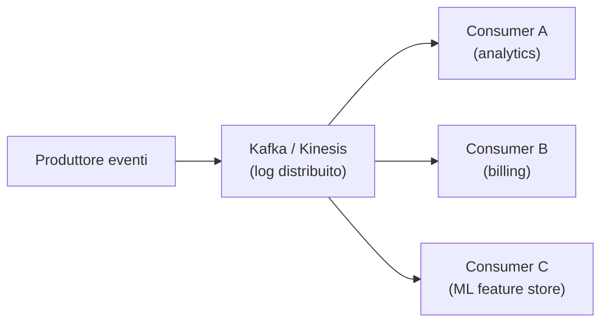

# Dati in movimento

  In evoluzione
  Lezione 3.1
  ~11 min di lettura

Quando il batch non basta: alcune domande richiedono una risposta entro 100 millisecondi, non entro la prossima notte. Lo stream processing risponde in tempo reale, ma cambia ogni assunzione su come scrivi e testi il codice.

Il batch processing è il modello che tutti conoscono: raccogli i dati di un giorno, mandi il job alle 2 di notte, hai i risultati al mattino. Funziona per la stragrande maggioranza dei casi. Ma ci sono scenari dove il risultato "al mattino" è inutile:

- Rilevazione di frodi: se la transazione fraudolenta è già confermata, il danno è fatto.
- Dashboard in tempo reale: il cliente vuole vedere il grafico che si aggiorna ora, non ieri sera.
- Prezzi dinamici: il prezzo di un volo deve riflettere la domanda delle ultime ore, non del mese scorso.
- Sistemi di raccomandazione live: "gli utenti che hanno visto questo video hanno anche visto..." deve considerare i view degli ultimi 5 minuti.

L'**idea in una frase**: lo stream processing tratta i dati come un flusso continuo di eventi invece di un lotto — ogni evento viene elaborato non appena arriva, indipendentemente da quelli che seguiranno.

## Stream vs batch: la differenza che conta

Il batch ha un inizio e una fine: conosci tutti i dati prima di iniziare l'elaborazione. Puoi fare ordinamenti globali, join completi, aggregazioni perfette. Il job è deterministico e riproducibile.

Lo stream non ha una fine (in principio): i dati arrivano uno alla volta, in ordine variabile, e devono essere elaborati con un'assunzione fondamentale — **non conosci il futuro**. Non puoi aspettare di avere tutti i dati per calcolare la media delle ultime 24 ore. Devi mantenere uno stato locale che si aggiorna a ogni evento.

Questo porta al concetto di **window**: un'aggregazione su stream non lavora su "tutti i dati", ma su una finestra temporale — gli ultimi 5 minuti, l'ora corrente, una sessione utente. Le finestre sono il meccanismo per rendere le aggregazioni bounded su un flusso unbounded.

## Kafka e Kinesis: il log distribuito come concetto

**Apache Kafka** è la tecnologia di riferimento per lo stream processing nelle architetture di medie e grandi dimensioni. Il modello concettuale di Kafka — e del suo equivalente gestito su AWS, **Amazon Kinesis** — è il **log distribuito**.

Un log è una struttura dati append-only: ogni evento viene aggiunto alla fine, mai modificato o cancellato (entro il periodo di retention configurato). I consumer leggono il log tenendo traccia della loro posizione (l'**offset**). Questo ha conseguenze importanti:

- **Molteplici consumer indipendenti**: il servizio di analisi e il servizio di fatturazione possono leggere lo stesso stream ognuno al proprio ritmo, senza interferirsi.
- **Replay**: se un consumer ha un bug e deve rielaborare gli ultimi 7 giorni di eventi, basta riportare il suo offset all'inizio. I dati sono ancora lì.
- **Disaccoppiamento temporale**: il producer pubblica indipendentemente dai consumer. Se un consumer è down, i messaggi si accumulano nel log finché non torna su.

*Ogni consumer ha il proprio offset e legge indipendentemente. Aggiungere un Consumer C non richiede modifiche a produttore o Consumer A/B.*

## Event Sourcing: quando il log diventa il database

L'**Event Sourcing** è un pattern di persistenza che porta il concetto di log al livello del dominio applicativo: invece di salvare lo stato corrente dell'entità (es. il saldo del conto = 1.250€), salvi la sequenza di eventi che ha portato a quello stato (es. "depositato 500€", "prelevato 200€", "depositato 950€").

Lo stato corrente è sempre ricavabile riapplicando la sequenza di eventi dall'inizio (o da uno **snapshot** periodico per evitare di rileggere anni di storia).

Vantaggi: audit log completo e immutabile, replay per debug e analytics, possibilità di proiettare lo stesso stream in formati diversi (il "saldo" per l'app mobile vs lo "storico transazioni" per il revisore contabile).

Svantaggi: complessità significativa — query dello stato corrente richiede aggregazione (non è un semplice SELECT), e lo schema degli eventi non può essere cambiato liberamente una volta che gli eventi esistono nel log.

## Change Data Capture: catturare le modifiche del database

**CDC** (*Change Data Capture*) è la tecnica per catturare ogni modifica (INSERT, UPDATE, DELETE) su un database relazionale e trasformarla in un evento su uno stream. Il producer non è l'applicazione — è direttamente il database.

Strumenti come **Debezium** (open source) si collegano al transaction log del database (es. il binlog di MySQL, il WAL di PostgreSQL) e pubblicano ogni modifica come evento Kafka. L'applicazione non deve fare niente di speciale — ogni riga che cambia nel database diventa automaticamente un evento.

Use case tipici:
- **Sincronizzazione di sistemi**: aggiornare Elasticsearch ogni volta che cambia un record nel database principale
- **Invalidazione della cache**: svuotare la cache per le chiavi modificate in tempo reale
- **Data warehouse**: alimentare il data lake senza batch ETL overnight
- **Event sourcing retroattivo**: aggiungere event sourcing a un'applicazione esistente senza riscriverla

Watermark e out-of-order events: il problema del tempo nello streaming

Gli eventi non arrivano sempre in ordine cronologico. Nella rete, un evento generato alle 14:00:00 può arrivare dopo un evento generato alle 14:00:01 — latenza di rete variabile, retry, buffering. Come calcoli la somma degli eventi "dell'ultimo minuto" se non sai quando il minuto è davvero finito?

La soluzione è il **watermark**: una stima del "minimo timestamp che arriverà ancora". Il sistema processa gli eventi fino al watermark, poi chiude la finestra e produce il risultato. Gli eventi che arrivano dopo il watermark della propria finestra sono *late events* e vengono gestiti con strategie configurabili (scartati, aggiornano un risultato precedente, vanno in una finestra speciale).

Apache Flink e Google Dataflow (Beam) hanno gestione sofisticata dei watermark. Kinesis e Kafka Streams hanno supporto di base. Questo è uno dei motivi per cui lo stream processing è più complesso del batch.

## Cosa non è

| Il pensiero sbagliato | Come stanno le cose |
|---|---|
| "Kafka è solo una coda avanzata" | Kafka è un log distribuito. La differenza non è solo di prestazioni: i consumer tengono traccia del loro offset e possono rileggere i dati. In una coda tradizionale il messaggio viene cancellato dopo la consegna. |
| "Event Sourcing è sempre preferibile" | Event Sourcing aggiunge complessità significativa — schema versionamento, query più complesse, gestione degli snapshot. Va usato quando l'audit log immutabile o il replay sono requisiti reali del dominio, non per default. |
| "CDC è la stessa cosa di un trigger database" | I trigger eseguono logica sincrona nel contesto della transazione, possono rallentarla, e sono difficili da mantenere. CDC legge il transaction log *dopo* la commit — è asincrono, non rallenta la transazione, e scala in modo indipendente. |
| "Stream processing sostituisce il batch" | Sono complementari. Il batch è più semplice, più economico, e riproducibile per analisi storiche. Lo streaming è necessario solo quando la latenza del batch è inaccettabile per il business case. |

## Verifica di comprensione

> Rispondi a memoria. Le risposte incerte rivedile domani.

1. Qual è la differenza fondamentale tra batch processing e stream processing nel trattare i dati?
2. Cosa significa "offset" nel contesto di Kafka? Perché permette il replay?
3. Cos'è una window nel contesto dello streaming e perché è necessaria?
4. Descrivi un caso d'uso concreto dove Event Sourcing aggiunge valore reale rispetto a un database tradizionale.
5. Cos'è il CDC e come si differenzia da un trigger database?
6. Cosa succede a un consumer Kafka se va down per 2 ore? Il produttore smette di pubblicare?
7. *(anticipazione)* AWS offre Kinesis Data Streams e Kinesis Data Firehose. Qual è la differenza concettuale tra i due?

## Glossario della lezione

- **Stream processing**: elaborazione di dati evento per evento, man mano che arrivano.
- **Batch processing**: elaborazione di un insieme delimitato di dati in blocco.
- **Window**: finestra temporale su un flusso, usata per aggregare eventi bounded.
- **Kafka**: sistema di log distribuito open source per stream processing ad alta throughput.
- **Kinesis**: equivalente gestito di Kafka su AWS.
- **Offset**: posizione di un consumer nel log Kafka/Kinesis.
- **Event Sourcing**: pattern di persistenza basato su sequenza di eventi immutabili invece dello stato corrente.
- **Snapshot**: foto dello stato aggregato fino a un certo punto nel log, per evitare il replay completo.
- **CDC** (*Change Data Capture*): tecnica per catturare modifiche database e pubblicarle come eventi su stream.
- **Debezium**: strumento open source per CDC via transaction log (MySQL binlog, PostgreSQL WAL).
- **Watermark**: stima del minimo timestamp futuro in uno stream, usata per chiudere finestre temporali.

## Per approfondire

- **Confluent docs** su `docs.confluent.io`: documentazione di Kafka con esempi pratici di stream processing.
- **Debezium docs** su `debezium.io`: guida al CDC per MySQL, PostgreSQL, MongoDB.
- **"Designing Data-Intensive Applications"** (Kleppmann): i capitoli 10 e 11 coprono batch, stream, e log — il riferimento teorico più solido su questo tema.

## Prossima lezione

Hai ora il pezzo di architettura dei dati che blocca se fatto tardi: stream, log distribuito, event sourcing, CDC. Il quadro concettuale è chiuso — runtime (Parte 2), dati in movimento (Parte 3). La **Parte 4** copre l'**Infrastructure as Code**: come si traduce tutto questo in infrastruttura riproducibile, versionata, automatizzabile invece di click in console.
