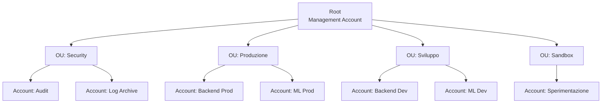

# Governance multi-account

<div class="lesson-meta">
  <span class="badge-stato evoluzione">In evoluzione</span>
  <span>Lezione 9.2</span>
  <span>~14 min di lettura</span>
</div>

<p class="lesson-lead">In un'enterprise, un solo account AWS diventa un problema di sicurezza, di costi e di governance in fretta. La risposta è la struttura multi-account — e Control Tower come strumento che la rende automatizzabile invece di manuale.</p>

Parti con un account AWS. Ci metti il frontend, il backend, il database, i job di ML, il monitoraggio. Dopo sei mesi hai 40 sviluppatori che ci lavorano, tre team con esigenze diverse, e non riesci più a capire chi ha fatto cosa o chi ha accesso a cosa. Qualcuno cambia una policy IAM per sbaglio e un sistema di produzione smette di funzionare. Un junior lancia un'istanza GPU e la dimentica accesa per una settimana.

Il problema non è la negligenza — è l'architettura. **Un singolo account non offre isolamento**. Tutto condivide lo stesso spazio di nomi per i permessi, lo stesso budget, lo stesso blast radius in caso di errore o breach.

La risposta è la **struttura multi-account**: ogni ambiente (prod, dev, staging), ogni team, ogni workload ad alto rischio riceve il proprio account AWS isolato. Ma gestire decine di account a mano è impossibile — è qui che entrano **AWS Organizations** e **Control Tower**.

## AWS Organizations — il coordinatore

**AWS Organizations** è il servizio che permette di raggruppare più account AWS sotto una struttura gerarchica e applicare policy centralizzate. La struttura è ad albero:

- **Root**: il nodo di partenza, l'account management dell'organizzazione
- **OU** (*Organizational Unit*): cartelle che raggruppano account con caratteristiche simili — es. `Produzione`, `Dev`, `Sandbox`, `Sicurezza`
- **Account**: le foglie dell'albero, ognuna con la propria fatturazione aggregata, i propri IAM user/role, il proprio blast radius



*Struttura tipica a OU per un'organizzazione con team tecnici separati. La gerarchia riflette i confini di sicurezza e fatturazione.*

### SCP — Service Control Policies

Le **SCP** (*Service Control Policies*) sono policy JSON che si applicano a una OU o a un singolo account e definiscono il massimo dei permessi consentiti — indipendentemente da cosa dicono le policy IAM locali dell'account.

Questo è il punto critico: **le SCP non concedono permessi, li limitano**. Un account dentro una OU con una SCP restrictiva non può fare cose che quella SCP nega, anche se ha un ruolo IAM con `AdministratorAccess`.

Esempi di SCP tipici:
```json
// Vieta l'uso di regioni fuori dall'UE (data residency)
{
  "Effect": "Deny",
  "Action": "*",
  "Resource": "*",
  "Condition": {
    "StringNotEquals": {
      "aws:RequestedRegion": ["eu-west-1", "eu-central-1"]
    }
  }
}
```
```json
// Vieta la disabilitazione di CloudTrail
{
  "Effect": "Deny",
  "Action": ["cloudtrail:StopLogging", "cloudtrail:DeleteTrail"],
  "Resource": "*"
}
```

### RCP — Resource Control Policies

Le **RCP** (*Resource Control Policies*), introdotte nel 2024, complementano le SCP con una prospettiva diversa: invece di limitare *chi può fare cosa*, limitano *cosa le risorse possono accettare*. Per esempio: un bucket S3 non può mai essere reso pubblico, qualunque sia la policy del bucket o chi la imposta.

SCP e RCP insieme coprono sia il lato "chi agisce" che il lato "cosa viene fatto alle risorse".

## La struttura tipica degli account

Non esiste una struttura universale, ma un pattern di riferimento ricorre nella maggior parte delle enterprise:

| Account | Scopo | Chi vi accede |
|---|---|---|
| **Management** | Solo billing e Organizations. Nessun workload. | Solo amministratori cloud |
| **Security / Audit** | CloudTrail aggregato, Security Hub, GuardDuty | Team security, audit esterni |
| **Log Archive** | Log immutabili su S3 Object Lock. Retention a lungo termine | Team security (read-only), audit |
| **Shared Services** | VPN, DNS, Active Directory, strumenti di team condivisi | Tutti gli account via VPC peering |
| **Workload Prod** | Un account per team o per workload critico | Solo CI/CD, nessun accesso manuale |
| **Workload Dev** | Un account per team, accesso più largo | Developer del team |
| **Sandbox** | Account usa-e-getta per sperimentazione. Si distrugge ogni N giorni | Chiunque, con budget cappato |

La separazione tra Log Archive e Audit è deliberata: i log non devono essere accessibili agli stessi account che possono modificare l'infrastruttura (altrimenti un attaccante che compromette un account può cancellare le sue tracce).

## AWS Control Tower — l'account vending machine

Creare e configurare un account AWS a mano richiede ore: policy IAM, CloudTrail, Config, Security Hub, budget alert, VPC di base, ruoli di accesso federato. Moltiplicato per decine di account, è un lavoro ripetitivo e soggetto a errori.

**AWS Control Tower** automatizza questo. È il servizio che crea e gestisce una **landing zone** — la baseline configurata di tutti gli account dell'organizzazione. Le componenti principali:

**Account Factory**: un modulo che provisiona nuovi account AWS già configurati, con tutte le baseline imposte dall'organizzazione. Un developer fa richiesta, Control Tower crea l'account in 10-15 minuti con la configurazione standard. Nessun click manuale, nessuna configurazione dimenticata.

**Guardrail**: le regole che Control Tower applica automaticamente su tutti gli account. Esistono in tre varianti:

- **Preventive** (usa SCP): blocca azioni non consentite prima che avvengano. Es. "Nessun account può disabilitare CloudTrail."
- **Detective** (usa AWS Config): monitora lo stato delle risorse e segnala deviazioni. Es. "Tutti i bucket S3 devono avere il logging abilitato."
- **Proactive** (usa CloudFormation hooks): controlla i template IaC prima del deployment. Es. "Nessun template può creare un security group con 0.0.0.0/0 in ingress."

**Drift detection**: quando qualcuno tocca a mano una configurazione gestita da Control Tower — modifica una SCP direttamente, cambia un guardrail — Control Tower lo rileva e segnala il **drift**. Puoi ignorarlo (accettando il rischio) o ripristinare la configurazione baseline.

## Cosa non è

| Il pensiero sbagliato | Come stanno le cose |
|---|---|
| "Multi-account significa multi-fattura" | AWS Organizations consolida tutta la fatturazione nel Management Account. Un solo conto, ma con breakdown per account. I volume discount si applicano all'aggregato dell'intera organizzazione. |
| "Le SCP sostituiscono IAM" | Le SCP definiscono il soffitto dei permessi; IAM definisce i permessi effettivi. Entrambi devono consentire un'azione perché sia possibile. Non sono alternativi: sono strati sovrapposti. |
| "Control Tower serve solo alle grandi enterprise" | Anche un'azienda con 10 developer e 4 account beneficia di Control Tower: garantisce che nessun account sia configurato "a caso" e che i log esistano sempre, da ogni account. |
| "Posso aggiungere la governance multi-account dopo" | È difficile migrare un sistema già in produzione su un singolo account verso una struttura multi-account. Le dipendenze (VPC, IAM, policy) si intrecciano. La struttura si decide all'inizio, come le fondamenta. |

## Verifica di comprensione

1. Qual è la differenza tra SCP e policy IAM? Cosa succede se una SCP nega un'azione ma IAM la consente?
2. Cosa sono le RCP e in cosa differiscono dalle SCP concettualmente?
3. Perché l'account Log Archive è separato dall'account Security/Audit?
4. Cosa fa l'Account Factory di Control Tower?
5. Quali sono i tre tipi di guardrail in Control Tower e qual è la loro base tecnica?
6. Cos'è il drift e come Control Tower lo gestisce?
7. Perché la struttura multi-account si decide all'inizio e non si aggiunge dopo?

## Glossario della pagina

- **AWS Organizations**: servizio che raggruppa più account AWS in una struttura gerarchica con policy centralizzate.
- **OU** — *Organizational Unit*: unità organizzativa che raggruppa account con caratteristiche simili dentro AWS Organizations.
- **SCP** — *Service Control Policy*: policy che definisce il massimo dei permessi consentiti a una OU o account, indipendentemente da IAM.
- **RCP** — *Resource Control Policy*: policy che limita cosa le risorse AWS possono accettare, indipendentemente da chi agisce.
- **Landing zone**: l'ambiente multi-account baseline creato e gestito da Control Tower con tutte le configurazioni di sicurezza standard.
- **Account Factory**: il modulo di Control Tower che provisiona nuovi account già configurati con la baseline dell'organizzazione.
- **Guardrail**: regola automatica in Control Tower che può essere preventiva (SCP), detective (Config) o proattiva (CloudFormation hooks).
- **Drift**: deviazione rilevata tra la configurazione attuale di un account e la baseline di Control Tower.
- **Blast radius**: l'estensione del danno che un errore o una breach può causare. In un singolo account è massimo; in multi-account è limitato all'account colpito.

## Per approfondire

- **AWS Organizations documentation** (`docs.aws.amazon.com/organizations`): la fonte primaria per SCP, RCP e struttura delle OU.
- **AWS Control Tower** (`docs.aws.amazon.com/controltower`): documentazione su Account Factory, guardrail e landing zone.
- **AWS Security Reference Architecture** (`docs.aws.amazon.com/prescriptive-guidance`): cerca "AWS Security Reference Architecture" — il blueprint ufficiale per la struttura degli account in contesti enterprise.
- **SCP examples** (`docs.aws.amazon.com/organizations`): raccolta di SCP comuni per data residency, sicurezza e compliance.

## Prossima lezione

Hai la governance. Ora arriva la domanda che molte aziende devono affrontare prima ancora di costruire: **come si portano i sistemi esistenti sul cloud?** La **9.3** copre la migrazione e la modernizzazione: le 7R come framework decisionale per ogni workload, il pattern Strangler Fig per i monoliti, e come si presenta una business case di migrazione a chi non capisce di cloud.
