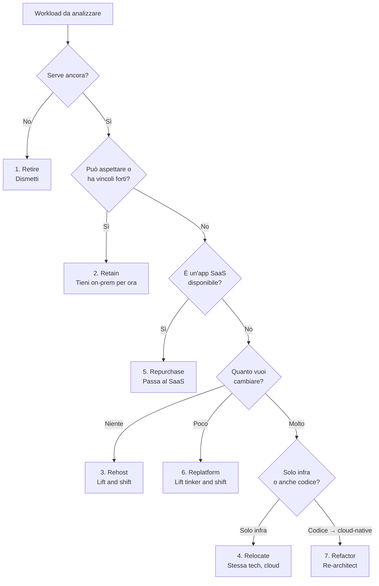
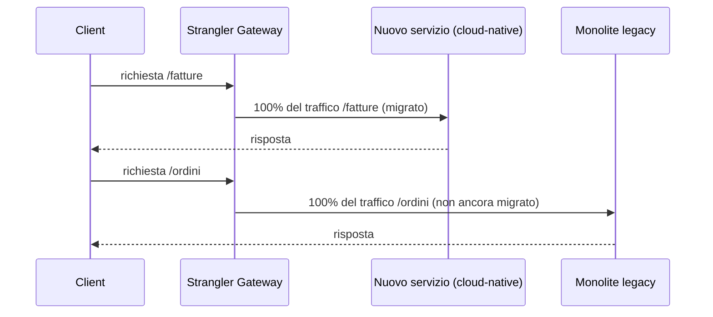

# Migrazione e modernizzazione

  Stabile
  Lezione 9.3
  ~12 min di lettura

Non tutto quello che esiste on-premises va migrato nello stesso modo — né tutto va migrato. Le 7R danno un framework per decidere cosa fare di ogni workload. La sfida vera è convincere il business a finanziare la migrazione prima che il monolite crolli da solo.

L'azienda ha un sistema legacy che gira su server fisici nel datacenter. Il contratto di manutenzione scade tra due anni. Il CTO vuole "andare sul cloud". Il team tecnico ha cinque sistemi da spostare, ognuno con la propria storia, le proprie dipendenze, il proprio livello di rischio. Da dove si inizia? Con quale criterio si decide cosa fare di ciascuno?

Il framework che risponde a questa domanda si chiama **le 7R** — sette strategie di migrazione, ognuna con un profilo di costo, rischio e beneficio diverso. Non è una ricetta: è una griglia di analisi.

## Le 7R — la griglia decisionale

**1. Retire — Dismetti.** Il workload non serve più, o serve a pochi utenti con costi sproporzionati. Prima di migrare, chiediti: se spegni questo sistema, qualcuno se ne accorge? Spesso la risposta è no. Secondo alcuni studi, il 10-20% dei workload enterprise candidati alla migrazione può essere semplicemente dismesso.

**2. Retain — Tieni dov'è.** Non tutto deve migrare adesso. Un sistema con vincoli di compliance severi, o con integrazioni hardware impossibili da virtualizzare, o semplicemente troppo critico per essere migrato senza un'analisi approfondita — rimane on-premises ancora per un po'. Retain non è resa: è una decisione consapevole con una data di revisione.

**3. Rehost — Lift and shift.** Sposta la VM così com'è, senza modifiche, su EC2. È la strategia più veloce: automazioni come AWS Application Migration Service (MGN) possono migrare centinaia di server in giorni. Il lato negativo: non ottimizzi niente. Paghi per istanze EC2 che replicano i server fisici, senza usare servizi managed, senza scalabilità elastica. È un punto di partenza, non un punto di arrivo.

**4. Relocate — Sposta la piattaforma.** Simile al rehost, ma per piattaforme specifiche: se il datacenter usa VMware, puoi spostare le VM su VMware Cloud on AWS senza nemmeno toccare i guest OS. L'impatto operativo è minimo, ma il costo per VM resta alto.

**5. Repurchase — Compra il SaaS.** Se stai mantenendo un'installazione on-premises di Salesforce, SAP, o un sistema CRM personalizzato, considera di comprare direttamente il servizio SaaS. Il costo di licenza SaaS spesso è inferiore al costo di mantenimento di un'installazione self-hosted. È la strategia con il cambiamento tecnico più piccolo e il cambiamento di processo più grande.

**6. Replatform — Lift, tinker and shift.** Porta il sistema sul cloud con modifiche mirate che abilitano i benefici managed senza riscrivere tutto. L'esempio classico: invece di installare MySQL su EC2 (rehost), migri il database su Amazon RDS. Stesso motore, stesso schema, stessa applicazione — ma non gestisci più aggiornamenti, backup, Multi-AZ. È il punto di equilibrio tra velocità e ottimizzazione per molti workload.

**7. Refactor / Re-architect.** Riscrivi tutto, o una parte significativa, per essere cloud-native: microservizi, container, serverless, managed services al posto di componenti self-managed. È la strategia con il beneficio più alto a lungo termine — scaling elastico, resilienza, costi ottimizzati — e il costo più alto a breve termine. Si giustifica quando il sistema ha un problema architetturale che il rehost non risolve.

## Strangler Fig — come si modernizza un monolite

Per i sistemi legacy grandi, il refactoring completo è troppo rischioso: non puoi fermare il sistema di fatturazione per sei mesi per riscriverlo. Il pattern che risolve questo è lo **Strangler Fig**, formalizzato da Martin Fowler.

L'idea è semplice: invece di rimpiazzare il monolite tutto d'un colpo, sostituisci una funzione per volta. Ogni pezzo nuovo viene deployato come servizio cloud-native separato. Il traffico viene gradualmente instradato verso il nuovo servizio. Il monolite originale "si strangola" lentamente mentre il sistema nuovo cresce intorno.

*Il gateway instrada: le funzioni già migrate vanno al nuovo servizio; le funzioni non ancora migrate vanno al monolite. I due sistemi coesistono durante la transizione.*

Il gateway è di solito un API Gateway o un reverse proxy che fa routing basato sul path. La migrazione procede funzione per funzione, con rollback immediato disponibile se qualcosa va storto.

## AWS Migration Hub

**AWS Migration Hub** è lo strumento di tracking centralizzato per le migrazioni. Permette di:
- Scoprire automaticamente i server on-premises e le loro dipendenze (con AWS Application Discovery Service)
- Tracciare lo stato di ogni workload attraverso le fasi della migrazione (Discovered → Not Started → In Progress → Migrated)
- Aggregare i risultati di più strumenti di migrazione (MGN per server, DMS per database, SMS per VM)

Il valore principale non è tecnico: è comunicativo. Migration Hub produce dashboard che mostrano al management l'avanzamento della migrazione in modo aggregato, senza dover chiedere aggiornamenti manuali a ogni team.

## La business case per il C-level

La decisione di migrare è tecnica, ma il finanziamento è aziendale. Chi firma il budget non capisce (né deve capire) le 7R. Capisce ROI, rischi e timeline.

Una business case efficace per una migrazione cloud include:

**TCO attuale vs proiettato**: quanto costa mantenere l'infrastruttura attuale per i prossimi 3-5 anni (hardware, licenze, energia, personale ops) vs quanto costerebbe sul cloud. Il risparmio di solito emerge nei costi ops (meno sysadmin), nell'elasticità (non sovra-provisionare per i picchi) e nell'eliminazione dei rinnovi hardware.

**Rischi del non migrare**: il contratto di supporto scade, la versione del SO va EOL (*End of Life*), un guasto hardware non è coperto. Questi rischi si quantificano in ore di downtime attese × costo/ora di downtime per il business.

**Timeline e milestone**: non "saremo sul cloud tra due anni", ma milestone misurabili — "entro Q2 abbiamo dismesso il datacenter secondario, con un saving di €X/mese".

**Quick wins**: iniziare con i workload Retire e Replatform semplici produce saving rapidi che finanziano le migrazioni più complesse.

## Cosa non è

| Il pensiero sbagliato | Come stanno le cose |
|---|---|
| "Lift and shift è sempre il punto di partenza sbagliato" | Il rehost ha senso quando la velocità conta più dell'ottimizzazione: scadenza di contratto imminente, data center da chiudere entro una data. Si ottimizza dopo; prima si esce. |
| "Refactor è sempre la scelta migliore" | Refactor è la scelta più cara a breve termine. Su workload destinati a essere dismessi entro 2 anni, è uno spreco. La scelta giusta dipende dalla vita residua del workload. |
| "Migrazione = cloud" | Un sistema migrato in rehost su EC2 non è ancora "cloud". Sta usando il cloud come datacenter virtuale. Il cloud è elastic scaling, managed services, pay-per-use. Ci arriva con Replatform e Refactor. |
| "Il pattern Strangler Fig funziona su qualsiasi monolite" | Funziona bene su monoliti con interfacce chiare (API REST, eventi). Funziona male su sistemi con stato condiviso massiccio (un DB denormalizzato con trigger ovunque) dove separare una funzione richiede di toccare metà dello schema. |

## Verifica di comprensione

1. Quali sono le 7R della migrazione cloud? Descrivi brevemente ciascuna.
2. In quale scenario sceglieresti Replatform invece di Rehost?
3. Come funziona il pattern Strangler Fig? Disegna il flusso di traffico durante la transizione.
4. Cosa fa AWS Migration Hub e a chi serve principalmente?
5. Qual è la differenza tra Relocate e Rehost?
6. Perché il Retire dovrebbe essere il primo passo di analisi prima di qualsiasi migrazione?
7. Quali sono i tre elementi di una business case di migrazione efficace per il C-level?

## Glossario della pagina

- **7R**: le sette strategie di migrazione cloud — Retire, Retain, Rehost, Relocate, Repurchase, Replatform, Refactor.
- **Rehost (lift and shift)**: spostare un workload su cloud senza modifiche, di solito su EC2.
- **Replatform (lift, tinker and shift)**: spostare su cloud con modifiche mirate ai servizi managed (es. MySQL su EC2 → RDS).
- **Refactor / Re-architect**: riscrivere il workload per essere cloud-native (microservizi, container, serverless).
- **Strangler Fig**: pattern di modernizzazione che sostituisce un monolite una funzione per volta, con coesistenza dei due sistemi durante la transizione.
- **AWS Migration Hub**: servizio di tracking centralizzato per l'avanzamento delle migrazioni.
- **AWS Application Migration Service (MGN)**: strumento per il rehost automatizzato di server fisici o VM su EC2.
- **TCO** — *Total Cost of Ownership*: costo totale di possesso, incluendo hardware, licenze, energia, personale e gestione.
- **EOL** — *End of Life*: fine del supporto ufficiale per un sistema operativo, database o software.

## Per approfondire

- **AWS Migration Hub** (`docs.aws.amazon.com/migrationhub`): documentazione ufficiale e guida introduttiva.
- **AWS Prescriptive Guidance** (`docs.aws.amazon.com/prescriptive-guidance`): cerca "migration strategies" per le guide pratiche aggiornate alle 7R.
- **"Strangler Fig Application"** di Martin Fowler (`martinfowler.com`): il post originale che descrive il pattern con esempi.
- **AWS Application Migration Service** (`docs.aws.amazon.com/mgn`): come automatizzare il rehost di server fisici e VM.

## Prossima lezione

Hai migrato i workload. Li gestisci con una struttura multi-account. Hai valutato l'architettura con il Well-Architected Framework. Ma un cliente enterprise ti chiede: "Supportate anche Azure? Abbiamo team che usano GCP." La **9.5** risponde a questa domanda: consapevolezza multi-cloud — cosa sai, cosa non sai, e come parli di provider diversi senza promettersi competenze che non si hanno.
