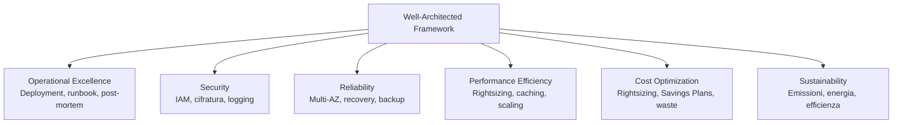

# AWS Well-Architected Framework

  Stabile
  Lezione 9.1
  ~12 min di lettura

Il Well-Architected Framework è lo strumento che i Solution Architect AWS usano in ogni engagement enterprise: sei pilastri per valutare un'architettura, trovare i rischi prima che diventino incidenti, e parlare al business con numeri invece che con opinioni.

Hai costruito il sistema. Gira in produzione. Tutto sembra a posto. Ma un cliente enterprise — o un potenziale investitore, o il tuo CISO — vuole una risposta alla domanda: "Questa architettura è ben fatta?" Senza un framework condiviso, la risposta è inevitabilmente soggettiva: dipende da chi risponde, dalla sua esperienza, dal giorno in cui è stato chiesto.

Il **Well-Architected Framework** (WAF) di AWS risolve questo. Non è un quiz da passare una volta: è un linguaggio comune tra engineer e business per identificare rischi reali, comunicarli con una priorità condivisa, e costruire un piano di miglioramento. È **lo** strumento del SA AWS nel 2026 — ogni engagement significativo include una Well-Architected Review.

## I sei pilastri

Ogni pilastro è una lente con cui guardare il sistema. Insieme coprono le dimensioni che contano in produzione.

**Operational Excellence** — riesci a deployare cambiamenti in modo affidabile, a rispondere agli eventi e a imparare dagli errori? Le domande chiave: hai runbook documentati? I deployment sono automatizzati e rollbackabili? Fai post-mortem dopo gli incidenti?

**Security** — stai proteggendo dati, sistemi e asset? L'identità è ben gestita? I log coprono tutto il necessario? Le risorse sono cifrate? Il principio del least privilege è applicato ovunque?

**Reliability** — il sistema si riprende dai guasti e scala quando la domanda cresce? Hai Multi-AZ per i componenti critici? I circuit breaker e i retry sono implementati? I backup vengono testati?

**Performance Efficiency** — stai usando le risorse in modo efficiente? Il tipo di istanza è quello giusto per il workload? Il caching è usato dove riduce la latenza? C'è qualcosa che scala quando serve e si ferma quando non serve?

**Cost Optimization** — stai spendendo solo quello che serve? Ci sono risorse idle? I Savings Plans sono stati valutati? Il rightsizing viene fatto periodicamente?

**Sustainability** — stai minimizzando l'impatto ambientale dell'infrastruttura? Le istanze sono nel mix giusto tra on-demand e riservate? I workload batch sono schedulati nelle ore con maggiore disponibilità di energia rinnovabile?

*I sei pilastri coprono insieme le dimensioni operative, tecniche, economiche e ambientali di un sistema in produzione.*

## Il Responsible AI Lens

Nel novembre 2025, AWS ha pubblicato il **Responsible AI Lens** — un'estensione del framework dedicata ai sistemi che usano AI e machine learning. I sei pilastri si applicano anche all'AI, ma ci sono domande specifiche che in un sistema puramente infrastrutturale non emergono.

Il Responsible AI Lens aggiunge sei principi trasversali:

- **Fairness**: il sistema tratta equamente tutti i gruppi? Ci sono dataset sbilanciati che introducono bias? Chi è stato escluso dal design?
- **Explainability**: le decisioni del modello sono interpretabili? Se il modello nega un servizio a un utente, si può spiegare perché?
- **Privacy**: i dati di training e inferenza rispettano le aspettative degli utenti? I dati personali vengono minimizzati?
- **Safety**: il sistema ha guardrail contro output dannosi? Cosa succede quando il modello fallisce in modo inatteso?
- **Transparency**: gli utenti sanno che stanno interagendo con un sistema AI? L'incertezza del modello è comunicata?
- **Veracity and Robustness**: il modello è resistente agli input avversariali? Le allucinazioni sono gestite con meccanismi di grounding (RAG, validazione dell'output)?

Se stai costruendo un sistema AI in produzione, il Responsible AI Lens è una checklist tecnica concreta, non solo un esercizio di PR.

## Come funziona una Well-Architected Review

Una WAR — *Well-Architected Review* — è un processo strutturato che di solito un SA AWS conduce con il team tecnico del cliente. Dura tipicamente 2-4 ore per un workload specifico. Ecco come si svolge.

**Fase 1 — Scoping**: si definisce *quale workload* si sta revisionando. Non "tutta l'infrastruttura" — un workload specifico, con un confine chiaro. L'URL shortener, il RAG assistant, il sistema di fatturazione. Un confine troppo largo produce una revisione superficiale.

**Fase 2 — Questionario**: per ogni pilastro, il framework ha un set di domande con risposte predefinite. Non è un quiz a risposta libera: è un questionario strutturato che forza il team a esprimere esplicitamente cosa fa e cosa non fa. Lo strumento AWS Well-Architected Tool nel Console automatizza questo step.

**Fase 3 — Identificazione dei rischi**: le risposte generano automaticamente **HRI** (*High Risk Issues*, rischi ad alto impatto) e **MRI** (*Medium Risk Issues*). Un HRI è qualcosa che, se non risolto, potrebbe causare un outage, una breach o una perdita significativa di dati. Un MRI è un miglioramento importante ma non critico.

**Fase 4 — Improvement plan**: si prioritizzano gli HRI per probabilità × impatto. Non si risolvono tutti in una notte — si costruisce un piano con owner, timeline e criteri di successo misurabili.

Il risultato finale è un **report** con il dettaglio di ogni HRI, la raccomandazione, e lo stato (risolta, accettata con rischio, in corso).

## Come si prioritizzano gli HRI

Non tutti gli HRI hanno la stessa urgenza. La matrice di prioritizzazione usa due assi: **probabilità** di materializzazione del rischio e **impatto** sul business se si materializza.

Gli HRI da affrontare per primi sono quelli in cui entrambi i fattori sono alti: single point of failure senza Multi-AZ su un database di produzione, credenziali AWS nelle variabili d'ambiente hardcoded, nessun backup testato su un sistema critico. Questi non aspettano il prossimo sprint: vanno nel backlog corrente.

Gli HRI con impatto alto ma probabilità bassa — un data center che brucia, un account AWS compromesso a livello root — si gestiscono con procedure di disaster recovery e controlli di sicurezza, non necessariamente con una fix immediata al codice.

Il punto chiave: **il WAF non dice "questo sistema è buono o cattivo"**. Dice "questi sono i rischi, ordinati per urgenza, con una raccomandazione per ciascuno". La decisione se accettare o mitigare ogni rischio resta al team.

## Cosa non è

| Il pensiero sbagliato | Come stanno le cose |
|---|---|
| "Il WAF è una certificazione — passi o non passi" | Non è una certificazione. Non esiste un "punteggio minimo". È uno strumento di analisi che produce un elenco di rischi da gestire secondo le priorità del business. |
| "Una volta fatta la WAR, sei a posto per anni" | I sistemi cambiano. Ogni modifica significativa all'architettura dovrebbe innescare una revisione parziale. Una WAR completa si fa tipicamente ogni 1-2 anni su workload critici. |
| "Il WAF riguarda solo i grandi sistemi enterprise" | Si applica a qualsiasi workload, anche piccolo. Un URL shortener con una WAR rapida individua pattern di sicurezza e costo che senza il framework nessuno avrebbe notato. |
| "I sei pilastri sono indipendenti — lavoro su uno per volta" | Sono correlati. Una scelta su Security (cifrare tutto) impatta Cost Optimization (costo KMS) e Performance Efficiency (latenza della cifratura). Le decisioni architetturali si propagano tra pilastri. |

## Verifica di comprensione

1. Elenca i sei pilastri del Well-Architected Framework e la domanda centrale di ciascuno.
2. Cos'è un HRI e come si distingue da un MRI?
3. Quali sono i sei principi del Responsible AI Lens?
4. Come funziona la fase di scoping di una Well-Architected Review?
5. Perché il WAF non è una certificazione?
6. Come si prioritizzano gli HRI su probabilità × impatto?
7. In quale pilastro rientra la domanda "i backup vengono testati periodicamente"?

## Glossario della pagina

- **WAF** — *Well-Architected Framework*: framework AWS con sei pilastri per valutare e migliorare architetture cloud.
- **WAR** — *Well-Architected Review*: il processo strutturato di revisione di un workload specifico usando il WAF.
- **HRI** — *High Risk Issue*: problema identificato dalla WAR con alto impatto potenziale sul business.
- **MRI** — *Medium Risk Issue*: problema con impatto moderato, da pianificare ma non urgente.
- **Responsible AI Lens**: estensione del WAF pubblicata nel novembre 2025 per sistemi AI/ML, con sei principi (Fairness, Explainability, Privacy, Safety, Transparency, Veracity).
- **Pilastro**: una delle sei dimensioni del WAF. Ogni pilastro ha un set di domande e best practice associati.
- **Workload**: nel contesto del WAF, un sistema con un confine definito che viene revisionato come unità (es. "il RAG assistant in produzione", non "tutta l'infrastruttura").
- **Improvement plan**: documento che raccoglie gli HRI/MRI identificati dalla WAR con owner, timeline e criteri di successo.

## Per approfondire

- **AWS Well-Architected** (`aws.amazon.com/architecture/well-architected`): hub ufficiale con il framework completo, i lens disponibili e lo strumento di revisione nel Console.
- **AWS Well-Architected Tool** (`docs.aws.amazon.com`): come usare lo strumento nel Console per condurre una revisione autonomamente, senza un SA AWS.
- **AWS Well-Architected Labs** (`wellarchitectedlabs.com`): laboratori pratici per ogni pilastro, con scenari reali e codice IaC.
- **Responsible AI Lens** (`docs.aws.amazon.com/wellarchitected`): cerca "Responsible AI Lens" nella documentazione ufficiale per il questionario completo.

## Prossima lezione

Il Well-Architected Framework valuta un singolo workload. Ma in un'enterprise, i workload sono decine — su account diversi, team diversi, con policy diverse. La **9.2** copre la **governance multi-account**: come si struttura AWS Organizations, come si impongono policy con gli SCP, e come Control Tower automatizza il provisioning di nuovi account in modo sicuro.
