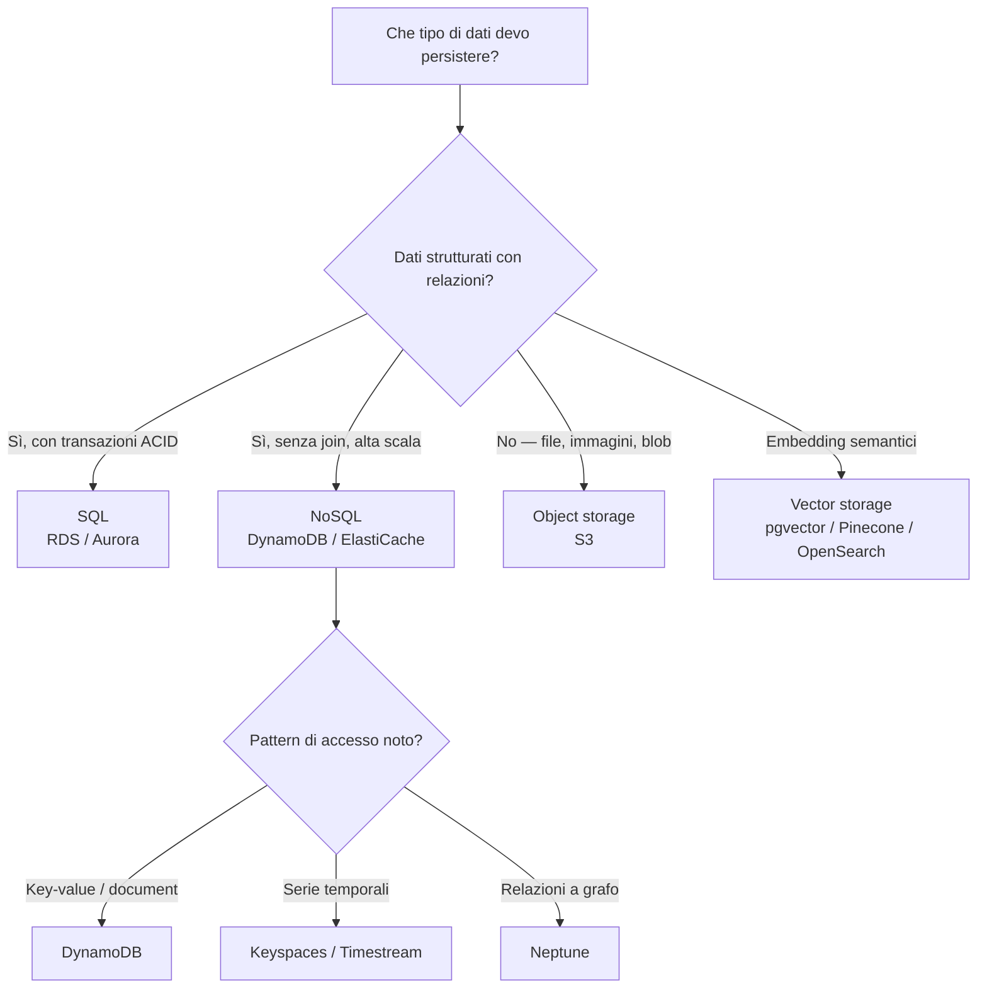

# Persistenza dei dati: SQL, NoSQL, oggetti, vector

  Stabile
  Lezione 0.5
  ~11 min di lettura

Scegliere il tipo di storage sbagliato non è un dettaglio implementativo — è una decisione di architettura che si paga cara quando si vuole cambiare.

Nella lezione 0.3 lo storage era una categoria ampia: oggetti, blocchi, file. Adesso scendiamo nel livello successivo — quello che conta ogni volta che vuoi **persistere dati strutturati**: utenti, ordini, documenti, log, embedding. Quattro famiglie fondamentali, ciascuna con un modello di dati e un insieme di garanzie completamente diversi. La scelta sbagliata non si vede subito: si vede quando la query che funzionava con 10.000 righe crolla con 10 milioni, o quando il tuo sistema transazionale diventa una fonte di contese bloccanti.

L'**idea in una frase**: ogni famiglia di storage è ottimizzata per un tipo di query e di garanzia — scegliere quella giusta richiede di sapere prima *come accederai* ai dati, non solo come li strutturi.

## SQL: transazioni e consistenza

I database **SQL** (*Structured Query Language*) — detti anche relazionali — organizzano i dati in tabelle con colonne tipizzate e relazioni esplicite tra tabelle. Il punto di forza non è il linguaggio SQL in sé, ma le garanzie che i database relazionali offrono sulle transazioni: **ACID**.

**ACID** sta per:
- **Atomicità**: una transazione è tutto-o-niente. Se trasferisci 100€ da un conto a un altro, o avvengono entrambe le scritture o nessuna.
- **Consistenza**: ogni transazione porta il database da uno stato valido a un altro stato valido. Non puoi avere un account con saldo negativo se la constraint dice "saldo ≥ 0".
- **Isolamento**: transazioni concorrenti non si vedono a metà: ognuna vede il database come se fosse l'unica a girare.
- **Durabilità**: una volta committed, la transazione sopravvive anche a crash del server.

Queste garanzie hanno un costo: per mantenerle, i database relazionali usano locking e coordinazione che limitano la scalabilità orizzontale. Un PostgreSQL su un singolo server poteva reggere qualche migliaio di operazioni al secondo; una volta saturato, scalare orizzontale non è triviale.

Su AWS il relazionale gestito è **Amazon RDS** (*Relational Database Service*) — PostgreSQL, MySQL, MariaDB, Oracle, SQL Server — e **Amazon Aurora**, che è il managed database AWS-native compatibile con MySQL e PostgreSQL ma con architettura distribuita che separa compute da storage. Aurora replica i dati su 6 copie in 3 AZ automaticamente e scala il storage fino a 128 TB senza configurazione. Per nuovi sistemi relazionali su AWS, Aurora è la scelta di default a meno che non ci sia una ragione specifica per RDS vanilla.

Usa SQL quando: hai dati con relazioni complesse, hai bisogno di transazioni ACID (pagamenti, inventari, prenotazioni), hai query ad hoc che non conosci a priori, e la dimensione dei dati è nell'ordine dei GB-TB (non petabyte).

## NoSQL: quattro famiglie per quattro problemi

"NoSQL" non è un sistema ma un'etichetta ombrello per database che rinunciano (parzialmente) alle garanzie ACID in cambio di scalabilità orizzontale, flessibilità dello schema, o ottimizzazione per pattern di accesso specifici. Ci sono quattro famiglie principali, con casi d'uso distinti:

**Key-value**: ogni record è una coppia chiave → valore. Schema libero, accesso O(1) per chiave. Non puoi fare query "dammi tutti i record con campo X > 5" — puoi solo cercare per chiave esatta. Velocissimi, scala orizzontale enorme. Usati per session storage, cache, contatori. Su AWS: **Amazon DynamoDB** supporta il modello key-value e document, **Amazon ElastiCache** (Redis/Memcached) per cache in memoria.

**Document**: come il key-value, ma il valore è un documento strutturato (JSON, BSON). Puoi fare query su campi interni al documento, creare indici su attributi nidificati, ma le join tra documenti diversi sono costose o non supportate. Schema flessibile: ogni documento può avere campi diversi. Usato per cataloghi, profili utente, content management. Su AWS: DynamoDB supporta anche questo modello; altrove (non managed AWS) MongoDB è l'archetipo.

**Wide-column**: i dati sono organizzati in famiglie di colonne, ottimizzate per scritture veloci e query su serie temporali o time-series a scala enorme (miliardi di righe). Apache Cassandra è l'archetipo. Su AWS: **Amazon Keyspaces** (Cassandra compatibile managed). Usato per IoT, metriche, log ad alto volume.

**Grafo**: i dati sono nodi e archi, con query che navigano relazioni complesse ("trova tutti gli amici degli amici che hanno comprato X"). Indispensabile per reti sociali, sistemi di raccomandazione basati su relazioni, knowledge graph. Su AWS: **Amazon Neptune**. Da usare solo quando il problema ha davvero struttura a grafo — altrimenti è over-engineering.

Su AWS, **Amazon DynamoDB** merita attenzione speciale: è fully serverless (scala automaticamente, scala a zero in lettura), con latenza garantita sotto i 10ms a qualsiasi scala, e pricing on-demand (paghi per richiesta). È la scelta di default per workload serverless che non richiedono join relazionali. Il trade-off: il modello di accesso va definito *prima* di creare la tabella, perché modificare i pattern di query dopo è costoso.

## Object storage: per i dati non strutturati

Lo storage a oggetti — che abbiamo incontrato nella 0.3 come S3 — non è un database, ma è dove finisce la maggior parte dei dati in un sistema moderno: immagini, video, PDF, log compressi, backup, dataset di training, modelli ML serializzati, output di pipeline batch.

**Amazon S3** (*Simple Storage Service*) è il servizio più usato di AWS. Il modello: carichi un file, ricevi una chiave (un path-like string); recuperi il file con quella chiave. Non puoi fare query sul contenuto, non puoi fare join, non puoi aggiornare un byte senza riscrivere l'oggetto intero.

La forza di S3: costo basso (frazioni di centesimo per GB al mese), **undici nove di durabilità** (99.999999999%) — il che significa che perdere un oggetto è statisticamente improbabile su scala astronomica — e nessun limite pratico di dimensione totale. **Storage lifecycle policies** permettono di spostare oggetti automaticamente su tier più economici (Infrequent Access, Glacier per archivio) dopo un certo tempo.

Un sistema AI usa S3 quasi certamente: dataset di training, checkpoint dei modelli, output delle pipeline di inferenza, log degli esperimenti. Non usarlo come sostituto di un database per dati che richiedono query.

## Vector storage: il database dell'AI

Il **vector storage** è la categoria più recente, diventata centrale nell'AI applicativa moderna. Un embedding — il tipo di dato prodotto dai modelli linguistici e dai modelli visivi per rappresentare il significato semantico di un testo o di un'immagine — è un vettore di centinaia o migliaia di numeri in virgola mobile. Per recuperare documenti "semanticamente simili" a una query, devi cercare i vettori più vicini nello spazio multidimensionale — non per uguaglianza esatta, ma per **prossimità** (cosine similarity, prodotto scalare).

Questa operazione si chiama **Approximate Nearest Neighbor search** (*ANN*), e i database convenzionali (SQL e NoSQL) non la supportano in modo efficiente. I vector database sono costruiti apposta per farlo: usano indici specializzati (HNSW, IVF, LSH) che rendono la ricerca tra milioni di vettori praticabile in millisecondi.

In evoluzione Il mercato dei vector database si sta consolidando rapidamente (2024-2026). Le opzioni principali:
- **pgvector** (estensione PostgreSQL): per chi vuole tenere tutto in un database relazionale già esistente, con query SQL normali. Ottimo per sistemi con meno di qualche milione di vettori.
- **Amazon OpenSearch** con k-NN: per chi già usa OpenSearch per search/log.
- **Pinecone**, **Weaviate**, **Qdrant**: vector database specializzati, fully managed, ottimizzati per questa operazione.

Il trade-off build/managed per i vector database lo tratteremo nella lezione 6.7 della guida Cloud. La decisione da capire ora è *perché esistono* — e perché un SQL normale non basta: la 0.5 è il prerequisito per capire RAG nella guida AI.

Perché la ricerca vettoriale non si fa con un indice B-tree

Un indice B-tree (usato da PostgreSQL, MySQL, ecc.) ottimizza la ricerca per confronto d'ordine: dato un valore, trovare i record con quel valore o in un range. Funziona perfettamente per query come `WHERE età > 30` o `WHERE cognome = 'Rossi'`.

La ricerca dei K vettori più vicini (*K-Nearest Neighbor*, KNN esatta) in uno spazio a 1536 dimensioni è un problema diverso: devi calcolare la distanza da ogni vettore nello store, ordinarli, e restituire i K più vicini. Con un milione di vettori a 1536 dimensioni, ogni ricerca richiede 1.000.000 × 1.536 operazioni floating-point — qualche miliardo di operazioni per query. Non scalabile.

Gli indici ANN (come HNSW, *Hierarchical Navigable Small World*) usano un grafo di navigazione che permette di trovare i vicini approssimati senza confrontare tutto lo store, tipicamente con recall >95% e latenza di millisecondi. La parola "approssimato" è chiave: non garantisce il vicino esatto, ma un vicino molto vicino — per applicazioni semantiche è più che sufficiente.

## Il framework di scelta

Non è una scelta binaria: la maggior parte dei sistemi reali usa più famiglie insieme. Un'applicazione e-commerce tipica usa Aurora per ordini e pagamenti (ACID obbligatorio), DynamoDB per il carrello e le sessioni (scalabilità e bassa latenza), S3 per le immagini prodotti, e pgvector o OpenSearch per la ricerca semantica del catalogo.

## Cosa non è

| Il pensiero sbagliato | Come stanno le cose |
|---|---|
| "NoSQL è più veloce di SQL" | Dipende completamente dal workload. DynamoDB è più veloce di Aurora per accesso per chiave ad altissimo volume; Aurora è più veloce per query analitiche complesse su dati relazionali. Non c'è una risposta universale. |
| "S3 può sostituire un database" | S3 non supporta query sui contenuti, transazioni, o aggiornamenti parziali. Va usato per blob e file, non per dati strutturati che richiedono ricerca. |
| "Il vector database serve solo per l'AI" | Qualsiasi sistema che abbia bisogno di ricerca semantica — non solo LLM, anche search su cataloghi, raccomandazioni basate su similarità di contenuto — può beneficiare del vector storage. |
| "Cambiare database dopo il lancio è sempre possibile" | La migrazione tra famiglie di database è costosa e rischiosa: richiede re-design dello schema, migrazione dei dati, testing approfondito, e spesso una riscrittura parziale del codice di accesso. Scegliere bene prima conviene. |

## Verifica di comprensione

> Rispondi a memoria. Le risposte incerte rivedile domani.

1. Cosa significano le quattro lettere di ACID?
2. Quando sceglieresti DynamoDB invece di Aurora?
3. Qual è il limite principale di S3 come storage?
4. Cos'è un embedding, e perché richiede un tipo di indice diverso da un B-tree?
5. In un sistema e-commerce, quali dati metteresti in SQL e quali in NoSQL?
6. Cosa significa "schema flessibile" in un document database?
7. *(anticipazione)* Se devi fare ricerca semantica su 10 milioni di documenti, quale sistema di storage ti serve?

---

## Glossario della pagina

- **ACID**: le quattro garanzie transazionali dei database relazionali (Atomicità, Consistenza, Isolamento, Durabilità).
- **Amazon Aurora**: database relazionale AWS-native (MySQL/PostgreSQL compatibile) con architettura distribuita.
- **Amazon DynamoDB**: database NoSQL fully managed, key-value e document, latenza millisecondo, serverless.
- **Amazon Neptune**: database a grafo managed su AWS.
- **Amazon RDS** (*Relational Database Service*): database relazionale gestito su AWS.
- **ANN** (*Approximate Nearest Neighbor*): ricerca dei vettori più vicini in modo approssimato; base degli indici dei vector database.
- **Embedding**: rappresentazione vettoriale densa di un testo o immagine, prodotta da un modello ML.
- **HNSW** (*Hierarchical Navigable Small World*): tipo di indice ANN ad alta performance, usato da vector database come Weaviate e Qdrant.
- **NoSQL**: categoria di database che rinunciano (parzialmente) a ACID in cambio di scalabilità o flessibilità.
- **pgvector**: estensione PostgreSQL per ricerca vettoriale, basata su HNSW e IVF.
- **Vector database**: database ottimizzato per la ricerca ANN su vettori ad alta dimensionalità.

## Per approfondire

- "AWS Database Selection" su `aws.amazon.com/getting-started/decision-guides/databases-on-aws-how-to-choose` — il decision guide ufficiale AWS.
- "Amazon DynamoDB Best Practices" su `docs.aws.amazon.com/amazondynamodb/latest/developerguide/best-practices.html` — fondamentale per non fare errori di design sul modello dati.
- Guida AI, lezione 1.1 — RAG: spiega come si usano gli embedding e il vector storage in un sistema di retrieval reale.

## Prossima lezione

Sai come persistere dati strutturati. Ma prima di accendere una VM o deployare un container, c'è una skill pratica che ti serve per non essere cieco sull'infrastruttura: leggere log, gestire file, capire i permessi. La lezione 0.6 copre il **minimo Linux** che ogni cloud practitioner deve avere.
