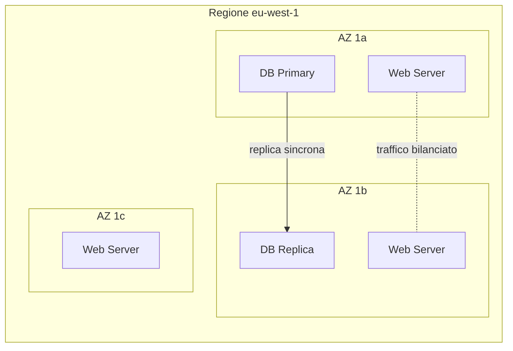

# Regioni, zone, geografia

  Stabile
  Lezione 0.4
  ~10 min di lettura

Le risorse cloud non vivono in un posto solo. Dove le posizioni — e quante copie ne fai — determina latenza, ridondanza e compliance. Spesso anche il prezzo.

Nella lezione 0.3 le risorse — compute, storage, database — esistevano in astratto. In realtà ogni risorsa che crei è localizzata fisicamente da qualche parte. **AWS** (*Amazon Web Services*) gestisce la sua infrastruttura attraverso una gerarchia geografica: **Regioni**, **Availability Zone** e, per certi servizi, **edge location**. Capire questa gerarchia non è geografia per cultura generale — è la base di ogni decisione di alta disponibilità, disaster recovery e rispetto del GDPR.

L'**idea in una frase**: le regioni ti danno sovranità geografica sui dati, le availability zone ti danno ridondanza dentro una regione, e le edge location ti danno velocità per gli utenti finali.

## Regioni: i confini geografici

Una **regione** AWS è un'area geografica con infrastruttura autonoma e isolata: data center propri, rete propria, alimentazione propria. Al maggio 2026 AWS ha oltre 35 regioni nel mondo — `us-east-1` (Virginia), `eu-west-1` (Irlanda), `ap-southeast-1` (Singapore), e così via.

Le regioni sono **isolate tra loro per design**: un guasto in `us-east-1` non impatta `eu-west-1`. Questa separazione è intenzionale: ti permette di distribuire i sistemi geograficamente per tollerare eventi catastrofici (outage di una regione intera, disastri naturali, interruzioni di rete).

Quando crei una risorsa su AWS scegli la regione esplicitamente. La scelta impatta tre cose:

**Latenza**: i tuoi utenti devono raggiungere il server. Un utente in Europa che arriva su `us-east-1` ha 80-120ms di latenza di rete solo per il round-trip atlantico. Un utente sullo stesso continente del server ha 5-20ms. Per applicazioni interattive, questa differenza è percepibile.

**Costo**: i prezzi variano tra regioni. `us-east-1` è tipicamente tra le più economiche; regioni più remote (come `ap-east-1` a Hong Kong) costano 10-20% in più. I costi di trasferimento dati *uscenti* da una regione (*egress*) possono essere significativi — è uno dei costi nascosti del cloud che coglie di sorpresa.

**Residenza dei dati** (*data residency*): la legge può imporre che certi dati rimangano in un territorio specifico. In Europa il **GDPR** (*General Data Protection Regulation*) e normative specifiche di settore (bancario, sanitario) spesso richiedono che i dati personali rimangano nell'UE. Se deploi in `eu-central-1` (Francoforte) o `eu-west-1` (Irlanda), i dati rimangono nell'Unione Europea.

> Attenzione: la residenza dei dati non è automatica solo perché scegli una regione europea. Alcuni servizi AWS replicano dati globalmente per impostazione predefinita (es. IAM è globale, Route 53 è globale). Verifica servizio per servizio. Il programma **AWS GDPR** fornisce le garanzie contrattuali necessarie via Data Processing Addendum.

## Availability Zone: ridondanza dentro una regione

Ogni regione è suddivisa in **Availability Zone** (*AZ*) — abbreviato `1a`, `1b`, `1c`, ecc. Un'AZ è uno o più data center fisicamente separati ma vicini (decine di km), collegati con fibra ad altissima velocità e bassa latenza (&lt;1ms tra AZ nella stessa regione).

La logica è: anche se un data center prende fuoco, l'AZ adiacente è a decine di chilometri di distanza. Un guasto singolo — hardware, alimentazione, network — non abbatte tutto.

Per costruire un sistema **high availability** (*HA*) la regola di base è deployare su **almeno due AZ**: se un'AZ ha un problema, il traffico si sposta sull'altra senza che gli utenti notino niente. La maggior parte dei servizi managed AWS gestisce questo automaticamente (RDS con Multi-AZ, ALB che distribuisce su AZ multiple, ECS con task su più AZ).

Architettura di una regione AWS con tre Availability Zone: ogni AZ ha i propri data center fisici, collegati tra loro con fibra a bassa latenza.

*Web server e database replicati su due AZ: il sistema regge il guasto di un'intera AZ.*

## Multi-region: quando una regione non basta

Distribuire su più AZ protegge dai guasti di un data center. Distribuire su più **regioni** protegge da eventi più rari ma più gravi: l'outage di un'intera regione AWS (raro, ma è successo).

**Multi-region è costoso e complesso**: la latenza di replica cross-region è alta (decine di millisecondi), la sincronizzazione dei dati diventa un problema non banale, il costo raddoppia o peggio. Si giustifica solo per:
- Applicazioni con requisiti di uptime estremi (SLA >99.99%)
- Compliance che richiede backup in una seconda regione geograficamente separata
- User base globale con requisiti di latenza stretti

Per la maggior parte dei sistemi, **multi-AZ è sufficiente** e molto più semplice da gestire.

## Edge location: dove si chiude la distanza con l'utente

Le **edge location** sono punti di presenza distribuiti globalmente — ne esistono oltre 400 nel mondo, inclusi aeroporti, exchange point e facility di terze parti — molto più capillari delle regioni (che sono decine, non centinaia).

Non eseguono codice applicativo in modo generale, ma servono due scopi specifici:
- **CDN** (*Content Delivery Network*): **Amazon CloudFront** porta i contenuti statici (immagini, CSS, JS, video) vicino all'utente, riducendo la latenza percepita da centinaia di ms a decine di ms.
- **Protezione DDoS**: **AWS Shield** e **AWS WAF** (*Web Application Firewall*) assorbono il traffico attacco alle edge prima che arrivi alla tua infrastruttura principale.

Le edge location non sono "regioni lite": non hai controllo diretto su di esse, non puoi metterci un database, non puoi garantire residenza dei dati. Sono infrastruttura di distribuzione, non di elaborazione.

Latenza e fisica: perché i numeri contano

La velocità della luce fibra ottica è ~200.000 km/s. La distanza Europa-USA è ~8.000 km. Il round-trip minimo fisico è ~80ms — anche con fibra perfetta e nessun hop di rete. In pratica si arriva a 120-150ms per una richiesta HTTP transatlantica.

Regole empiriche utili:
- Stessa AZ: &lt;1ms
- AZ diverse nella stessa regione: 1-3ms
- Regioni nella stessa area geografica (es. eu-west-1 ↔ eu-central-1): 20-50ms
- Cross-continente (es. eu-west-1 ↔ us-east-1): 80-150ms
- Pacific (es. us-east-1 ↔ ap-southeast-1): 150-250ms

Questi numeri impattano direttamente le scelte di design: un'architettura che richiede 5 chiamate sincrone cross-region per rispondere a una richiesta ha già 400-750ms di latenza di rete da sola, prima che un byte di business logic sia eseguito.

## Cosa non è

| Il pensiero sbagliato | Come stanno le cose |
|---|---|
| "I dati in una regione europea sono automaticamente conformi al GDPR" | La regione definisce *dove* stanno i dati fisicamente, ma la conformità GDPR richiede anche contratti di trattamento dati (DPA), configurazione corretta degli accessi, e verifica che servizi globali (IAM, CloudFront) non copino dati fuori UE involontariamente. |
| "Multi-region è sempre meglio di multi-AZ" | Multi-region è più costoso, più complesso, e utile solo per requisiti di uptime estremi o compliance specifica. Multi-AZ copre il 95% dei casi reali. |
| "Le edge location sono come micro-regioni" | No: non hanno storage persistente generale, non puoi deployarci applicazioni arbitrarie, non garantiscono residenza dei dati. Sono ottimizzate per distribuzione di contenuti e protezione DDoS. |
| "Posso spostare risorse tra regioni facilmente" | Le risorse sono create in una regione e ci rimangono. Spostare un sistema tra regioni richiede spesso re-deploy completo, migrazione dei dati, aggiornamento di tutti i riferimenti. Non è un'operazione banale. |

## Verifica di comprensione

> Rispondi a memoria. Le risposte incerte rivedile domani.

1. Qual è la differenza tra una regione e una Availability Zone?
2. Perché conviene deployare su almeno due AZ?
3. In quale scenario ha senso una architettura multi-region?
4. Cosa serve, oltre a scegliere una regione europea, per soddisfare il GDPR?
5. Cos'è una edge location e a cosa serve CloudFront?
6. Se un utente in Asia accede a un sistema in `us-east-1`, qual è la latenza minima fisica approssimativa?
7. *(anticipazione)* Se il tuo database primario è in `eu-west-1 1a` e va down, come fa l'applicazione a continuare a funzionare?

---

## Glossario della pagina

- **Availability Zone (AZ)**: data center fisicamente separato dentro una regione, collegato con fibra a bassa latenza alle altre AZ della stessa regione.
- **Amazon CloudFront**: CDN di AWS basata su edge location, per distribuzione di contenuti a bassa latenza.
- **Data residency**: requisito che i dati rimangano fisicamente in un territorio specifico, spesso imposto da normative come il GDPR.
- **Edge location**: punto di presenza distribuito globalmente; non è una regione, serve per CDN e protezione DDoS.
- **GDPR** (*General Data Protection Regulation*): regolamento europeo sulla protezione dei dati personali, in vigore dal 2018.
- **High availability (HA)**: progettazione di sistemi che continuano a funzionare in presenza di guasti parziali.
- **Multi-AZ**: architettura che replica risorse su più Availability Zone per tollerare guasti di un singolo data center.
- **Regione**: area geografica con infrastruttura AWS autonoma e isolata (es. `eu-west-1` = Irlanda).

## Per approfondire

- "AWS Global Infrastructure" su `aws.amazon.com/about-aws/global-infrastructure` — mappa interattiva di regioni, AZ e edge location.
- "AWS GDPR Center" su `aws.amazon.com/compliance/gdpr-center` — documentazione ufficiale sulla conformità GDPR con i servizi AWS.
- "Amazon CloudFront FAQs" su `aws.amazon.com/cloudfront/faqs` — per capire cosa fanno e non fanno le edge location.

## Prossima lezione

Ora sai *dove* vivono le risorse cloud. La lezione 0.5 scende nella persistenza dei dati: non tutte le risorse di storage sono uguali, e scegliere tra **SQL, NoSQL, oggetti e vector storage** è una delle decisioni architetturali più frequenti — e più costose da sbagliare.
